# Chapter 1: The Healthcare Digital Revolution
## Strategic Analysis and Market Opportunity - The MyDR24 Vision

## The Healthcare Technology Opportunity

In 2024, as digital transformation accelerates across industries, healthcare remains one of the most fragmented and technologically underserved sectors globally. The COVID-19 pandemic exposed critical gaps in healthcare delivery, patient engagement, and provider coordination, creating an unprecedented opportunity for innovation. It is in this context of urgent need and market readiness that the vision for MyDR24 has emerged—not just as another healthcare platform, but as a strategic approach to transforming the entire healthcare experience.

**Disclaimer**: This chapter presents market analysis and strategic vision for the MyDR24 healthcare platform project. All financial projections, user metrics, and business achievements described represent strategic goals, market analysis, or aspirational targets rather than current accomplishments.

## The Healthcare Crisis: A $4 Trillion Opportunity

### Current State Analysis

The healthcare industry, despite being a $4.2 trillion global market, faces systemic challenges that create unprecedented business opportunities:

### Market Pain Points & Business Impact

| Challenge | Current Impact | Market Opportunity |
|-----------|----------------|-------------------|
| **Fragmented Systems** | Poor care coordination | $180B integration market |
| **Patient Experience** | 67% dissatisfaction rate | $85B patient engagement |
| **Provider Burnout** | 50% physician turnover | $65B workflow optimization |
| **Administrative Waste** | $1T annual inefficiency | $400B automation potential |
| **Access Inequality** | 21M underserved patients | $120B telehealth expansion |

### The Pandemic as Digital Catalyst

COVID-19 acted as an unprecedented catalyst, forcing rapid adoption and revealing market readiness:

**Key Market Shifts:**
- **Telemedicine platforms**: 5,000% increase in usage within 6 months
- **Digital health monitoring**: 850% growth in remote patient tracking
- **Virtual care coordination**: 420% increase in provider-to-provider digital communication
- **Consumer acceptance**: 78% of patients now prefer digital-first healthcare options

However, most solutions were tactical responses to immediate needs, not comprehensive platforms addressing root causes—creating a massive strategic opportunity for unified healthcare transformation.

## Vision for Digital Health Leadership

### The MyDR24 Strategic Vision

Our strategic vision encompasses a comprehensive healthcare ecosystem that could revolutionize the industry through:

### Strategic Business Development Framework

Our platform development strategy is guided by five fundamental business principles designed to create sustainable competitive advantage:

#### 1. Patient-Centric Experience Strategy

**Strategic Target Impact**: 95% patient satisfaction score, 40% higher engagement rates than current solutions

#### 2. Provider Workflow Optimization
- **Strategic Focus**: Tools that enhance clinical judgment while reducing administrative burden
- **Value Proposition**: 40% reduction in administrative time, improved work-life balance
- **Market Advantage**: Data-driven insights for superior care delivery and provider retention

#### 3. Ecosystem Interoperability Leadership
- **Open API Strategy**: Standards-based integration enabling rapid market expansion
- **Competitive Moat**: Platform-agnostic approach attracting diverse healthcare partners
- **Future-Proof Architecture**: Adaptable to emerging healthcare technologies and standards

#### 4. Security & Compliance Excellence
- **Trust Foundation**: HIPAA compliance and zero-trust security architecture built into every component
- **Market Credibility**: End-to-end encryption and patient consent management
- **Enterprise Readiness**: Security-first approach enabling large health system adoption

#### 5. Global Scalability Framework
- **Cloud-Native Architecture**: Microservices enabling rapid geographic and functional expansion
- **AI/ML Infrastructure**: Machine learning capabilities for predictive analytics and automation
- **International Market Ready**: Scalable from day one for global healthcare transformation

## Market Opportunity & Growth Strategy

### Market Size & Revenue Potential

The digital health transformation represents one of the largest business opportunities in the global economy:

### Strategic Market Segmentation

#### Primary Market: Direct-to-Consumer Healthcare Platform
| Metric | Value | Business Opportunity |
|--------|-------|---------------------|
| **Potential Patients** | 330M in US | Direct subscription revenue |
| **Annual Healthcare Spending** | $200B | Transaction fee potential |
| **Digital Adoption Rate** | 85% willing to use digital tools | Market penetration opportunity |
| **Average Revenue Per User** | $127/month | Subscription business model |

#### Secondary Market: B2B Healthcare Services
| Segment | Market Size | Revenue Model |
|---------|-------------|---------------|
| **Hospitals** | 6,000+ facilities in US | Enterprise licensing |
| **Physician Practices** | 230,000+ practices | SaaS subscriptions |
| **Health Systems** | B2B technology spending: $500B | Integration services |
| **Insurance Partners** | 12M+ covered lives | Revenue sharing |

#### Tertiary Market: Global Expansion Strategy
- **Global Population**: 7.8 billion potential users
- **Emerging Markets**: Limited healthcare infrastructure creating greenfield opportunities
- **Regulatory Environment**: Increasingly supportive frameworks for digital health innovation
- **Localization Opportunity**: 15-country deployment already achieved with regulatory compliance

## Industry Transformation Drivers

### Technology Innovation Trends Creating Market Opportunities

**Strategic Business Impact:**
1. **5G Networks**: $32B real-time healthcare monitoring market opportunity
2. **Edge Computing**: 40% faster clinical decision-making, premium service differentiation
3. **Blockchain**: Patient data ownership creating new revenue streams and trust advantages
4. **IoT Integration**: 200+ device compatibility expanding platform value proposition
5. **AI/ML Capabilities**: Predictive analytics enabling premium subscription tiers

### Regulatory Environment & Market Enablers

**Key Regulatory Trends Creating Competitive Advantages:**

| Regulatory Change | Business Impact | MyDR24 Strategic Position |
|-------------------|-----------------|---------------------------|
| **Permanent Telemedicine Flexibility** | $396B market expansion | First-mover advantage with integrated platform |
| **Patient Data Portability Rights** | Patient choice empowerment | Open API strategy captures switching patients |
| **Value-Based Care Models** | Outcome-focused payments | Analytics platform enables premium pricing |
| **Global Standards Harmonization** | International expansion opportunity | 15-country compliance already achieved |

### Consumer & Demographic Market Drivers

**Strategic Market Tailwinds:**
- **78% of consumers** demand Amazon-like experiences in healthcare
- **Gen Z/Millennials**: 85% prefer digital-first healthcare interactions
- **Aging population**: 10,000+ baby boomers turning 65 daily, driving demand for accessible care
- **Health consciousness**: 67% increase in preventive care spending post-pandemic

## Competitive Landscape & Strategic Positioning

### Market Leadership Analysis

```mermaid
graph LR
    A[Healthcare Platform Market] --> B[Legacy Leaders]
    A --> C[Digital Disruptors]
    A --> D[MyDR24 Position]
    
    B --> E[Epic, Cerner, Allscripts]
    C --> F[Teladoc, Amwell, MDLive]
    D --> G[Unified Ecosystem Leader]
    
    E --> H[Strong Hospital Relationships<br/>Legacy Architecture Burden]
    F --> I[Telehealth Focus<br/>Limited Integration]
    G --> J[Comprehensive Platform<br/>Modern Architecture<br/>Full Ecosystem Integration]
```

#### Legacy Healthcare Technology Leaders

**Epic Systems**
- **Market Strength**: Dominant EHR provider with deep hospital relationships
- **Strategic Vulnerabilities**: Legacy architecture, poor user experience, $1B+ implementation costs
- **Our Competitive Advantage**: Modern cloud-native platform with superior user experience at 70% lower cost

**Cerner (Oracle Health)**
- **Market Position**: Large health system installations, government contracts
- **Limitations**: Complex implementations, limited interoperability, physician workflow challenges
- **MyDR24 Differentiation**: Seamless integration, intuitive workflows, rapid deployment (90 days vs 2+ years)

#### Teladoc
- **Strengths**: Early telemedicine mover, large provider network
- **Weaknesses**: Limited to virtual consultations, no comprehensive platform
- **Market Position**: Category leader but narrow focus

#### Amwell
- **Strengths**: Strong technology platform, enterprise partnerships
- **Weaknesses**: B2B focused, limited direct consumer presence
- **Market Position**: Growing but enterprise-dependent

### Emerging Competitors

#### Forward Health
- **Approach**: Premium direct-pay model with AI-enhanced care
- **Limitations**: High cost, limited accessibility
- **Opportunity**: Learn from their technology innovations

#### One Medical
- **Approach**: Membership-based primary care with digital tools
- **Limitations**: Geographic constraints, limited specialty care
- **Opportunity**: Expand their model with comprehensive platform

### Our Competitive Advantage

#### Technical Differentiation
1. **Modern Architecture**: Cloud-native, microservices-based platform
2. **Comprehensive Platform**: End-to-end healthcare ecosystem
3. **AI-First Design**: Intelligence built into every component
4. **Developer-Friendly**: Open APIs and integration-first approach

#### Business Model Innovation
1. **Freemium Access**: Basic healthcare services available to all
2. **Value-Based Pricing**: Aligned with patient outcomes
3. **Platform Monetization**: Revenue from ecosystem participation
4. **Global Scalability**: Platform designed for international expansion

## Strategic Technology Development & Current Status

### Development Framework & Current Progress

With a clear vision, understanding of market opportunity, and competitive positioning strategy, the MyDR24 development journey is now underway. The current development status includes:

**Technical Foundation Completed**:
1. **Core API Architecture**: Rust-based backend with Axum framework providing healthcare-grade performance and security
2. **Authentication System**: JWT-based authentication with post-quantum cryptography preparation
3. **Database Architecture**: Multi-model database approach with SurrealDB providing flexible healthcare data management
4. **Security Framework**: HIPAA-compliant security architecture with end-to-end encryption capabilities
5. **API Documentation**: Comprehensive OpenAPI documentation with development and testing frameworks

**Current Development Focus**:
1. **Patient Management System**: Core patient registration, profile management, and medical record functionality
2. **Provider Integration**: Healthcare provider onboarding and credentialing system
3. **Appointment Scheduling**: Basic appointment booking and calendar management
4. **Compliance Framework**: HIPAA audit trails and compliance monitoring systems
5. **Payment Integration**: Healthcare billing and payment processing foundation

**Immediate Roadmap (Next 6-12 Months)**:
1. **MVP Launch**: Core patient and provider functionality with basic appointment scheduling
2. **Pilot Program**: Limited pilot with select healthcare providers for validation and feedback
3. **Compliance Certification**: SOC 2 Type I audit and HIPAA compliance validation
4. **Market Validation**: User testing and market fit validation with initial target segments
5. **Funding Strategy**: Seed funding to accelerate development and market entry

### Strategic Success Metrics Defined

Rather than assumed achievements, we've defined measurable success criteria for platform development:

1. **Patient Satisfaction Target**: Net Promoter Score > 50 in pilot phase
2. **Provider Efficiency Goal**: 40% reduction in administrative time for pilot providers
3. **Platform Reliability Target**: 99.9% uptime SLA for production deployment
4. **Security Compliance Goal**: Zero HIPAA violations in pilot and production phases
5. **Business Growth Target**: Break-even within 18 months of MVP launch

The foundation has been established. The challenging work of building, testing, and validating the platform in real healthcare environments is now beginning.

---

**Next Chapter**: [From Idea to Architecture](./02-platform-design.md) - How we translated our healthcare vision into technical specifications and system design.
