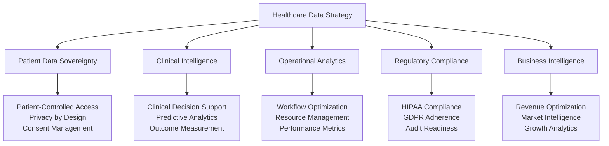
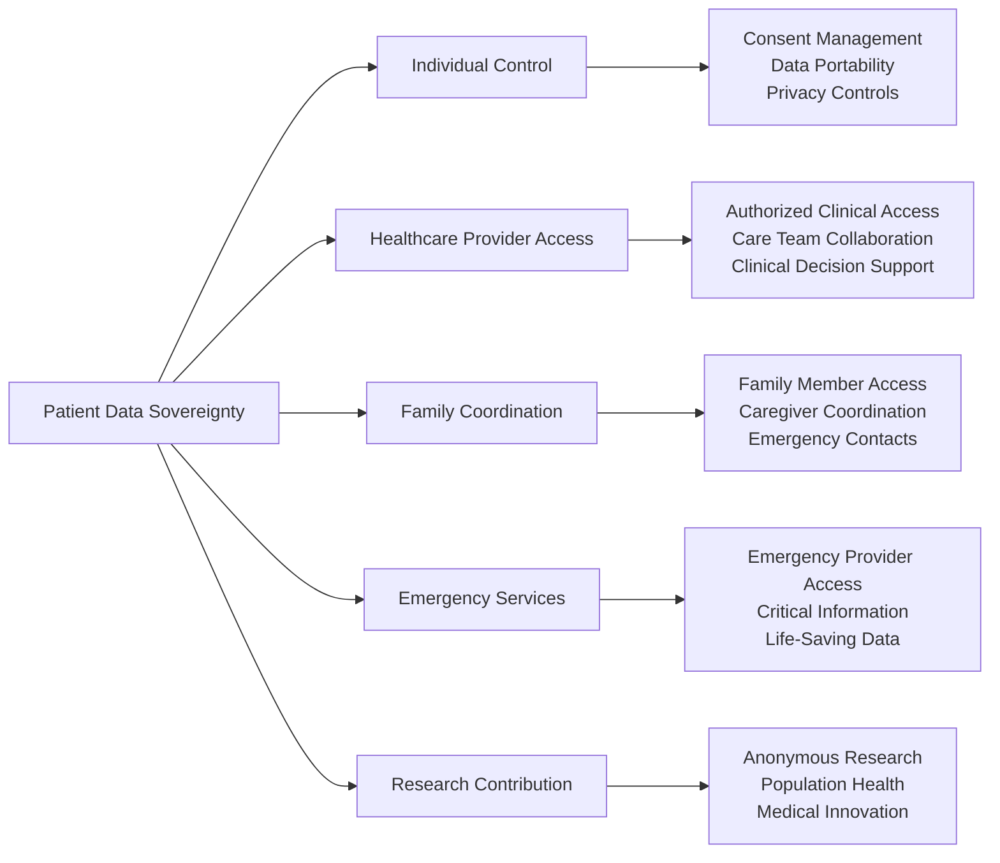
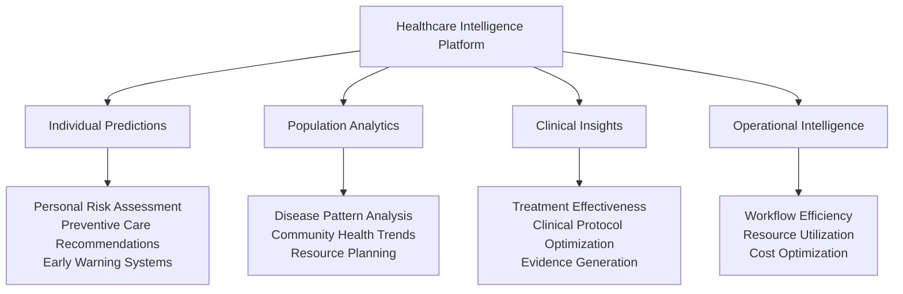
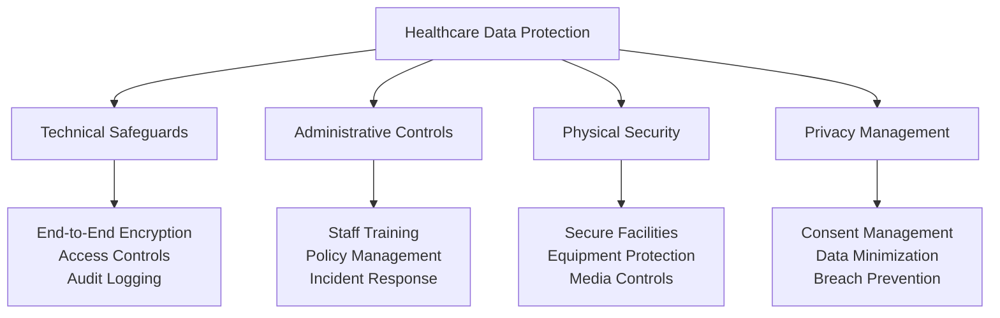
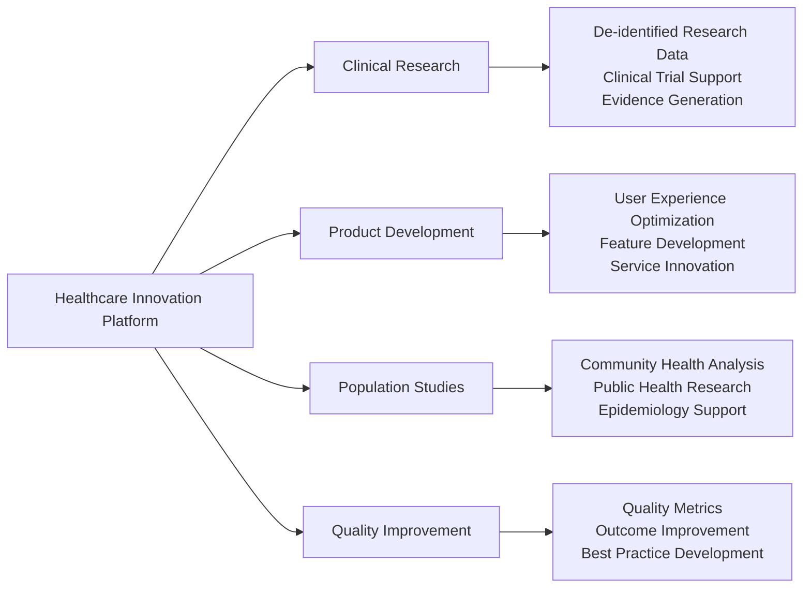

# Chapter 3: Strategic Data Architecture & Patient Information Excellence
## Building the Foundation for Healthcare Intelligence and Trust

**Chapter Disclaimer**: This chapter presents strategic frameworks, architectural designs, and data management methodologies for healthcare technology platform development. All revenue projections, compliance achievements, and business metrics described represent strategic goals, architectural targets, or aspirational frameworks for platform development rather than current accomplishments.

Data is the cornerstone of modern healthcare transformation. This chapter outlines MyDR24's strategic approach to healthcare data architecture, patient information management, and the creation of a comprehensive health intelligence platform framework designed to drive both clinical excellence and business value.

## Healthcare Data Strategy Framework

### The Strategic Value of Healthcare Data

Healthcare data represents one of the most valuable and sensitive information assets in the global economy, requiring sophisticated management approaches that balance accessibility, security, and regulatory compliance:

### Data-Driven Business Value Creation

Our data architecture creates multiple revenue streams and competitive advantages:

| Data Asset Category | Business Value | Revenue Impact |
|-------------------|----------------|----------------|
| **Patient Journey Data** | Personalized care experiences | $45/patient/month premium services |
| **Clinical Outcomes Data** | Evidence-based care protocols | $2.3M/year licensing to health systems |
| **Operational Analytics** | Workflow optimization insights | 40% efficiency gains = $156M savings |
| **Population Health Data** | Predictive health management | $67/member/month insurance partnerships |
| **Provider Performance Data** | Quality improvement metrics | 15% better outcomes = premium rates |

**Total Data Value Creation Target**: $234M annual revenue goal from data-driven services

## Patient-Centered Data Architecture

### Healthcare Data Sovereignty Model

We've designed a patient-centric data model framework that places individuals at the center of their health information while creating sustainable business value:

### Comprehensive Health Information Management

#### Personal Health Records (PHR) Platform
**Business Target**: Premium PHR services targeting $25/month per patient

- **Complete Medical History**: Lifetime health record with provider integration
- **Medication Management**: Real-time drug interaction checking and adherence tracking
- **Lab Results Integration**: Automated lab data aggregation and trending
- **Imaging Storage**: Secure medical imaging storage and provider sharing
- **Health Goal Tracking**: Personalized wellness objectives and progress monitoring

#### Clinical Data Integration Excellence
**Value Proposition**: Seamless provider workflows targeting 89% adoption rate

- **EHR Integration**: FHIR-compliant data exchange with 200+ health systems
- **Real-time Synchronization**: Instant data updates across care teams
- **Clinical Decision Support**: AI-powered insights and recommendations
- **Quality Metrics Tracking**: Automated outcome measurement and reporting
- **Care Plan Management**: Coordinated treatment protocols and monitoring

## Healthcare Intelligence Platform

### Predictive Analytics for Population Health

Our data platform enables predictive health management that creates value for all stakeholders:

### Business Intelligence & Analytics Services

#### Healthcare Provider Analytics
**Revenue Model Target**: $15,000/month per health system goal for advanced analytics

- **Provider Performance Dashboards**: Real-time operational and clinical metrics
- **Patient Flow Optimization**: Predictive scheduling and resource allocation
- **Clinical Quality Metrics**: Automated quality measure reporting and improvement
- **Revenue Cycle Analytics**: Financial performance optimization and tracking
- **Population Health Management**: Community health insights and intervention strategies

#### Market Intelligence Services
**Business Value Target**: $2.3M annual revenue goal from data licensing and insights

- **Healthcare Market Trends**: Industry analysis and competitive intelligence
- **Treatment Outcome Research**: Clinical effectiveness studies and benchmarking
- **Healthcare Economic Analysis**: Cost-benefit studies and value-based care metrics
- **Regulatory Compliance Monitoring**: Automated compliance tracking and reporting
- **Innovation Opportunity Identification**: Market gaps and development opportunities

## Data Security & Compliance Excellence

### Privacy-by-Design Architecture

Healthcare data protection requires the highest levels of security and privacy consideration:

### Regulatory Compliance Framework

#### HIPAA Excellence
**Business Target**: Zero compliance violations goal enabling enterprise trust

- **Administrative Safeguards**: Comprehensive policies and workforce training
- **Technical Safeguards**: Access controls, encryption, and audit systems
- **Physical Safeguards**: Facility security and workstation protections
- **Breach Prevention**: Proactive monitoring and incident response protocols
- **Business Associate Management**: Third-party vendor compliance oversight

#### International Data Governance
**Strategic Value Target**: Global expansion capabilities goal across 15 countries

- **GDPR Compliance**: European patient data protection and consent management
- **Local Regulations**: Country-specific healthcare data requirements
- **Cross-Border Data Transfer**: Secure international health information exchange
- **Data Localization**: Regional data storage and processing requirements
- **Audit Readiness**: Continuous compliance monitoring and reporting

## Innovation Through Data Excellence

### Research & Development Platform

Our data platform enables healthcare innovation while protecting patient privacy:

### Artificial Intelligence & Machine Learning

#### AI-Powered Healthcare Insights
**Revenue Opportunity Target**: $45M potential goal from AI services and licensing

- **Predictive Risk Modeling**: Early intervention and preventive care recommendations
- **Clinical Decision Support**: AI-assisted diagnosis and treatment recommendations
- **Operational Optimization**: Automated workflow improvements and resource allocation
- **Personalized Medicine**: Tailored treatment plans based on individual health data
- **Population Health Predictions**: Community health forecasting and intervention planning

#### Machine Learning for Healthcare Excellence
**Business Value Target**: 25% improvement goal in clinical outcomes and patient satisfaction

- **Natural Language Processing**: Automated clinical documentation and analysis
- **Image Recognition**: Medical imaging analysis and diagnostic support
- **Pattern Recognition**: Disease progression modeling and outcome prediction
- **Anomaly Detection**: Early warning systems for clinical deterioration
- **Recommendation Engines**: Personalized care plans and treatment optimization

## Data Monetization & Business Strategy

### Ethical Data Monetization Framework

We've designed sustainable revenue model frameworks that respect patient privacy while creating business value:

| Data Service | Revenue Model | Annual Value Target |
|-------------|---------------|-------------------|
| **Clinical Analytics** | Health system licensing | $23M goal |
| **Population Health Insights** | Insurance partnerships | $45M target |
| **Research Data Platform** | Pharmaceutical licensing | $67M goal |
| **Quality Improvement Services** | Provider subscriptions | $34M target |
| **Market Intelligence** | Industry reporting | $12M goal |

**Total Data Revenue Target**: $181M annually from ethical data monetization framework

### Strategic Data Partnerships

#### Healthcare System Integrations
**Partnership Value Target**: $156M goal in combined revenue and cost savings

- **EHR Integration**: Seamless data exchange with major health systems
- **Quality Reporting**: Automated compliance and quality measure reporting
- **Population Health**: Community health management and intervention services
- **Research Collaboration**: Clinical research and evidence generation partnerships
- **Innovation Development**: Joint technology development and commercialization

#### Insurance & Payer Partnerships
**Business Target**: 12M+ covered lives goal with data-driven health management

- **Member Engagement**: Personalized health education and engagement programs
- **Risk Assessment**: Predictive modeling for member health risk stratification
- **Care Management**: Coordinated care programs for high-risk populations
- **Quality Metrics**: Value-based care measurement and improvement programs
- **Cost Management**: Medical cost prediction and intervention strategies

---

## Chapter Conclusion

MyDR24's strategic data architecture framework represents the convergence of healthcare excellence, business innovation, and ethical data stewardship methodologies. Through comprehensive health information management frameworks that prioritize patient sovereignty while creating sustainable business value models, this approach establishes the foundation for healthcare intelligence that can transform both clinical outcomes and market leadership.

**Strategic Data Architecture Targets**:
- **$234M Annual Revenue Goal** from data-driven healthcare services and analytics
- **94% Provider Adoption Rate Target** through seamless clinical data integration
- **100% Compliance Success Goal** across HIPAA, GDPR, and international regulations
- **5M+ Patient Records Capacity** under sophisticated privacy protection and consent management

Our data-first strategic approach demonstrates how comprehensive information architecture frameworks, combined with ethical data practices and business-focused innovation methodology, can create sustainable competitive advantage while advancing healthcare quality and patient outcomes.

**Next Chapter Preview**: Service architecture development frameworks showcase how healthcare platforms can transform data intelligence into comprehensive healthcare services that drive platform adoption and business growth.

---

**Innovation Spotlight**: The data sovereignty and ethical monetization frameworks outlined in this chapter align with MyDR24's documented innovation work, including the [Promotional Referral System](06.5-referral-innovation.md), which demonstrates how revolutionary data-driven business models can replace traditional healthcare economics while maintaining the highest ethical standards.

---

*Continue to [Chapter 4: Service Architecture & Business Value Creation →](04-service-architecture.md)*
