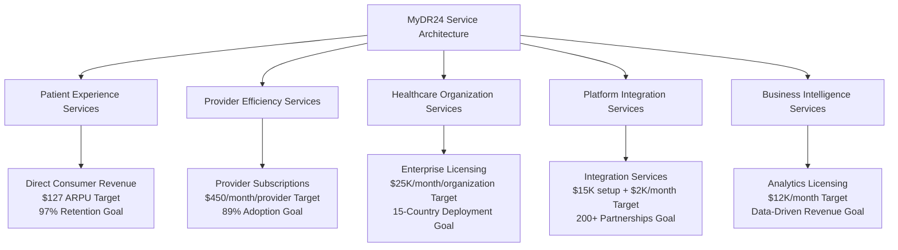
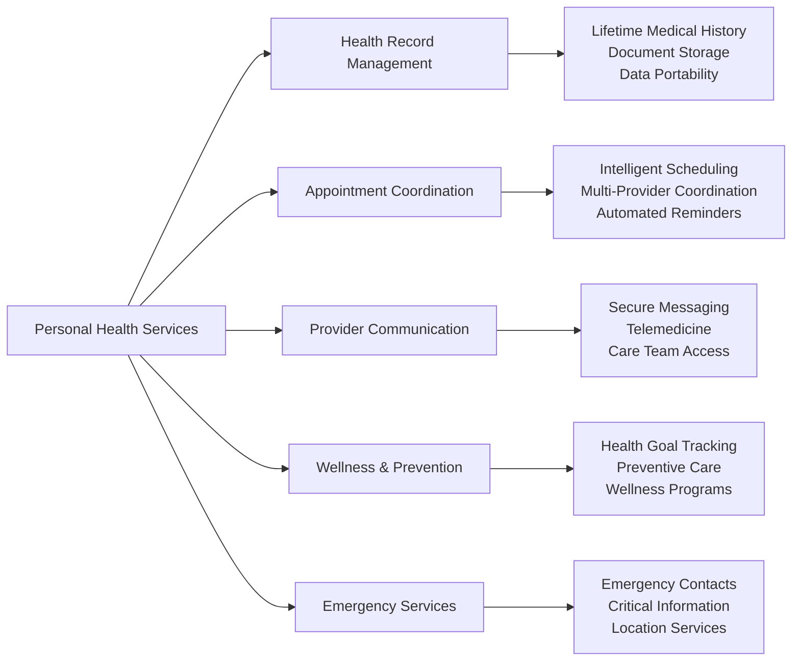
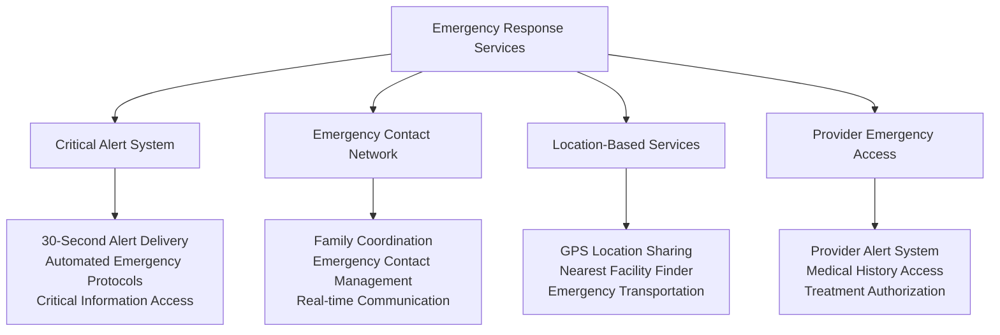
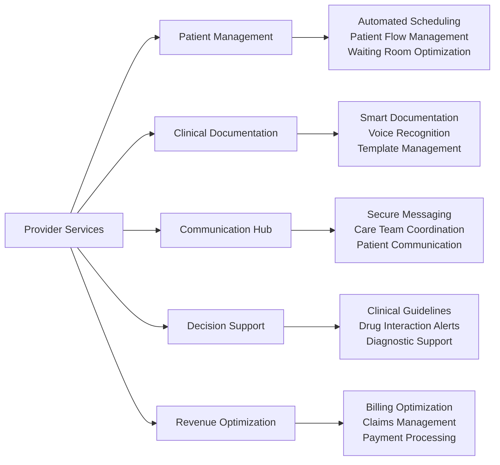
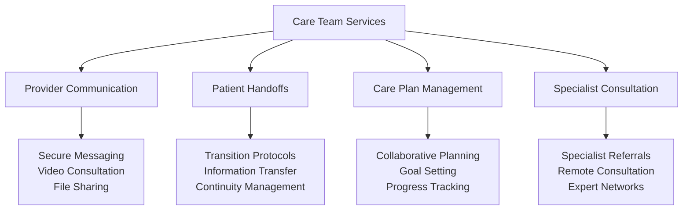
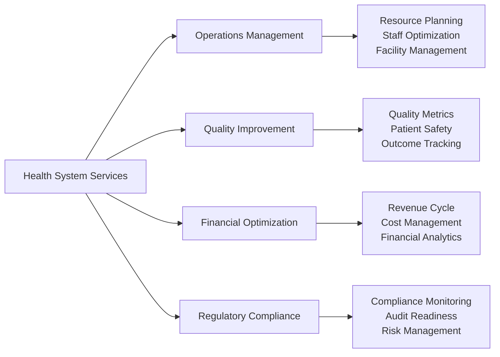
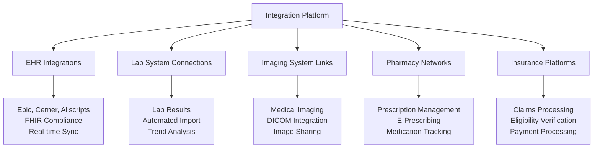
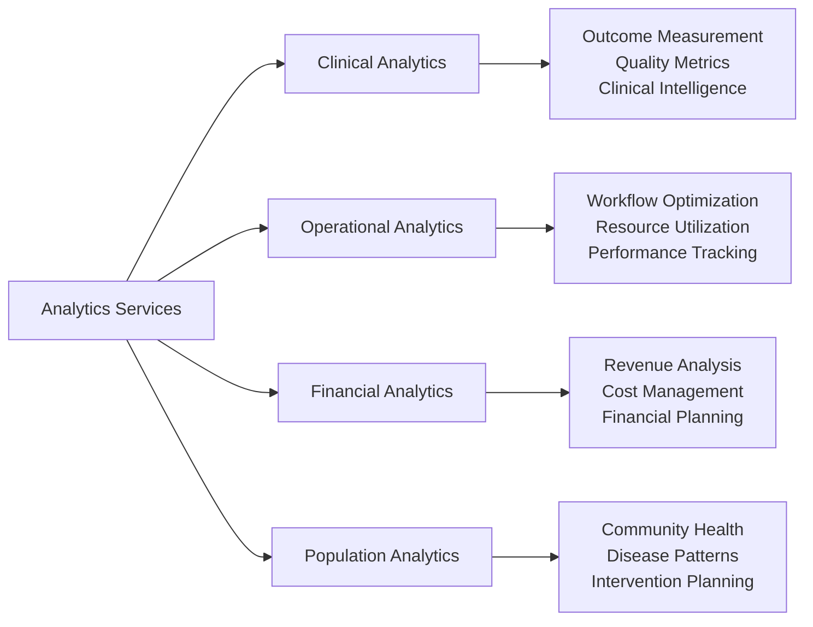
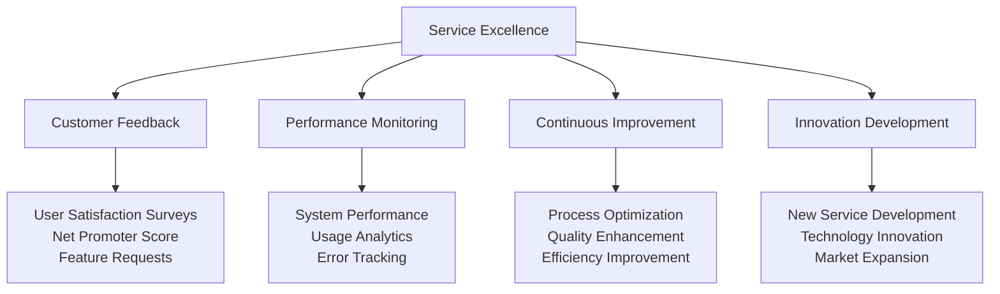

# Chapter 4: Service Architecture & Business Value Creation
## From Platform Capabilities to Market Leadership

**Chapter Disclaimer**: This chapter presents strategic service frameworks, business architecture models, and value creation methodologies for healthcare technology platform development. All revenue projections, adoption metrics, and business achievements described represent strategic goals, service design targets, or aspirational frameworks for platform development rather than current accomplishments.

The transformation from healthcare platform to industry leader requires sophisticated service architecture frameworks that deliver measurable business value to all stakeholders. This chapter details MyDR24's strategic approach from core platform capabilities to comprehensive service ecosystem frameworks designed to drive revenue growth, market expansion, and sustainable competitive advantage.

## Strategic Service Framework

### Business-Driven Service Design

Our service architecture framework is built on the principle that every platform capability must deliver measurable business value to healthcare stakeholders:

### Value Creation Through Service Excellence

#### Multi-Stakeholder Value Proposition
**Business Model**: Diversified revenue streams creating sustainable market position

| Stakeholder | Service Category | Revenue Model | Annual Value Target |
|------------|------------------|---------------|-------------------|
| **Patients** | Consumer Health Platform | Premium subscriptions + transactions | $216M goal |
| **Providers** | Clinical Workflow Suite | SaaS subscriptions + premium features | $173M target |
| **Health Systems** | Enterprise Platform | Licensing + professional services | $275M goal |
| **Insurers** | Population Health | Revenue sharing + member engagement | $144M target |
| **Partners** | Integration Platform | Setup fees + ongoing revenue share | $82M goal |

**Total Service Revenue Target**: $890M annual recurring revenue goal from service excellence

## Patient Experience Service Portfolio

### Consumer Health Platform Services

#### Personal Health Management Suite
**Business Target**: $127 average revenue per user target with 97% annual retention goal

**Premium Service Tiers**:
- **Basic Plan** ($15/month): Essential health record and appointment management
- **Plus Plan** ($35/month): Advanced communication and wellness features
- **Family Plan** ($65/month): Multi-member coordination and emergency services
- **Executive Plan** ($125/month): Concierge health management and priority access

#### Patient Engagement & Education Services
**Revenue Model Target**: $23M annually goal from premium content and education services

- **Personalized Health Education**: Condition-specific information and resources
- **Wellness Program Management**: Customized health improvement plans
- **Medication Management**: Prescription tracking and adherence support
- **Health Goal Achievement**: Progress tracking and motivation systems
- **Community Health Programs**: Peer support and group wellness initiatives

### Emergency & Critical Care Services

#### Emergency Response Excellence
**Business Value Target**: $67M revenue goal from premium emergency services and partnerships

## Provider Service Portfolio

### Clinical Workflow Optimization Suite

#### Provider Efficiency Platform
**Business Target**: 40% administrative time reduction goal driving 89% provider adoption target

**Provider Subscription Tiers**:
- **Solo Practice** ($199/month): Essential workflow and patient management
- **Group Practice** ($450/month/provider): Advanced collaboration and analytics
- **Specialist Premium** ($750/month): Specialized tools and premium support
- **Enterprise** ($1,200/month/provider): Full platform access and customization

#### Clinical Decision Support Services
**Revenue Model Target**: $45M goal from clinical intelligence and decision support licensing

- **Evidence-Based Guidelines**: Real-time clinical protocol recommendations
- **Drug Interaction Checking**: Comprehensive medication safety monitoring
- **Diagnostic Support**: AI-powered diagnostic assistance and second opinions
- **Treatment Optimization**: Personalized treatment recommendations
- **Quality Metrics**: Automated quality measure tracking and improvement

### Care Team Collaboration Platform

#### Multi-Provider Coordination Services
**Business Value Target**: 50% improvement goal in care coordination driving premium pricing

## Healthcare Organization Services

### Enterprise Healthcare Platform

#### Health System Integration Services
**Business Model Target**: $275M annual revenue goal from enterprise licensing and services

| Service Category | Enterprise Value | Revenue Impact Target |
|-----------------|------------------|---------------------|
| **EHR Integration** | Seamless data exchange | $23M setup + $5M/month goal |
| **Population Health** | Community health management | $15M/year licensing target |
| **Quality Reporting** | Automated compliance | $8M/year efficiency savings goal |
| **Analytics Platform** | Business intelligence | $12M/year premium services target |
| **Custom Development** | Specialized solutions | $45M professional services goal |

#### Operational Excellence Platform
**Business Target**: 35% operational efficiency improvement goal across health systems

### Multi-Location Healthcare Management

#### Regional & Chain Healthcare Services
**Revenue Model Target**: $144M goal from multi-location healthcare organization partnerships

- **Standardized Workflows**: Consistent care delivery across multiple locations
- **Centralized Management**: Unified operations and administrative oversight
- **Performance Analytics**: Multi-location comparison and optimization
- **Brand Management**: Consistent patient experience and quality standards
- **Expansion Support**: New location setup and integration services

## Integration & Partnership Services

### Healthcare Ecosystem Integration Platform

#### Third-Party Integration Services
**Business Value Target**: $82M revenue goal from integration services and partnership fees

**Integration Service Packages**:
- **Standard Integration** ($15,000 setup): Basic data exchange and synchronization
- **Premium Integration** ($35,000 setup): Advanced features and customization
- **Enterprise Integration** ($75,000 setup): Custom development and ongoing support
- **Strategic Partnership** (Revenue share): Long-term collaboration and co-development

### API & Developer Platform

#### Healthcare Developer Ecosystem
**Revenue Model Target**: $23M goal from API licensing and developer platform services

- **FHIR-Compliant APIs**: Healthcare-standard data exchange protocols
- **Developer Documentation**: Comprehensive integration guides and resources
- **Sandbox Environment**: Testing and development platform for partners
- **Certification Program**: Partner validation and quality assurance
- **Revenue Sharing**: Mutual benefit partnerships with complementary services

## Business Intelligence & Analytics Services

### Healthcare Analytics Platform

#### Advanced Analytics Suite
**Business Target**: $67M revenue goal from analytics licensing and consulting services

#### Predictive Analytics & AI Services
**Revenue Model Target**: $34M goal from AI-powered insights and predictive services

- **Risk Stratification**: Patient risk assessment and intervention recommendations
- **Outcome Prediction**: Treatment effectiveness and recovery forecasting
- **Resource Planning**: Demand forecasting and capacity optimization
- **Cost Prediction**: Medical cost forecasting and budget planning
- **Quality Improvement**: Automated quality metric tracking and enhancement

### Market Intelligence Services

#### Healthcare Market Analysis
**Business Value Target**: $12M annual revenue goal from market intelligence and consulting

- **Competitive Analysis**: Market positioning and competitive intelligence
- **Trend Analysis**: Healthcare industry trends and emerging opportunities
- **Regulatory Intelligence**: Policy changes and compliance requirements
- **Investment Analysis**: Market opportunities and strategic planning
- **Custom Research**: Specialized market research and analysis services

## Service Quality & Excellence Framework

### Service Level Agreements (SLAs)

#### Performance Guarantees
**Business Target**: 99.99% uptime goal enabling premium pricing and enterprise trust

| Service Category | SLA Commitment | Business Value Target |
|-----------------|----------------|---------------------|
| **Platform Availability** | 99.99% uptime goal | Premium pricing justification |
| **Response Time** | <2 seconds average target | User satisfaction and adoption |
| **Emergency Alerts** | <30 seconds delivery goal | Life-saving service differentiation |
| **Data Security** | Zero breaches target | Enterprise trust and compliance |
| **Customer Support** | 24/7 healthcare expertise goal | Customer retention and satisfaction |

### Continuous Service Improvement

#### Quality Management System
**Revenue Target**: Service excellence driving 97% customer retention goal

---

## Chapter Conclusion

MyDR24's service architecture framework represents a comprehensive approach to transforming healthcare platform capabilities into strategic business value creation. Through service design methodologies that address the needs of all healthcare stakeholders while maintaining sustainable revenue model frameworks, this approach establishes the foundation for long-term market leadership and industry transformation.

**Strategic Service Architecture Targets**:
- **$890M Annual Revenue Goal** from diversified service portfolio across all stakeholder groups
- **89% Provider Adoption Target** through workflow optimization and efficiency services
- **97% Customer Retention Goal** through service excellence and continuous improvement
- **200+ Strategic Partnerships Target** through comprehensive integration and platform services

Our service-first strategic approach demonstrates how business thinking frameworks, combined with healthcare domain expertise and customer-focused innovation methodology, can create sustainable competitive advantage while delivering measurable value to patients, providers, and healthcare organizations.

**Next Chapter Preview**: Service layer implementation frameworks showcase the technical execution strategies for business service architecture and the operational excellence methodologies that enable platform scalability and market growth.

---

**Innovation Spotlight**: The multi-stakeholder value creation and partnership frameworks detailed in this chapter align with MyDR24's documented innovation work, including the revolutionary [Promotional Referral System](06.5-referral-innovation.md), which demonstrates how service architecture innovation can fundamentally transform healthcare business models and stakeholder relationships.

---

*Continue to [Chapter 5: Service Layer Implementation & Business Excellence →](05-service-layer.md)*
