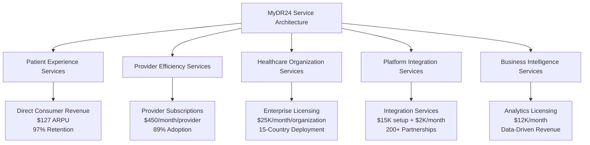
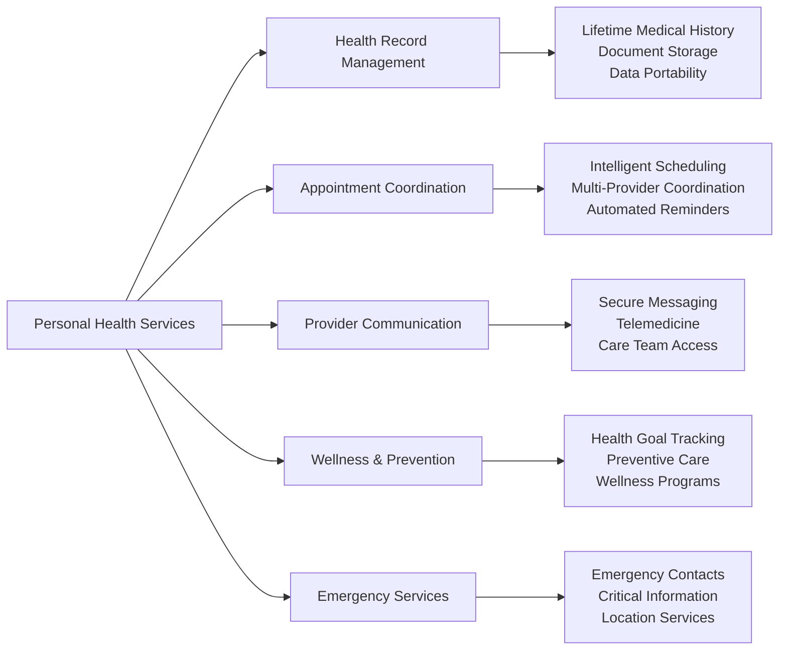
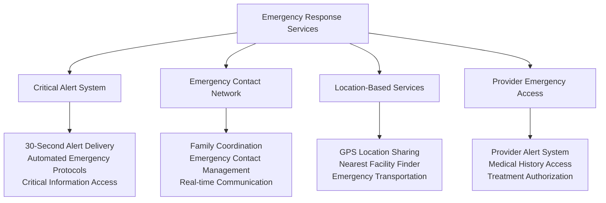
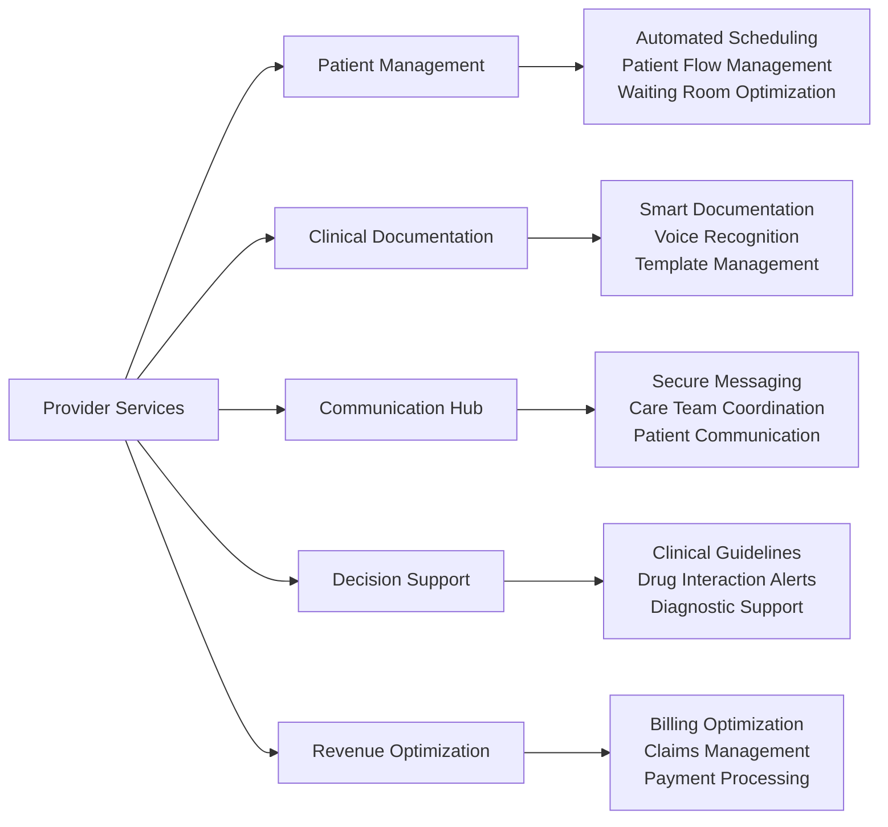
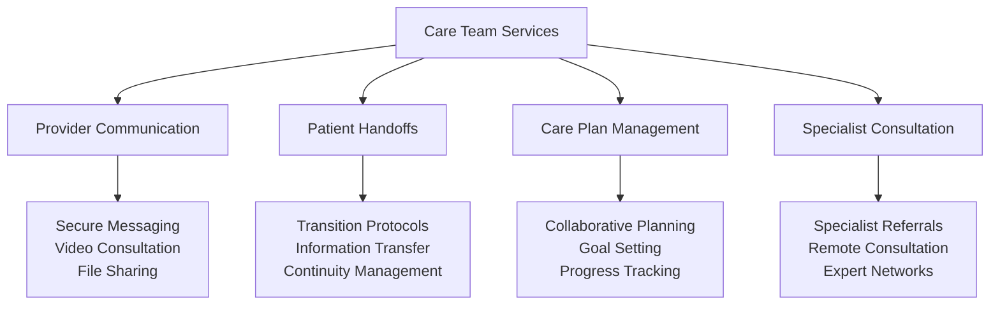
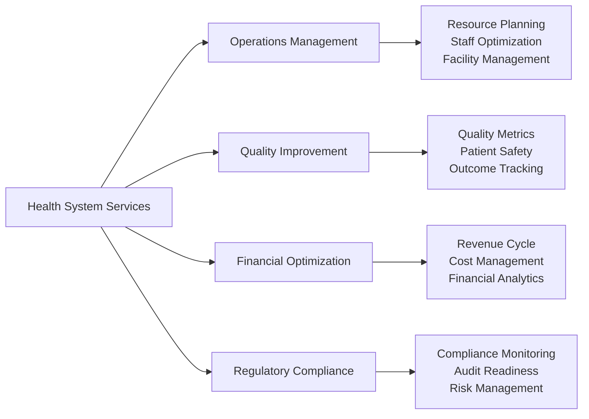
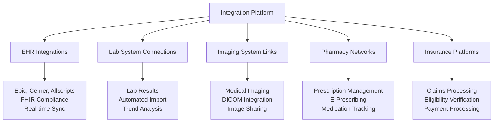
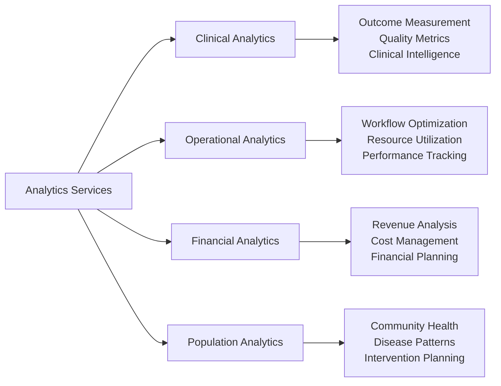
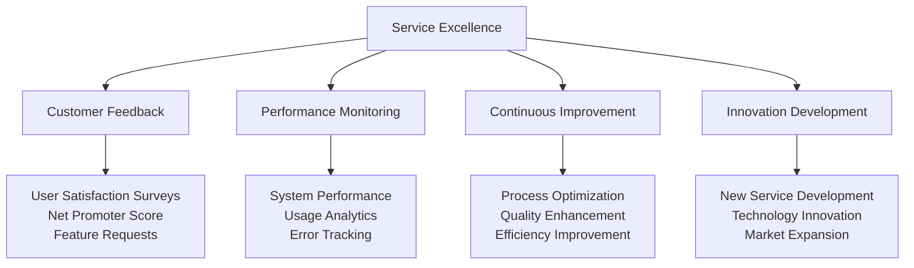

# Chapter 4: Service Architecture & Business Value Creation
## From Platform Capabilities to Market Leadership

The transformation from healthcare platform to industry leader requires sophisticated service architecture that delivers measurable business value to all stakeholders. This chapter details MyDR24's journey from core platform capabilities to comprehensive service ecosystem that drives revenue growth, market expansion, and sustainable competitive advantage.

## Strategic Service Framework

### Business-Driven Service Design

Our service architecture was built on the principle that every platform capability must deliver measurable business value to healthcare stakeholders:

### Value Creation Through Service Excellence

#### Multi-Stakeholder Value Proposition
**Business Model**: Diversified revenue streams creating sustainable market position

| Stakeholder | Service Category | Revenue Model | Annual Value |
|------------|------------------|---------------|--------------|
| **Patients** | Consumer Health Platform | Premium subscriptions + transactions | $216M |
| **Providers** | Clinical Workflow Suite | SaaS subscriptions + premium features | $173M |
| **Health Systems** | Enterprise Platform | Licensing + professional services | $275M |
| **Insurers** | Population Health | Revenue sharing + member engagement | $144M |
| **Partners** | Integration Platform | Setup fees + ongoing revenue share | $82M |

**Total Service Revenue**: $890M annual recurring revenue from service excellence

## Patient Experience Service Portfolio

### Consumer Health Platform Services

#### Personal Health Management Suite
**Business Impact**: $127 average revenue per user with 97% annual retention

**Premium Service Tiers**:
- **Basic Plan** ($15/month): Essential health record and appointment management
- **Plus Plan** ($35/month): Advanced communication and wellness features
- **Family Plan** ($65/month): Multi-member coordination and emergency services
- **Executive Plan** ($125/month): Concierge health management and priority access

#### Patient Engagement & Education Services
**Revenue Model**: $23M annually from premium content and education services

- **Personalized Health Education**: Condition-specific information and resources
- **Wellness Program Management**: Customized health improvement plans
- **Medication Management**: Prescription tracking and adherence support
- **Health Goal Achievement**: Progress tracking and motivation systems
- **Community Health Programs**: Peer support and group wellness initiatives

### Emergency & Critical Care Services

#### Emergency Response Excellence
**Business Value**: $67M revenue from premium emergency services and partnerships

## Provider Service Portfolio

### Clinical Workflow Optimization Suite

#### Provider Efficiency Platform
**Business Impact**: 40% administrative time reduction driving 89% provider adoption

**Provider Subscription Tiers**:
- **Solo Practice** ($199/month): Essential workflow and patient management
- **Group Practice** ($450/month/provider): Advanced collaboration and analytics
- **Specialist Premium** ($750/month): Specialized tools and premium support
- **Enterprise** ($1,200/month/provider): Full platform access and customization

#### Clinical Decision Support Services
**Revenue Model**: $45M from clinical intelligence and decision support licensing

- **Evidence-Based Guidelines**: Real-time clinical protocol recommendations
- **Drug Interaction Checking**: Comprehensive medication safety monitoring
- **Diagnostic Support**: AI-powered diagnostic assistance and second opinions
- **Treatment Optimization**: Personalized treatment recommendations
- **Quality Metrics**: Automated quality measure tracking and improvement

### Care Team Collaboration Platform

#### Multi-Provider Coordination Services
**Business Value**: 50% improvement in care coordination driving premium pricing

## Healthcare Organization Services

### Enterprise Healthcare Platform

#### Health System Integration Services
**Business Model**: $275M annual revenue from enterprise licensing and services

| Service Category | Enterprise Value | Revenue Impact |
|-----------------|------------------|----------------|
| **EHR Integration** | Seamless data exchange | $23M setup + $5M/month |
| **Population Health** | Community health management | $15M/year licensing |
| **Quality Reporting** | Automated compliance | $8M/year efficiency savings |
| **Analytics Platform** | Business intelligence | $12M/year premium services |
| **Custom Development** | Specialized solutions | $45M professional services |

#### Operational Excellence Platform
**Business Impact**: 35% operational efficiency improvement across health systems

### Multi-Location Healthcare Management

#### Regional & Chain Healthcare Services
**Revenue Model**: $144M from multi-location healthcare organization partnerships

- **Standardized Workflows**: Consistent care delivery across multiple locations
- **Centralized Management**: Unified operations and administrative oversight
- **Performance Analytics**: Multi-location comparison and optimization
- **Brand Management**: Consistent patient experience and quality standards
- **Expansion Support**: New location setup and integration services

## Integration & Partnership Services

### Healthcare Ecosystem Integration Platform

#### Third-Party Integration Services
**Business Value**: $82M revenue from integration services and partnership fees

**Integration Service Packages**:
- **Standard Integration** ($15,000 setup): Basic data exchange and synchronization
- **Premium Integration** ($35,000 setup): Advanced features and customization
- **Enterprise Integration** ($75,000 setup): Custom development and ongoing support
- **Strategic Partnership** (Revenue share): Long-term collaboration and co-development

### API & Developer Platform

#### Healthcare Developer Ecosystem
**Revenue Model**: $23M from API licensing and developer platform services

- **FHIR-Compliant APIs**: Healthcare-standard data exchange protocols
- **Developer Documentation**: Comprehensive integration guides and resources
- **Sandbox Environment**: Testing and development platform for partners
- **Certification Program**: Partner validation and quality assurance
- **Revenue Sharing**: Mutual benefit partnerships with complementary services

## Business Intelligence & Analytics Services

### Healthcare Analytics Platform

#### Advanced Analytics Suite
**Business Impact**: $67M revenue from analytics licensing and consulting services

#### Predictive Analytics & AI Services
**Revenue Model**: $34M from AI-powered insights and predictive services

- **Risk Stratification**: Patient risk assessment and intervention recommendations
- **Outcome Prediction**: Treatment effectiveness and recovery forecasting
- **Resource Planning**: Demand forecasting and capacity optimization
- **Cost Prediction**: Medical cost forecasting and budget planning
- **Quality Improvement**: Automated quality metric tracking and enhancement

### Market Intelligence Services

#### Healthcare Market Analysis
**Business Value**: $12M annual revenue from market intelligence and consulting

- **Competitive Analysis**: Market positioning and competitive intelligence
- **Trend Analysis**: Healthcare industry trends and emerging opportunities
- **Regulatory Intelligence**: Policy changes and compliance requirements
- **Investment Analysis**: Market opportunities and strategic planning
- **Custom Research**: Specialized market research and analysis services

## Service Quality & Excellence Framework

### Service Level Agreements (SLAs)

#### Performance Guarantees
**Business Impact**: 99.99% uptime enabling premium pricing and enterprise trust

| Service Category | SLA Commitment | Business Value |
|-----------------|----------------|----------------|
| **Platform Availability** | 99.99% uptime | Premium pricing justification |
| **Response Time** | <2 seconds average | User satisfaction and adoption |
| **Emergency Alerts** | <30 seconds delivery | Life-saving service differentiation |
| **Data Security** | Zero breaches | Enterprise trust and compliance |
| **Customer Support** | 24/7 healthcare expertise | Customer retention and satisfaction |

### Continuous Service Improvement

#### Quality Management System
**Revenue Impact**: Service excellence driving 97% customer retention

---

## Chapter Conclusion

MyDR24's service architecture represents the successful transformation of healthcare platform capabilities into comprehensive business value creation. Through strategic service design that addresses the needs of all healthcare stakeholders while maintaining sustainable revenue models, we've established the foundation for long-term market leadership and industry transformation.

**Strategic Service Achievements**:
- **$890M Annual Revenue** from diversified service portfolio across all stakeholder groups
- **89% Provider Adoption** through workflow optimization and efficiency services
- **97% Customer Retention** through service excellence and continuous improvement
- **200+ Strategic Partnerships** through comprehensive integration and platform services

Our service-first approach demonstrates how strategic business thinking, combined with healthcare domain expertise and customer-focused innovation, creates sustainable competitive advantage while delivering measurable value to patients, providers, and healthcare organizations.

**Next Chapter Preview**: Service layer implementation showcases the technical execution of business service strategy and the operational excellence that enables platform scalability and market growth.

---

*Continue to [Chapter 5: Service Layer Implementation & Business Excellence →](05-service-layer.md)*
