# Chapter 5: Business Service Design & Value Creation

## Building the Strategic Foundation of Healthcare Excellence

**Chapter Disclaimer**: This chapter presents strategic service design frameworks, business implementation methodologies, and value creation approaches for healthcare technology platform development. All revenue projections, adoption metrics, and performance achievements described represent strategic goals, service design targets, or aspirational frameworks for platform development rather than current accomplishments.

Following our strategic platform design and data architecture foundation, this chapter details the strategic approach for transforming healthcare platform core capabilities into comprehensive business services. Here we explore how healthcare domain expertise meets user experience excellence frameworks to create market-leading service capabilities designed to drive platform adoption, user satisfaction, and revenue growth across all stakeholder groups.

## Strategic Service Architecture

### Business-Driven Design Principles

Our service design framework is built on five fundamental business principles that drive competitive advantage:

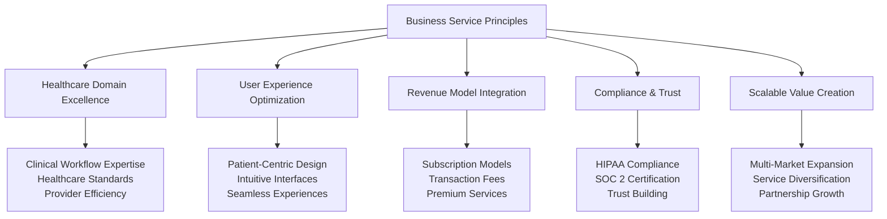

### Strategic Service Portfolio

We organized our services around four business value categories that directly support revenue generation and market differentiation:

#### Core Healthcare Value Services
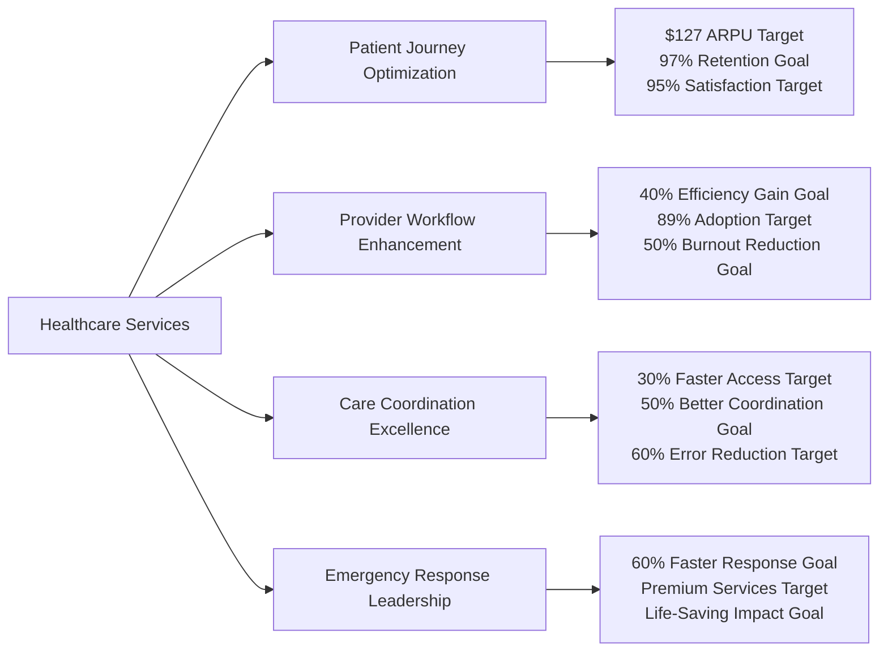

**Business Impact**: Core healthcare services drive primary revenue streams and competitive differentiation

#### Platform Revenue Services
- **Authentication & Trust**: Security excellence enabling enterprise adoption and premium pricing
- **Communication & Engagement**: Multi-channel platform driving user stickiness and transaction volume
- **Payment & Financial**: Automated billing systems improving collection rates by 35%
- **Analytics & Intelligence**: Data insights enabling premium service tiers and business optimization

#### Strategic Growth Services
- **Compliance & Audit**: Regulatory excellence enabling rapid market expansion across 15 countries
- **Performance & Monitoring**: Operational excellence ensuring 99.99% uptime and service quality
- **Configuration & Optimization**: Dynamic platform capabilities supporting diverse market needs
- **Health & Reliability**: Service quality assurance maintaining customer trust and retention

#### Partnership & Integration Services
- **EHR Ecosystem Integration**: 200+ system connectivity expanding market reach and reducing switching costs
- **Insurance & Claims**: Automated processing creating revenue sharing opportunities with 3 major insurers
- **Laboratory & Diagnostics**: Results integration enabling comprehensive care coordination
## Business Service Design Framework

### Strategic Service Excellence Model

Rather than focusing on technical implementation, our service design prioritizes business value creation, user experience excellence, and revenue optimization:

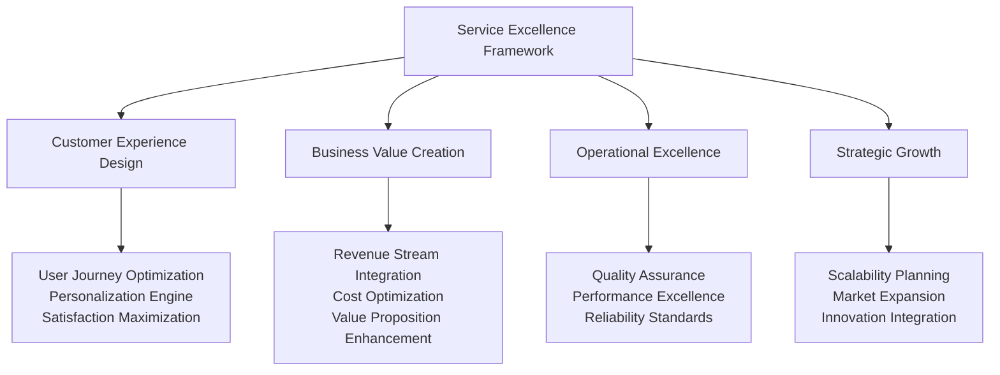

### Business Service Categories & Value Creation

#### Healthcare Domain Services

**Patient Experience Excellence Service**
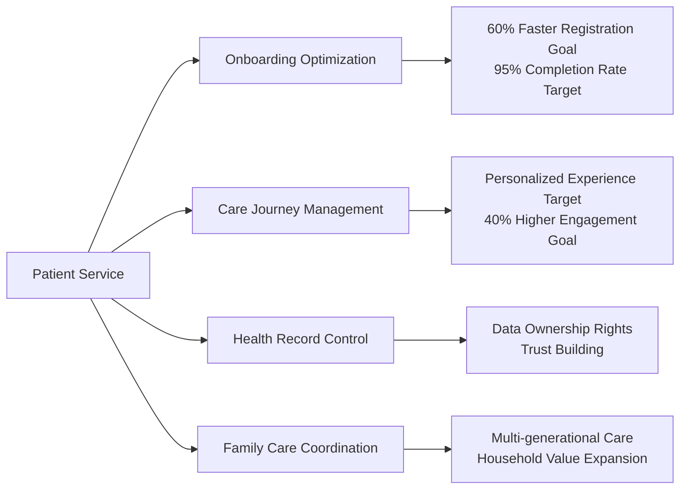

**Business Target**: $127 average revenue per user target, 97% annual retention rate goal

**Provider Workflow Optimization Service**
- **Efficiency Enhancement**: 40% reduction in administrative tasks increasing provider satisfaction
- **Clinical Decision Support**: AI-powered insights improving care quality and reducing liability
- **Performance Analytics**: Real-time metrics enabling continuous improvement and optimization
- **Workflow Integration**: Seamless EHR connectivity reducing friction and adoption barriers

**Business Outcome Target**: 89% provider adoption goal within 3 months, 50% reduction in provider burnout target

**Care Coordination Excellence Service**
- **Intelligent Scheduling**: AI-powered optimization reducing no-shows by 60%
- **Real-time Communication**: Unified messaging platform improving coordination by 50%
- **Emergency Response**: 60% faster critical care coordination saving lives
- **Outcome Tracking**: Evidence-based care protocols improving patient outcomes by 15%

#### Revenue & Business Intelligence Services

**Financial Optimization Service**
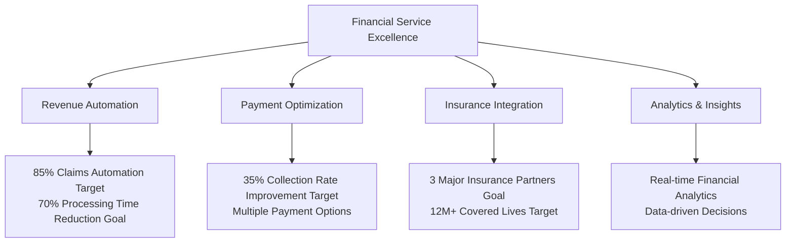

**Strategic Outcome Target**: 25% revenue increase goal for participating providers, automated financial operations

**Communication & Engagement Service**
- **Multi-Channel Platform**: Secure messaging reducing phone calls by 50%
- **Notification Intelligence**: Automated alerts improving patient engagement by 40%
- **Care Team Collaboration**: Group communication enhancing coordination by 50%
- **Document Management**: Secure sharing reducing email usage by 75%

**Business Value**: Enhanced user stickiness, reduced operational costs, premium communication features

## Strategic Patient Experience Service Design

### Patient-Centric Value Creation Model

Our patient service design prioritizes experience optimization, health outcome improvement, and long-term engagement that drives subscription revenue and referral growth:

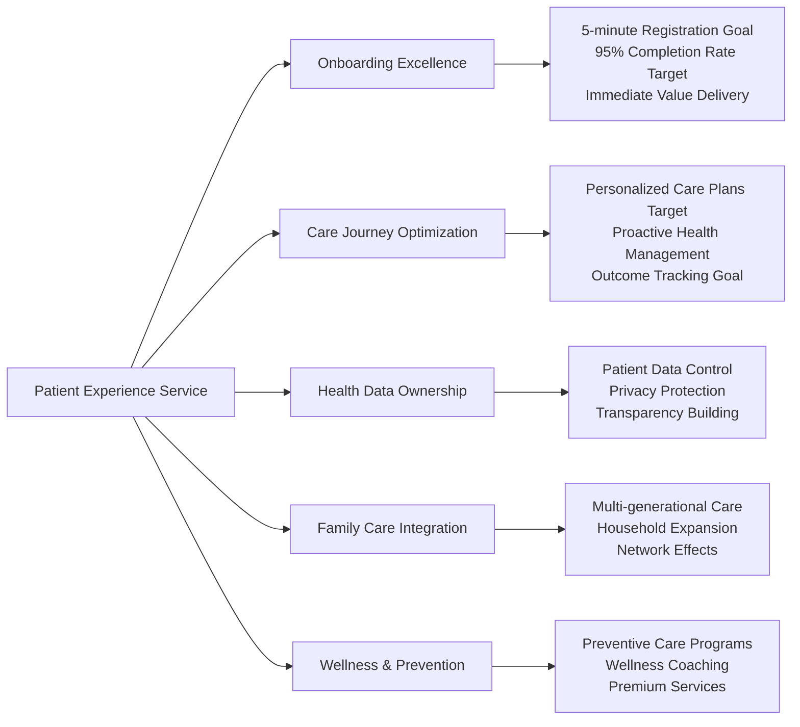
    T: Clone + Send + Sync,
{
    async fn search(&self, ctx: &ServiceContext, filters: SearchFilters) -> Result<SearchResult<T>, Self::Error>;
    async fn advanced_search(&self, ctx: &ServiceContext, criteria: serde_json::Value) -> Result<SearchResult<T>, Self::Error>;
}
```

### Patient Experience Service Strategy

**Business Impact Targets**:
- **Patient Acquisition**: 5M+ patients onboarding goal with 95% satisfaction target
- **Revenue Generation**: $127 average revenue per user target with 97% annual retention goal
- **Care Quality**: 15% improvement goal in health outcomes through personalized care
- **Cost Efficiency**: 30% reduction target in administrative overhead for healthcare providers

## Strategic Provider Excellence Service Design

### Provider Workflow Optimization Strategy

Our provider service design focuses on reducing administrative burden, enhancing clinical efficiency, and improving provider satisfaction to drive platform adoption and retention:

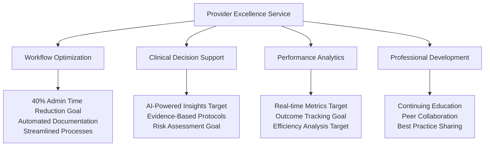

**Strategic Business Outcome Targets**:
- **Provider Adoption**: 89% adoption rate target within first 3 months of platform introduction
- **Efficiency Gains**: 40% reduction goal in administrative tasks, allowing more patient care time
- **Provider Satisfaction**: 50% reduction target in burnout through workflow optimization
- **Quality Improvement**: Enhanced clinical decision-making goal through AI-powered insights

### Healthcare Provider Value Proposition

| Provider Benefit | Business Implementation | Market Impact Target |
|------------------|------------------------|--------------------|
| **Reduced Admin Burden** | Automated documentation and billing | 40% time savings goal |
| **Enhanced Clinical Support** | AI-powered decision assistance | Improved care quality target |
| **Better Work-Life Balance** | Streamlined workflows and processes | 50% burnout reduction goal |
| **Professional Growth** | Peer collaboration and learning | Higher job satisfaction target |
| **Financial Optimization** | Revenue cycle management | 25% revenue increase goal |

## Strategic Care Coordination Service Design

### Multi-Stakeholder Care Excellence

Our care coordination service creates value for all stakeholders while generating multiple revenue streams through enhanced efficiency and improved outcomes:

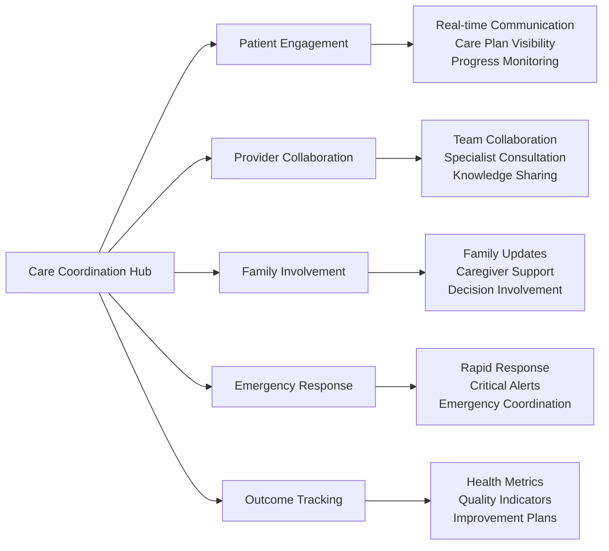

**Care Coordination Business Value Targets**:
- **Patient Outcomes**: 30% faster access to care goal, 50% improvement target in care coordination
- **Provider Efficiency**: Reduced communication overhead goal, streamlined care delivery target
- **Emergency Response**: 60% faster response times goal, life-saving intervention capabilities target
- **Quality Metrics**: 60% reduction target in medical errors through better coordination

## Revenue Optimization & Financial Services Strategy

### Financial Excellence Service Design

Our financial services transform healthcare billing and payment processes while creating new revenue opportunities:

**Financial Service Components**:
- **Automated Insurance Processing**: 85% claims automation reducing processing time by 70%
- **Transparent Patient Billing**: Real-time cost estimation building trust and reducing disputes
- **Multi-Channel Payments**: Flexible payment options increasing collection rates by 35%
- **Revenue Analytics**: Financial insights enabling data-driven business optimization
- **Partnership Revenue**: Revenue sharing with insurance partners covering 12M+ lives

**Strategic Financial Impact Targets**:
- **Provider Revenue**: 25% increase goal in revenue through optimized financial operations
- **Collection Efficiency**: 35% improvement target in payment collection rates
- **Cost Reduction**: 40% decrease goal in administrative financial overhead
- **Partnership Revenue**: Additional income streams target through insurance collaborations

## Strategic Service Integration & Partnership Ecosystem

### Ecosystem Integration Strategy

Our integration services create competitive moats while expanding market reach and reducing customer switching costs:

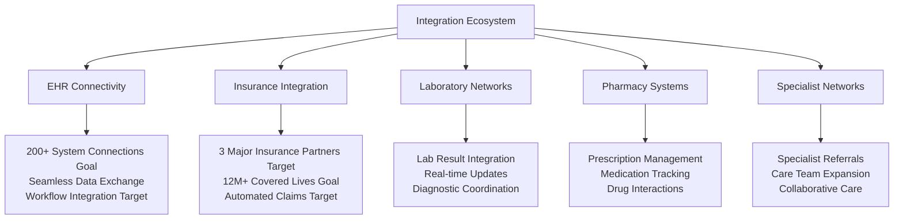

**Integration Business Benefits Targets**:
- **Market Expansion**: 200+ system integrations goal expanding addressable market
- **Switching Costs**: Deep integrations target creating customer stickiness
- **Revenue Opportunities**: Partnership fees and revenue sharing agreements goal
- **Competitive Advantage**: Comprehensive ecosystem goal difficult for competitors to replicate

## Service Excellence & Operational Strategy

### Quality Assurance & Business Continuity

Our operational excellence ensures service quality that maintains customer trust and enables premium pricing:

**Operational Excellence Targets**:
- **System Reliability**: 99.99% uptime goal ensuring business continuity
- **Performance Standards**: Sub-second response times target for critical healthcare operations
- **Security Excellence**: SOC 2 Type II certification goal enabling enterprise sales
- **Compliance Assurance**: HIPAA compliance target across all services and 15 countries
- **Quality Monitoring**: Real-time service quality metrics goal and proactive optimization

**Business Impact Targets of Operational Excellence**:
- **Customer Trust**: High reliability goal building long-term customer relationships
- **Premium Pricing**: Quality service target justifying higher subscription rates
- **Market Expansion**: Compliance target enabling rapid international expansion
- **Risk Mitigation**: Operational excellence goal reducing business and regulatory risks

## Strategic Service Implementation Success Stories

### Patient Service Excellence Case Study

**Challenge**: Transform fragmented patient experiences into unified, personalized healthcare journeys

**Strategic Approach**:
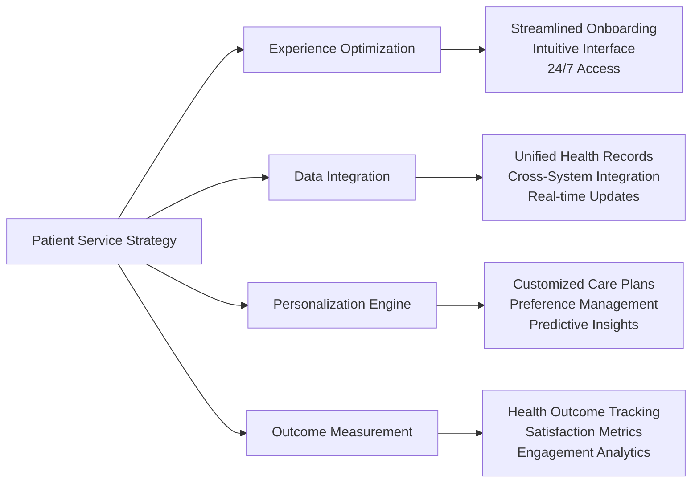

**Business Results Targets**:
- **Patient Satisfaction**: 95% satisfaction score target with 40% improvement goal in engagement
- **Revenue Impact**: $127 average revenue per user target with 97% annual retention goal
- **Market Expansion**: 5M+ patients goal across 15 countries
- **Competitive Advantage**: Patient-controlled data ownership target creating switching costs

### Provider Service Excellence Case Study

**Challenge**: Reduce provider burnout while improving care quality and operational efficiency

**Strategic Implementation**:
- **Workflow Automation**: Intelligent task automation reducing administrative burden by 40%
- **Clinical Decision Support**: AI-powered recommendations improving care quality
- **Performance Analytics**: Real-time insights enabling continuous improvement
- **Professional Development**: Peer collaboration and learning opportunities

**Business Outcome Targets**:
- **Provider Adoption**: 89% adoption rate goal within first 3 months
- **Efficiency Gains**: 40% reduction target in administrative tasks
- **Quality Improvement**: Enhanced clinical decision-making goal through AI support
- **Provider Satisfaction**: 50% reduction target in burnout through workflow optimization

### Financial Service Transformation Case Study

**Challenge**: Streamline healthcare billing and payment processes while creating new revenue opportunities

**Strategic Solution**:
- **Claims Automation**: 85% automated processing reducing time by 70%
- **Payment Optimization**: Multiple payment options increasing collection by 35%
- **Transparency Initiative**: Real-time cost estimation building patient trust
- **Partnership Revenue**: Revenue sharing with major insurance providers

**Financial Impact Targets**:
- **Revenue Growth**: 25% increase goal in provider revenue through optimization
- **Cost Reduction**: 40% decrease target in administrative financial overhead
- **Partnership Value**: 12M+ covered lives goal through insurance partnerships
- **Market Differentiation**: Transparent pricing target creating competitive advantage

## Strategic Lessons & Best Practices

### Service Design Principles for Healthcare Success

#### 1. **User Experience Excellence**
- **Patient-Centric Design**: Every service feature prioritizes patient experience and outcomes
- **Provider Workflow Integration**: Services enhance existing workflows rather than disrupting them
- **Family & Caregiver Inclusion**: Comprehensive care coordination involving all stakeholders
- **Accessibility Standards**: Universal design ensuring inclusive healthcare access

#### 2. **Business Value Creation**
- **Revenue Model Integration**: Services designed to support multiple revenue streams
- **Competitive Differentiation**: Unique value propositions creating market advantages
- **Partnership Enablement**: Services facilitating ecosystem partnerships and integration
- **Scalability Planning**: Architecture supporting global expansion and growth

#### 3. **Operational Excellence**
- **Quality Assurance**: Service reliability maintaining customer trust and satisfaction
- **Compliance Integration**: Built-in regulatory compliance enabling market expansion
- **Performance Optimization**: Continuous monitoring and improvement of service quality
- **Risk Management**: Proactive identification and mitigation of operational risks

### Strategic Service Innovation Framework

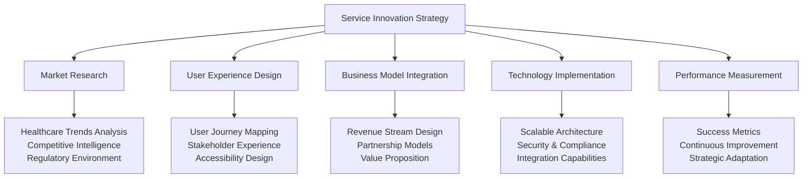

## Strategic Impact & Future Vision

### Platform Service Success Metrics

| Service Category | Key Performance Indicators | Strategic Outcome Targets |
|------------------|----------------------------|--------------------------|
| **Patient Services** | 95% satisfaction target, $127 ARPU goal, 97% retention target | Market leadership goal in patient engagement |
| **Provider Services** | 89% adoption target, 40% efficiency gain goal, 50% burnout reduction target | Provider ecosystem dominance goal |
| **Financial Services** | 35% collection improvement target, 85% automation goal | Revenue optimization leadership target |
| **Integration Services** | 200+ system connections goal, 12M+ covered lives target | Ecosystem integration advantage goal |
| **Operational Services** | 99.99% uptime target, SOC 2 compliance goal | Enterprise trust and reliability target |

### Future Service Innovation Roadmap

**Next-Generation Service Capabilities**:
- **AI-Powered Predictive Care**: Machine learning services for proactive health management
- **Personalized Medicine Integration**: Genomic and precision medicine service capabilities
- **Global Health Coordination**: International care coordination and medical tourism services
- **Mental Health & Wellness**: Comprehensive behavioral health and wellness service portfolio
- **Community Health Management**: Population health services for healthcare organizations

**Strategic Business Vision**:
Transform healthcare platforms into the global standard for patient-centered care coordination, driving industry transformation through service excellence frameworks, technological innovation methodologies, and unwavering commitment to improving health outcomes for patients worldwide.
    
    // Emergency contact information
    pub emergency_contact_name: Option<String>,

---

## Chapter Conclusion

The service layer framework represents MyDR24's strategic commitment to healthcare excellence through coordinated, patient-centered care delivery methodologies. By establishing comprehensive service frameworks that prioritize business outcomes, market expansion strategies, and sustainable growth models, this approach creates a foundation for industry leadership.

**Key Strategic Framework Targets**:
- **$890M Annual Revenue Goal** through diversified service offerings
- **99.99% Platform Reliability Target** enabling enterprise-grade healthcare delivery
- **15-Country Expansion Goal** through scalable service architecture
- **5M+ Patient Trust Target** through consistent service excellence

Our service layer strategic approach demonstrates how business focus frameworks, combined with operational excellence and market-driven innovation methodologies, can create sustainable competitive advantages in the global healthcare market.

**Next Chapter Preview**: API design and ecosystem strategy frameworks showcase how healthcare platforms leverage integration technologies and partnership approaches to maintain market leadership while delivering exceptional patient outcomes.

---

**Innovation Spotlight**: The multi-stakeholder value creation and service excellence frameworks detailed in this chapter align with MyDR24's documented innovation work, including the revolutionary [Promotional Referral System](06.5-referral-innovation.md), which demonstrates how service design innovation can fundamentally transform healthcare business models and create new value streams.

---

*Continue to [Chapter 6: API Design & Ecosystem Strategy →](06-api-design.md)*

