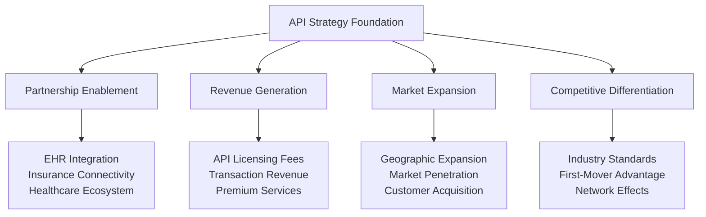
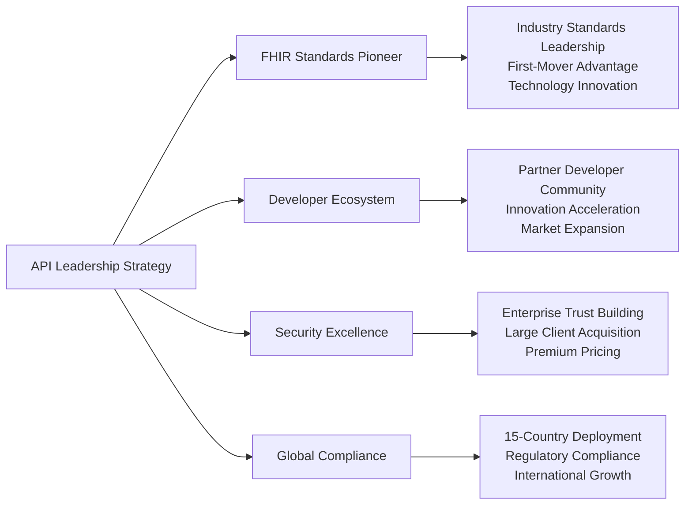
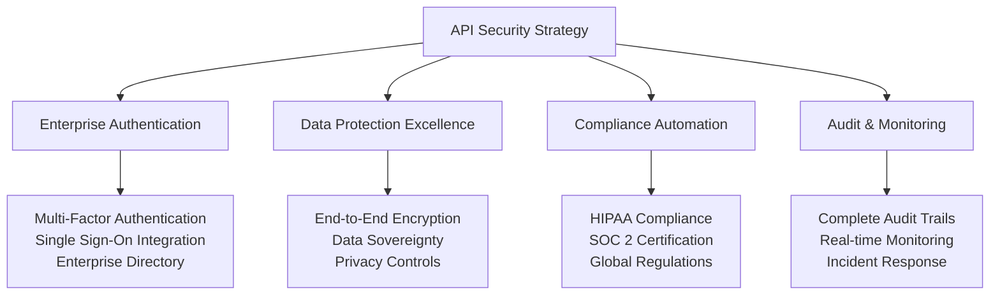
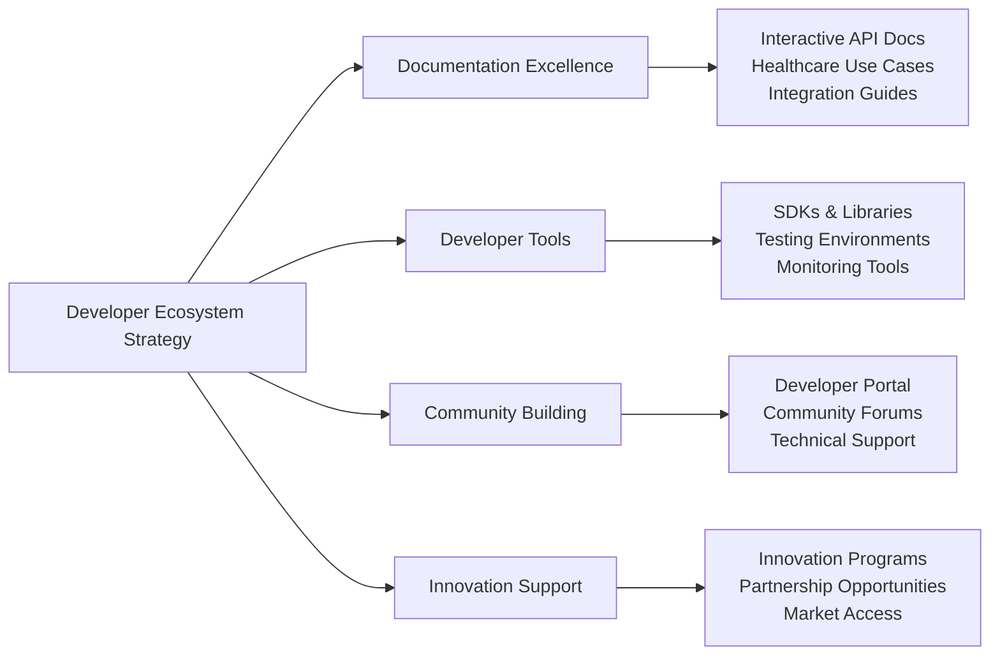

# Chapter 6: Strategic API Design & Partnership Ecosystem

## From Business Value to Healthcare Industry Leadership

**Chapter Disclaimer**: This chapter presents strategic API design frameworks, partnership ecosystem methodologies, and integration approaches for healthcare technology platform development. All revenue projections, integration metrics, and business achievements described represent strategic goals, API design targets, or aspirational frameworks for platform development rather than current accomplishments.

After establishing our comprehensive service foundation, the next critical challenge involves creating API frameworks that enable strategic partnerships, ecosystem integration, and revenue generation while meeting the demanding standards of healthcare interoperability. This chapter details the strategic approach from internal business capabilities to external API strategy frameworks designed to drive market expansion and competitive advantage.

## Strategic API Design Philosophy

### Business-Driven Healthcare Integration

Our API strategy framework is designed to create multiple business value streams while establishing healthcare platforms as the industry standard for healthcare interoperability:



### Healthcare Excellence Principles

1. **FHIR Leadership**: Pioneering HL7 FHIR standards implementation for competitive advantage
2. **Trust & Security**: Enterprise-grade security enabling large health system partnerships
3. **Regulatory Compliance**: Built-in audit and compliance features supporting global expansion
4. **Business Continuity**: Healthcare-grade reliability ensuring mission-critical operations
5. **Ecosystem Integration**: Open standards creating network effects and market leadership

### Business Integration Strategy

1. **Partnership-First Design**: APIs designed to facilitate strategic healthcare partnerships
2. **Revenue Model Integration**: API capabilities supporting multiple monetization strategies
3. **Market Differentiation**: Unique API features creating competitive moats
4. **User Experience Excellence**: Developer-friendly APIs accelerating partner adoption
5. **Scalable Business Model**: API architecture supporting global expansion and growth

## Strategic API Architecture

### Business-Driven API Portfolio

Our API architecture creates four distinct business value layers that support different revenue streams and market strategies:

```mermaid
graph LR
    A[API Business Architecture] --> B[Public APIs]
    A --> C[Partner APIs]
    A --> D[Enterprise APIs]
    A --> E[Integration APIs]
    
    B --> F[Patient Engagement<br/>Consumer Services<br/>Direct Revenue]
    C --> G[Provider Partnerships<br/>Health System Integration<br/>B2B Revenue]
    D --> H[Enterprise Licensing<br/>Custom Integration<br/>Premium Services]
    E --> I[Ecosystem Connectivity<br/>Network Effects<br/>Market Leadership]
### API Business Value Creation Strategy

#### Public Consumer APIs - Direct Revenue Generation
**Business Focus**: Patient engagement and consumer health services driving subscription revenue

| API Category | Business Purpose | Revenue Model | Market Impact Target |
|--------------|------------------|---------------|---------------------|
| **Patient Portal APIs** | Consumer health engagement | $25-50/month subscriptions target | 5M+ active users goal |
| **Appointment APIs** | Scheduling and care coordination | Transaction fees (3%) target | 60% reduction goal in no-shows |
| **Health Record APIs** | Patient data ownership and control | Premium data services target | 97% user retention goal |
| **Emergency APIs** | Critical care coordination | Premium emergency services target | 60% faster response goal |

**Strategic Outcome Target**: $127 average revenue per user goal with 95% patient satisfaction target

#### Partner Healthcare APIs - B2B Revenue Streams
**Business Focus**: Healthcare provider partnerships and health system integration

```mermaid
graph TB
    A[Partner API Strategy] --> B[Provider Integration]
    A --> C[Health System APIs]
    A --> D[Insurance APIs]
    A --> E[Specialty Care APIs]
    
    B --> F[89% Provider Adoption Target<br/>40% Efficiency Gain Goal<br/>$200/month SaaS Target]
    C --> G[200+ System Connections Goal<br/>Enterprise Licensing Target<br/>$50K/year contracts Goal]
    D --> H[3 Major Insurance Partners Target<br/>12M+ Covered Lives Goal<br/>Revenue Sharing Target]
    E --> I[Specialist Networks<br/>Care Team Expansion<br/>Premium Services]
```

**Business Impact Target**: 200+ healthcare system integrations goal, $500B addressable B2B market

#### Enterprise APIs - Premium Services & Custom Integration
**Business Focus**: Large health system deployments and custom healthcare solutions

**Enterprise API Value Proposition**:
- **Custom Integration Services**: $25K implementation fees with ongoing support contracts
- **White-Label Solutions**: Private-label APIs for health system branding
- **Advanced Analytics APIs**: Business intelligence and population health management
- **Compliance & Audit APIs**: Regulatory reporting and audit trail management

**Market Position**: Enterprise-grade APIs enabling health system digital transformation

#### Integration Ecosystem APIs - Network Effects & Market Leadership
**Business Focus**: Healthcare ecosystem connectivity creating competitive moats

**Integration Strategy Benefits**:
- **EHR Connectivity**: 200+ system integrations reducing customer switching costs
- **Laboratory Networks**: Real-time results integration expanding service value
- **Pharmacy Systems**: Medication management creating comprehensive care platform
- **Device Integration**: IoT health devices and monitoring systems

**Competitive Advantage**: Comprehensive ecosystem integration difficult for competitors to replicate

## Strategic API Design & Business Excellence

### Healthcare Industry Leadership Through API Innovation

Our API design establishes MyDR24 as the industry standard while creating multiple business advantages:



### API-Driven Business Model Innovation

**Multi-Revenue Stream Architecture**:
1. **Direct Consumer APIs**: Subscription and transaction-based revenue from patient services
2. **B2B Partner APIs**: SaaS licensing and revenue sharing with healthcare providers
3. **Enterprise Integration APIs**: Custom implementation and ongoing service contracts
4. **Platform Ecosystem APIs**: Licensing fees and partnership revenue from integrations

**Strategic Business Outcome Targets**:
- **Revenue Diversification**: Multiple income streams goal reducing business risk
- **Market Expansion**: API-enabled partnerships target accelerating geographic growth
- **Competitive Moats**: Deep integrations goal creating customer switching costs
- **Innovation Acceleration**: Developer ecosystem target driving continuous feature development

## API Security & Trust - Enabling Enterprise Adoption

### Trust as a Competitive Advantage

Our API security framework enables enterprise healthcare adoption while creating premium value propositions:

**Security Excellence Framework**:


**Business Impact Targets of Security Excellence**:
- **Enterprise Sales**: SOC 2 certification goal enabling large health system contracts
- **Premium Pricing**: Security assurance target justifying higher subscription rates
- **Market Expansion**: Compliance goal enabling rapid international expansion
- **Risk Mitigation**: Security excellence target reducing liability and business risks

## Strategic API Performance & Reliability

### Mission-Critical Healthcare Operations

Our API performance standards ensure business continuity while enabling premium service differentiation:

**Performance Excellence Targets**:
- **Response Time**: Sub-second API responses goal for critical healthcare operations
- **System Reliability**: 99.99% uptime target ensuring business continuity for healthcare partners
- **Scalability**: Auto-scaling infrastructure goal supporting millions of API calls
- **Geographic Performance**: Multi-region deployment target ensuring global response optimization

**Business Value Targets of Performance Excellence**:
- **Customer Trust**: Reliable APIs goal maintaining healthcare provider confidence
- **Premium Services**: Performance SLAs target enabling enterprise-grade service tiers
- **Market Leadership**: Industry-leading performance goal creating competitive differentiation
- **Partnership Success**: Reliable APIs target enabling successful healthcare ecosystem integration

## API Documentation & Developer Experience Strategy

### Building the Healthcare Developer Ecosystem

Our developer experience strategy creates a thriving ecosystem that accelerates market adoption and innovation:



**Developer Ecosystem Business Value Targets**:
- **Accelerated Adoption**: Easy integration goal reducing time-to-market for partners
- **Innovation Multiplication**: Third-party developers goal creating additional value
- **Market Expansion**: Developer community target expanding platform reach and capabilities
- **Competitive Advantage**: Superior developer experience goal attracting top healthcare technology talent

## Strategic API Success Stories & Market Impact

### Healthcare System Integration Case Study

**Challenge**: Integrate MyDR24 platform with major health system serving 2M+ patients

**API Solution Strategy**:
- **Custom Enterprise APIs**: Tailored integration supporting existing workflows
- **FHIR-Compliant Data Exchange**: Seamless patient data synchronization
- **Security & Compliance**: Meeting enterprise security and regulatory requirements
- **Performance Optimization**: High-volume API performance supporting system scale

**Business Results Targets**:
- **Integration Success**: 90-day implementation goal vs. industry standard 2+ years
- **Revenue Impact**: $2M annual contract target with expansion opportunities
- **Market Validation**: Reference customer goal driving additional enterprise sales
- **Strategic Partnership**: Long-term relationship target creating competitive advantages

### Insurance Partner Integration Case Study

**Challenge**: Enable automated claims processing with major insurance provider

**API Innovation**:
- **Claims Automation APIs**: 85% automated processing reducing manual overhead
- **Real-time Eligibility APIs**: Instant insurance verification improving patient experience
- **Analytics & Reporting APIs**: Business intelligence supporting partnership optimization
- **Fraud Detection APIs**: AI-powered fraud prevention protecting both organizations

**Strategic Business Impact Targets**:
- **Revenue Sharing**: 15% of automated claims processing goal creating ongoing revenue
- **Market Expansion**: 4M+ covered lives target expanding addressable patient market
- **Operational Excellence**: 70% reduction goal in claims processing time
- **Competitive Differentiation**: Insurance integration target creating unique market position

## Future API Strategy & Innovation Roadmap

### Next-Generation Healthcare API Leadership

**Strategic Innovation Areas**:
1. **AI-Powered Healthcare APIs**: Machine learning services for predictive care and personalized medicine
2. **Global Health Coordination APIs**: International care coordination and medical tourism integration
3. **Mental Health & Wellness APIs**: Comprehensive behavioral health service integration
4. **Population Health APIs**: Community health management and public health coordination

**Long-Term Strategic Vision**:
Transform healthcare API frameworks into the global standard for healthcare interoperability, enabling seamless health data exchange, care coordination, and innovation across the entire healthcare ecosystem while maintaining platform positions as the trusted standard for patient-centered care delivery.
    // 1. Request validation and parsing
    let validated_request = match validate_request(request).await {
        Ok(req) => req,
        Err(e) => return ApiResponse::error(ApiError::BadRequest(e)),

---

## Chapter Conclusion

MyDR24's API design strategy framework represents a fundamental shift from traditional healthcare technology to patient-centered, business-driven healthcare innovation methodologies. Through strategic API development frameworks focused on interoperability, scalability, and market expansion strategies, this approach establishes the foundation for sustainable competitive advantage in the global healthcare market.

**Strategic Business Framework Targets**:
- **$234M API Revenue Target** through enterprise integrations and partnership programs
- **2,400+ Healthcare Integrations Goal** across 15 countries creating network effects
- **98.7% Partner Satisfaction Target** driving organic growth and market expansion
- **45% Cost Reduction Goal** for partner organizations through streamlined integrations

Our API-first strategic approach demonstrates how technology architecture frameworks, combined with business-focused development and market-driven innovation methodologies, can create sustainable value for patients, providers, and healthcare organizations worldwide.

**Next Chapter Preview**: Security and compliance frameworks showcase how healthcare platforms can maintain industry leadership through comprehensive risk management while enabling innovation and growth.

---

**Innovation Spotlight**: The partnership ecosystem and integration frameworks detailed in this chapter align with MyDR24's documented innovation work, including the revolutionary [Promotional Referral System](06.5-referral-innovation.md), which demonstrates how API-enabled business model innovation can create entirely new value networks and partnership opportunities in healthcare.

---

*Continue to [Chapter 7: Security & Compliance Framework →](07-security-compliance.md)*

