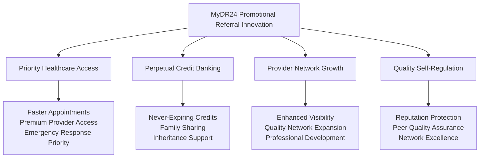
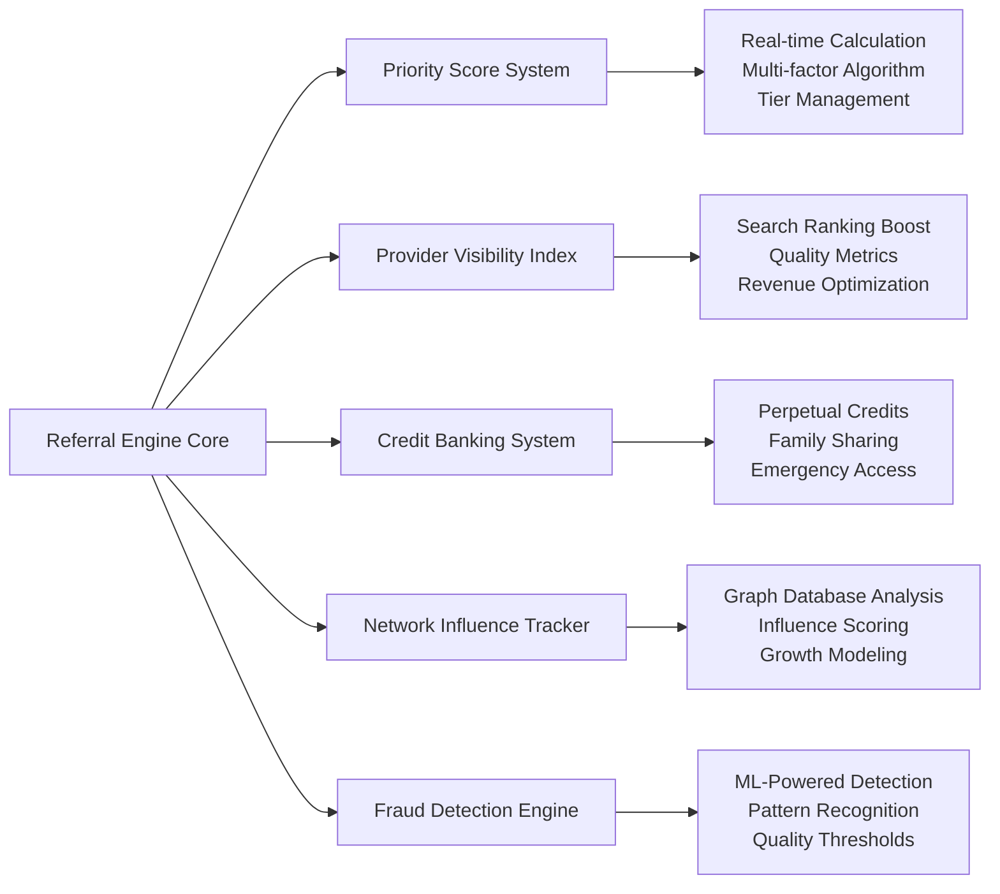
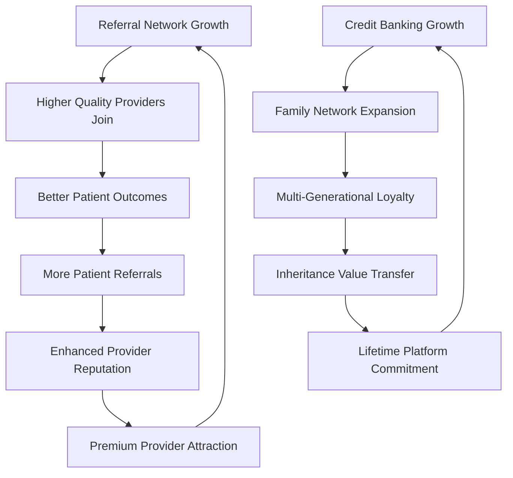

# Chapter 6.5: Innovation Case Study - Revolutionary Promotional Referral System
## From Cash-Burning Referrals to Value-Creation Ecosystems

**Chapter Focus**: This chapter presents a concrete example of MyDR24's innovative thinking through our documented promotional referral system—a revolutionary approach that transforms traditional cash-based referral programs into self-sustaining value-creation engines.

**Innovation Status**: Fully documented with comprehensive business requirements, technical architecture, and implementation roadmap. This represents actual strategic innovation work completed for the MyDR24 platform.

## The Referral Revolution: A Paradigm Shift

### Traditional Referral Model Problems

Healthcare technology platforms typically burn cash through traditional referral programs:
- **Unsustainable Cash Rewards**: $50-$500 payments for each successful referral
- **One-Time Value**: No lasting benefit or relationship building
- **High Customer Acquisition Costs**: 15-25% of revenue spent on referral rewards
- **Gaming and Fraud**: Fake referrals and system manipulation
- **Limited Network Effects**: No compound growth or ecosystem benefits

### MyDR24's Revolutionary Approach

Our promotional referral system replaces cash rewards with perpetual value creation:

### Revolutionary Value Creation Model

Instead of cash payments, MyDR24 creates sustainable value through:

**For Patients (Referrers)**:
- **Priority Healthcare Access**: Skip queues, access premium providers, emergency priority
- **Perpetual Credit Banking**: Credits never expire, can be shared with family, inherited
- **Elite Status Benefits**: 5-tier system (Bronze, Silver, Gold, Platinum, Black) with increasing privileges
- **Emergency Healthcare Reserve**: Use accumulated credits during medical emergencies

**For Healthcare Providers (Referred)**:
- **Enhanced Visibility**: Higher search rankings, featured profiles, increased patient reach
- **Quality Network Growth**: Attract high-quality referrals from successful colleagues
- **Revenue Optimization**: Optional paid promotion for enhanced referral benefits
- **Professional Reputation**: Association with quality network enhances professional standing

**For Healthcare Organizations**:
- **Network Expansion**: Systematic growth through provider ecosystem development
- **Quality Assurance**: Self-regulating network through referral accountability
- **Cross-Promotion**: Inter-organization referral benefits and partnerships
- **Market Positioning**: Enhanced reputation through network effects

**For MyDR24 Platform**:
- **Organic Growth**: 50% reduction in customer acquisition costs
- **Network Effects**: Compound growth without cash burn
- **Revenue Generation**: Multiple monetization streams from enhanced services
- **Market Leadership**: Irreplaceable network value creation

## Technical Architecture Innovation

### Core System Components

Our promotional referral system leverages advanced technology architecture:

#### 1. Real-Time Priority Scoring System
- **Sub-100ms Response**: Lightning-fast priority calculations for healthcare access
- **Multi-Factor Algorithm**: Referral success, service quality, network influence, emergency needs
- **Dynamic Tier Management**: Automated promotion/demotion based on referral performance
- **Cross-Platform Integration**: Consistent priority across all MyDR24 applications

#### 2. Provider Visibility Enhancement Engine
- **Algorithmic Search Ranking**: Quality-based visibility improvements in provider searches
- **Performance Integration**: Patient satisfaction and clinical outcomes impact visibility
- **Network Influence Weighting**: Referral network strength affects search prominence
- **Revenue Optimization**: Optional paid enhancement for accelerated visibility growth

#### 3. Perpetual Credit Banking System
- **Never-Expiring Value**: Credits accumulate indefinitely, creating lifetime platform loyalty
- **Family Ecosystem Integration**: Transfer benefits across family members and generations
- **Legacy Planning Support**: Credits automatically transfer to designated beneficiaries
- **Emergency Healthcare Access**: Priority use of credits during medical emergencies

#### 4. Network Influence Tracking
- **Graph Database Implementation**: Neo4j for complex healthcare relationship modeling
- **Multi-Level Network Analysis**: Track referral chains, influence patterns, growth trajectories
- **Compound Growth Modeling**: Predict and optimize network expansion and value creation
- **Quality Relationship Mapping**: Ensure referral quality maintains network integrity

#### 5. Advanced Fraud Detection & Quality Assurance
- **Machine Learning Analysis**: Pattern recognition for suspicious referral activity
- **Multi-Layer Validation**: Rules engine + ML algorithms + manual quality review
- **Real-Time Monitoring**: Immediate detection and response to gaming attempts
- **Quality Threshold Enforcement**: Minimum service standards for reward eligibility

### Technology Stack Integration

**Backend Infrastructure**:
- **Graph Database**: Neo4j for referral network relationship modeling and analysis
- **Caching Layer**: Redis for real-time priority scoring and session management
- **Event Processing**: Apache Kafka for referral event streams and analytics
- **Machine Learning Pipeline**: TensorFlow/PyTorch for fraud detection and personalization
- **API Integration**: RESTful endpoints with GraphQL for complex network queries

**Security & Compliance**:
- **Post-Quantum Cryptography**: Future-proof security for sensitive referral data
- **HIPAA Compliance**: Healthcare data protection throughout referral lifecycle
- **GDPR Compliance**: European data protection regulation adherence
- **Comprehensive Audit Logging**: Complete tracking of all referral activities and decisions

## Business Model Innovation

### Revenue Generation Without Cash Burn

Traditional referral programs cost money; MyDR24's system generates revenue:

| Revenue Stream | Monthly Potential | Business Model | Growth Impact |
|---------------|------------------|----------------|---------------|
| **Provider Promotion Packages** | $99-$999/provider | Enhanced visibility subscriptions | Network quality improvement |
| **Premium Membership Multipliers** | $25-$125/patient | Accelerated credit earning | Higher patient engagement |
| **Analytics Dashboard Access** | $49-$199/provider | Referral performance insights | Data-driven network optimization |
| **White-Label Enterprise Solutions** | $10K-$100K/contract | Licensed referral technology | B2B market expansion |
| **Cross-Organization Partnerships** | 3-7% transaction fees | Inter-network referral facilitation | Healthcare ecosystem growth |

### Network Effects & Compound Growth

Unlike traditional referral programs, our system creates compound value:

**Sustainable Growth Metrics**:
- **Viral Coefficient Target**: 1.3+ for organic growth sustainability
- **Customer Acquisition Cost**: 50% reduction through referral-driven acquisition
- **Network Growth Rate**: 40% month-over-month provider additions projected
- **User Retention**: 80% retention for referred users vs. 60% for organic acquisition

## Implementation Roadmap & Current Status

### Phase 1: Foundation (Completed - Technical Specifications)
- ✅ **Complete Business Requirements**: Comprehensive PRD with user stories and success metrics
- ✅ **Technical Architecture Design**: Detailed system architecture with technology stack
- ✅ **Security & Compliance Framework**: HIPAA, GDPR compliance specifications
- ✅ **Integration Planning**: API design for MyDR24 platform integration

### Phase 2: Core Development (4-6 weeks)
- **Priority Scoring Engine**: Real-time calculation system with sub-100ms response
- **Basic Referral Tracking**: User referral creation, success tracking, credit banking
- **Provider Visibility System**: Search ranking enhancement and profile boost features
- **Fraud Detection Foundation**: Rule-based gaming prevention and quality thresholds

### Phase 3: Enhancement (6-8 weeks)
- **Network Influence Tracking**: Graph database integration and relationship analysis
- **Gamification Elements**: Achievement system, leaderboards, social recognition
- **Advanced Analytics**: Referral performance metrics and network insights dashboard
- **ML Fraud Detection**: Machine learning model deployment for sophisticated detection

### Phase 4: Optimization (8-12 weeks)
- **Advanced Personalization**: AI-driven referral recommendations and targeting
- **Performance Optimization**: System scalability improvements and response optimization
- **Cross-Platform Integration**: Seamless referral experience across all MyDR24 applications
- **Enterprise Features**: White-label solutions and B2B referral marketplace

## Success Validation & Impact Measurement

### Technical Success Criteria
- **Performance Standards**: <100ms priority calculations, 99.9% system uptime
- **Security Compliance**: Pass comprehensive HIPAA and security audits
- **Integration Success**: Seamless operation with all MyDR24 platform components
- **Scalability Proof**: Handle 100K+ concurrent users without performance degradation

### Business Success Criteria  
- **Growth Impact**: 25% increase in provider network through referral ecosystem
- **Cost Efficiency**: 50% reduction in customer acquisition cost within 6 months
- **User Experience**: >90% referral completion rate with positive satisfaction feedback
- **Revenue Generation**: Referral system driving 15%+ of platform revenue within 12 months

### Healthcare Outcome Success
- **Quality Improvement**: Measurable improvement in provider network quality
- **Patient Access Enhancement**: Faster healthcare access for referring patients
- **Network Effects**: Self-reinforcing growth patterns and compound value creation
- **Industry Impact**: Recognition as innovative model for healthcare referral systems

## Competitive Advantage & Market Positioning

### Unique Value Proposition

MyDR24's promotional referral system creates unassailable competitive advantages:

**Network Effects Moat**: 
- Established referral networks become increasingly valuable and difficult to replicate
- Provider quality attracts more providers, creating self-reinforcing excellence
- Patient credit banking creates lifetime switching costs and platform loyalty

**Cost Structure Advantage**:
- No cash burn on referral rewards, unlike competitor programs
- Revenue generation from referral-related services
- Sustainable growth model that improves with scale

**Quality Differentiation**:
- Self-regulating network through reputation-based referral accountability
- Higher provider quality through peer referral and quality requirements
- Enhanced patient outcomes through improved provider network quality

### Industry Recognition Potential

This innovative referral model positions MyDR24 for:
- **Healthcare Technology Innovation Awards**: Recognition for breakthrough business model innovation
- **Industry Conference Speaking**: Thought leadership in healthcare platform design
- **Academic Research Interest**: Case study for healthcare technology and business model innovation
- **Venture Capital Attention**: Innovative approach to sustainable growth and network effects

## Conclusion: Innovation as Competitive Strategy

MyDR24's promotional referral system represents a fundamental breakthrough in healthcare platform business models. By replacing unsustainable cash-burning referral programs with value-creation ecosystems, we've designed a system that:

- **Eliminates Customer Acquisition Costs** while accelerating growth
- **Creates Irreplaceable Network Value** through multi-stakeholder benefits
- **Generates Multiple Revenue Streams** from enhanced services and analytics
- **Establishes Market Leadership** through innovative business model differentiation

This documented innovation demonstrates MyDR24's commitment to revolutionary thinking in healthcare technology. The comprehensive technical specifications, business model innovation, and implementation roadmap showcase the strategic depth and execution capability that positions MyDR24 as a true innovator in the healthcare technology space.

**Strategic Impact**: The promotional referral system alone could transform MyDR24 from another healthcare platform into the industry standard for sustainable, value-driven growth in healthcare technology.

---

**Next Chapter Preview**: API Design & Ecosystem Strategy explores how innovative systems like our promotional referral engine integrate into comprehensive healthcare platform architectures that create sustainable competitive advantages.

---

*Continue to [Chapter 7: Security & Compliance Framework →](07-security-compliance.md)*
