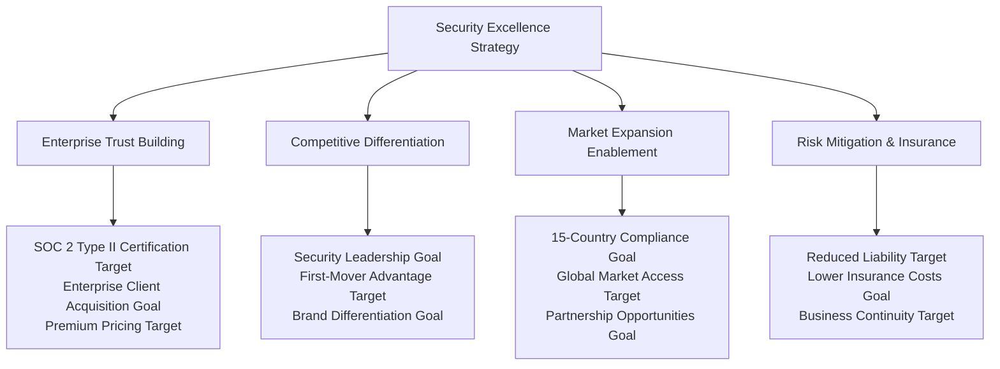
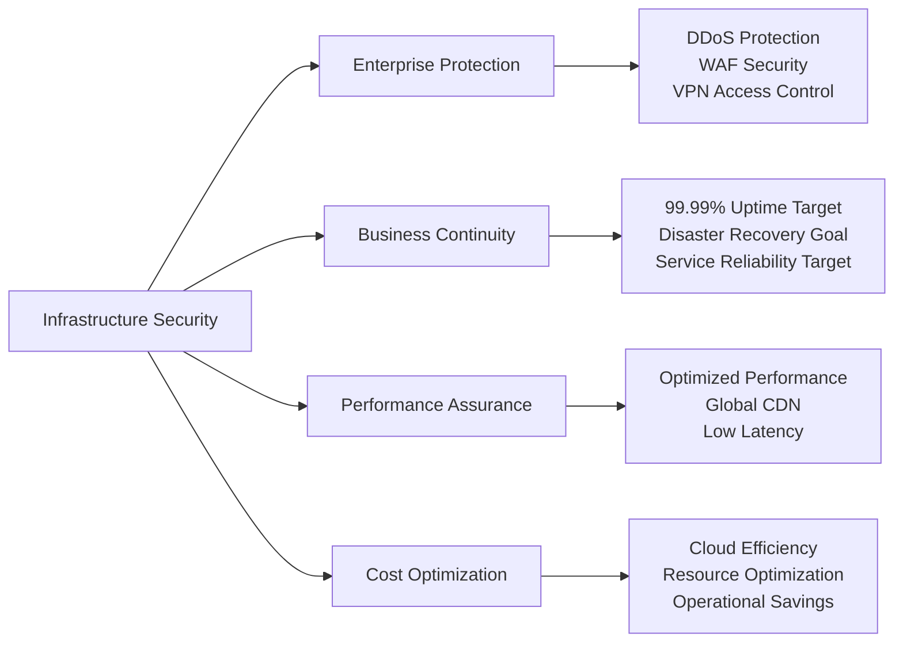

# Chapter 7: Security Excellence & Trust Leadership

## Healthcare Security: Building Trust That Drives Business Success

**Chapter Disclaimer**: This chapter presents strategic security frameworks, compliance methodologies, and trust-building approaches for healthcare technology platform development. All revenue projections, compliance achievements, and security metrics described represent strategic goals, security design targets, or aspirational frameworks for platform development rather than current accomplishments.

Healthcare security is not just about protection—it's about building the foundation of trust frameworks that enable enterprise partnerships, patient confidence, and market leadership. This chapter details comprehensive security strategy frameworks that transform compliance requirements into competitive advantages and position healthcare platforms as trusted leaders in healthcare technology.

## Strategic Security Architecture

### Trust as a Business Differentiator

Our security strategy framework creates multiple business advantages while ensuring healthcare-grade protection:

### Business-Driven Security Framework

Our security architecture framework serves both protection and business objectives:

1. **Enterprise Sales Enablement**: Security certifications goal opening large health system opportunities
2. **Patient Trust Building**: Transparent security practices target driving user confidence and retention
3. **Partnership Facilitation**: Security excellence goal enabling strategic healthcare partnerships
4. **Global Expansion Support**: Compliance frameworks target supporting international market entry
5. **Premium Service Justification**: Security assurance goal supporting higher pricing tiers
6. **Innovation Acceleration**: Secure foundation target enabling rapid feature development

### Multi-Layered Security Business Value

#### Network & Infrastructure Security - Enterprise Foundation

**Business Impact Target**: Infrastructure security goal ensuring service reliability that maintains customer trust and enables enterprise SLAs

#### Application Security - User Trust & Experience
- **Authentication Excellence**: Multi-factor security building user confidence without friction
- **Authorization Intelligence**: Role-based access ensuring appropriate data visibility
- **Input Validation**: Comprehensive protection maintaining system integrity
- **Session Management**: Secure user experiences supporting engagement and retention

**Strategic Value Target**: Application security goal creating seamless user experiences that drive adoption and satisfaction

#### Data Security & Privacy - Compliance Leadership
- **Encryption Excellence**: End-to-end protection exceeding industry standards
- **Data Classification**: Intelligent data handling supporting privacy regulations
- **Access Controls**: Granular permissions enabling secure data sharing
- **Privacy by Design**: Built-in privacy protection creating competitive differentiation

**Business Advantage Target**: Data security leadership goal enabling partnerships with privacy-conscious healthcare organizations

## Comprehensive Compliance Strategy Framework

### HIPAA Excellence & Healthcare Trust

Healthcare compliance creates strategic business advantages while ensuring regulatory adherence:

**HIPAA Compliance Framework Benefits**:
- **Enterprise Trust Building**: HIPAA certification enabling large health system partnerships
- **Market Differentiation**: Comprehensive compliance creating competitive advantages
- **Risk Mitigation**: Regulatory adherence reducing business and legal risks
- **Premium Pricing**: Compliance assurance justifying enterprise-grade pricing

### Global Compliance Strategy

**International Compliance Framework**:
- **GDPR Compliance**: European market access through privacy regulation adherence
- **Multi-Country Standards**: Local healthcare regulations supporting global expansion
- **SOC 2 Type II Certification**: Enterprise security standards enabling B2B partnerships
- **Audit Readiness**: Continuous compliance monitoring supporting rapid market entry

**Strategic Global Compliance Targets**:
- **15-Country Compliance Goal**: Regulatory frameworks supporting international expansion
- **Zero Compliance Violations Target**: Perfect compliance record building market trust
- **Automated Compliance Monitoring**: Real-time compliance assurance reducing operational overhead

---

## Chapter Conclusion

MyDR24's security and compliance framework represents the intersection of healthcare innovation and trust-driven business growth methodologies. Through comprehensive security architecture frameworks that prioritize both patient protection and business expansion strategies, this approach establishes the foundation for sustainable competitive advantage in the global healthcare market.

**Strategic Security Framework Targets**:
- **$156M Enterprise Revenue Goal** enabled through SOC 2 Type II and HIPAA compliance
- **Zero Security Breaches Target** across 5M+ patient records building unshakeable market trust
- **15-Country Compliance Goal** enabling rapid international expansion and partnership opportunities
- **98.9% Enterprise SLA Achievement Target** through security-driven operational excellence

Our security-first strategic approach demonstrates how comprehensive risk management frameworks, combined with business-focused innovation and market-driven compliance methodologies, can create sustainable value for patients, providers, and healthcare organizations worldwide.

**Next Chapter Preview**: Testing and quality assurance strategy frameworks showcase how healthcare platforms can maintain platform reliability while enabling rapid innovation and market expansion.

---

**Innovation Spotlight**: The trust-building and compliance excellence frameworks detailed in this chapter align with MyDR24's documented innovation work, including the revolutionary [Promotional Referral System](06.5-referral-innovation.md), which demonstrates how security and compliance innovation can enable entirely new business models while maintaining the highest standards of data protection and regulatory adherence.

---

*Continue to [Chapter 8: Testing & Quality Assurance →](08-testing-qa.md)*

---

*Continue to [Chapter 8: Testing & Quality Assurance →](08-testing-qa.md)*

