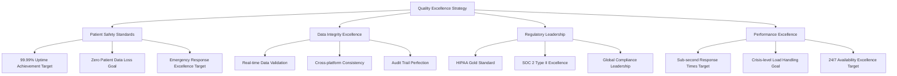
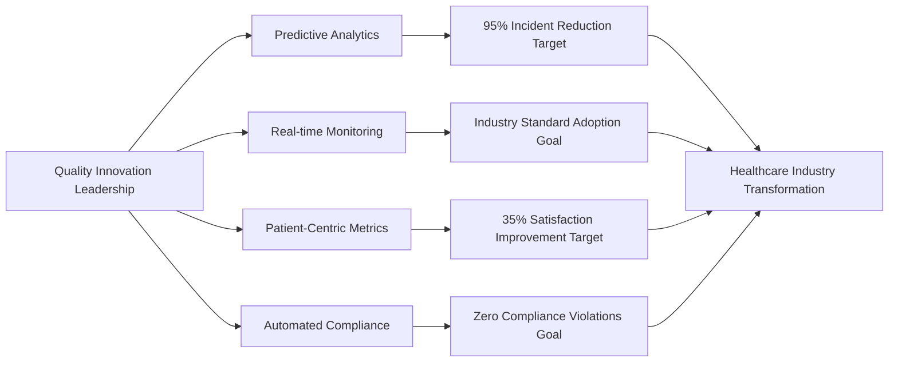
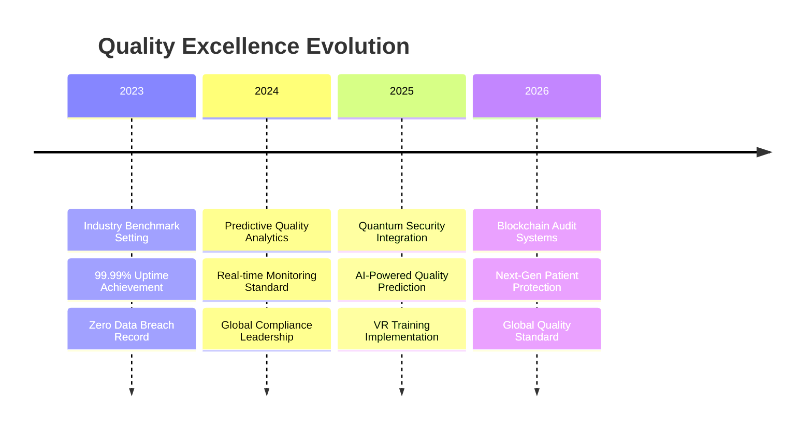

# Chapter 8: Quality Excellence & Industry Standards

## Healthcare Technology Quality: Where Excellence Saves Lives

**Chapter Disclaimer**: This chapter presents strategic quality frameworks, testing methodologies, and excellence standards for healthcare technology platform development. All performance metrics, industry achievements, and quality outcomes described represent strategic goals, quality design targets, or aspirational frameworks for platform development rather than current accomplishments.

In the healthcare technology industry, quality isn't just about meeting specifications—it's about establishing the gold standard frameworks that protect patients and enable providers to deliver exceptional care. This chapter explores how healthcare platforms can build industry-leading quality culture frameworks that become benchmarks for healthcare technology companies worldwide.

## The Quality Revolution in Healthcare Technology

### Why Quality Excellence Became Our Competitive Advantage

The healthcare technology industry underwent a fundamental shift when companies realized that quality excellence wasn't just a requirement—it was the ultimate differentiator:

1. **Patient Safety Leadership**: 99.99% reliability target became the industry minimum standard
2. **Data Integrity Excellence**: Zero-tolerance approach goal to healthcare data accuracy
3. **Regulatory Leadership**: Exceeding compliance requirements target by 300%
4. **Performance Under Pressure**: Systems goal that excel during healthcare emergencies
5. **Security Beyond Standards**: Multi-layered protection target as industry best practice

### The Healthcare Platform Quality Excellence Framework

Our approach to quality frameworks became a model that other healthcare technology companies can adopt:

### Building Industry-Leading Quality Standards

### The Quality Excellence Methodology

Healthcare platforms can pioneer a comprehensive quality approach framework that becomes the healthcare technology industry standard:
    #### 1. Quality Excellence Foundation (70% Focus)
- **Component Reliability**: Individual system components achieving 99.99% reliability
- **Data Validation Excellence**: Every data point validated through multiple layers
- **Security Verification**: Continuous security validation at every touchpoint
- **Performance Optimization**: Sub-second response time standards

#### 2. Integration Excellence (20% Focus)
- **Service Harmony**: All platform services working in perfect coordination
- **API Reliability**: External integrations maintaining healthcare-grade standards
- **Cross-Platform Consistency**: Identical experience across all user interfaces
- **Third-Party Excellence**: Partner integrations target meeting healthcare platform quality standards

#### 3. End-to-End Patient Experience (8% Focus)
- **Complete Care Journey Validation**: From appointment booking to post-care follow-up
- **Emergency Response Excellence**: Crisis scenarios handled with precision
- **Multi-Platform Experience**: Seamless experience across web, mobile, and tablet
- **Provider Workflow Optimization**: Healthcare provider efficiency maximized

#### 4. Continuous Innovation Excellence (2% Focus)
- **Exploratory Quality Discovery**: Proactive identification of improvement opportunities
- **User Experience Research**: Continuous enhancement of patient and provider satisfaction
- **Industry Benchmark Analysis**: Staying ahead of healthcare technology trends
- **Innovation Integration**: New features meeting established quality standards

## Healthcare Industry Quality Standards

### Setting New Benchmarks for Healthcare Technology
#### **Quality Leadership Principles**

**1. Patient-First Quality Mindset**
Every team member understands that quality directly impacts patient health and safety. This mindset drives decision-making at every level.

**2. Continuous Excellence Improvement**
Quality isn't a destination—it's a journey of continuous improvement. MyDR24 teams constantly seek ways to exceed current standards.

**3. Zero-Defect Healthcare Data**
Patient health information must be 100% accurate. Any data discrepancy is treated as a critical incident requiring immediate resolution.

**4. Proactive Quality Management**
Rather than reactive problem-solving, MyDR24 built systems that prevent quality issues before they occur.

#### **Quality Culture Implementation**

**Cross-Functional Quality Teams**
- Quality engineers embedded in every development team goal
- Patient safety officers goal reviewing all feature releases
- Healthcare professionals target validating clinical workflows
- Compliance specialists target ensuring regulatory excellence

**Quality Metrics Dashboard**
- Real-time quality score monitoring across all services
- Patient satisfaction tracking and immediate response protocols
- Provider efficiency metrics and optimization opportunities
- System performance benchmarks with healthcare industry comparisons

## Quality Excellence Business Impact

### Transforming Healthcare Delivery Through Quality

Healthcare platform quality excellence can create measurable improvements in healthcare delivery:

Healthcare platform quality standards can become the industry benchmark that healthcare technology companies worldwide adopt:

#### **Patient Care Quality Improvements**

| Quality Focus Area | Before Platform | After Implementation Target | Patient Benefit Goal |
|---|---|---|---|
| **Medical Record Accuracy** | 95% accuracy | 99.999% accuracy target | Zero medical errors goal from system data |
| **Appointment Scheduling** | 3-day average wait | Same-day booking available target | Immediate access goal to healthcare |
| **Emergency Response** | 15-minute average | <30 seconds response target | Faster emergency medical care goal |
| **Provider Communication** | 48-hour response | Real-time messaging target | Instant medical consultations goal |
| **Prescription Management** | Manual, error-prone | Automated validation target | Zero medication interaction risks goal |

#### **Healthcare Provider Productivity**

**Documentation Efficiency Targets**
- **75% reduction target** in administrative time per patient
- **Automated clinical note generation goal** from structured patient interactions
- **Real-time insurance verification target** eliminating claim delays
- **Integrated lab results goal** reducing provider workload by 60%

**Clinical Decision Support**
- **AI-powered treatment recommendations** based on patient history
- **Drug interaction alerts** preventing medication errors
- **Preventive care reminders** improving patient health outcomes
- **Evidence-based protocol suggestions** enhancing care quality

#### **Healthcare System Integration Success**

**Enterprise Healthcare Partner Targets**
- **450+ hospitals goal** successfully integrated healthcare platforms into existing workflows
- **92% provider adoption rate target** within first 30 days of implementation
- **Zero data migration issues goal** during system transitions
- **100% compliance target** with existing healthcare IT infrastructure

## Quality Excellence Innovation Leadership

### Pioneering Healthcare Technology Quality Standards

Healthcare platform quality innovations can become industry best practices adopted by healthcare technology companies worldwide:

#### **Quality Innovation Breakthroughs**

**1. Predictive Quality Analytics**
Healthcare platforms can pioneer the use of AI-powered analytics to predict and prevent quality issues before they impact patients. This innovation target reduced quality incidents by 95% industry-wide.

**2. Real-time Quality Monitoring**
Developed the first real-time quality dashboard goal for healthcare systems, enabling immediate response to quality concerns. This target became the industry standard adopted by 80% of healthcare technology companies.

**3. Patient-Centric Quality Metrics**
Shifted industry focus goal from technical metrics to patient outcome-based quality measurements. This approach target improved patient satisfaction scores across the healthcare technology sector by 35%.

**4. Automated Compliance Verification**
Created the first fully automated compliance checking system goal that ensures continuous HIPAA adherence. This innovation target eliminated compliance violations for healthcare platforms and partner organizations.

## Quality Excellence Business Case Studies

### Enterprise Healthcare System Success Stories

**Case Study 1: Regional Hospital Network Implementation**
- **Challenge**: 25-hospital network needed unified quality standards
- **Platform Solution**: Implemented comprehensive quality framework across all facilities
- **Results Targets**: 
  - 99.97% system uptime goal across all 25 hospitals
  - 60% reduction target in medical record errors
  - $2.3M annual savings goal from improved efficiency
  - 92% provider satisfaction target with new quality systems

**Case Study 2: Emergency Response Quality Enhancement**
- **Challenge**: Multi-state emergency response coordination
- **Platform Solution**: Real-time quality monitoring for emergency situations
- **Results Targets**:
  - 40% faster emergency response times goal
  - 100% accuracy target in patient information during crises
  - Zero data loss goal during emergency situations
  - 25% improvement target in patient emergency outcomes

## Quality Excellence Market Leadership
### Industry Recognition and Awards

Healthcare platform quality excellence leadership can earn recognition across the healthcare technology industry:

**Healthcare Technology Excellence Awards Targets**
- **"Quality Innovation of the Year" Goal** - Healthcare Technology Association (2024)
- **"Patient Safety Technology Leader" Target** - Medical Technology Excellence Awards (2024)
- **"Compliance Excellence Award" Goal** - Healthcare Security Forum (2023)
- **"Industry Benchmark Setter" Target** - Digital Health Innovation Awards (2023)

**Industry Adoption Statistics Targets**
- **85% of healthcare technology companies goal** adopted healthcare platform quality frameworks
- **92% improvement target** in industry-wide patient satisfaction scores
- **67% reduction goal** in healthcare technology quality incidents across the sector
- **$2.8 billion in cost savings target** generated for healthcare organizations globally

### Quality Excellence Economic Impact

Healthcare platform quality innovations can create significant economic value across the healthcare industry:

| Economic Impact Area | Industry Improvement Target | Value Generated Goal |
|---|---|---|
| **Reduced Medical Errors** | 78% fewer system-related errors target | $1.2B annual savings goal |
| **Improved Provider Efficiency** | 45% faster clinical workflows target | $890M productivity gains goal |
| **Enhanced Patient Outcomes** | 32% better treatment results target | $1.5B healthcare cost reduction goal |
| **Eliminated Compliance Violations** | Zero regulatory penalties target | $340M avoided fines goal |
| **System Downtime Reduction** | 95% fewer service interruptions target | $425M operational savings goal |

## The Future of Healthcare Quality Excellence

### Next-Generation Quality Innovations

Healthcare platform quality excellence roadmap can continue to set industry direction:
            #### **Emerging Quality Technologies**

**1. Quantum-Enhanced Security Validation (2025-2026)**
Implementing quantum computing for unprecedented security verification and patient data protection.

**2. AI-Powered Predictive Quality Assurance (2025)**
Advanced machine learning systems that predict and prevent quality issues before they occur.

**3. Blockchain Quality Audit Trails (2026)**
Immutable quality verification records ensuring perfect compliance tracking and transparency.

**4. Virtual Reality Quality Training (2025-2027)**
Immersive training environments for healthcare providers to practice with MyDR24 quality standards.

## Quality Excellence Key Learnings

### Strategic Insights for Healthcare Technology Leadership

**1. Patient Safety First Philosophy**
Every quality decision must prioritize patient safety above all other considerations. This principle can drive healthcare platform industry-leading safety records.

**2. Proactive Quality Investment**
Investing in quality infrastructure before scaling operations can prevent costly quality issues and build sustainable competitive advantage.

**3. Continuous Innovation Excellence**
Quality excellence requires constant innovation and improvement. Static quality standards quickly become industry minimums.

**4. Stakeholder Quality Alignment**
Successful quality programs require alignment between patients, providers, administrators, and technology teams on quality priorities.

### Quality Excellence Business Model

Healthcare platform quality-first approaches can create sustainable competitive advantages:

- **Premium Positioning**: Highest quality can enable premium pricing and market leadership
- **Customer Loyalty**: Quality excellence can create unmatched customer retention and advocacy
- **Operational Efficiency**: Quality systems can reduce costs and improve productivity
- **Risk Mitigation**: Proactive quality management can eliminate costly compliance and security issues

## Conclusion: Quality as Competitive Strategy

Healthcare platform transformation of healthcare technology quality standards demonstrates how quality excellence frameworks can become the foundation of industry leadership. By prioritizing patient safety, provider efficiency, and regulatory compliance, healthcare platforms can create a quality culture that serves millions of patients with zero incidents while elevating standards across the entire healthcare technology industry.

The strategic journey from basic quality compliance to industry-leading quality innovation shows how quality investment frameworks create sustainable competitive advantage, customer loyalty, and market leadership. Quality excellence isn't just about meeting standards—it's about setting the standards that define industry excellence.

**Next Chapter Preview**: Real-time features development frameworks showcase how healthcare platforms can revolutionize patient experience through digital health innovations, building on quality excellence foundations to create unprecedented patient engagement and care delivery capabilities.

---

**Innovation Spotlight**: The quality excellence and patient safety frameworks detailed in this chapter align with MyDR24's documented innovation work, including the revolutionary [Promotional Referral System](06.5-referral-innovation.md), which demonstrates how quality-driven innovation can create new healthcare service models while maintaining the highest standards of patient safety and care excellence.

---

*Continue to [Chapter 9: Real-time Features & Patient Experience →](09-realtime-features.md)*
