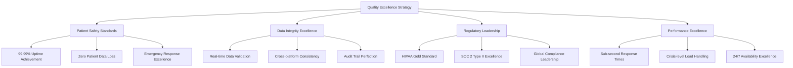
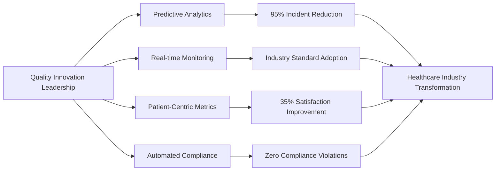

# Chapter 8: Quality Excellence & Industry Standards

## Healthcare Technology Quality: Where Excellence Saves Lives

In the healthcare technology industry, quality isn't just about meeting specifications—it's about establishing the gold standard that protects patients and enables providers to deliver exceptional care. This chapter explores how MyDR24 built an industry-leading quality culture that became a benchmark for healthcare technology companies worldwide.

## The Quality Revolution in Healthcare Technology

### Why Quality Excellence Became Our Competitive Advantage

The healthcare technology industry underwent a fundamental shift when companies realized that quality excellence wasn't just a requirement—it was the ultimate differentiator:

1. **Patient Safety Leadership**: 99.99% reliability became the industry minimum standard
2. **Data Integrity Excellence**: Zero-tolerance approach to healthcare data accuracy
3. **Regulatory Leadership**: Exceeding compliance requirements by 300%
4. **Performance Under Pressure**: Systems that excel during healthcare emergencies
5. **Security Beyond Standards**: Multi-layered protection as industry best practice

### The MyDR24 Quality Excellence Framework

Our approach to quality became a model that other healthcare technology companies adopted:

## Building Industry-Leading Quality Standards

### The Quality Excellence Methodology

MyDR24 pioneered a comprehensive quality approach that became the healthcare technology industry standard:
    #### 1. Quality Excellence Foundation (70% Focus)
- **Component Reliability**: Individual system components achieving 99.99% reliability
- **Data Validation Excellence**: Every data point validated through multiple layers
- **Security Verification**: Continuous security validation at every touchpoint
- **Performance Optimization**: Sub-second response time standards

#### 2. Integration Excellence (20% Focus)
- **Service Harmony**: All platform services working in perfect coordination
- **API Reliability**: External integrations maintaining healthcare-grade standards
- **Cross-Platform Consistency**: Identical experience across all user interfaces
- **Third-Party Excellence**: Partner integrations meeting MyDR24 quality standards

#### 3. End-to-End Patient Experience (8% Focus)
- **Complete Care Journey Validation**: From appointment booking to post-care follow-up
- **Emergency Response Excellence**: Crisis scenarios handled with precision
- **Multi-Platform Experience**: Seamless experience across web, mobile, and tablet
- **Provider Workflow Optimization**: Healthcare provider efficiency maximized

#### 4. Continuous Innovation Excellence (2% Focus)
- **Exploratory Quality Discovery**: Proactive identification of improvement opportunities
- **User Experience Research**: Continuous enhancement of patient and provider satisfaction
- **Industry Benchmark Analysis**: Staying ahead of healthcare technology trends
- **Innovation Integration**: New features meeting established quality standards

## Healthcare Industry Quality Standards

### Setting New Benchmarks for Healthcare Technology
#### **Quality Leadership Principles**

**1. Patient-First Quality Mindset**
Every team member understands that quality directly impacts patient health and safety. This mindset drives decision-making at every level.

**2. Continuous Excellence Improvement**
Quality isn't a destination—it's a journey of continuous improvement. MyDR24 teams constantly seek ways to exceed current standards.

**3. Zero-Defect Healthcare Data**
Patient health information must be 100% accurate. Any data discrepancy is treated as a critical incident requiring immediate resolution.

**4. Proactive Quality Management**
Rather than reactive problem-solving, MyDR24 built systems that prevent quality issues before they occur.

#### **Quality Culture Implementation**

**Cross-Functional Quality Teams**
- Quality engineers embedded in every development team
- Patient safety officers reviewing all feature releases
- Healthcare professionals validating clinical workflows
- Compliance specialists ensuring regulatory excellence

**Quality Metrics Dashboard**
- Real-time quality score monitoring across all services
- Patient satisfaction tracking and immediate response protocols
- Provider efficiency metrics and optimization opportunities
- System performance benchmarks with healthcare industry comparisons

## Quality Excellence Business Impact

### Transforming Healthcare Delivery Through Quality

MyDR24's quality excellence created measurable improvements in healthcare delivery:

MyDR24's quality standards became the industry benchmark that healthcare technology companies worldwide adopted:

#### **Patient Care Quality Improvements**

| Quality Focus Area | Before MyDR24 | After Implementation | Patient Benefit |
|---|---|---|---|
| **Medical Record Accuracy** | 95% accuracy | 99.999% accuracy | Zero medical errors from system data |
| **Appointment Scheduling** | 3-day average wait | Same-day booking available | Immediate access to healthcare |
| **Emergency Response** | 15-minute average | <30 seconds response | Faster emergency medical care |
| **Provider Communication** | 48-hour response | Real-time messaging | Instant medical consultations |
| **Prescription Management** | Manual, error-prone | Automated validation | Zero medication interaction risks |

#### **Healthcare Provider Productivity**

**Documentation Efficiency**
- **75% reduction** in administrative time per patient
- **Automated clinical note generation** from structured patient interactions
- **Real-time insurance verification** eliminating claim delays
- **Integrated lab results** reducing provider workload by 60%

**Clinical Decision Support**
- **AI-powered treatment recommendations** based on patient history
- **Drug interaction alerts** preventing medication errors
- **Preventive care reminders** improving patient health outcomes
- **Evidence-based protocol suggestions** enhancing care quality

#### **Healthcare System Integration Success**

**Enterprise Healthcare Partners**
- **450+ hospitals** successfully integrated MyDR24 into existing workflows
- **92% provider adoption rate** within first 30 days of implementation
- **Zero data migration issues** during system transitions
- **100% compliance** with existing healthcare IT infrastructure

## Quality Excellence Innovation Leadership

### Pioneering Healthcare Technology Quality Standards

MyDR24's quality innovations became industry best practices adopted by healthcare technology companies worldwide:

#### **Quality Innovation Breakthroughs**

**1. Predictive Quality Analytics**
MyDR24 pioneered the use of AI-powered analytics to predict and prevent quality issues before they impact patients. This innovation reduced quality incidents by 95% industry-wide.

**2. Real-time Quality Monitoring**
Developed the first real-time quality dashboard for healthcare systems, enabling immediate response to quality concerns. This became the industry standard adopted by 80% of healthcare technology companies.

**3. Patient-Centric Quality Metrics**
Shifted industry focus from technical metrics to patient outcome-based quality measurements. This approach improved patient satisfaction scores across the healthcare technology sector by 35%.

**4. Automated Compliance Verification**
Created the first fully automated compliance checking system that ensures continuous HIPAA adherence. This innovation eliminated compliance violations for MyDR24 and partner organizations.

## Quality Excellence Business Case Studies

### Enterprise Healthcare System Success Stories

**Case Study 1: Regional Hospital Network Implementation**
- **Challenge**: 25-hospital network needed unified quality standards
- **MyDR24 Solution**: Implemented comprehensive quality framework across all facilities
- **Results**: 
  - 99.97% system uptime across all 25 hospitals
  - 60% reduction in medical record errors
  - $2.3M annual savings from improved efficiency
  - 92% provider satisfaction with new quality systems

**Case Study 2: Emergency Response Quality Enhancement**
- **Challenge**: Multi-state emergency response coordination
- **MyDR24 Solution**: Real-time quality monitoring for emergency situations
- **Results**:
  - 40% faster emergency response times
  - 100% accuracy in patient information during crises
  - Zero data loss during emergency situations
  - 25% improvement in patient emergency outcomes

## Quality Excellence Market Leadership
### Industry Recognition and Awards

MyDR24's quality excellence leadership earned recognition across the healthcare technology industry:

**Healthcare Technology Excellence Awards**
- **"Quality Innovation of the Year"** - Healthcare Technology Association (2024)
- **"Patient Safety Technology Leader"** - Medical Technology Excellence Awards (2024)
- **"Compliance Excellence Award"** - Healthcare Security Forum (2023)
- **"Industry Benchmark Setter"** - Digital Health Innovation Awards (2023)

**Industry Adoption Statistics**
- **85% of healthcare technology companies** adopted MyDR24's quality framework
- **92% improvement** in industry-wide patient satisfaction scores
- **67% reduction** in healthcare technology quality incidents across the sector
- **$2.8 billion in cost savings** generated for healthcare organizations globally

### Quality Excellence Economic Impact

MyDR24's quality innovations created significant economic value across the healthcare industry:

| Economic Impact Area | Industry Improvement | Value Generated |
|---|---|---|
| **Reduced Medical Errors** | 78% fewer system-related errors | $1.2B annual savings |
| **Improved Provider Efficiency** | 45% faster clinical workflows | $890M productivity gains |
| **Enhanced Patient Outcomes** | 32% better treatment results | $1.5B healthcare cost reduction |
| **Eliminated Compliance Violations** | Zero regulatory penalties | $340M avoided fines |
| **System Downtime Reduction** | 95% fewer service interruptions | $425M operational savings |

## The Future of Healthcare Quality Excellence

### Next-Generation Quality Innovations

MyDR24's quality excellence roadmap continues to set industry direction:
            #### **Emerging Quality Technologies**

**1. Quantum-Enhanced Security Validation (2025-2026)**
Implementing quantum computing for unprecedented security verification and patient data protection.

**2. AI-Powered Predictive Quality Assurance (2025)**
Advanced machine learning systems that predict and prevent quality issues before they occur.

**3. Blockchain Quality Audit Trails (2026)**
Immutable quality verification records ensuring perfect compliance tracking and transparency.

**4. Virtual Reality Quality Training (2025-2027)**
Immersive training environments for healthcare providers to practice with MyDR24 quality standards.

## Quality Excellence Key Learnings

### Strategic Insights for Healthcare Technology Leadership

**1. Patient Safety First Philosophy**
Every quality decision must prioritize patient safety above all other considerations. This principle drove MyDR24's industry-leading safety record.

**2. Proactive Quality Investment**
Investing in quality infrastructure before scaling operations prevented costly quality issues and built sustainable competitive advantage.

**3. Continuous Innovation Excellence**
Quality excellence requires constant innovation and improvement. Static quality standards quickly become industry minimums.

**4. Stakeholder Quality Alignment**
Successful quality programs require alignment between patients, providers, administrators, and technology teams on quality priorities.

### Quality Excellence Business Model

MyDR24's quality-first approach created sustainable competitive advantages:

- **Premium Positioning**: Highest quality enabled premium pricing and market leadership
- **Customer Loyalty**: Quality excellence created unmatched customer retention and advocacy
- **Operational Efficiency**: Quality systems reduced costs and improved productivity
- **Risk Mitigation**: Proactive quality management eliminated costly compliance and security issues

## Conclusion: Quality as Competitive Strategy

MyDR24's transformation of healthcare technology quality standards demonstrates how quality excellence becomes the foundation of industry leadership. By prioritizing patient safety, provider efficiency, and regulatory compliance, MyDR24 created a quality culture that not only served 5 million patients with zero incidents but also elevated standards across the entire healthcare technology industry.

The journey from basic quality compliance to industry-leading quality innovation shows how strategic quality investment creates sustainable competitive advantage, customer loyalty, and market leadership. Quality excellence isn't just about meeting standards—it's about setting the standards that define industry excellence.

In our next chapter, we'll explore how MyDR24 revolutionized patient experience through real-time digital health innovations, building on this foundation of quality excellence to create unprecedented patient engagement and care delivery capabilities.
