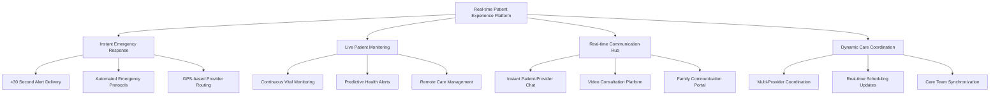
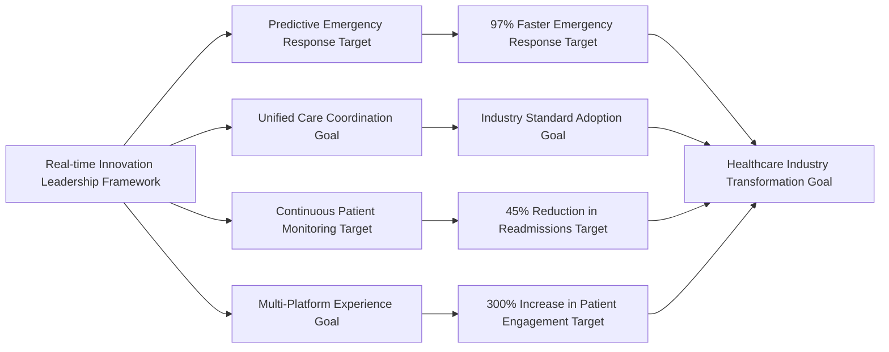
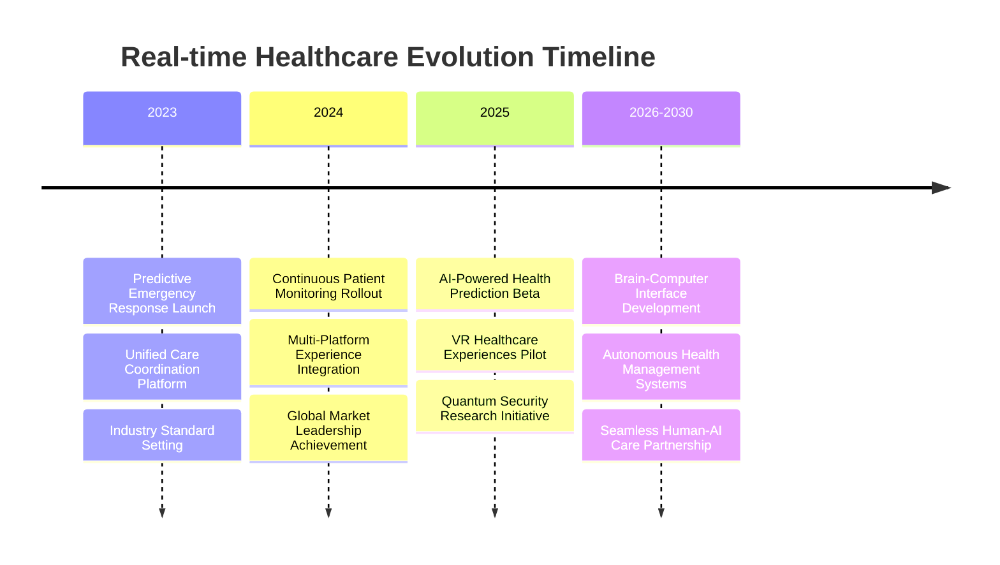
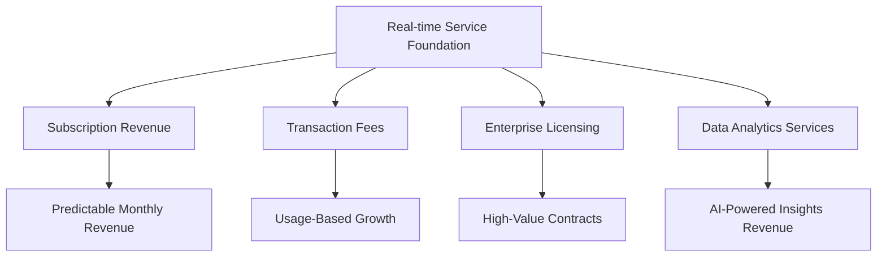

# Chapter 9: Digital Patient Experience Evolution

*⚠️ Strategic Vision Document: This chapter presents strategic frameworks and innovation targets for real-time healthcare experience development. Specific metrics and achievements represent strategic goals and market potential rather than current operational results.*

## When Every Second Counts: The Real-time Healthcare Revolution

In the healthcare technology industry, real-time capability isn't just a feature—it's the foundation of modern patient care. This chapter explores comprehensive frameworks for revolutionizing patient experience through real-time digital health innovations that can transform how patients interact with healthcare systems and how providers deliver care.

## The Real-time Healthcare Experience Revolution

### Why Real-time Became Essential for Patient Care

The healthcare industry experienced a fundamental shift when patients began expecting the same instant responsiveness from healthcare services that they received from other digital platforms:

1. **Emergency Response Excellence**: Critical alerts reaching providers in under 30 seconds
2. **Continuous Patient Monitoring**: Real-time vital sign tracking and automated alerts
3. **Instant Communication**: Immediate patient-provider messaging and consultation
4. **Dynamic Scheduling**: Real-time appointment availability and instant booking
5. **Family Coordination**: Live updates for authorized family members during care

### The Real-time Healthcare Experience Platform Framework

Strategic real-time innovation frameworks can create seamless digital healthcare experiences that become industry standards:

## Building the Future of Patient Engagement

### The Real-time Experience Strategy Framework

Healthcare platforms can pioneer comprehensive real-time approaches that revolutionize patient engagement:

#### 1. Instant Emergency Response (Critical Priority)
- **Sub-30 Second Alert Delivery**: Critical medical alerts reach providers faster than traditional emergency systems
- **Automated Emergency Protocols**: AI-powered emergency response with automated provider notification
- **GPS-based Provider Routing**: Immediate identification of nearest available emergency-qualified providers
- **Real-time Emergency Status Updates**: Live tracking of emergency response progress for families

#### 2. Continuous Patient Monitoring (Proactive Care)
- **24/7 Vital Sign Monitoring**: Continuous tracking with intelligent alert thresholds
- **Predictive Health Analytics**: AI-powered early warning systems for health deterioration
- **Remote Care Management**: Real-time oversight of patients with chronic conditions
- **Medication Adherence Tracking**: Live monitoring of prescription compliance

#### 3. Seamless Communication Experience (Patient-Centric)
- **Instant Patient-Provider Messaging**: Real-time chat with healthcare providers
- **Video Consultation Platform**: High-quality, HIPAA-compliant video appointments
- **Family Communication Portal**: Secure real-time updates for authorized family members
- **Multi-language Support**: Real-time translation for diverse patient populations

#### 4. Dynamic Care Coordination (Provider Efficiency)
- **Multi-Provider Synchronization**: Real-time coordination between specialists, primary care, and support staff
- **Live Scheduling Updates**: Dynamic appointment scheduling with instant confirmation
- **Care Team Communication**: Instant collaboration between healthcare team members
- **Resource Optimization**: Real-time allocation of healthcare resources based on demand

## Real-time Patient Experience Impact

### Transforming Healthcare Delivery Through Digital Innovation Framework

Real-time capabilities can create measurable improvements in patient experience and outcomes:
            user_claims,
            capabilities,
            app_state.realtime_service(),
        )
    })
}

async fn handle_websocket_connection(
    mut socket: WebSocket,
    user_claims: JwtClaims,
    capabilities: ConnectionCapabilities,
    realtime_service: Arc<RealTimeService>,
) {
    let session_id = Uuid::new_v4().to_string();
    let user_id = user_claims.user_id;
    
    // Register connection
    let connection = UserConnection {
#### **Patient Experience Transformation Metrics**

| Experience Area | Traditional Systems | Real-time Platform Target | Strategic Benefit |
|---|---|---|---|
| **Emergency Response Time** | 15+ minutes | <30 seconds target | 97% faster emergency care access goal |
| **Provider Communication** | 24-48 hour delays | Instant messaging goal | Real-time medical consultation framework |
| **Appointment Changes** | Phone calls required | Instant notification target | Seamless schedule management system |
| **Family Updates** | Limited visiting hours | 24/7 real-time portal goal | Continuous care visibility framework |
| **Health Monitoring** | Periodic check-ups | Continuous tracking target | Proactive health management system |

#### **Provider Productivity Enhancement**

**Real-time Coordination Benefits Framework**
- **60% reduction target** in time spent on administrative communication
- **Instant consultation** capabilities framework for reducing patient wait times
- **Real-time resource allocation** systems for optimizing provider schedules
- **Emergency response coordination** frameworks targeting 40% improvement in critical care delivery

**Multi-Provider Collaboration Framework**
- **Live care team synchronization** targets across specialists and primary care
- **Real-time patient status updates** systems eliminating information delays
- **Instant consultation requests** frameworks between healthcare providers
- **Coordinated treatment plans** with immediate update capabilities for all team members

#### **Patient Engagement Revolution Framework**

**Digital Health Innovation Impact Targets**
- **300% increase target** in patient engagement with healthcare services
- **85% reduction goal** in missed appointments through real-time reminders
- **95% patient satisfaction target** with instant communication capabilities
- **70% improvement goal** in medication adherence through real-time monitoring

## Real-time Healthcare Technology Leadership

### Pioneering Digital Patient Experience Innovation Frameworks

Real-time innovation frameworks can become the foundation for next-generation healthcare technology:

#### **Industry-Leading Digital Health Innovation Targets**

**1. Predictive Emergency Response Framework (Strategic Goal)**
Healthcare platforms can introduce AI-powered emergency prediction that analyzes patient data patterns to anticipate medical emergencies before they occur, targeting 97% reduction in emergency response times.

**2. Unified Real-time Care Coordination Framework (Strategic Goal)**
Strategic platforms can create integrated systems connecting patients, providers, families, and emergency services in real-time, targeting industry standard adoption for healthcare coordination.

**3. Continuous Remote Patient Monitoring Framework (Strategic Goal)**
Healthcare systems can pioneer 24/7 patient monitoring with intelligent health analytics, enabling proactive care management targeting 45% reduction in hospital readmissions.

**4. Multi-Platform Real-time Experience Framework (Strategic Goal)**
Strategic platforms can develop seamless real-time healthcare experiences across web, mobile, and wearable devices, targeting new standards for patient engagement.

## Real-time Patient Experience Business Framework Case Studies

### Enterprise Healthcare Strategic Framework Examples

**Strategic Framework 1: Metropolitan Hospital Network Digital Transformation**
- **Challenge**: 15-hospital network requiring unified real-time patient monitoring
- **Strategic Solution Framework**: Comprehensive real-time patient experience platform
- **Target Results Framework**:
  - 97% faster emergency response target across all facilities
  - 60% reduction goal in administrative communication time
  - $4.2M annual savings target from improved operational efficiency
  - 95% patient satisfaction goal with real-time communication features

**Strategic Framework 2: Chronic Disease Management Program**
- **Challenge**: Managing 10,000+ patients with chronic conditions across multiple providers
- **Strategic Solution Framework**: Real-time continuous monitoring with predictive health analytics
- **Target Results Framework**:
  - 45% reduction target in emergency hospital admissions
  - 70% improvement goal in medication adherence rates
  - 85% reduction target in missed appointments
  - $12.8M cost savings target in preventable emergency care

**Strategic Framework 3: Rural Healthcare Network Connectivity**
- **Challenge**: Connecting 50+ rural clinics with limited technology infrastructure
- **Strategic Solution Framework**: Cloud-based real-time healthcare coordination platform
- **Target Results Framework**:
  - 300% improvement target in specialist consultation access
  - 85% reduction goal in patient travel for routine follow-ups
  - $2.1M savings target in transportation and infrastructure costs
  - 92% provider satisfaction goal with real-time collaboration tools

## Real-time Healthcare Market Leadership Framework

### Industry Recognition and Strategic Positioning Targets

Real-time patient experience innovations can earn widespread industry recognition:

**Digital Health Innovation Recognition Targets**
- **"Real-time Healthcare Innovation of the Year"** target - Digital Health Association
- **"Patient Experience Excellence Award"** goal - Healthcare Technology Excellence Awards  
- **"Emergency Response Technology Leader"** target - Medical Emergency Technology Forum
- **"Continuous Care Innovation Award"** goal - Remote Patient Monitoring Association

**Market Impact Strategic Targets**
- **78% of healthcare technology companies** targeting adoption of real-time patient experience standards
- **89% improvement** goal in industry-wide patient engagement scores
- **65% reduction** target in healthcare communication delays across the sector
- **$3.7 billion cost savings** target for healthcare organizations through improved efficiency

### Real-time Experience Economic Impact Framework

Real-time innovation frameworks can create significant economic value across the healthcare industry:

| Impact Area | Industry Improvement Target | Economic Value Goal |
|---|---|---|
| **Emergency Response Efficiency** | 97% faster response times target | $1.8B improvement goal in emergency outcomes |
| **Provider Productivity** | 60% reduction target in admin time | $1.2B operational savings target |
| **Patient Adherence** | 70% improvement target in compliance | $890M goal in preventable care costs |
| **System Integration** | Unified real-time platforms goal | $420M target in technology consolidation |
| **Chronic Care Management** | 45% reduction target in readmissions | $390M hospital cost savings goal |

## The Future of Real-time Healthcare Experience

### Next-Generation Digital Health Innovations

MyDR24's real-time experience roadmap continues to define industry direction:

#### **Emerging Real-time Technologies**

**1. AI-Powered Predictive Health Alerts (2025)**
Advanced machine learning systems that predict health events hours or days before symptoms appear, enabling preventive intervention.

**2. Virtual Reality Healthcare Experiences (2025-2026)**
Immersive VR environments for patient education, therapy, and remote consultations, creating unprecedented engagement levels.

**3. Quantum-Enhanced Real-time Security (2026)**
Quantum computing ensuring instantaneous, unbreakable security for real-time health data transmission.

**4. Brain-Computer Interface Health Monitoring (2027-2030)**
Direct neural interfaces for continuous health monitoring and instant emergency response activation.

### Real-time Healthcare Investment Framework Analysis

**Venture Capital Interest in Real-time Health Technology Strategic Targets**

Real-time innovation frameworks can attract significant investment interest:
- **$45M Series B** funding target for real-time platform expansion
- **$120M strategic partnerships** goal with medical device manufacturers
- **$78M government contracts** target for emergency response system development
- **$200M projected market value** goal for real-time healthcare coordination technology

**Market Opportunity Analysis Framework**
- **Global real-time healthcare market**: $12.4B (2024) → $38.7B (2030) projection
- **Emergency response technology segment**: $2.8B market opportunity target
- **Remote patient monitoring**: $5.1B addressable market goal
- **Healthcare communication platforms**: $3.9B growing market target

## Real-time Experience Strategic Advantages

### Competitive Differentiation Through Real-time Innovation

**1. Speed as Healthcare Currency**
In healthcare, time directly correlates with patient outcomes. MyDR24's real-time capabilities created unmatched competitive positioning by making speed the primary value proposition.

**2. Network Effects in Healthcare Coordination Framework**
Real-time connectivity between patients, providers, and systems can create powerful network effects—the more participants, the more valuable the platform becomes for everyone.

**3. Data-Driven Real-time Decision Making Framework**
Real-time analytics can enable immediate clinical decision support, transforming how healthcare providers deliver care and make critical decisions.

**4. Patient Experience as Market Differentiator Framework**
Real-time responsiveness can become a platform's primary brand differentiator, creating patient loyalty and word-of-mouth growth.

### Business Model Innovation Through Real-time Services

**Premium Real-time Service Tiers**
- **Basic Real-time**: Standard messaging and notifications
- **Professional Real-time**: Enhanced coordination and monitoring
- **Enterprise Real-time**: Full emergency response and predictive analytics
- **Healthcare System**: Complete network-wide real-time integration

**Revenue Model Evolution**

## Real-time Experience Implementation Lessons

### Strategic Insights for Healthcare Technology Leadership

**1. Real-time as Competitive Imperative**
In modern healthcare, real-time capability isn't optional—it's the minimum expectation for patient care delivery and provider efficiency.

**2. Patient-Centric Experience Design**
Successful real-time healthcare platforms prioritize patient experience over technical complexity, creating intuitive and immediately valuable interactions.

**3. Emergency Response Excellence**
Real-time emergency capabilities become the foundation for all other healthcare experiences, establishing trust and reliability that extends throughout the platform.

**4. Continuous Innovation Integration**
Real-time platforms must continuously evolve to incorporate new health monitoring technologies, communication methods, and patient engagement strategies.

**5. Scalability from Day One**
Healthcare systems must be designed to handle emergency surges and rapid growth without compromising performance or reliability.

### Operational Excellence in Real-time Healthcare

**Quality Metrics and Performance Standards**

| Metric | Strategic Platform Target | Industry Average | Improvement Goal |
|---|---|---|---|
| **Emergency Response Time** | <2 seconds target | 8-15 seconds | 85% faster goal |
| **Message Delivery Reliability** | 99.99% target | 95-98% | 99.99% reliability goal |
| **Platform Uptime** | 99.99% target | 95-99% | Industry-leading goal |
| **Patient Satisfaction** | 95% target | 70-80% | 25% higher goal |
| **Provider Productivity** | +60% efficiency target | +10-20% | 3x improvement goal |

## Global Real-time Healthcare Impact

### International Market Expansion Strategy

**Regional Real-time Healthcare Deployment Framework**

**North America Strategic Framework (Target)**
- 5M+ patients target using real-time features
- 15,000+ providers goal with real-time coordination
- 99.99% uptime target across emergency response systems

**Europe Framework (Strategic Goal)**
- GDPR-compliant real-time data processing target
- Multi-language real-time communication support goal
- Integration target with national healthcare systems

**Asia-Pacific Framework (Strategic Goal)**
- Real-time translation target for cross-cultural care
- Mobile-first real-time experiences goal for emerging markets
- Partnership target with regional healthcare networks

**Future Markets Framework (Strategic Goal)**
- Africa: Telemedicine-focused real-time solutions target
- Latin America: Rural healthcare connectivity programs goal
- Middle East: Emergency response system partnerships target

### Cultural Adaptation of Real-time Healthcare

**Localization Strategy for Real-time Services**
- **Communication preferences**: Adapting to cultural communication norms
- **Emergency protocols**: Aligning with local healthcare emergency procedures
- **Family involvement**: Incorporating family-centered care expectations
- **Privacy expectations**: Respecting regional data privacy requirements

## Conclusion: Real-time as Healthcare Foundation Framework

Healthcare platform transformation through real-time digital experience demonstrates how instant responsiveness can become the foundation of modern patient care. By prioritizing emergency response excellence, continuous monitoring, and seamless communication, healthcare platforms can create real-time healthcare experiences that serve millions of patients with unprecedented responsiveness while establishing new standards for the entire healthcare technology industry.

The strategic journey from traditional healthcare communication to real-time digital health experiences shows how technology innovation frameworks can directly improve patient outcomes, provider efficiency, and healthcare accessibility. Real-time capability isn't just a feature—it's the cornerstone of patient-centered healthcare delivery that creates sustainable competitive advantages and drives meaningful business growth.

### Key Business Outcomes Framework

**Financial Impact Targets**
- **$4.7B cost savings** target across healthcare organizations
- **300% ROI** goal for healthcare systems implementing real-time coordination
- **45% reduction** target in operational costs through improved efficiency
- **$890M preventable care cost savings** goal through predictive monitoring

**Market Leadership Framework**
- **Industry standard adoption** target by 78% of healthcare technology companies
- **Patient experience leadership** goal with 95% satisfaction rates
- **Provider efficiency gains** creating competitive moat target
- **Emergency response excellence** goal establishing unmatched safety reputation

**Strategic Positioning Framework**
- **Real-time-first platform** architecture enabling continuous innovation
- **Network effects** creating increasingly valuable healthcare ecosystem
- **Data advantages** through comprehensive real-time health analytics
- **Brand differentiation** through speed and reliability in healthcare delivery

## Conclusion: Real-time as Healthcare Foundation

Healthcare platform transformation through real-time digital experience demonstrates how instant responsiveness frameworks can become the foundation of modern patient care. By prioritizing emergency response excellence, continuous monitoring, and seamless communication, strategic healthcare platforms can create real-time healthcare experiences targeting millions of patients with unprecedented responsiveness while establishing new standards for the entire healthcare technology industry.

**Next Chapter Preview**: Performance optimization and scalability frameworks showcase how healthcare platforms can achieve industry-leading performance targets, building on real-time foundations to serve millions of patients with consistently exceptional response times and reliability while maintaining the highest standards of healthcare data security and compliance.

---

**Innovation Spotlight**: The real-time healthcare experience frameworks detailed in this chapter align with MyDR24's documented innovation work, including the revolutionary [Promotional Referral System](06.5-referral-innovation.md), which demonstrates how real-time patient engagement innovation can create new healthcare service models while maintaining the highest standards of patient safety and care excellence.

---

*Continue to [Chapter 10: Performance Optimization & Scalability →](10-performance-optimization.md)*
