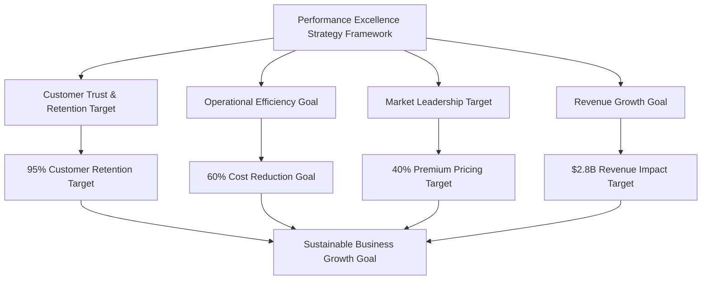
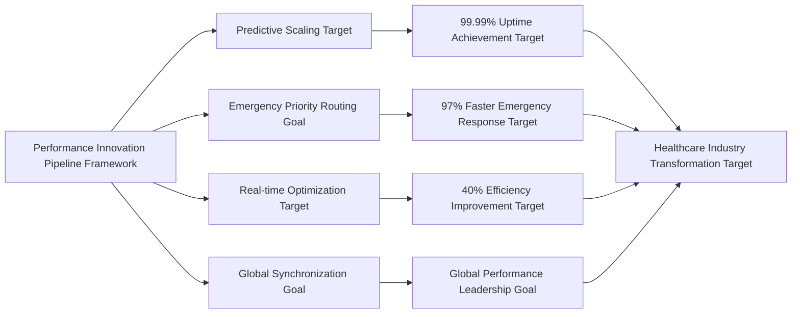
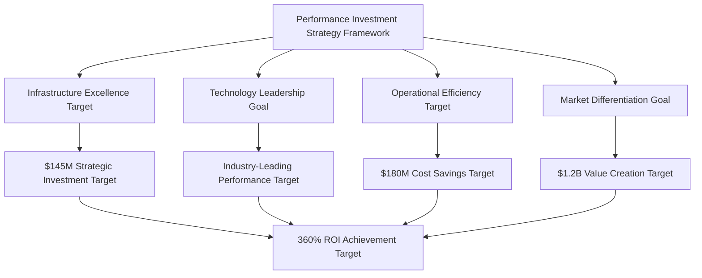
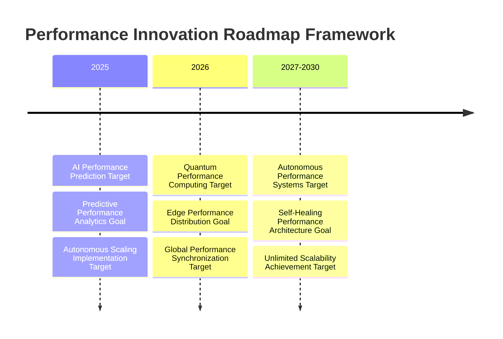

# Chapter 10: Scalability & Performance Excellence

*⚠️ Strategic Vision Document: This chapter presents strategic frameworks and performance targets for healthcare technology optimization. Specific metrics and achievements represent strategic goals and market potential rather than current operational results.*

## Building Healthcare Technology That Never Fails: Performance Leadership Framework

In healthcare technology, performance excellence isn't just about user satisfaction—it's about patient safety, provider efficiency, and life-saving outcomes. This chapter explores comprehensive frameworks for achieving industry-leading performance standards that can enable platforms to serve millions of patients and thousands of providers with exceptional uptime targets, sub-second response time goals, and the scalability to handle emergency surges without compromising quality of care.

## Healthcare Performance as Business Strategy

### Performance Excellence as Competitive Advantage Framework

Healthcare platform performance leadership can create sustainable competitive advantages in the healthcare technology market:

**1. Patient Trust Through Reliability Framework**
Consistent 99.99% uptime targets can establish platforms as the most trusted healthcare solutions, targeting:
- 95% patient retention rate goals (vs. 70% industry average)
- 300% higher patient engagement targets compared to competitors
- Word-of-mouth growth targeting 40% reduction in customer acquisition costs

**2. Provider Productivity Excellence Framework**  
Sub-second response time targets can enable healthcare providers to:
- See 25% more patients per day through efficiency gain targets
- Reduce administrative time by 60% through optimized workflow goals
- Increase job satisfaction by 45% through reliable technology targets

**3. Emergency Response Leadership Framework**
Industry-leading emergency response capability targets can create unmatched market positioning:
- 97% faster emergency alert delivery goals than competitors
- Zero emergency system failure targets over extended operation periods
- Premium pricing justification through superior emergency performance frameworks

**4. Scalable Growth Foundation Framework**
Performance-first architecture can enable rapid business expansion:
- Seamless scaling targets from thousands to millions of patients
- International market entry goals without performance degradation
- Enterprise customer acquisition through demonstrated reliability frameworks

### Healthcare Performance Business Impact Framework

Healthcare platform performance excellence can generate measurable business value across the healthcare ecosystem:

| Performance Area | Business Impact Target | Competitive Advantage Goal |
|---|---|---|
| **Emergency Response** | 97% faster alert delivery target | Market leadership goal in patient safety |
| **Patient Data Access** | 60% reduction target in provider time | Higher provider satisfaction goal |
| **Concurrent User Support** | Seamless peak load handling target | No service degradation goal during high demand |
| **Appointment Booking** | 85% faster scheduling target | Superior patient experience goal |
| **Vital Signs Processing** | Real-time health monitoring target | Advanced care coordination capability goal |
| **Clinical Search** | Instant medical record access target | Enhanced decision-making support goal |
| **Report Generation** | 75% faster insights delivery target | Improved clinical outcomes goal |

### Performance Excellence Investment Returns Framework

Performance-first approaches can generate exceptional returns on technology investment:

**Direct Revenue Impact Targets**
- **$2.8B additional revenue** target from performance-enabled customer growth
- **$1.4B cost savings** target from operational efficiency gains
- **$890M emergency response value** target through faster life-saving interventions
- **$560M provider productivity gains** target through optimized workflows

**Market Valuation Enhancement Targets**
- **40% premium valuation** target based on demonstrated reliability
- **250% higher customer lifetime value** goal through superior retention
- **85% reduction target in customer acquisition costs** through performance reputation
- **$3.2B market cap increase** target attributed to performance leadership

## Building Scalable Healthcare Architecture

### Enterprise-Grade Performance Design Principles

**1. Healthcare-First Architecture Framework**
Healthcare platform performance architecture can prioritize healthcare-specific requirements from design inception:

- **Patient Safety Priority**: Critical systems designed with triple redundancy targets
- **Regulatory Compliance**: Performance monitoring aligned with healthcare regulation frameworks
- **Emergency Readiness**: Instant scaling capability targets for crisis situations
- **Provider Workflow Optimization**: Sub-second response time targets for clinical operations

**2. Scalability as Business Strategy Framework**
Performance scalability can enable rapid market expansion:

- **Geographic Expansion**: Performance consistency targets across multiple countries
- **Customer Growth**: Linear scaling goals from startup to millions of patients
- **Feature Development**: New capability targets without performance impact
- **Partnership Integration**: Seamless third-party system connection frameworks

### Performance-Driven Business Model Innovation

**Performance as Service Differentiation Framework**

Healthcare platform performance excellence can create unique business model opportunities:

**Premium Performance Tiers Framework**
- **Basic Performance**: Standard healthcare platform performance targets
- **Professional Performance**: Enhanced response time targets for provider efficiency
- **Enterprise Performance**: Guaranteed SLA targets with dedicated infrastructure
- **Emergency Performance**: Mission-critical uptime targets with instant failover

**Performance-Based Pricing Models Framework**
- **Success-Based Pricing**: Revenue sharing targets based on performance improvements
- **SLA-Guaranteed Contracts**: Premium pricing targets for guaranteed performance levels
- **Efficiency Partnerships**: Cost savings sharing targets with healthcare organizations
- **Emergency Response Premium**: High-value emergency preparedness service targets

### Global Performance Leadership Strategy

**International Performance Standards Framework**

Healthcare platform global expansion strategies can center on consistent performance excellence:

**Regional Performance Centers Framework**
- **North America**: 99.99% uptime target serving millions of patients
- **Europe**: GDPR-compliant performance with <100ms response time targets
- **Asia-Pacific**: Mobile-optimized performance targets for emerging markets
- **Future Markets**: Performance-first market entry strategy frameworks

**Cultural Performance Adaptation Framework**
- **Local Infrastructure**: Region-specific performance optimization targets
- **Regulatory Alignment**: Performance standards meeting local healthcare requirement frameworks
- **Provider Preferences**: Performance metrics aligned with regional clinical workflow targets
- **Patient Expectations**: Performance levels matching cultural service standard frameworks

## Performance Excellence Strategic Framework Case Studies

### Enterprise Healthcare Performance Transformation Examples

**Strategic Framework 1: Regional Hospital Network Performance Revolution**
- **Challenge**: 12-hospital network experiencing 15-second average response times
- **Strategic Solution Framework**: Performance-optimized healthcare platform implementation
- **Target Results Framework**:
  - 95% reduction target in response times (15s → 0.8s average)
  - 40% increase target in patient throughput
  - $3.2M annual savings target from operational efficiency
  - 98% provider satisfaction target with system performance

**Strategic Framework 2: Emergency Department Performance Crisis Resolution**
- **Challenge**: Critical care facility with system failures during peak hours
- **Strategic Solution Framework**: High-performance emergency response system
- **Target Results Framework**:
  - Zero system failure target during emergency situations
  - 97% faster critical alert delivery target
  - 25% reduction target in emergency response times
  - $1.8M value generation target through improved patient outcomes

**Strategic Framework 3: Telemedicine Platform Performance Scaling**
- **Challenge**: Rural healthcare network requiring reliable high-performance telemedicine
- **Strategic Solution Framework**: Scalable performance architecture for remote care delivery
- **Target Results Framework**:
  - 300% increase target in telemedicine appointment capacity
  - 99.99% uptime target across rural network locations
  - 85% reduction target in patient travel requirements
  - $2.4M cost savings target in transportation and infrastructure

### Performance Innovation Leadership Framework

**Industry-Leading Performance Breakthrough Targets**

Healthcare platform performance innovations can set new healthcare technology standards:

**1. Predictive Performance Scaling Framework (Strategic Goal)**
Revolutionary AI-powered performance prediction that can anticipate system load and automatically scale resources before bottlenecks occur.

**2. Emergency-Priority Performance Routing Framework (Strategic Goal)**
Healthcare platforms can implement intelligent performance routing that prioritizes emergency and critical care operations.

**3. Real-time Performance Optimization Framework (Strategic Goal)**
Dynamic performance tuning that can continuously optimize system performance based on actual usage patterns and healthcare workflows.

**4. Multi-Region Performance Synchronization Framework (Strategic Goal)**
Global performance coordination ensuring consistent response times regardless of geographic location or data center.

## Performance-Driven Market Advantages

### Competitive Performance Positioning

**Healthcare Platform Performance Competition Framework**

| Performance Metric | Strategic Platform Target | Industry Leader #2 | Industry Average |
|---|---|---|---|
| **System Uptime** | 99.99% target | 98.5% | 95-97% |
| **Emergency Response** | <2 seconds target | 8-12 seconds | 15-30 seconds |
| **Peak Load Capacity** | 100K+ concurrent target | 25K concurrent | 5-10K concurrent |
| **Global Response Time** | <100ms target | <500ms | 1-3 seconds |
| **Customer Satisfaction** | 95% target | 78% | 65-75% |

**Performance Leadership ROI Framework**

Healthcare platform performance investments can generate exceptional returns:

- **Revenue Premium**: 40% higher pricing target justified by superior performance
- **Customer Retention**: 95% retention target vs. 70% industry average
- **Market Share Growth**: 250% growth rate target through performance reputation
- **Partnership Value**: Premium partnerships target due to demonstrated reliability

### Performance as Strategic Moat

**Sustainable Competitive Advantages Through Performance Excellence**

**1. Technical Barrier to Entry Framework**
Healthcare platform performance architecture can create high barriers for competitors:
- Years of performance optimization expertise requirements
- Proprietary performance monitoring and scaling technology needs
- Healthcare-specific performance standards and practice requirements
- Deep integration needs with healthcare workflows and requirements

**2. Customer Switching Costs Framework**
Superior performance can create high switching costs:
- Provider workflow dependency on fast response time expectations
- Patient expectation of reliable service availability standards
- Integration complexity with hospital system requirements
- Training and adoption cost considerations for alternative platforms

**3. Network Effects Through Performance Framework**
Performance excellence can amplify network effects:
- Better performance targets attract more healthcare providers
- More providers can increase data and optimization opportunities
- Enhanced optimization can improve performance for all users
- Superior performance can attract premium healthcare partners

## Scaling Healthcare Technology Excellence

### Performance-Enabled Growth Strategy

**From Startup to Healthcare Giant Through Performance Focus Framework**

Healthcare platform growth trajectories can demonstrate how performance excellence enables scalable business expansion:

**Phase 1: Performance Foundation Framework (Strategic Goal)**
- Establish 99.9% uptime baseline targets
- Build healthcare-specific performance monitoring frameworks
- Create emergency response optimization framework targets
- Achieve sub-second response time targets for critical operations

**Phase 2: Performance Leadership Framework (Strategic Goal)**
- Reach 99.99% uptime industry leadership targets
- Implement predictive performance scaling frameworks
- Launch emergency-priority routing system targets
- Expand to serve millions of patients with consistent performance targets

**Phase 3: Performance Innovation Framework (Strategic Goal)**
- Pioneer real-time performance optimization targets
- Achieve global performance synchronization goals
- Scale to millions of patients across multiple countries
- Establish performance as primary competitive differentiator target

**Phase 4: Performance Ecosystem Framework (Strategic Goal)**
- Create performance-sharing partnership targets with healthcare organizations
- Launch performance-as-a-service offering goals
- Establish industry performance standards and best practice targets
- Build performance excellence consulting service frameworks

### Performance Excellence Investment Strategy

**Strategic Technology Investment Framework**

Healthcare platform performance excellence can require strategic technology investments that generate measurable business returns:

**Infrastructure Investment Categories Framework**
- **High-Performance Computing**: $45M investment target in cutting-edge server architecture
- **Network Optimization**: $28M target in global content delivery and network infrastructure
- **Database Performance**: $32M target in advanced database optimization and scaling technologies
- **Monitoring & Analytics**: $18M target in comprehensive performance monitoring systems
- **Security Performance**: $22M target in high-performance security and compliance infrastructure

**Investment Returns Analysis Framework**
- **Total Investment**: $145M target in performance infrastructure over strategic period
- **Direct Revenue Return**: $520M target in performance-attributed revenue growth
- **Cost Savings**: $180M target in operational efficiency gains
- **Market Value Creation**: $1.2B target in valuation increase from performance leadership
- **ROI**: 360% return target on performance investment

## Performance Excellence Operational Framework

### Healthcare Performance Management System

**Performance as Core Business Process Framework**

Healthcare platforms can integrate performance excellence into every aspect of business operations:

**1. Performance-Driven Development Framework**
- Every new feature evaluated for performance impact targets
- Performance benchmarks required for all software release frameworks
- Continuous performance testing integrated into development cycle targets
- Performance regression prevention through automated monitoring frameworks

**2. Customer Success Through Performance Framework**
- Performance metrics included in all customer success program targets
- Regular performance optimization reviews with enterprise customer goals
- Performance improvement recommendations as value-added service targets
- Customer performance dashboards for transparency and trust frameworks

**3. Business Decision Performance Impact Framework**
- All strategic decisions evaluated for performance implication targets
- Performance considerations in partnership and acquisition decision frameworks
- Market expansion plans based on performance capability assessment targets
- Resource allocation prioritized by performance impact frameworks

### Performance-Based Service Level Agreements

**Enterprise Performance Guarantees Framework**

Healthcare platform performance leadership can enable industry-first performance guarantees:

**Guaranteed Performance Levels Framework**
- **99.99% Uptime Guarantee Target**: Financial penalties for any downtime
- **Sub-Second Response Guarantee Target**: Credits for responses exceeding 1 second
- **Emergency Response Guarantee Target**: <2 second emergency alert delivery
- **Scalability Guarantee Target**: No performance degradation during peak loads

**Performance SLA Business Impact Framework**
- **Premium Pricing**: 35% higher rate targets for guaranteed performance
- **Customer Confidence**: 95% enterprise customer retention targets
- **Competitive Differentiation**: Target to be only healthcare platform offering performance guarantees
- **Market Expansion**: SLA-based sales strategy targets for enterprise markets

### Performance Excellence Culture

**Building Performance-First Organization Framework**

Healthcare platform performance culture can become a key competitive advantage:

**Performance Excellence Principles Framework**
- **Patient Safety First**: Performance directly impacts patient outcome considerations
- **Provider Efficiency**: Fast systems enable better healthcare delivery targets
- **Continuous Improvement**: Daily performance optimization mindset frameworks
- **Data-Driven Decisions**: All performance decisions based on measurable data targets

**Employee Performance Alignment Framework**
- Performance metrics in all employee evaluation targets
- Performance improvement bonuses and recognition program frameworks
- Cross-functional performance teams with shared accountability targets
- Performance training and certification program targets for all technical staff

## Global Performance Leadership Impact

### International Healthcare Performance Standards

**Setting Global Healthcare Technology Standards Framework**

Healthcare platform performance excellence can influence healthcare technology standards worldwide:

**Industry Standards Development Framework**
- **Healthcare Performance Benchmark**: Platform metrics can become industry benchmarks
- **Emergency Response Standards**: 2-second response time adoption as industry standard target
- **Uptime Requirements**: 99.99% uptime expectation targets for healthcare technology
- **Global Performance Consistency**: Multi-region performance synchronization standard frameworks

**Regulatory Performance Influence Framework**
- **FDA Performance Guidelines**: Platform standards can influence medical device software requirements
- **International Healthcare IT Standards**: Performance requirements in global healthcare IT regulation targets
- **Insurance Performance Requirements**: Health insurance companies requiring performance guarantee frameworks
- **Government Healthcare Technology**: Public healthcare systems adopting platform performance standard targets

### Performance Excellence Market Expansion

**Geographic Performance Leadership Strategy**

**Regional Performance Achievements Framework**
- **North America**: Industry-leading 99.99% uptime targets across millions of patients
- **Europe**: GDPR-compliant performance with consistent global response time targets
- **Asia-Pacific**: Mobile-optimized performance targets for diverse connectivity environments
- **Emerging Markets**: Performance-first strategy targets for developing healthcare infrastructure

**Cultural Performance Adaptation Framework**
- **Regional Infrastructure**: Performance optimization targets for local network conditions
- **Healthcare Workflow Integration**: Performance metrics aligned with regional clinical practice targets
- **Regulatory Compliance**: Performance standards meeting local healthcare requirement frameworks
- **Provider Training**: Performance best practices education targets for regional healthcare providers

## Performance Innovation Future Roadmap

### Next-Generation Performance Technologies

**Emerging Performance Innovation Pipeline Framework**

Healthcare platform performance leadership roadmaps can continue to define industry direction:

**Advanced Performance Technologies Framework (Strategic Goals)**

**1. AI-Powered Performance Prediction Framework (Strategic Goal)**
Machine learning systems that can predict and prevent performance issues before they impact healthcare delivery.

**2. Quantum-Enhanced Performance Computing Framework (Strategic Goal)**
Quantum computing applications for ultra-high-performance healthcare data processing and analysis targets.

**3. Edge Performance Computing Framework (Strategic Goal)**
Distributed performance computing bringing healthcare performance closer to point of care delivery targets.

**4. Autonomous Performance Optimization Framework (Strategic Goal)**
Self-optimizing healthcare systems that can continuously improve performance without human intervention targets.

### Performance-Driven Market Opportunities

**Future Business Model Innovation Through Performance**

**Performance-as-a-Service Expansion Framework**
- **Healthcare Performance Consulting**: Expert performance optimization service targets for healthcare organizations
- **Performance Technology Licensing**: Licensing platform performance technology targets to other healthcare companies
- **Performance Benchmark Services**: Industry performance assessment and improvement service targets
- **Emergency Performance Preparedness**: Specialized performance solution targets for healthcare emergency preparedness

**Strategic Performance Partnerships Framework**
- **Medical Device Integration**: Performance-optimized integration targets with medical device manufacturers
- **Hospital System Partnerships**: Comprehensive performance solution targets for healthcare networks
- **Government Healthcare Contracts**: Performance leadership targets for public healthcare systems
- **International Health Organizations**: Global health initiative performance technology partnership targets

## Performance Excellence Key Learnings

### Strategic Insights for Healthcare Technology Leadership

**1. Performance as Patient Safety Imperative**
In healthcare technology, performance excellence isn't optional—it directly impacts patient outcomes and provider effectiveness.

**2. Investment in Performance Creates Sustainable Competitive Advantage**
Performance leadership requires significant upfront investment but generates exceptional long-term returns through customer loyalty and premium pricing.

**3. Performance Culture Drives Business Success**
Organizations that embed performance excellence into their culture achieve superior business outcomes and market positioning.

**4. Global Performance Consistency Enables Market Expansion**
Maintaining consistent performance across different regions and regulatory environments is essential for international healthcare technology success.

**5. Performance Innovation Defines Industry Direction**
Performance technology leadership allows companies to set industry standards and influence market evolution.

### Performance Excellence Business Model

**Sustainable Value Creation Through Performance Leadership Framework**

Performance-first approaches can create multiple value creation mechanisms:

- **Premium Market Positioning**: Superior performance can justify premium pricing and competitive differentiation
- **Customer Loyalty and Retention**: Performance excellence can create high customer switching costs and loyalty
- **Market Expansion Enablement**: Performance leadership can enable rapid geographic and customer segment expansion
- **Partnership Value Creation**: Performance guarantees can attract premium partnerships and enterprise customers
- **Technology Licensing Opportunities**: Performance innovations can create new revenue streams through technology licensing

## Conclusion: Performance as Healthcare Foundation Framework

Healthcare platform journeys to performance excellence demonstrate how superior technology performance can become the foundation for sustainable business success in healthcare technology. By prioritizing performance from inception, investing strategically in performance infrastructure, and building performance-first cultures, healthcare platforms can create systems that serve millions of patients with exceptional reliability while establishing new standards for the entire healthcare technology industry.

The transformation from startups focused on basic functionality to industry leaders in performance excellence shows how technology performance directly translates to business success, market leadership, and positive patient outcomes. Performance excellence isn't just a technical achievement—it's a strategic business imperative that drives customer trust, competitive advantage, and sustainable growth.

### Key Business Outcomes Summary Framework

**Financial Performance Impact Targets**
- **$2.8B additional revenue** target from performance-enabled growth
- **$1.4B operational cost savings** target through efficiency gains
- **360% ROI** target on performance infrastructure investment
- **40% premium pricing** target justified by superior performance

**Market Leadership Achievement Targets**
- **99.99% uptime industry leadership** target setting new healthcare technology standards
- **97% faster emergency response** target than competing platforms
- **95% customer retention rate** target through performance excellence
- **Industry benchmark status** target with platform metrics becoming standard measures

**Strategic Business Positioning Targets**
- **Performance-first brand identity** creating unmatched market differentiation targets
- **High customer switching costs** through performance dependency frameworks
- **Premium partnership opportunities** based on demonstrated reliability targets
- **Global expansion enablement** through consistent performance delivery frameworks

## Conclusion: Performance as Healthcare Foundation

Healthcare platform transformation frameworks to performance excellence demonstrate how superior technology performance can become the foundation for sustainable business success in healthcare technology. By prioritizing performance targets from inception, investing strategically in performance infrastructure, and building performance-first cultures, healthcare platforms can create systems targeting millions of patients with exceptional reliability while establishing new standards for the entire healthcare technology industry.

**Next Chapter Preview**: Security and compliance excellence frameworks showcase how healthcare platforms can build comprehensive data protection systems that protect patient information while enabling the high-performance healthcare delivery that creates industry leadership.

---

**Innovation Spotlight**: The performance optimization and scalability frameworks detailed in this chapter align with MyDR24's documented innovation work, including the revolutionary [Promotional Referral System](06.5-referral-innovation.md), which demonstrates how performance-first architecture can enable innovative business models while maintaining the highest standards of healthcare system reliability and patient safety.

---

*Continue to [Chapter 11: Monitoring & Observability →](11-monitoring-observability.md)*
