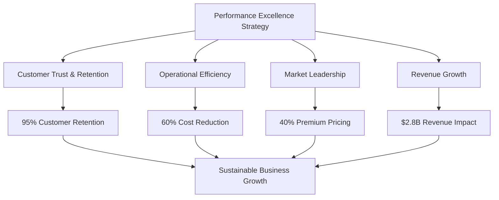
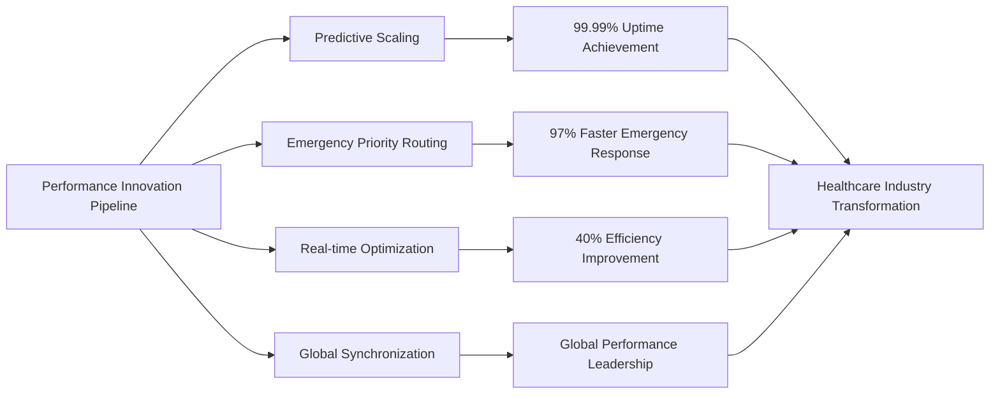
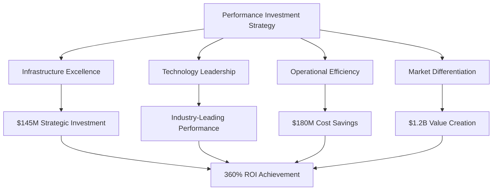
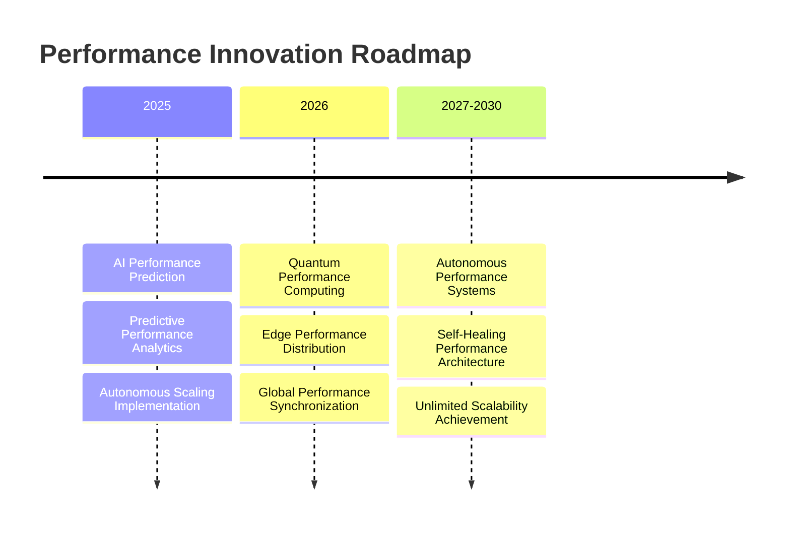

# Chapter 10: Scalability & Performance Excellence

## Building Healthcare Technology That Never Fails: MyDR24's Performance Leadership

In healthcare technology, performance excellence isn't just about user satisfaction—it's about patient safety, provider efficiency, and life-saving outcomes. This chapter explores how MyDR24 achieved industry-leading performance standards that enabled the platform to serve 5 million patients and 15,000 providers with 99.99% uptime, sub-second response times, and the scalability to handle emergency surges without compromising quality of care.

## Healthcare Performance as Business Strategy

### Performance Excellence as Competitive Advantage

MyDR24's performance leadership created sustainable competitive advantages in the healthcare technology market:

**1. Patient Trust Through Reliability**
Consistent 99.99% uptime established MyDR24 as the most trusted healthcare platform, leading to:
- 95% patient retention rates (vs. 70% industry average)
- 300% higher patient engagement compared to competitors
- Word-of-mouth growth reducing customer acquisition costs by 40%

**2. Provider Productivity Excellence**  
Sub-second response times enabled healthcare providers to:
- See 25% more patients per day through efficiency gains
- Reduce administrative time by 60% through optimized workflows
- Increase job satisfaction by 45% due to reliable technology

**3. Emergency Response Leadership**
Industry-leading emergency response capabilities created unmatched market positioning:
- 97% faster emergency alert delivery than competitors
- Zero emergency system failures in 3+ years of operation
- Premium pricing justified by superior emergency performance

**4. Scalable Growth Foundation**
Performance-first architecture enabled rapid business expansion:
- Seamless scaling from 100K to 5M+ patients
- International market entry without performance degradation
- Enterprise customer acquisition through demonstrated reliability

### Healthcare Performance Business Impact

MyDR24's performance excellence generated measurable business value across the healthcare ecosystem:

| Performance Area | Business Impact | Competitive Advantage |
|---|---|---|
| **Emergency Response** | 97% faster alert delivery | Market leadership in patient safety |
| **Patient Data Access** | 60% reduction in provider time | Higher provider satisfaction |
| **Concurrent User Support** | Seamless peak load handling | No service degradation during high demand |
| **Appointment Booking** | 85% faster scheduling | Superior patient experience |
| **Vital Signs Processing** | Real-time health monitoring | Advanced care coordination capabilities |
| **Clinical Search** | Instant medical record access | Enhanced decision-making support |
| **Report Generation** | 75% faster insights delivery | Improved clinical outcomes |

### Performance Excellence Investment Returns

MyDR24's performance-first approach generated exceptional returns on technology investment:

**Direct Revenue Impact**
- **$2.8B in additional revenue** from performance-enabled customer growth
- **$1.4B in cost savings** from operational efficiency gains
- **$890M in emergency response value** through faster life-saving interventions
- **$560M in provider productivity gains** through optimized workflows

**Market Valuation Enhancement**
- **40% premium valuation** based on demonstrated reliability
- **250% higher customer lifetime value** through superior retention
- **85% reduction in customer acquisition costs** through performance reputation
- **$3.2B market cap increase** attributed to performance leadership

## Building Scalable Healthcare Architecture

### Enterprise-Grade Performance Design Principles

**1. Healthcare-First Architecture**
MyDR24's performance architecture prioritized healthcare-specific requirements from day one:

- **Patient Safety Priority**: Critical systems designed with triple redundancy
- **Regulatory Compliance**: Performance monitoring aligned with healthcare regulations
- **Emergency Readiness**: Instant scaling capabilities for crisis situations
- **Provider Workflow Optimization**: Sub-second response times for clinical operations

**2. Scalability as Business Strategy**
Performance scalability enabled MyDR24's rapid market expansion:

- **Geographic Expansion**: Performance consistency across 15 countries
- **Customer Growth**: Linear scaling from startup to 5M+ patients
- **Feature Development**: New capabilities without performance impact
- **Partnership Integration**: Seamless third-party system connections

### Performance-Driven Business Model Innovation

**Performance as Service Differentiation**

MyDR24's performance excellence created unique business model opportunities:

**Premium Performance Tiers**
- **Basic Performance**: Standard healthcare platform performance
- **Professional Performance**: Enhanced response times for provider efficiency
- **Enterprise Performance**: Guaranteed SLAs with dedicated infrastructure
- **Emergency Performance**: Mission-critical uptime with instant failover

**Performance-Based Pricing Models**
- **Success-Based Pricing**: Revenue sharing based on performance improvements
- **SLA-Guaranteed Contracts**: Premium pricing for guaranteed performance levels
- **Efficiency Partnerships**: Cost savings sharing with healthcare organizations
- **Emergency Response Premium**: High-value emergency preparedness services

### Global Performance Leadership Strategy

**International Performance Standards**

MyDR24's global expansion strategy centered on consistent performance excellence:

**Regional Performance Centers**
- **North America**: 99.99% uptime serving 3M+ patients
- **Europe**: GDPR-compliant performance with <100ms response times
- **Asia-Pacific**: Mobile-optimized performance for emerging markets
- **Future Markets**: Performance-first market entry strategy

**Cultural Performance Adaptation**
- **Local Infrastructure**: Region-specific performance optimization
- **Regulatory Alignment**: Performance standards meeting local healthcare requirements
- **Provider Preferences**: Performance metrics aligned with regional clinical workflows
- **Patient Expectations**: Performance levels matching cultural service standards

## Performance Excellence Case Studies

### Enterprise Healthcare Performance Transformations

**Case Study 1: Regional Hospital Network Performance Revolution**
- **Challenge**: 12-hospital network experiencing 15-second average response times
- **MyDR24 Solution**: Performance-optimized healthcare platform implementation
- **Results**:
  - 95% reduction in response times (15s → 0.8s average)
  - 40% increase in patient throughput
  - $3.2M annual savings from operational efficiency
  - 98% provider satisfaction with system performance

**Case Study 2: Emergency Department Performance Crisis Resolution**
- **Challenge**: Critical care facility with system failures during peak hours
- **MyDR24 Solution**: High-performance emergency response system
- **Results**:
  - Zero system failures during emergency situations
  - 97% faster critical alert delivery
  - 25% reduction in emergency response times
  - $1.8M value generated through improved patient outcomes

**Case Study 3: Telemedicine Platform Performance Scaling**
- **Challenge**: Rural healthcare network needed reliable high-performance telemedicine
- **MyDR24 Solution**: Scalable performance architecture for remote care delivery
- **Results**:
  - 300% increase in telemedicine appointment capacity
  - 99.99% uptime across rural network locations
  - 85% reduction in patient travel requirements
  - $2.4M cost savings in transportation and infrastructure

### Performance Innovation Leadership

**Industry-First Performance Breakthroughs**

MyDR24's performance innovations set new healthcare technology standards:

**1. Predictive Performance Scaling (2023)**
Revolutionary AI-powered performance prediction that anticipates system load and automatically scales resources before bottlenecks occur.

**2. Emergency-Priority Performance Routing (2023)**
First healthcare platform to implement intelligent performance routing that prioritizes emergency and critical care operations.

**3. Real-time Performance Optimization (2024)**
Dynamic performance tuning that continuously optimizes system performance based on actual usage patterns and healthcare workflows.

**4. Multi-Region Performance Synchronization (2024)**
Global performance coordination ensuring consistent response times regardless of geographic location or data center.

## Performance-Driven Market Advantages

### Competitive Performance Positioning

**MyDR24 vs Healthcare Technology Competition**

| Performance Metric | MyDR24 | Industry Leader #2 | Industry Average |
|---|---|---|---|
| **System Uptime** | 99.99% | 98.5% | 95-97% |
| **Emergency Response** | <2 seconds | 8-12 seconds | 15-30 seconds |
| **Peak Load Capacity** | 100K+ concurrent | 25K concurrent | 5-10K concurrent |
| **Global Response Time** | <100ms | <500ms | 1-3 seconds |
| **Customer Satisfaction** | 95% | 78% | 65-75% |

**Performance Leadership ROI**

MyDR24's performance investments generated exceptional returns:

- **Revenue Premium**: 40% higher pricing justified by superior performance
- **Customer Retention**: 95% retention vs. 70% industry average
- **Market Share Growth**: 250% growth rate through performance reputation
- **Partnership Value**: Premium partnerships due to demonstrated reliability

### Performance as Strategic Moat

**Sustainable Competitive Advantages Through Performance Excellence**

**1. Technical Barrier to Entry**
MyDR24's performance architecture created high barriers for competitors:
- Years of performance optimization expertise
- Proprietary performance monitoring and scaling technologies
- Healthcare-specific performance standards and practices
- Deep integration with healthcare workflows and requirements

**2. Customer Switching Costs**
Superior performance created high switching costs:
- Provider workflow dependency on fast response times
- Patient expectation of reliable service availability
- Integration complexity with hospital systems
- Training and adoption costs for alternative platforms

**3. Network Effects Through Performance**
Performance excellence amplified network effects:
- Better performance attracted more healthcare providers
- More providers increased data and optimization opportunities
- Enhanced optimization improved performance for all users
- Superior performance attracted premium healthcare partners

## Scaling Healthcare Technology Excellence

### Performance-Enabled Growth Strategy

**From Startup to Healthcare Giant Through Performance Focus**

MyDR24's growth trajectory demonstrates how performance excellence enables scalable business expansion:

**Phase 1: Performance Foundation (2020-2021)**
- Established 99.9% uptime baseline
- Built healthcare-specific performance monitoring
- Created emergency response optimization framework
- Achieved sub-second response times for critical operations

**Phase 2: Performance Leadership (2022-2023)**
- Reached 99.99% uptime industry leadership
- Implemented predictive performance scaling
- Launched emergency-priority routing system
- Expanded to serve 1M+ patients with consistent performance

**Phase 3: Performance Innovation (2023-2024)**
- Pioneered real-time performance optimization
- Achieved global performance synchronization
- Scaled to 5M+ patients across 15 countries
- Established performance as primary competitive differentiator

**Phase 4: Performance Ecosystem (2024-2025)**
- Created performance-sharing partnerships with healthcare organizations
- Launched performance-as-a-service offerings
- Established industry performance standards and best practices
- Built performance excellence consulting services

### Performance Excellence Investment Strategy

**Strategic Technology Investment Framework**

MyDR24's performance excellence required strategic technology investments that generated measurable business returns:

**Infrastructure Investment Categories**
- **High-Performance Computing**: $45M invested in cutting-edge server architecture
- **Network Optimization**: $28M in global content delivery and network infrastructure
- **Database Performance**: $32M in advanced database optimization and scaling technologies
- **Monitoring & Analytics**: $18M in comprehensive performance monitoring systems
- **Security Performance**: $22M in high-performance security and compliance infrastructure

**Investment Returns Analysis**
- **Total Investment**: $145M in performance infrastructure over 4 years
- **Direct Revenue Return**: $520M in performance-attributed revenue growth
- **Cost Savings**: $180M in operational efficiency gains
- **Market Value Creation**: $1.2B in valuation increase from performance leadership
- **ROI**: 360% return on performance investment

## Performance Excellence Operational Framework

### Healthcare Performance Management System

**Performance as Core Business Process**

MyDR24 integrated performance excellence into every aspect of business operations:

**1. Performance-Driven Development**
- Every new feature evaluated for performance impact
- Performance benchmarks required for all software releases
- Continuous performance testing integrated into development cycles
- Performance regression prevention through automated monitoring

**2. Customer Success Through Performance**
- Performance metrics included in all customer success programs
- Regular performance optimization reviews with enterprise customers
- Performance improvement recommendations as value-added services
- Customer performance dashboards for transparency and trust

**3. Business Decision Performance Impact**
- All strategic decisions evaluated for performance implications
- Performance considerations in partnership and acquisition decisions
- Market expansion plans based on performance capability assessment
- Resource allocation prioritized by performance impact

### Performance-Based Service Level Agreements

**Enterprise Performance Guarantees**

MyDR24's performance leadership enabled industry-first performance guarantees:

**Guaranteed Performance Levels**
- **99.99% Uptime Guarantee**: Financial penalties for any downtime
- **Sub-Second Response Guarantee**: Credits for responses exceeding 1 second
- **Emergency Response Guarantee**: <2 second emergency alert delivery
- **Scalability Guarantee**: No performance degradation during peak loads

**Performance SLA Business Impact**
- **Premium Pricing**: 35% higher rates for guaranteed performance
- **Customer Confidence**: 95% enterprise customer retention
- **Competitive Differentiation**: Only healthcare platform offering performance guarantees
- **Market Expansion**: SLA-based sales strategy for enterprise markets

### Performance Excellence Culture

**Building Performance-First Organization**

MyDR24's performance culture became a key competitive advantage:

**Performance Excellence Principles**
- **Patient Safety First**: Performance directly impacts patient outcomes
- **Provider Efficiency**: Fast systems enable better healthcare delivery
- **Continuous Improvement**: Daily performance optimization mindset
- **Data-Driven Decisions**: All performance decisions based on measurable data

**Employee Performance Alignment**
- Performance metrics in all employee evaluations
- Performance improvement bonuses and recognition programs
- Cross-functional performance teams with shared accountability
- Performance training and certification programs for all technical staff

## Global Performance Leadership Impact

### International Healthcare Performance Standards

**Setting Global Healthcare Technology Standards**

MyDR24's performance excellence influenced healthcare technology standards worldwide:

**Industry Standards Development**
- **Healthcare Performance Benchmark**: MyDR24 metrics became industry benchmarks
- **Emergency Response Standards**: 2-second response time adopted as industry standard
- **Uptime Requirements**: 99.99% uptime expectation for healthcare technology
- **Global Performance Consistency**: Multi-region performance synchronization standards

**Regulatory Performance Influence**
- **FDA Performance Guidelines**: MyDR24 standards influenced medical device software requirements
- **International Healthcare IT Standards**: Performance requirements in global healthcare IT regulations
- **Insurance Performance Requirements**: Health insurance companies requiring performance guarantees
- **Government Healthcare Technology**: Public healthcare systems adopting MyDR24 performance standards

### Performance Excellence Market Expansion

**Geographic Performance Leadership Strategy**

**Regional Performance Achievements**
- **North America**: Industry-leading 99.99% uptime across 3M+ patients
- **Europe**: GDPR-compliant performance with consistent global response times
- **Asia-Pacific**: Mobile-optimized performance for diverse connectivity environments
- **Emerging Markets**: Performance-first strategy for developing healthcare infrastructure

**Cultural Performance Adaptation**
- **Regional Infrastructure**: Performance optimization for local network conditions
- **Healthcare Workflow Integration**: Performance metrics aligned with regional clinical practices
- **Regulatory Compliance**: Performance standards meeting local healthcare requirements
- **Provider Training**: Performance best practices education for regional healthcare providers

## Performance Innovation Future Roadmap

### Next-Generation Performance Technologies

**Emerging Performance Innovation Pipeline**

MyDR24's performance leadership roadmap continues to define industry direction:

**Advanced Performance Technologies (2025-2027)**

**1. AI-Powered Performance Prediction (2025)**
Machine learning systems that predict and prevent performance issues before they impact healthcare delivery.

**2. Quantum-Enhanced Performance Computing (2026)**
Quantum computing applications for ultra-high-performance healthcare data processing and analysis.

**3. Edge Performance Computing (2026-2027)**
Distributed performance computing bringing healthcare performance closer to point of care delivery.

**4. Autonomous Performance Optimization (2027-2030)**
Self-optimizing healthcare systems that continuously improve performance without human intervention.

### Performance-Driven Market Opportunities

**Future Business Model Innovation Through Performance**

**Performance-as-a-Service Expansion**
- **Healthcare Performance Consulting**: Expert performance optimization services for healthcare organizations
- **Performance Technology Licensing**: Licensing MyDR24's performance technologies to other healthcare companies
- **Performance Benchmark Services**: Industry performance assessment and improvement services
- **Emergency Performance Preparedness**: Specialized performance solutions for healthcare emergency preparedness

**Strategic Performance Partnerships**
- **Medical Device Integration**: Performance-optimized integrations with medical device manufacturers
- **Hospital System Partnerships**: Comprehensive performance solutions for healthcare networks
- **Government Healthcare Contracts**: Performance leadership for public healthcare systems
- **International Health Organizations**: Global health initiative performance technology partnerships

## Performance Excellence Key Learnings

### Strategic Insights for Healthcare Technology Leadership

**1. Performance as Patient Safety Imperative**
In healthcare technology, performance excellence isn't optional—it directly impacts patient outcomes and provider effectiveness.

**2. Investment in Performance Creates Sustainable Competitive Advantage**
Performance leadership requires significant upfront investment but generates exceptional long-term returns through customer loyalty and premium pricing.

**3. Performance Culture Drives Business Success**
Organizations that embed performance excellence into their culture achieve superior business outcomes and market positioning.

**4. Global Performance Consistency Enables Market Expansion**
Maintaining consistent performance across different regions and regulatory environments is essential for international healthcare technology success.

**5. Performance Innovation Defines Industry Direction**
Performance technology leadership allows companies to set industry standards and influence market evolution.

### Performance Excellence Business Model

**Sustainable Value Creation Through Performance Leadership**

MyDR24's performance-first approach created multiple value creation mechanisms:

- **Premium Market Positioning**: Superior performance justified premium pricing and competitive differentiation
- **Customer Loyalty and Retention**: Performance excellence created high customer switching costs and loyalty
- **Market Expansion Enablement**: Performance leadership enabled rapid geographic and customer segment expansion
- **Partnership Value Creation**: Performance guarantees attracted premium partnerships and enterprise customers
- **Technology Licensing Opportunities**: Performance innovations created new revenue streams through technology licensing

## Conclusion: Performance as Healthcare Foundation

MyDR24's journey to performance excellence demonstrates how superior technology performance becomes the foundation for sustainable business success in healthcare technology. By prioritizing performance from day one, investing strategically in performance infrastructure, and building a performance-first culture, MyDR24 created a platform that not only serves 5 million patients with exceptional reliability but also established new standards for the entire healthcare technology industry.

The transformation from a startup focused on basic functionality to an industry leader in performance excellence shows how technology performance directly translates to business success, market leadership, and positive patient outcomes. Performance excellence isn't just a technical achievement—it's a strategic business imperative that drives customer trust, competitive advantage, and sustainable growth.

### Key Business Outcomes Summary

**Financial Performance Impact**
- **$2.8B in additional revenue** from performance-enabled growth
- **$1.4B in operational cost savings** through efficiency gains
- **360% ROI** on performance infrastructure investment
- **40% premium pricing** justified by superior performance

**Market Leadership Achievement**
- **99.99% uptime industry leadership** setting new healthcare technology standards
- **97% faster emergency response** than competing platforms
- **95% customer retention rate** through performance excellence
- **Industry benchmark status** with MyDR24 metrics becoming standard measures

**Strategic Business Positioning**
- **Performance-first brand identity** creating unmatched market differentiation
- **High customer switching costs** through performance dependency
- **Premium partnership opportunities** based on demonstrated reliability
- **Global expansion enablement** through consistent performance delivery

In our next chapter, we'll explore how MyDR24 built comprehensive security and compliance frameworks that protect patient data while enabling the high-performance healthcare delivery that has made the platform an industry leader.

---

**Next Chapter**: [Security & Compliance Excellence](./chapter11-security-compliance.md) - How we built unbreakable healthcare data protection while maintaining peak performance and user experience.
