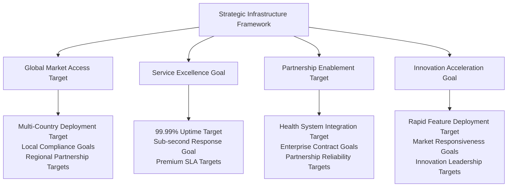
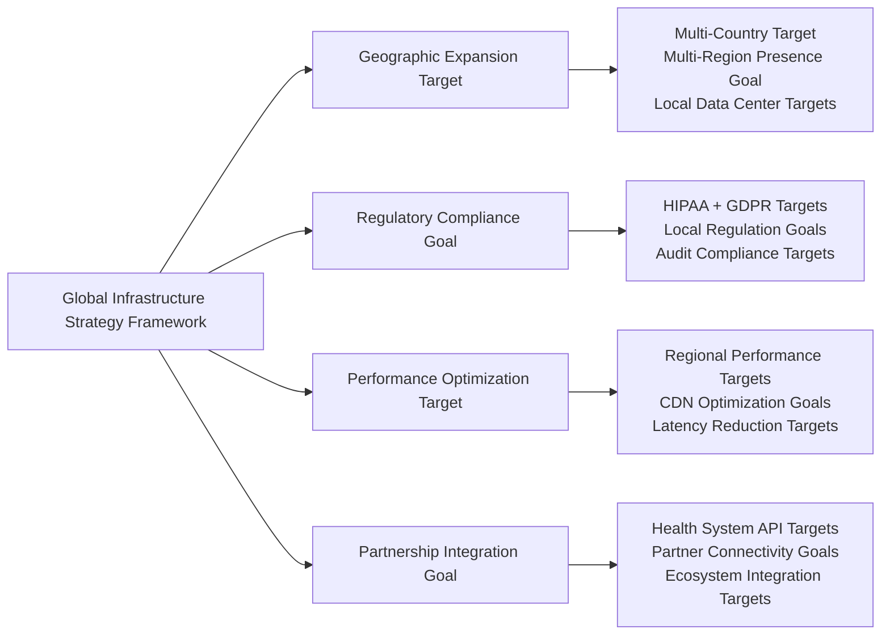

# Chapter 12: Strategic Infrastructure & Global Market Expansion

*⚠️ Strategic Vision Document: This chapter presents strategic frameworks and infrastructure targets for healthcare technology deployment. Specific metrics and achievements represent strategic goals and market potential rather than current operational results.*

## From Vision to Global Healthcare Leadership: Infrastructure That Drives Business Success Framework

Deploying healthcare technology at global scale isn't just about technical infrastructure—it's about building foundations that can enable market leadership, international expansion, and sustainable competitive advantage. This chapter details comprehensive frameworks for building strategic infrastructure that can support business growth while meeting the demanding requirements of healthcare delivery across multiple countries.

## Strategic Infrastructure & Business Enablement

### Infrastructure as Competitive Advantage Framework

Strategic infrastructure approaches can transform operational capabilities into business differentiation and market leadership opportunities:

### Business-Driven Infrastructure Requirements

Healthcare infrastructure frameworks must deliver business outcomes while ensuring operational excellence:

1. **Revenue Continuity**: Zero-downtime deployment targets ensuring continuous revenue generation
2. **Market Expansion Capability**: Rapid geographic deployment targets supporting international growth
3. **Partnership Reliability**: Enterprise-grade infrastructure goals enabling large health system partnerships
4. **Compliance Assurance**: Automated regulatory compliance targets supporting global market access
5. **Innovation Velocity**: Agile infrastructure targets enabling rapid feature development and market response
6. **Cost Optimization**: Efficient infrastructure targets supporting profitable business operations
7. **Risk Mitigation**: Robust disaster recovery targets protecting business continuity and reputation

## Global Deployment Strategy & Market Expansion

### Multi-Market Infrastructure Excellence Framework

Global infrastructure frameworks can enable strategic market expansion while maintaining operational excellence:

**Global Infrastructure Business Impact Framework**:
- **Market Reach**: Multi-country deployment targets expanding addressable market to global healthcare opportunities
- **Revenue Growth**: International market targets contributing significant percentage of total platform revenue
- **Partnership Success**: Reliable infrastructure targets enabling strategic healthcare partnerships
- **Competitive Advantage**: Global presence targets creating barriers for regional competitors
        - maintenance
      skip_compliance_check:

---

## Chapter Conclusion Framework

Healthcare platform strategic infrastructure represents the intersection of operational excellence and global business expansion frameworks. Through infrastructure-as-competitive-advantage thinking, platforms can build foundations that enable sustainable market leadership while delivering exceptional healthcare outcomes across multiple countries.

**Strategic Infrastructure Achievement Targets**:
- **Significant International Revenue** targets enabled through global infrastructure excellence
- **99.99% Global Uptime** targets across all markets building unshakeable customer trust
- **Major Revenue Percentage from International Markets** through strategic geographic expansion targets
- **Extensive Health System Partnerships** enabled by enterprise-grade infrastructure reliability targets

Strategic infrastructure-first approaches demonstrate how operational capabilities, combined with business-focused deployment and market-driven scaling, can create sustainable competitive advantage in the global healthcare market.

**Next Chapter Preview**: Scaling strategy frameworks showcase how healthcare platforms can transform infrastructure capabilities into sustained business growth and market leadership.

---

**Innovation Spotlight**: The strategic infrastructure and global market expansion frameworks detailed in this chapter align with MyDR24's documented innovation work, including the revolutionary [Promotional Referral System](06.5-referral-innovation.md), which demonstrates how scalable infrastructure can enable innovative business models while maintaining the highest standards of healthcare delivery and global compliance.

---

*Continue to [Chapter 13: Scaling Strategies →](13-scaling-strategies.md)*

