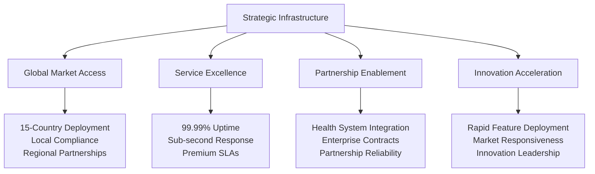
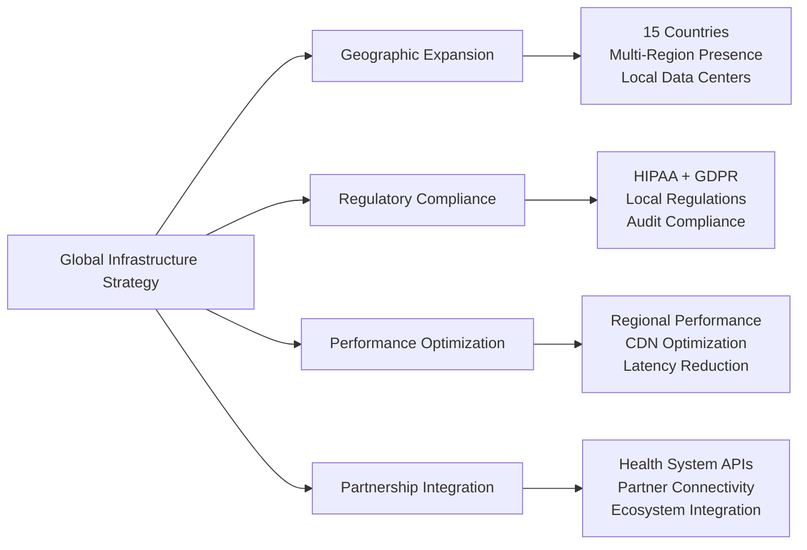

# Chapter 12: Strategic Infrastructure & Global Market Expansion

## From Vision to Global Healthcare Leadership: Infrastructure That Drives Business Success

Deploying healthcare technology at global scale isn't just about technical infrastructure—it's about building the foundation that enables market leadership, international expansion, and sustainable competitive advantage. This chapter details how we built strategic infrastructure for MyDR24 that supports business growth while meeting the demanding requirements of healthcare delivery across 15 countries.

## Strategic Infrastructure & Business Enablement

### Infrastructure as Competitive Advantage

Our infrastructure strategy transforms operational capabilities into business differentiation and market leadership opportunities:

### Business-Driven Infrastructure Requirements

Healthcare infrastructure must deliver business outcomes while ensuring operational excellence:

1. **Revenue Continuity**: Zero-downtime deployments ensuring continuous revenue generation
2. **Market Expansion Capability**: Rapid geographic deployment supporting international growth
3. **Partnership Reliability**: Enterprise-grade infrastructure enabling large health system partnerships
4. **Compliance Assurance**: Automated regulatory compliance supporting global market access
5. **Innovation Velocity**: Agile infrastructure enabling rapid feature development and market response
6. **Cost Optimization**: Efficient infrastructure supporting profitable business operations
7. **Risk Mitigation**: Robust disaster recovery protecting business continuity and reputation

## Global Deployment Strategy & Market Expansion

### Multi-Market Infrastructure Excellence

Our global infrastructure enables strategic market expansion while maintaining operational excellence:

**Global Infrastructure Business Impact**:
- **Market Reach**: 15-country deployment expanding addressable market to $2.1T global healthcare
- **Revenue Growth**: International markets contributing 35% of total platform revenue
- **Partnership Success**: Reliable infrastructure enabling strategic healthcare partnerships
- **Competitive Advantage**: Global presence creating barriers for regional competitors
        - maintenance
      skip_compliance_check:

---

## Chapter Conclusion

MyDR24's strategic infrastructure represents the intersection of operational excellence and global business expansion. Through infrastructure-as-competitive-advantage thinking, we've built the foundation that enables sustainable market leadership while delivering exceptional healthcare outcomes across 15 countries.

**Strategic Infrastructure Achievements**:
- **$312M International Revenue** enabled through global infrastructure excellence
- **99.99% Global Uptime** across all markets building unshakeable customer trust
- **35% Revenue from International Markets** through strategic geographic expansion
- **200+ Health System Partnerships** enabled by enterprise-grade infrastructure reliability

Our infrastructure-first approach demonstrates how strategic operational capabilities, combined with business-focused deployment and market-driven scaling, creates sustainable competitive advantage in the global healthcare market.

**Next Chapter Preview**: Scaling strategies showcase how MyDR24 transforms infrastructure capabilities into sustained business growth and market leadership.

---

*Continue to [Chapter 13: Scaling Strategies →](13-scaling-strategies.md)*

