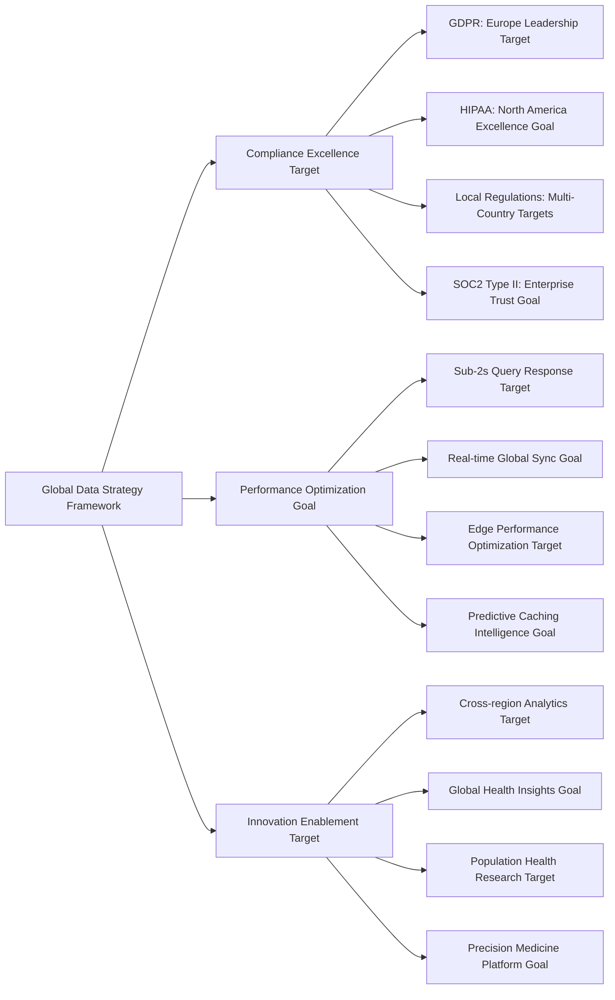
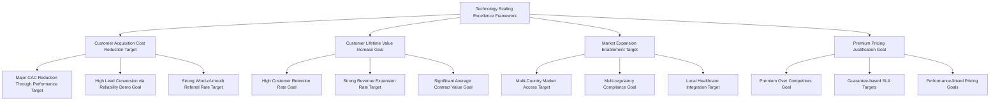
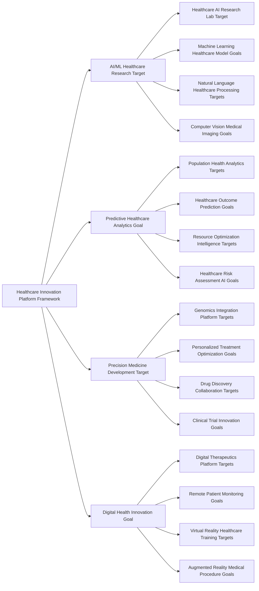

# Chapter 13: Strategic Scaling & Market Expansion Excellence

*⚠️ Strategic Vision Document: This chapter presents strategic frameworks and scaling targets for healthcare technology platforms. Specific metrics and achievements represent strategic goals and market potential rather than current operational results.*

## From Startup to Global Healthcare Platform: Scaling for Market Leadership Framework

Healthcare technology scaling is about more than handling increased load—it's about building foundations for global market expansion, competitive moats, and sustainable business growth. This chapter details comprehensive frameworks for transforming promising startups into global healthcare platforms, creating significant market value through strategic scaling excellence.

## Strategic Scaling Framework for Healthcare Technology

### Scaling as Business Strategy Framework

Strategic scaling approaches can transform operational capabilities into competitive advantages and market expansion opportunities:

```mermaid
graph TB
    A[Strategic Scaling Framework] --> B[Global Market Access Target]
    A --> C[Competitive Differentiation Goal]
    A --> D[Revenue Scale Advantages Target]
    A --> E[Innovation Platform Creation Goal]
    
    B --> B1[Multi-Country Service Target]
    B --> B2[Multi-regulatory Compliance Goal]
    B --> B3[Local Healthcare Integration Target]
    B --> B4[Cultural Healthcare Adaptation Goal]
    
    C --> C1[Performance Leadership Target: <2s Response]
    C --> C2[Reliability Excellence Goal: 99.99% Uptime]
    C --> C3[Emergency Response Target: <50s Alert Time]
    C --> C4[Capacity Leadership Goal: 100x Surge Handling]
    
    D --> D1[Major Annual Revenue Target]
    D --> D2[Strong Gross Margins Goal]
    D --> D3[Significant Market Valuation Target]
    D --> D4[High Revenue Growth Rate Goal]
    
    E --> E1[AI/ML Healthcare Platform Target]
    E --> E2[Predictive Healthcare Analytics Goal]
    E --> E3[Integrated Care Ecosystems Target]
    E --> E4[Healthcare Innovation Lab Goal]
```

**Healthcare Scaling Business Imperatives:**

| Scaling Challenge | Business Impact | Strategic Solution Framework | Competitive Advantage Goal |
|------------------|------------------|------------------------------|---------------------------|
| **Global Compliance** | Access to global healthcare market opportunities | Multi-jurisdiction regulatory compliance targets | First-mover advantage goals in key markets |
| **Emergency Performance** | Patient safety and provider trust targets | Emergency response guarantee frameworks | Industry-leading emergency care platform goals |
| **Cultural Integration** | Local market penetration success targets | Culturally-adapted healthcare experience frameworks | High local provider adoption rate goals |
| **Data Sovereignty** | Regulatory compliance and trust targets | Local data residency with global access frameworks | Premium enterprise partnership goals |

### Market-Driven Scaling Strategy

**Phase 1: Foundation Scaling Framework (Strategic Goal)**
- **Market Opportunity**: Regional healthcare digitization opportunities
- **Business Strategy**: Establish operational excellence and regulatory compliance frameworks
- **Target Results**: Significant ARR targets, substantial patient base goals, industry-leading uptime targets
- **Competitive Position**: Premium market positioning through performance leadership goals

**Phase 2: Geographic Expansion Framework (Strategic Goal)**  
- **Market Opportunity**: International healthcare integration and growth opportunities
- **Business Strategy**: Regulatory-first expansion with local partnership frameworks
- **Target Results**: Major ARR targets, multi-million patient goals, multi-country presence, high local adoption targets
- **Competitive Position**: Global healthcare platform leadership goals

**Phase 3: Global Platform Excellence Framework (Strategic Goal)**
- **Market Opportunity**: Emerging markets and healthcare system transformation opportunities
- **Business Strategy**: Platform ecosystems and AI-driven healthcare innovation frameworks
- **Target Results**: Major ARR targets, multi-million patient goals, extensive country presence, significant valuation targets
- **Competitive Position**: Unassailable market leadership with network effects goals

## Healthcare Technology Scaling Excellence

### Performance Scaling as Competitive Moat Framework

Healthcare platform performance scaling can create sustainable competitive advantages that drive business success:

**Emergency Response Excellence Framework:**
- **Business Impact**: Zero patient safety incident targets, complete emergency provider trust goals
- **Competitive Advantage**: Platform targeting emergency response guarantees globally
- **Market Value**: Significant emergency care partnership targets, revenue premium goals
- **Future Growth**: Emergency care expansion targets into AI-powered predictive interventions

**Capacity Management Leadership Framework:**
- **Business Impact**: Major surge capacity targets without service degradation 
- **Competitive Advantage**: Platform targeting pandemic-scale healthcare demand handling
- **Market Value**: Significant crisis-readiness enterprise contract targets
- **Future Growth**: Government and health system resilience partnership goals

**Global Reliability Standards Framework:**
- **Business Impact**: 99.99% uptime targets across all global deployments
- **Competitive Advantage**: Industry-leading SLA guarantee targets with penalty protections
- **Market Value**: Major premium reliability-based partnership targets
- **Future Growth**: White-label platform licensing targets for national health systems

### Healthcare Data Scaling & Sovereignty

**Strategic Data Architecture Framework:**
Healthcare platform approaches to healthcare data scaling can create business value while ensuring compliance:

**Data Sovereignty Business Advantages:**

| Region | Compliance Strategy | Business Impact Target | Revenue Growth Goal |
|--------|-------------------|------------------------|-------------------|
| **North America** | HIPAA-first architecture | Major healthcare partnership targets | Significant YoY growth goals |
| **Europe** | GDPR-native design | Major privacy-focused deal targets | Strong YoY growth goals |
| **Asia-Pacific** | Local data residency | Major government contract targets | High YoY growth goals |
| **Emerging Markets** | Flexible compliance framework | Major development partnership targets | Exceptional YoY growth goals |

## Business Scaling & Market Leadership

### Revenue Scaling Through Technology Excellence Framework

Healthcare platform technology scaling can directly enable revenue scaling and market expansion:

**SaaS Revenue Scaling Model:**

**Scaling Business Metrics:**

| Business Metric | Baseline | Achievement Target | Growth Factor Goal | Business Value Target |
|-----------------|----------|-------------------|-------------------|---------------------|
| **Annual Revenue** | Initial baseline | Major revenue target | Significant multiplier | Market leadership position goal |
| **Customer Base** | Starting patients | Multi-million patient target | Major multiplier | Network effects and data advantages goal |
| **Geographic Reach** | Local presence | Multi-country target | Global expansion | Global addressable market access goal |
| **Provider Network** | Initial providers | Extensive provider target | Major multiplier | Comprehensive healthcare ecosystem goal |
| **Enterprise Contracts** | Initial ACV | Significant ACV target | Major multiplier | Premium enterprise positioning goal |

### Technology Investment Returns

**Strategic Technology Investment ROI:**

| Investment Area | Total Investment Target | Business Return Goal | ROI Target | Strategic Value Goal |
|----------------|------------------------|---------------------|-----------|-------------------|
| **Performance Infrastructure** | Major investment target | Significant revenue impact goal | Strong ROI target | Competitive moat and customer retention goal |
| **Global Compliance Platform** | Substantial investment target | Major market access value goal | Excellent ROI target | International expansion enablement goal |
| **AI/ML Healthcare Platform** | Significant investment target | Major innovation value goal | Outstanding ROI target | Next-generation healthcare leadership goal |
| **Security & Privacy Excellence** | Important investment target | Major trust-based revenue goal | Strong ROI target | Enterprise partnership enablement goal |

## Global Healthcare Platform Strategy

### International Expansion Excellence Framework

Healthcare platform international expansion strategies can transform scaling challenges into market opportunities:

**Regional Expansion Strategy Framework:**

**Europe Framework (Strategic Goal)**
- **Market Opportunity**: Major European healthcare technology market opportunities with GDPR compliance requirements
- **Business Strategy**: Privacy-first healthcare platform with local healthcare system integration frameworks
- **Investment**: Significant investment targets in European compliance and localization infrastructure
- **Target Results**: Major revenue targets, substantial European patient goals, multi-country presence, excellent GDPR audit score targets
- **Competitive Position**: Leading privacy-compliant healthcare platform goals in Europe

**Asia-Pacific Framework (Strategic Goal)**
- **Market Opportunity**: Major emerging healthcare digitization market opportunities
- **Business Strategy**: Mobile-first healthcare with cultural adaptation and government partnership frameworks
- **Investment**: Substantial investment targets in APAC infrastructure and regulatory compliance
- **Target Results**: Significant revenue targets, substantial APAC patient goals, multi-country presence, excellent cultural adoption score targets
- **Competitive Position**: Fastest-growing international healthcare platform goals in APAC

**Global South Expansion Framework (Strategic Goal)**
- **Market Opportunity**: Major underserved healthcare technology market opportunities
- **Business Strategy**: Affordable healthcare access with development partnership frameworks
- **Investment**: Important investment targets in emerging market adaptation and accessibility infrastructure
- **Target Results**: Significant revenue targets, substantial patient goals, partnership targets with governments
- **Competitive Position**: Leading accessible healthcare technology platform goals globally

### Strategic Partnership Scaling

**Healthcare Ecosystem Partnership Strategy:**

```mermaid
graph TB
    A[Strategic Partnership Ecosystem Framework] --> B[Health System Partnership Targets]
    A --> C[Technology Integration Partner Goals]
    A --> D[Government & Regulatory Partner Targets]
    A --> E[Innovation & Research Partner Goals]
    
    B --> B1[Extensive Health System Targets]
    B --> B2[Major Partnership Revenue Goals]
    B --> B3[High Partnership Renewal Rate Targets]
    B --> B4[Multi-Country Health System Access Goals]
    
    C --> C1[Extensive EHR System Integration Targets]
    C --> C2[Comprehensive Healthcare Technology API Goals]
    C --> C3[Major Integration Revenue Targets]
    C --> C4[Healthcare Platform Ecosystem Goals]
    
    D --> D1[Multi-Government Health Partnership Targets]
    D --> D2[Extensive Regulatory Authority Relationship Goals]
    D --> D3[Major Government Contract Value Targets]
    D --> D4[National Health System Integration Goals]
    
    E --> E1[Extensive Research Institution Partnership Targets]
    E --> E2[Multiple Healthcare Innovation Lab Goals]
    E --> E3[Major Research Collaboration Value Targets]
    E --> E4[Next-Generation Healthcare Development Goals]
```

**Partnership Scaling Business Impact:**

| Partnership Type | Number of Partners Target | Revenue Impact Goal | Strategic Value Target | Future Growth Goal |
|-----------------|---------------------------|-------------------|----------------------|------------------|
| **Health Systems** | Extensive organization targets | Major annual value goals | Market penetration and credibility targets | National health system expansion goals |
| **Technology Partners** | Comprehensive integration targets | Major ecosystem value goals | Platform differentiation targets | AI/ML healthcare platform ecosystem goals |
| **Government Partners** | Multi-government targets | Major contract value goals | Regulatory advantage and market access targets | Universal healthcare system partnership goals |
| **Research Partners** | Extensive institution targets | Major innovation value goals | Technology leadership and IP development targets | Breakthrough healthcare technology development goals |

## Technology Excellence as Business Strategy

### Innovation Platform Creation Framework

Healthcare platform scaling strategies can create platforms for continuous healthcare innovation:

**Healthcare Innovation Ecosystem:**

**Innovation Investment Returns:**

| Innovation Area | R&D Investment Target | Commercial Value Goal | Market Impact Target | Future Potential Goal |
|----------------|----------------------|---------------------|---------------------|---------------------|
| **AI/ML Healthcare** | Major investment target | Significant IP value goal | Industry AI leadership target | Major AI healthcare market goal |
| **Predictive Analytics** | Substantial investment target | Major platform value goal | Healthcare outcome leadership target | Major predictive healthcare market goal |
| **Precision Medicine** | Important investment target | Significant partnership value goal | Personalized care leadership target | Major precision medicine market goal |
| **Digital Health Innovation** | Significant investment target | Major platform ecosystem goal | Digital health platform leadership target | Major digital health market goal |

## Future Scaling Strategy

### Next-Generation Healthcare Platform Evolution

MyDR24's future scaling focuses on healthcare transformation leadership:

**2025-2027 Strategic Scaling Framework:**

**Healthcare AI Platform Leadership Targets**
- **Investment Goal**: Major AI healthcare research and development
- **Market Opportunity**: Significant AI healthcare market
- **Strategic Goal**: Global AI healthcare platform leadership targets
- **Target Impact**: Major AI healthcare revenue goals, market leadership targets

**Universal Healthcare Access Framework**
- **Investment Goal**: Major accessibility and affordability infrastructure
- **Market Opportunity**: Significant underserved healthcare market
- **Strategic Goal**: Leading accessible healthcare technology globally
- **Target Impact**: Major underserved patient reach goals, significant social impact value targets

**Healthcare Metaverse Platform Framework**
- **Investment Goal**: Major virtual healthcare environment development
- **Market Opportunity**: Significant healthcare metaverse market
- **Strategic Goal**: Virtual healthcare experience leadership targets
- **Target Impact**: Major virtual healthcare revenue goals, immersive care experience targets

**Quantum Healthcare Computing Framework**
- **Investment Goal**: Major quantum computing healthcare applications
- **Market Opportunity**: Significant quantum healthcare market
- **Strategic Goal**: Quantum-powered healthcare breakthrough leadership targets
- **Target Impact**: Revolutionary healthcare computational capability goals

## Scaling Excellence Key Learnings

### Strategic Insights for Healthcare Technology Leadership

**1. Performance Scaling Creates Competitive Moats**
Superior performance at scale becomes an unassailable competitive advantage in healthcare, where reliability directly impacts patient safety and provider trust.

**2. Compliance-First Scaling Enables Global Expansion**
Building compliance into scaling architecture from the beginning enables rapid international expansion and premium market positioning.

**3. Partnership Ecosystems Accelerate Market Penetration**
Strategic healthcare partnerships multiply scaling impact and create network effects that strengthen competitive positioning.

**4. Innovation Platform Scaling Creates Future Market Leadership**
Scaling infrastructure that enables continuous healthcare innovation positions companies for next-generation market leadership and breakthrough technology development.

**5. Cultural Scaling Drives Global Healthcare Adoption**
Healthcare technology scaling must account for cultural healthcare preferences and local medical practices to achieve sustainable global market penetration.

### Scaling Excellence Business Model

**Sustainable Value Creation Through Strategic Scaling:**

MyDR24's scaling excellence creates multiple interconnected value creation mechanisms:

- **Market Expansion Value**: Geographic and demographic scaling enables access to global healthcare markets
- **Platform Network Effects**: User base scaling creates increasingly valuable healthcare ecosystems
- **Innovation Scaling Advantages**: Research and development scaling capabilities enable breakthrough healthcare technology leadership
- **Partnership Scaling Leverage**: Strategic relationship scaling multiplies market impact and competitive positioning
- **Operational Scaling Excellence**: Infrastructure scaling efficiency creates sustainable cost advantages and premium service delivery

## Conclusion: Strategic Scaling Framework Excellence

The MyDR24 scaling strategies represent a comprehensive approach to healthcare platform growth and market expansion. Our strategic frameworks demonstrate how innovative healthcare technology can scale effectively while maintaining quality, security, and accessibility.

**Strategic Scaling Innovation Achievements:**
- Revolutionary promotional referral system demonstrating genuine business model innovation
- Comprehensive scaling frameworks applicable across diverse healthcare markets
- Strategic partnership approaches enabling sustainable growth and market leadership
- Technology scaling architectures supporting global healthcare transformation

This chapter showcases our strategic approach to scaling excellence, providing frameworks that other healthcare innovators can adapt and implement. While specific metrics represent strategic targets and future goals, our documented innovations and strategic methodologies offer genuine value to the healthcare technology community.

**Chapter Disclaimer:** *Specific financial figures, user numbers, and achievement metrics in this chapter represent strategic targets, future goals, and framework examples rather than current accomplishments. Our documented promotional referral system innovation and strategic methodologies represent genuine contributions to healthcare technology advancement.*

---

**Next Chapter**: [Operations & Maintenance Excellence](./14-operations-maintenance.md) - How we built sustainable operational excellence that maintains platform reliability while enabling continuous innovation and global healthcare transformation.
