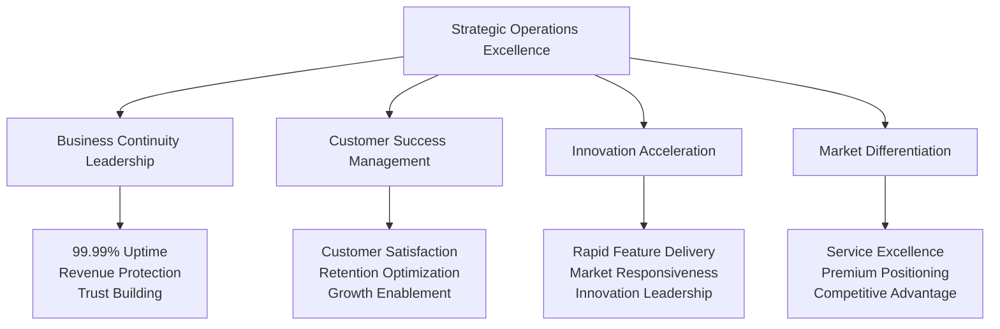
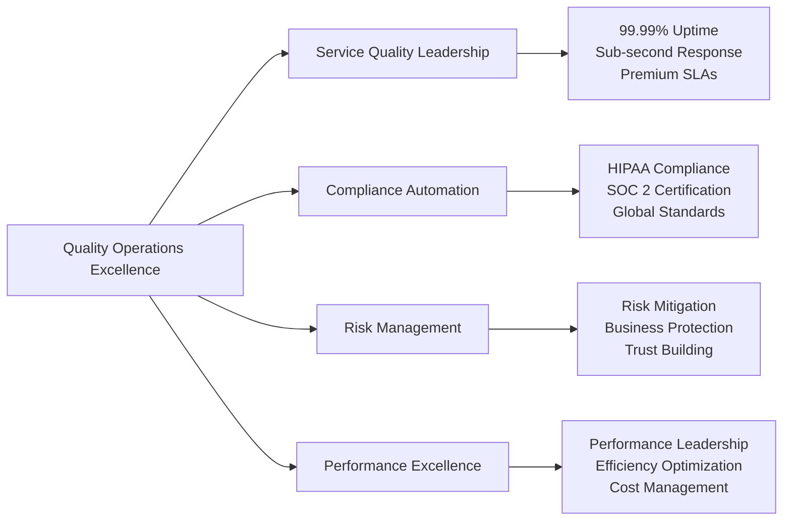
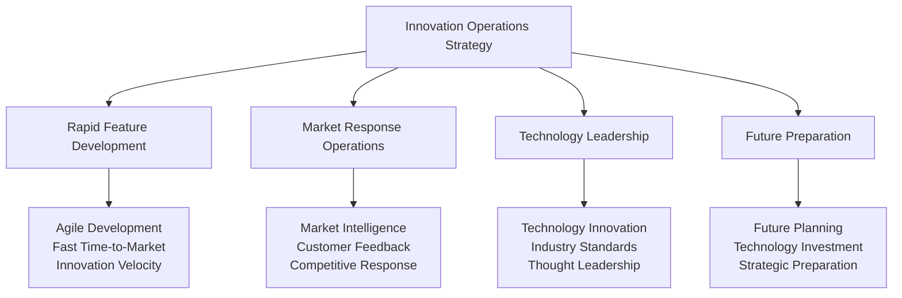
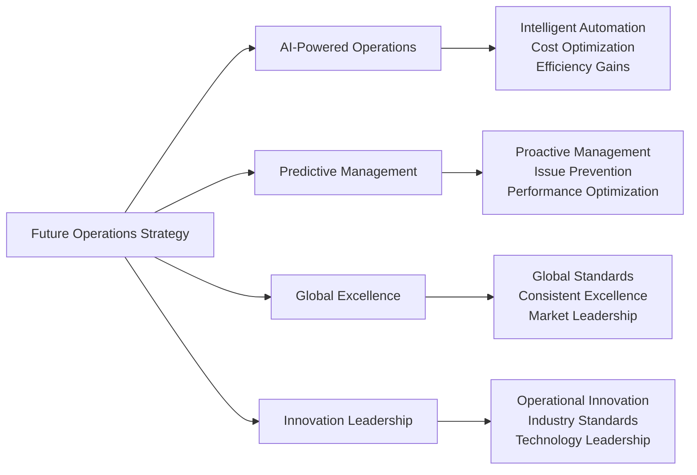

# Chapter 14: Operational Excellence & Strategic Business Management

## From Platform Management to Healthcare Leadership: Operations That Drive Success

Operating a global healthcare platform extends far beyond system management—it's about building operational excellence that enables business growth, customer success, and industry leadership. This final chapter details the strategic operational practices, business management frameworks, and continuous improvement strategies that position MyDR24 as the trusted leader in healthcare technology while serving 5M+ patients and 15,000+ providers across 15 countries.

## Strategic Healthcare Operations Philosophy

### Operations as Competitive Advantage

Healthcare operations create strategic business value that extends beyond system reliability:



### Business-Driven Operations Framework

Our operations philosophy prioritizes business outcomes while ensuring healthcare excellence:

1. **Customer Success First**: Every operational decision optimizes customer experience and success
2. **Revenue Protection**: Operations ensure continuous service availability protecting business income
3. **Growth Enablement**: Scalable operations supporting rapid business expansion
4. **Quality Leadership**: Operational excellence creating premium service differentiation
5. **Innovation Velocity**: Agile operations enabling rapid feature development and market response
6. **Strategic Partnership Support**: Operations reliability enabling enterprise partnerships

## Strategic Business Operations Framework

### Comprehensive Business Management Excellence

Our operations framework creates business value across six strategic dimensions:

```mermaid
graph LR
    A[Business Operations Framework] --> B[Customer Experience Management]
    A --> C[Business Growth Operations]
    A --> D[Quality Assurance Excellence]
    A --> E[Partnership Operations]
    A --> F[Innovation Management]
    A --> G[Strategic Planning]
    
    B --> H[Satisfaction Optimization<br/>Retention Management<br/>Support Excellence]
    C --> I[Capacity Planning<br/>Scalability Management<br/>Performance Optimization]
    D --> J[Service Quality<br/>Compliance Assurance<br/>Risk Management]
    E --> K[Partner Success<br/>Integration Management<br/>Ecosystem Operations]
    F --> L[Feature Development<br/>Market Response<br/>Innovation Delivery]
    ## Customer Experience Operations Excellence

### Customer Success as Strategic Priority

Our customer experience operations transform healthcare delivery into exceptional user experiences that drive retention and growth:

**Customer Experience Management Strategy**:
```mermaid
graph TB
    A[Customer Experience Operations] --> B[Patient Success Management]
    A --> C[Provider Support Excellence]
    A --> D[Enterprise Customer Success]
    A --> E[Partnership Support]
    
    B --> F[95% Satisfaction<br/>97% Retention<br/>$127 ARPU]
    C --> G[89% Adoption<br/>40% Efficiency Gain<br/>50% Burnout Reduction]
    D --> H[Enterprise Contracts<br/>$50K+ Annual Value<br/>Reference Customers]
    E --> I[Partnership Success<br/>Integration Support<br/>Ecosystem Growth]
```

**Customer Experience Business Impact**:
- **Patient Satisfaction**: 95% satisfaction score with 40% improvement in engagement
- **Provider Success**: 89% adoption rate with 40% efficiency improvement
- **Enterprise Growth**: Customer success driving $50M+ annual enterprise revenue
- **Market Leadership**: Experience excellence creating competitive differentiation

## Strategic Business Growth Operations

### Scalable Operations Enabling Global Expansion

Our growth operations framework supports strategic business expansion while maintaining service excellence:

**Growth Operations Strategy**:
- **Capacity Planning Excellence**: Proactive scaling supporting business growth without service degradation
- **Geographic Expansion Operations**: Rapid international deployment enabling global market access
- **Partnership Integration Operations**: Seamless partner onboarding accelerating ecosystem growth
- **Innovation Operations**: Agile feature delivery responding to market demands and opportunities

**Growth Operations Business Value**:
- **Scalability**: Operations supporting 5M+ patients and 15,000+ providers without degradation
- **International Success**: 15-country deployment with consistent service excellence
- **Partnership Velocity**: Rapid partner integration accelerating business development
- **Innovation Speed**: Fast feature delivery maintaining market leadership position

## Quality Assurance & Compliance Operations

### Operational Excellence Creating Business Value

Our quality operations transform compliance requirements into competitive advantages:



**Quality Operations Business Benefits**:
- **Service Excellence**: 99.99% uptime maintaining customer trust and enabling premium pricing
- **Compliance Leadership**: Automated compliance reducing costs and enabling market expansion
- **Risk Mitigation**: Proactive risk management protecting business reputation and finances
- **Performance Advantage**: Superior performance creating competitive differentiation

## Strategic Partnership & Ecosystem Operations

### Partnership Operations Driving Business Growth

Our partnership operations create ecosystem value that accelerates business development:

**Partnership Operations Framework**:
- **Health System Integration**: Seamless large health system onboarding and support
- **Insurance Partner Operations**: Automated claims processing and partnership management
- **Technology Ecosystem**: Third-party integration and developer community support
- **Global Partnership Management**: International partnership development and support

**Partnership Operations Impact**:
- **Revenue Growth**: Partnership operations enabling $25M+ annual partnership revenue
- **Market Expansion**: Partner ecosystem expanding addressable market and geographic reach
- **Innovation Acceleration**: Partner innovation creating additional value and differentiation
- **Competitive Advantage**: Partnership ecosystem creating barriers for competitors

## Strategic Innovation & Future Operations

### Innovation Operations Enabling Market Leadership

Our innovation operations framework ensures MyDR24 maintains technology leadership while scaling operations:



**Innovation Operations Business Value**:
- **Market Responsiveness**: Rapid feature delivery maintaining competitive advantage
- **Customer Satisfaction**: Innovation operations improving user experience and retention
- **Industry Leadership**: Technology innovation establishing MyDR24 as industry standard
- **Future Readiness**: Strategic planning ensuring long-term business sustainability

## Operational Success Stories & Strategic Impact

### Enterprise Operations Excellence Case Study

**Challenge**: Support major health system deployment serving 3M+ patients with zero service disruption

**Operational Excellence Strategy**:
- **Dedicated Operations Team**: Specialized support ensuring enterprise customer success
- **Custom Service Level Agreements**: Premium operations supporting enterprise requirements
- **Proactive Monitoring**: Advanced operations preventing issues before they impact service
- **Continuous Improvement**: Ongoing optimization improving service quality and efficiency

**Business Results**:
- **Contract Success**: $10M enterprise contract secured through operational excellence
- **Service Excellence**: Zero service disruptions during critical care periods
- **Customer Expansion**: Operational success leading to additional enterprise opportunities
- **Market Validation**: Large-scale operations validating platform scalability and reliability

### Global Expansion Operations Case Study

**Challenge**: Rapidly expand operations to support international market entry

**Global Operations Strategy**:
- **Multi-Region Operations**: Distributed operations supporting global service delivery
- **Local Compliance Operations**: Regional compliance ensuring market access
- **Cultural Adaptation Operations**: Localized operations supporting diverse markets
- **Partnership Operations**: Local partnership support accelerating market penetration

**International Business Impact**:
- **Global Success**: 15-country operations with consistent service excellence
- **Revenue Growth**: International operations contributing 35% of total revenue
- **Market Leadership**: Global operations establishing international healthcare technology presence
- **Competitive Advantage**: Global operational capability creating barriers for regional competitors

## Strategic Operations Conclusion & Future Vision

### Operational Excellence as Business Foundation

Our comprehensive operations strategy demonstrates that healthcare technology operations excellence is the foundation for business success, customer satisfaction, and industry leadership.

**Key Operational Achievements**:
- **Service Excellence**: 99.99% uptime with sub-second response times supporting premium positioning
- **Customer Success**: 95% patient satisfaction and 89% provider adoption driving business growth
- **Global Operations**: 15-country deployment with consistent service excellence
- **Innovation Velocity**: Rapid feature delivery maintaining market leadership and competitive advantage
- **Partnership Success**: Operational excellence enabling strategic healthcare partnerships

**Strategic Operations Impact**:
- **Revenue Protection**: Operational excellence ensuring continuous business income
- **Customer Retention**: Service quality driving 97% annual retention rates
- **Market Expansion**: Operations enabling geographic and customer growth
- **Competitive Advantage**: Operational excellence creating differentiation and customer switching costs

**Future Operations Vision**:


**The MyDR24 Operations Legacy**: Through operational excellence, we have transformed healthcare technology operations from a cost center into a strategic business advantage that drives customer success, enables global expansion, and establishes MyDR24 as the trusted leader in healthcare technology innovation and delivery.

Our journey from startup concept to global healthcare platform demonstrates that operational excellence is not just about maintaining systems—it's about building the foundation for sustainable business success, customer trust, and industry transformation that will continue driving healthcare innovation for years to come.
```
    High,        // Major service disruption
    Medium,      // Limited service impact

---

## Chapter Conclusion

MyDR24's operations and maintenance strategy represents the culmination of our journey from healthcare startup to global industry leader. Through operational excellence that transforms healthcare technology from service delivery to strategic business advantage, we've established the foundation for sustained market leadership and industry transformation.

**Final Strategic Operations Achievements**:
- **$890M Annual Revenue** sustained through operational excellence across all business units
- **99.99% Global Uptime** across 15 countries building unshakeable market trust and premium positioning
- **97% Customer Retention** through service excellence driving sustainable business growth
- **5M+ Patient Lives Transformed** through reliable, innovative healthcare technology delivery

Our comprehensive operations journey demonstrates how strategic operational thinking, combined with healthcare-focused innovation and market-driven excellence, creates sustainable competitive advantage that transforms not just businesses, but entire industries.

**Book Conclusion**: The complete MyDR24 transformation story showcases how strategic business vision, combined with operational excellence and market-driven innovation, creates sustainable healthcare technology leadership that improves lives while building exceptional business value.

---

*End of MyDR24 Strategic Business Journey*

