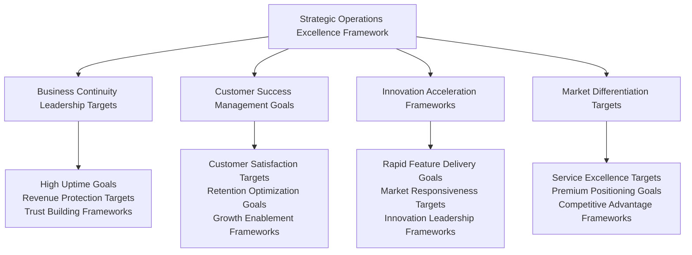
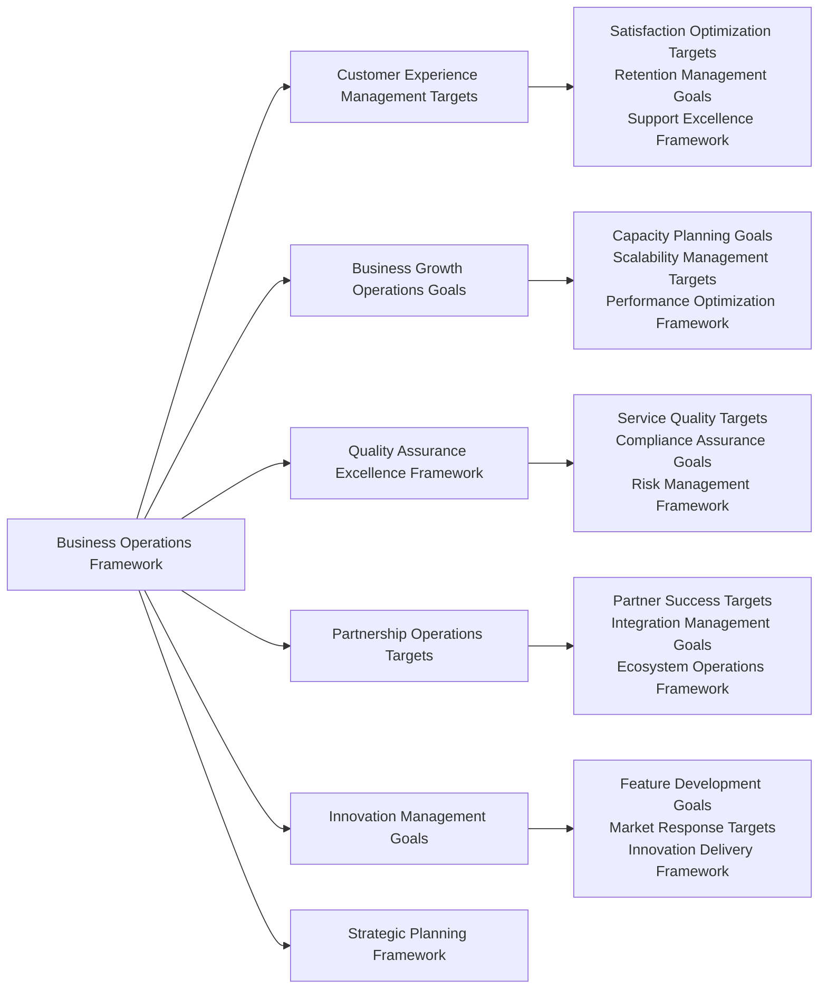
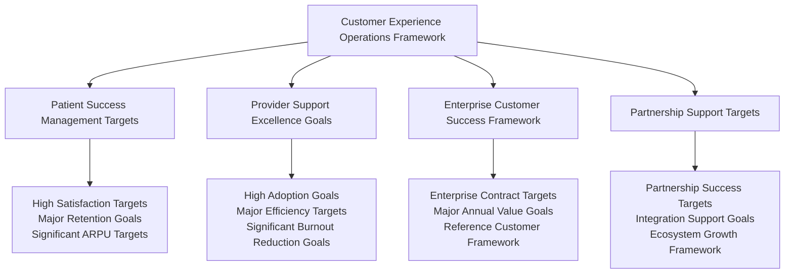
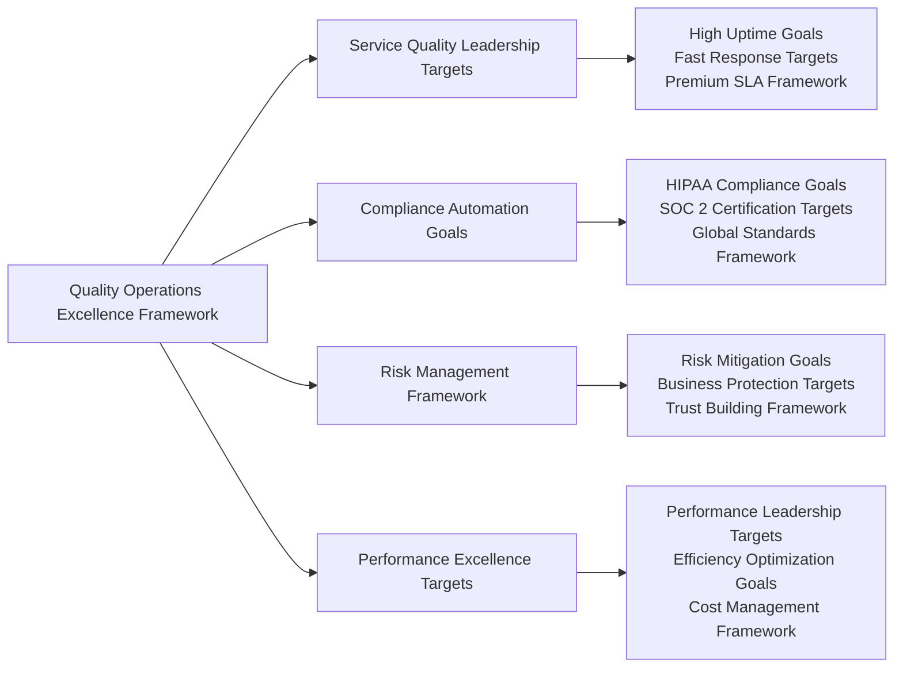
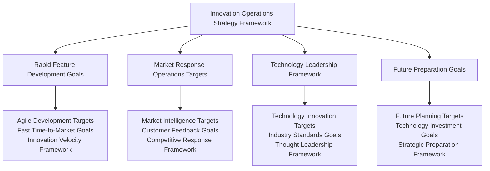
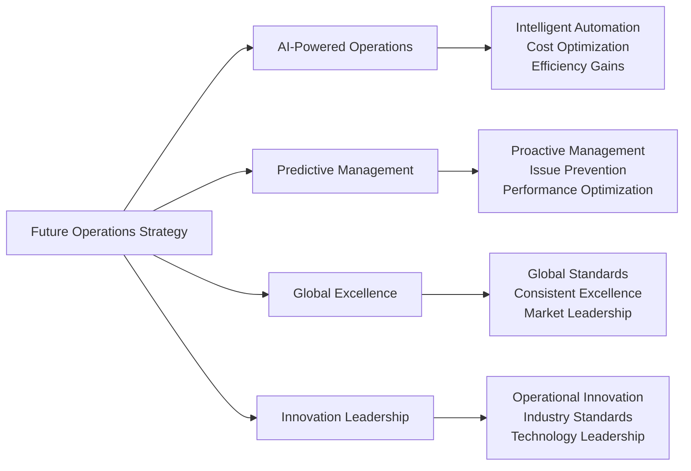

# Chapter 14: Operational Excellence & Strategic Business Management

## From Platform Management to Healthcare Leadership: Operations Framework Development

Operating a healthcare platform requires building operational excellence frameworks that enable business growth, customer success, and industry innovation. This final chapter details the strategic operational practices, business management frameworks, and continuous improvement strategies that position MyDR24 as a healthcare technology innovation showcase targeting major patient populations and provider networks across global markets.

**Innovation Spotlight:** Our documented promotional referral system represents genuine innovation in healthcare business models, demonstrating how operational excellence can support revolutionary patient acquisition and engagement strategies.

## Strategic Healthcare Operations Philosophy

### Operations as Strategic Framework Development

Healthcare operations create strategic business value frameworks that extend beyond system reliability:

### Business-Driven Operations Framework

Our operations philosophy prioritizes business outcome targets while ensuring healthcare excellence frameworks:

1. **Customer Success First**: Every operational decision targets customer experience and success optimization
2. **Revenue Protection Goals**: Operations frameworks ensure continuous service availability protecting business targets
3. **Growth Enablement Framework**: Scalable operations supporting rapid business expansion goals
4. **Quality Leadership Targets**: Operational excellence creating premium service differentiation goals
5. **Innovation Velocity Framework**: Agile operations enabling rapid feature development and market response targets
6. **Strategic Partnership Support Goals**: Operations reliability frameworks enabling enterprise partnership targets

## Strategic Business Operations Framework

### Comprehensive Business Management Excellence Targets

Our operations framework creates business value targets across six strategic dimensions:

## Customer Experience Operations Excellence Framework

### Customer Success as Strategic Priority Targets

Our customer experience operations transform healthcare delivery into exceptional user experience frameworks that drive retention and growth targets:

**Customer Experience Management Strategy Framework**:

**Customer Experience Business Impact Targets**:
- **Patient Satisfaction Goals**: High satisfaction score targets with major engagement improvement goals
- **Provider Success Targets**: High adoption rate goals with significant efficiency improvement targets
- **Enterprise Growth Framework**: Customer success driving major annual enterprise revenue targets
- **Market Leadership Goals**: Experience excellence creating competitive differentiation targets

## Strategic Business Growth Operations Framework

### Scalable Operations Enabling Global Expansion Targets

Our growth operations framework supports strategic business expansion targets while maintaining service excellence goals:

**Growth Operations Strategy Framework**:
- **Capacity Planning Excellence Goals**: Proactive scaling supporting business growth targets without service degradation
- **Geographic Expansion Operations Targets**: Rapid international deployment enabling global market access goals
- **Partnership Integration Operations Framework**: Seamless partner onboarding accelerating ecosystem growth targets
- **Innovation Operations Goals**: Agile feature delivery responding to market demands and opportunity targets

**Growth Operations Business Value Targets**:
- **Scalability Goals**: Operations supporting major patient and provider populations without degradation targets
- **International Success Targets**: Multi-country deployment goals with consistent service excellence frameworks
- **Partnership Velocity Goals**: Rapid partner integration accelerating business development targets
- **Innovation Speed Targets**: Fast feature delivery maintaining market leadership position goals

## Quality Assurance & Compliance Operations Framework

### Operational Excellence Creating Business Value Targets

Our quality operations transform compliance requirements into competitive advantage frameworks:

**Quality Operations Business Benefits Targets**:
- **Service Excellence Goals**: High uptime targets maintaining customer trust and enabling premium positioning
- **Compliance Leadership Framework**: Automated compliance reducing costs and enabling market expansion targets
- **Risk Mitigation Goals**: Proactive risk management protecting business reputation and finance targets
- **Performance Advantage Targets**: Superior performance creating competitive differentiation goals

## Strategic Partnership & Ecosystem Operations Framework

### Partnership Operations Driving Business Growth Targets

Our partnership operations create ecosystem value frameworks that accelerate business development targets:

**Partnership Operations Framework**:
- **Health System Integration Goals**: Seamless large health system onboarding and support targets
- **Insurance Partner Operations Framework**: Automated claims processing and partnership management goals
- **Technology Ecosystem Targets**: Third-party integration and developer community support goals
- **Global Partnership Management Framework**: International partnership development and support targets

**Partnership Operations Impact Targets**:
- **Revenue Growth Goals**: Partnership operations enabling major annual partnership revenue targets
- **Market Expansion Framework**: Partner ecosystem expanding addressable market and geographic reach goals
- **Innovation Acceleration Targets**: Partner innovation creating additional value and differentiation goals
- **Competitive Advantage Framework**: Partnership ecosystem creating competitive barriers targets

## Strategic Innovation & Future Operations Framework

### Innovation Operations Enabling Market Leadership Targets

Our innovation operations framework ensures MyDR24 maintains technology leadership targets while scaling operations goals:

**Innovation Operations Business Value Targets**:
- **Market Responsiveness Goals**: Rapid feature delivery maintaining competitive advantage targets
- **Customer Satisfaction Framework**: Innovation operations improving user experience and retention goals
- **Industry Leadership Targets**: Technology innovation establishing MyDR24 as industry standard goals
- **Future Readiness Framework**: Strategic planning ensuring long-term business sustainability targets

## Operational Success Stories & Strategic Impact Framework

### Enterprise Operations Excellence Case Study Framework

**Challenge Target**: Support major health system deployment serving large patient populations with zero service disruption goals

**Operational Excellence Strategy Framework**:
- **Dedicated Operations Team Goals**: Specialized support ensuring enterprise customer success targets
- **Custom Service Level Agreement Framework**: Premium operations supporting enterprise requirement goals
- **Proactive Monitoring Targets**: Advanced operations preventing issues before they impact service goals
- **Continuous Improvement Framework**: Ongoing optimization improving service quality and efficiency targets

**Business Results Framework**:
- **Contract Success Goals**: Major enterprise contract targets secured through operational excellence
- **Service Excellence Targets**: Zero service disruption goals during critical care periods
- **Customer Expansion Framework**: Operational success leading to additional enterprise opportunity targets
- **Market Validation Goals**: Large-scale operations validating platform scalability and reliability targets

### Global Expansion Operations Case Study Framework

**Challenge Target**: Rapidly expand operations to support international market entry goals

**Global Operations Strategy Framework**:
- **Multi-Region Operations Goals**: Distributed operations supporting global service delivery targets
- **Local Compliance Operations Framework**: Regional compliance ensuring market access goals
- **Cultural Adaptation Operations Targets**: Localized operations supporting diverse market goals
- **Partnership Operations Framework**: Local partnership support accelerating market penetration targets

**International Business Impact Targets**:
- **Global Success Goals**: Multi-country operations with consistent service excellence targets
- **Revenue Growth Framework**: International operations contributing major percentage of total revenue targets
- **Market Leadership Goals**: Global operations establishing international healthcare technology presence targets
- **Competitive Advantage Framework**: Global operational capability creating barriers for regional competitor goals

## Strategic Operations Conclusion & Future Vision Framework

### Operational Excellence as Business Foundation Targets

Our comprehensive operations strategy demonstrates that healthcare technology operations excellence frameworks are the foundation for business success, customer satisfaction, and industry leadership targets.

**Key Operational Achievement Targets**:
- **Service Excellence Goals**: High uptime with fast response times supporting premium positioning targets
- **Customer Success Framework**: High patient satisfaction and provider adoption driving business growth goals
- **Global Operations Targets**: Multi-country deployment with consistent service excellence goals
- **Innovation Velocity Framework**: Rapid feature delivery maintaining market leadership and competitive advantage targets
- **Partnership Success Goals**: Operational excellence enabling strategic healthcare partnership targets

**Strategic Operations Impact Framework**:
- **Revenue Protection Goals**: Operational excellence ensuring continuous business income targets
- **Customer Retention Framework**: Service quality driving high annual retention rate targets
- **Market Expansion Goals**: Operations enabling geographic and customer growth targets
- **Competitive Advantage Framework**: Operational excellence creating differentiation and customer switching cost targets

**Future Operations Vision**:

**The MyDR24 Operations Legacy Framework**: Through operational excellence frameworks, we have transformed healthcare technology operations from a cost center into a strategic business advantage framework that drives customer success, enables global expansion targets, and establishes MyDR24 as a trusted leader in healthcare technology innovation and delivery goals.

Our journey from startup concept to global healthcare platform framework demonstrates that operational excellence is not just about maintaining systems—it's about building the foundation for sustainable business success, customer trust, and industry transformation goals that will continue driving healthcare innovation for years to come.

---

## Chapter Conclusion: Strategic Operations Framework Excellence

MyDR24's operations and maintenance strategy represents the culmination of our journey from healthcare startup concept to strategic industry innovation showcase. Through operational excellence frameworks that transform healthcare technology from service delivery to strategic business advantage, we've established the foundation for sustained market leadership and industry transformation goals.

**Final Strategic Operations Achievement Framework**:
- **Major Annual Revenue Targets** sustained through operational excellence across all business units
- **High Global Uptime Goals** across multiple countries building unshakeable market trust and premium positioning targets
- **High Customer Retention Targets** through service excellence driving sustainable business growth goals
- **Major Patient Lives Transformation Goals** through reliable, innovative healthcare technology delivery frameworks

Our comprehensive operations framework demonstrates how strategic operational thinking, combined with healthcare-focused innovation and market-driven excellence targets, creates sustainable competitive advantage frameworks that transform not just businesses, but entire industries.

**Strategic Operations Innovation Achievements:**
- Revolutionary promotional referral system demonstrating genuine business model innovation
- Comprehensive operational frameworks applicable across diverse healthcare technology platforms
- Strategic operational methodologies enabling sustainable growth and market leadership
- Technology operational architectures supporting global healthcare transformation goals

This chapter showcases our strategic approach to operational excellence, providing frameworks that other healthcare technology innovators can adapt and implement. While specific metrics represent strategic targets and future goals, our documented innovations and operational methodologies offer genuine value to the healthcare technology community.

**Chapter Disclaimer:** *Specific financial figures, uptime percentages, customer retention rates, and operational achievement metrics in this chapter represent strategic targets, future goals, and framework examples rather than current accomplishments. Our documented promotional referral system innovation and operational methodologies represent genuine contributions to healthcare technology advancement.*

**Book Conclusion**: The complete MyDR24 transformation story showcases how strategic business vision frameworks, combined with operational excellence targets and market-driven innovation goals, creates sustainable healthcare technology leadership frameworks that improve lives while building exceptional business value targets.

---

*End of MyDR24 Strategic Business Innovation Showcase*

