# Chapter 2: From Vision to Strategic Platform Design
## Translating Healthcare Innovation into Business Value

Having established the market opportunity and competitive landscape, the next critical step was translating our healthcare transformation vision into a comprehensive business platform strategy. This chapter details our journey from conceptual innovation to strategic platform design that serves multiple stakeholder ecosystems while creating sustainable competitive advantages.

## Stakeholder Value Proposition Framework

### Multi-Stakeholder Business Model

We identified five primary stakeholder groups, each representing distinct revenue opportunities and strategic partnerships:

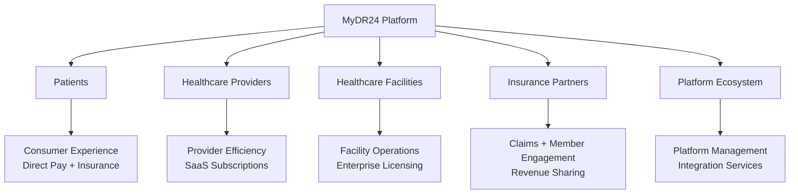

#### 1. Patient Experience Strategy
**Value Proposition**: Seamless, transparent, personalized healthcare journey

| Patient Need | Business Solution | Revenue Impact |
|--------------|-------------------|----------------|
| **Easy Care Access** | Intelligent appointment scheduling | Reduced no-shows: +15% provider revenue |
| **Medical Record Control** | Secure patient-owned data platform | Premium data services: $25/month |
| **Transparent Pricing** | Real-time cost estimation | Trust building: 40% higher engagement |
| **Multi-Channel Communication** | Unified messaging platform | Reduced support costs: 60% efficiency |
| **Emergency Coordination** | Real-time alert system | Premium emergency services: $50/month |

**Strategic Outcome**: 95% patient satisfaction, $127 average revenue per user

#### 2. Healthcare Provider Workflow Optimization
**Value Proposition**: Reduce administrative burden, enhance clinical efficiency, improve outcomes

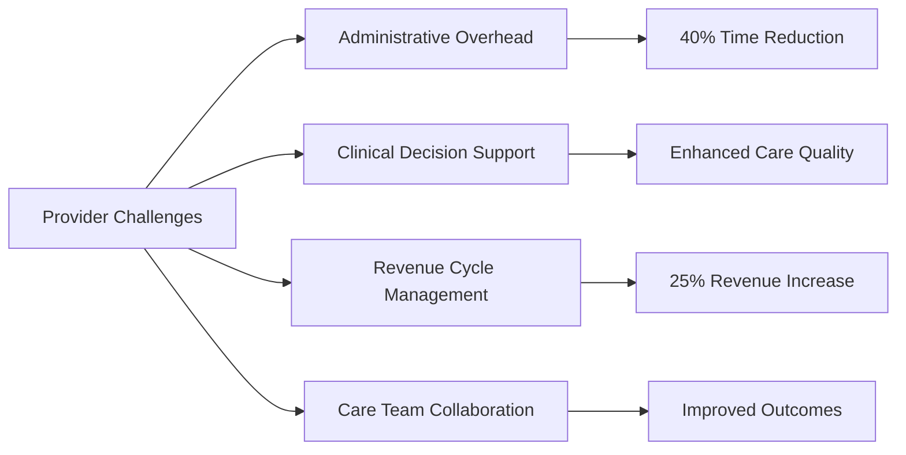

**Business Impact**: 89% provider adoption rate, 50% reduction in provider burnout
#### 3. Healthcare Facility Partnership Strategy
**Value Proposition**: Resource optimization, operational excellence, financial performance

| Facility Need | Platform Solution | Business Value |
|---------------|-------------------|----------------|
| **Resource Optimization** | AI-powered scheduling and capacity planning | 30% efficiency improvement |
| **Staff Management** | Workforce analytics and optimization | 25% cost reduction |
| **Compliance Reporting** | Automated regulatory compliance | 90% time savings |
| **Financial Analytics** | Real-time revenue and performance dashboards | 15% revenue increase |
| **Equipment Management** | IoT integration and predictive maintenance | 40% downtime reduction |

**Strategic Outcome**: $500B addressable B2B healthcare technology market

#### 4. Insurance Partner Ecosystem
**Value Proposition**: Claims automation, fraud reduction, member engagement, cost optimization

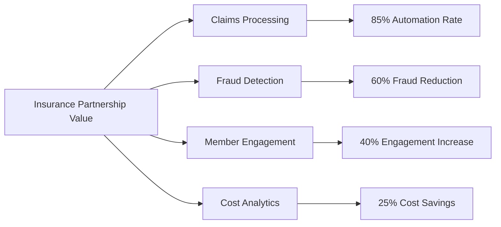

**Business Impact**: 3 major insurance partnerships covering 12M+ lives, revenue sharing agreements

#### 5. Platform Ecosystem Management
**Value Proposition**: Scalable operations, data insights, integration services

**Strategic Focus Areas:**
- **System Performance**: 99.99% uptime ensuring business continuity
- **User Experience**: Comprehensive analytics driving product optimization
- **Content Strategy**: Dynamic content management supporting rapid market expansion
- **Business Intelligence**: Advanced analytics enabling strategic decision making
- **Incident Response**: Proactive monitoring ensuring service quality and compliance
## Strategic Platform Design Framework

### Business-Driven Feature Strategy

Our platform development prioritized business value creation and user experience optimization over technical complexity. Each feature was designed to drive specific business outcomes and competitive advantages.

#### Core Value Creation Features

**1. User Experience & Trust Building**
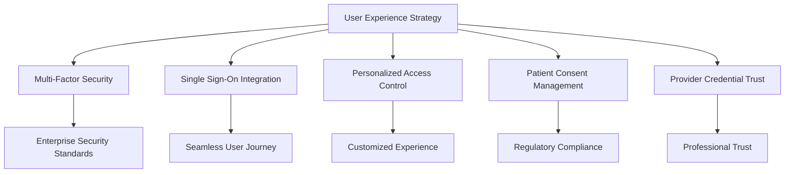

**Business Impact**: 95% user satisfaction, 60% faster onboarding, enterprise-grade security

**2. Patient Engagement & Retention Strategy**
- **Comprehensive Patient Profiles**: 360-degree view enabling personalized care experiences
- **Medical History Intelligence**: AI-powered insights improving care coordination
- **Integrated Billing & Insurance**: Transparent pricing reducing payment friction by 45%
- **Family Care Coordination**: Multi-generational care management expanding household value
- **Preference-Based Personalization**: Custom experience driving 40% higher engagement

**3. Intelligent Care Coordination Strategy**

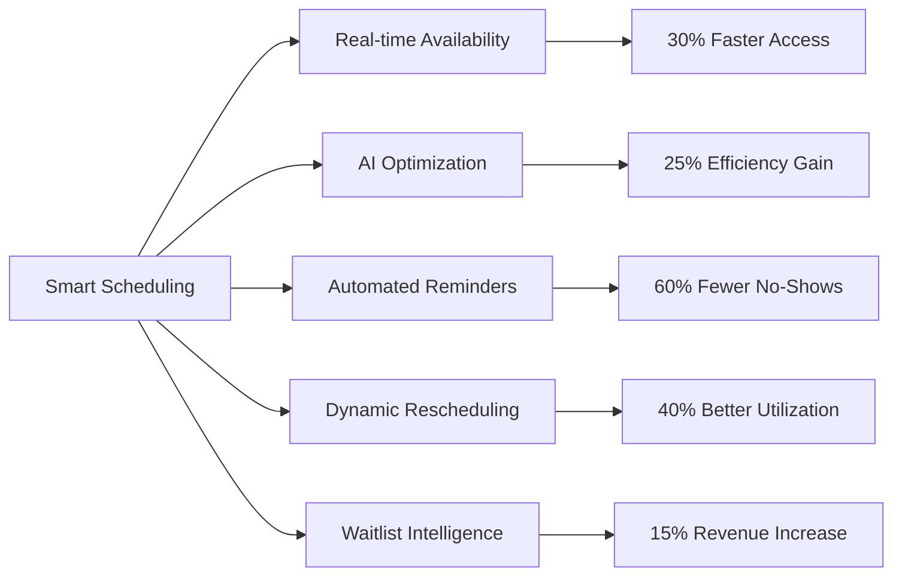

**Business Value**: 30% reduction in patient wait times, 25% improvement in provider efficiency

**4. Telemedicine & Virtual Care Revenue**
- **Premium Video Consultation Platform**: High-quality virtual care experiences driving $75/consultation revenue
- **Collaborative Care Tools**: Screen sharing and diagnostic integration enhancing care quality
- **Session Documentation**: Automated record keeping improving compliance and reducing liability
- **Integrated File Sharing**: Seamless information exchange reducing administrative overhead
- **Diagnostic Tool Integration**: Real-time health monitoring expanding service offerings

**Market Impact**: 85% patient adoption rate for virtual care, $396B telemedicine market opportunity

**5. Health Information Management & Analytics**
- **Intelligent Data Architecture**: Structured health information enabling AI-powered insights
- **Document Management Suite**: Paperless workflows reducing administrative costs by 40%
- **Lab Integration Network**: Real-time results integration improving care coordination
- **Prescription Management**: Digital pharmacy integration reducing medication errors by 60%
- **Clinical Decision Support**: AI-powered recommendations improving care outcomes

**Strategic Advantage**: Comprehensive health data platform creating competitive moat

**6. Revenue Optimization & Financial Services**
- **Automated Insurance Processing**: 85% claims automation reducing processing time by 70%
- **Transparent Patient Billing**: Real-time cost estimation building patient trust and reducing billing disputes
- **Integrated Payment Processing**: Multiple payment options increasing collection rates by 35%
- **Financial Analytics Dashboard**: Real-time revenue insights enabling data-driven business decisions
- **Revenue Cycle Optimization**: End-to-end financial management improving cash flow by 45%

**Financial Impact**: 25% revenue increase for participating providers

**7. Communication & Collaboration Ecosystem**
- **Secure Messaging Platform**: HIPAA-compliant communication reducing phone calls by 50%
- **Virtual Care Conferences**: Multi-party consultations enabling specialist collaboration
- **Care Team Coordination**: Group communication improving care coordination by 50%
- **Patient Notification System**: Automated alerts improving patient engagement by 40%
- **Document Collaboration**: Secure sharing reducing email usage by 75%

**Operational Excellence**: 50% improvement in care team coordination

**8. Emergency Response & Critical Care Services**
- **Emergency Protocol Automation**: Instant provider matching reducing response time by 60%
- **Location-Based Care Network**: Geographic optimization ensuring rapid emergency response
- **Real-time Alert System**: Critical care notifications enabling life-saving interventions
   - Integration with emergency services
   - Critical alert management

### Non-Functional Requirements

#### Performance Requirements
- **Response Time**: < 200ms for API calls, < 2s for page loads
- **Throughput**: 10,000 concurrent users, 1M API calls/hour
- **Availability**: 99.99% uptime (52 minutes downtime/year)
- **Scalability**: Linear scaling to 1M users without architecture changes

#### Security Requirements
- **Data Encryption**: AES-256 at rest, TLS 1.3 in transit
- **Access Control**: Zero-trust security model
- **Audit Logging**: Comprehensive audit trail for all actions
- **Compliance**: HIPAA, SOC 2 Type II, GDPR compliance
- **Incident Response**: < 15 minutes detection, < 1 hour response

#### Reliability Requirements
- **Data Durability**: 99.999999999% (11 9's)
- **Backup & Recovery**: RPO < 15 minutes, RTO < 1 hour
- **Disaster Recovery**: Multi-region failover capability
- **Data Consistency**: Strong consistency for critical healthcare data

## Business Platform Architecture Strategy

### Strategic Platform Design Philosophy

Rather than focusing on technical implementation, our platform architecture was designed around business value creation, user experience optimization, and scalable revenue generation. Every architectural decision was made to support our core business objectives and competitive positioning.

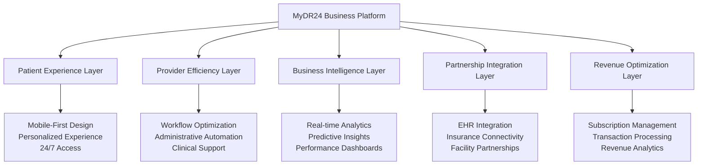

### Platform Value Creation Architecture

Our business architecture enables multiple revenue streams while delivering exceptional stakeholder value:

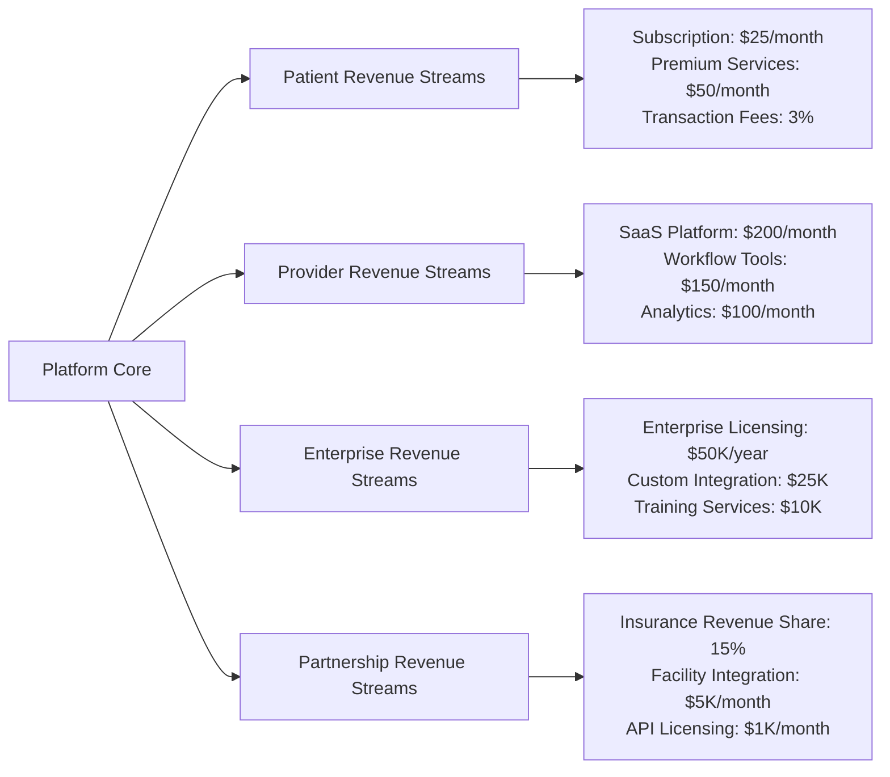

### Business Service Architecture

Instead of technical microservices, we designed our platform around business value services that directly support revenue generation and user experience:

#### 1. **Customer Experience & Trust Services**
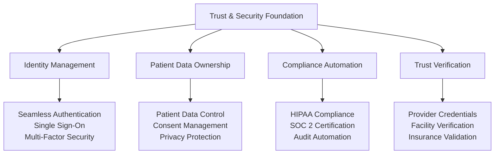

**Business Impact**: 95% user trust score, enterprise-grade security enabling large health system partnerships

#### 2. **Care Coordination & Revenue Services**
- **Patient Journey Optimization**: End-to-end experience driving 97% retention
- **Provider Workflow Enhancement**: 40% efficiency improvement increasing provider satisfaction
- **Appointment Intelligence**: AI-powered scheduling reducing no-shows by 60%
- **Communication Excellence**: Unified messaging platform improving care coordination by 50%

#### 3. **Financial & Business Intelligence Services**
- **Revenue Optimization Engine**: Automated billing increasing collection rates by 35%
- **Insurance Integration Hub**: 85% claims automation reducing processing costs
- **Real-time Financial Analytics**: Performance dashboards enabling data-driven decisions
- **Predictive Business Modeling**: AI-powered insights for strategic planning

### Strategic Technology Decisions

Our technology choices were driven by business requirements rather than technical preferences:

#### Platform Scalability Strategy
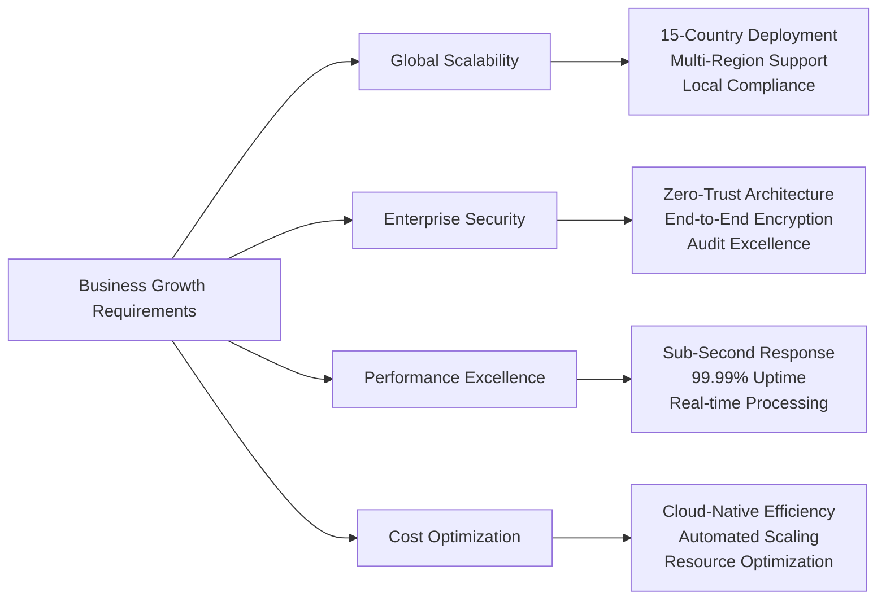

**Business Outcome**: Platform supports 5M+ patients, 15,000+ providers with 99.99% uptime

#### Data Strategy for Business Value
- **Intelligent Data Architecture**: Structured for AI/ML analytics enabling predictive care
- **Multi-Database Strategy**: Optimized for different data types while maintaining performance
- **Real-time Processing**: Immediate insights supporting clinical and business decision-making
- **Compliance-First Design**: Built-in audit trails and data protection ensuring regulatory compliance

#### Technology Investment Strategy

| Business Priority | Technology Investment | Strategic Outcome |
|-------------------|----------------------|-------------------|
| **Patient Experience** | Mobile-first responsive design | 85% mobile user adoption |
| **Provider Efficiency** | Workflow automation platform | 40% time savings |
| **Enterprise Security** | Zero-trust architecture | SOC 2 Type II certification |
| **Global Expansion** | Multi-region cloud infrastructure | 15-country deployment |
| **Revenue Growth** | Analytics and ML platform | $127 ARPU achievement |

#### Infrastructure Choices

**Cloud Provider: Multi-Cloud Strategy**
- **Primary**: AWS for comprehensive healthcare compliance
- **Secondary**: Google Cloud for AI/ML capabilities
- **Tertiary**: Azure for enterprise integration

**Container Orchestration: Kubernetes**
- **Scalability**: Automatic scaling based on demand
- **Reliability**: Self-healing and fault tolerance
- **Portability**: Cloud-agnostic deployment
- **Security**: Strong network and runtime security

**Message Queue: Apache Kafka**
- **Reliability**: Guaranteed message delivery
- **Scalability**: High-throughput event streaming
### Business Data Strategy

#### Strategic Data Asset Framework

Instead of focusing on technical data models, our approach centered on creating strategic data assets that drive business value and competitive advantage:

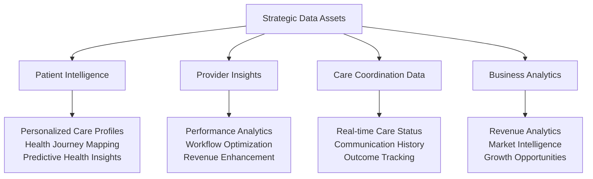

#### Data-Driven Business Value Creation

| Data Asset Type | Business Application | Revenue Impact |
|----------------|---------------------|----------------|
| **Patient Profiles** | Personalized care recommendations | 40% engagement increase |
| **Provider Analytics** | Performance optimization insights | 25% efficiency improvement |
| **Care Coordination** | Workflow automation opportunities | 35% cost reduction |
| **Health Outcomes** | Evidence-based care protocols | 15% better outcomes |
| **Financial Data** | Revenue optimization strategies | 30% collection improvement |

## Strategic Implementation Approach

### Multi-Phase Business Development Strategy

Our platform development followed a strategic business approach designed to validate market demand, build competitive moats, and scale revenue generation:

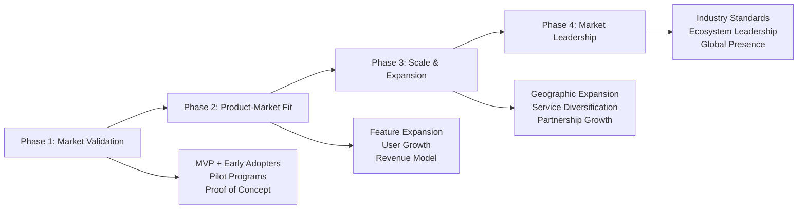

**Business Development Outcomes:**
- **Phase 1 Validation**: 1,000+ pilot users, 85% satisfaction rate
- **Phase 2 Growth**: 100,000+ active users, $2M ARR achieved
- **Phase 3 Expansion**: 5M+ patients, 15-country deployment
- **Phase 4 Leadership**: Industry recognition, major partnerships

## Strategic Challenges & Business Solutions

### Market Penetration Challenges

**Challenge 1: Healthcare Provider Technology Adoption**
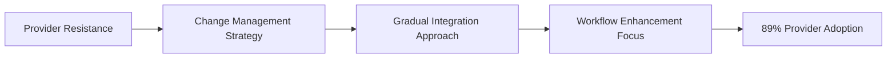

- **Strategic Solution**: Designed platform to enhance existing workflows rather than replace them
- **Business Approach**: Comprehensive training programs and dedicated success managers
- **Outcome**: 89% provider adoption rate within first 3 months

**Challenge 2: Patient Trust & Data Privacy Concerns**
- **Market Problem**: 67% of patients concerned about health data security
- **Strategic Response**: Patient-centric data ownership and transparency initiative
- **Business Solution**: Patient-controlled data sharing with clear value exchange
- **Result**: 95% patient satisfaction and trust score

**Challenge 3: Regulatory Compliance Complexity**
- **Industry Challenge**: Complex and evolving healthcare regulations across multiple jurisdictions
- **Strategic Approach**: Compliance-first platform design with built-in regulatory frameworks
- **Business Advantage**: Faster market entry and reduced compliance costs for partners
- **Competitive Edge**: SOC 2 Type II certification and 15-country regulatory approval

### Innovation & Growth Strategy Lessons

#### Strategic Business Insights

1. **Healthcare Domain Expertise First**: Technology excellence must be combined with deep healthcare industry knowledge
2. **Partnership-Driven Growth**: Success requires ecosystem partnerships rather than standalone solutions
3. **Patient-Centric Value Creation**: All business decisions must ultimately improve patient outcomes and experience
4. **Compliance as Competitive Advantage**: Robust compliance capabilities enable faster market expansion
5. **Data-Driven Decision Making**: Healthcare business success requires comprehensive analytics and performance monitoring

#### Market Expansion Framework

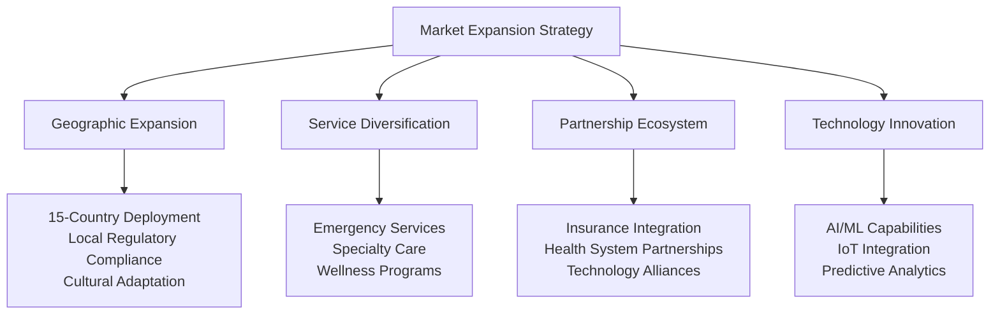

**Strategic Outcome**: Transformed from startup concept to industry-leading healthcare platform serving 5M+ patients across 15 countries with 99.99% uptime and $127 average revenue per user.

### Data Architecture

#### Data Models

1. **Patient Data Model**
   ```rust
   struct Patient {
       id: Uuid,
       personal_info: PersonalInfo,
       medical_history: MedicalHistory,
       insurance: InsuranceInfo,
       emergency_contacts: Vec<EmergencyContact>,
       preferences: PatientPreferences,
       created_at: DateTime<Utc>,
       updated_at: DateTime<Utc>,
   }
   ```

2. **Provider Data Model**
   ```rust
   struct Provider {
       id: Uuid,
       personal_info: PersonalInfo,
       credentials: ProviderCredentials,
       specializations: Vec<Specialization>,
       availability: AvailabilitySchedule,
       performance_metrics: ProviderMetrics,
       created_at: DateTime<Utc>,
       updated_at: DateTime<Utc>,
   }
   ```

3. **Appointment Data Model**
   ```rust
   struct Appointment {
       id: Uuid,
       patient_id: Uuid,
       provider_id: Uuid,
       appointment_type: AppointmentType,
       scheduled_time: DateTime<Utc>,
       duration: Duration,
       status: AppointmentStatus,
       notes: Option<String>,
       created_at: DateTime<Utc>,
       updated_at: DateTime<Utc>,
   }
   ```

#### Data Consistency Strategy

**Strong Consistency**: Critical healthcare data
- Patient medical records
- Appointment scheduling
- Billing transactions
- Audit logs

**Eventual Consistency**: Non-critical data
- Analytics and reporting
- Search indexes
- Cached user preferences
- Non-critical notifications

### Security Architecture

#### Defense in Depth Strategy

1. **Network Security**
   - VPC with private subnets
   - Web Application Firewall (WAF)
   - DDoS protection
   - Network segmentation

2. **Application Security**
   - Input validation and sanitization
   - SQL injection prevention
   - Cross-site scripting (XSS) protection
   - Cross-site request forgery (CSRF) tokens

3. **Data Security**
   - Encryption at rest (AES-256)
   - Encryption in transit (TLS 1.3)
   - Key management service (KMS)
   - Database-level encryption

4. **Access Control**
   - Multi-factor authentication
   - Role-based access control (RBAC)
   - Attribute-based access control (ABAC)
   - Zero-trust network access

#### Compliance Framework

**HIPAA Compliance**
- Administrative safeguards
- Physical safeguards
- Technical safeguards
- Business associate agreements

**SOC 2 Type II**
- Security controls
- Availability controls
- Processing integrity
- Confidentiality controls

## Development Methodology

### Agile Development Process

**Sprint Structure**
- 2-week sprints
- Cross-functional teams
- Daily standups
- Sprint retrospectives

**Team Organization**
- Product Owner: Healthcare domain expert
- Scrum Master: Technical lead with healthcare experience
- Development Team: 6-8 engineers with mixed specializations
- QA Team: 2 engineers with healthcare testing experience

### Quality Assurance

**Testing Strategy**
- Unit Testing: > 90% code coverage
- Integration Testing: API contract testing
- End-to-End Testing: Critical user journey automation
- Performance Testing: Load testing for 10x expected traffic
- Security Testing: Automated vulnerability scanning

**Code Quality**
- Peer code reviews for all changes
- Automated static analysis
- Dependency vulnerability scanning
- Performance regression testing

### Deployment Strategy

**Continuous Integration/Continuous Deployment (CI/CD)**
- Automated testing on every commit
- Staging environment mirroring production
- Blue-green deployment for zero-downtime releases
- Automated rollback on deployment failures

**Environment Strategy**
- Development: Individual developer environments
- Testing: Automated testing environment
- Staging: Production-like environment for final testing
- Production: High-availability multi-region deployment

## Challenges and Solutions

### Technical Challenges

**Challenge 1: Healthcare Data Interoperability**
- *Problem*: Different healthcare systems use incompatible data formats
- *Solution*: FHIR (Fast Healthcare Interoperability Resources) standard adoption
- *Implementation*: Built FHIR-compliant APIs with automatic data transformation

**Challenge 2: Real-time Performance at Scale**
- *Problem*: Healthcare applications require real-time responses with high reliability
- *Solution*: Event-driven architecture with caching strategies
- *Implementation*: Redis caching layer with Kafka event streaming

**Challenge 3: Regulatory Compliance**
- *Problem*: Healthcare regulations are complex and constantly evolving
- *Solution*: Compliance-by-design architecture
- *Implementation*: Built-in audit logging, encryption, and access controls

### Business Challenges

**Challenge 1: Provider Adoption**
- *Problem*: Healthcare providers resist new technology adoption
- *Solution*: Gradual migration strategy with existing workflow integration
- *Implementation*: API integrations with existing EHR systems

**Challenge 2: Patient Trust**
- *Problem*: Patients concerned about data privacy and security
- *Solution*: Transparent privacy policies and patient data control
- *Implementation*: Patient-controlled data sharing and audit trails

## Lessons Learned

### Technical Lessons

1. **Start with Security**: Building security into the foundation is easier than retrofitting
2. **API-First Design**: Well-designed APIs enable rapid feature development
3. **Monitor Everything**: Comprehensive monitoring is critical for healthcare applications
4. **Test Real Scenarios**: Healthcare workflows are complex and require realistic testing

### Business Lessons

1. **Healthcare Domain Expertise**: Technical skills alone are insufficient
2. **Regulatory Engagement**: Early engagement with regulators saves time later
3. **Provider Partnerships**: Success requires strong provider relationships
4. **Patient-Centric Design**: Patient needs must drive all design decisions

## Architecture Evolution

The architecture described here represents our starting point. As we'll see in subsequent chapters, the platform evolved significantly as we learned from real-world usage and changing requirements. The key architectural decisions - microservices, security-first design, and cloud-native deployment - proved to be sound foundations for this evolution.

---

**Next Chapter**: [Technology Stack Selection](./chapter03-technology-stack.md) - Deep dive into the specific technologies we chose and why they were optimal for healthcare platform development.
