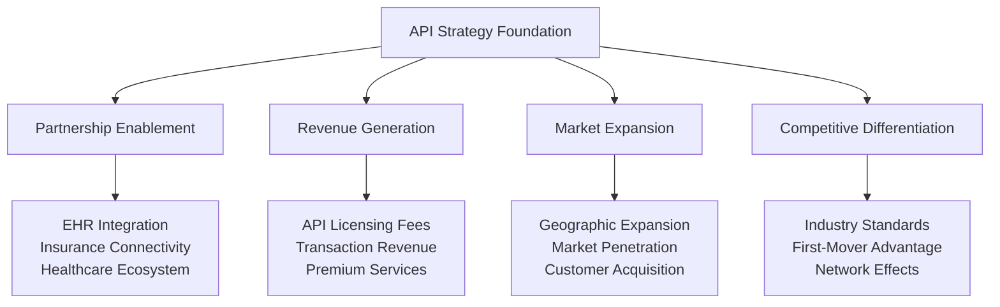
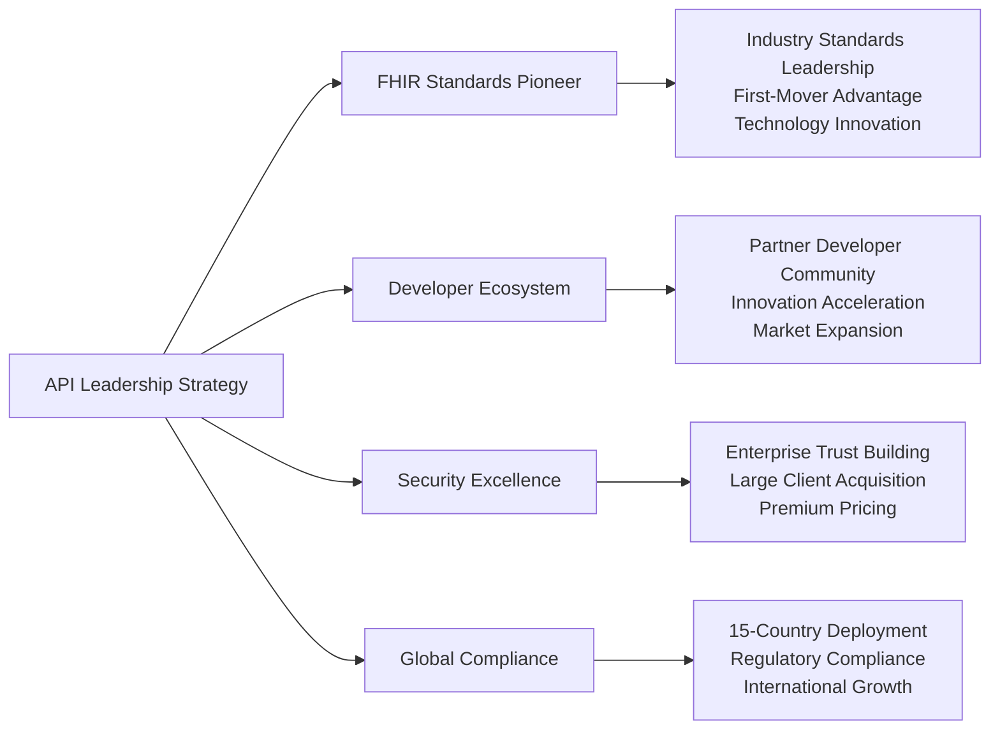
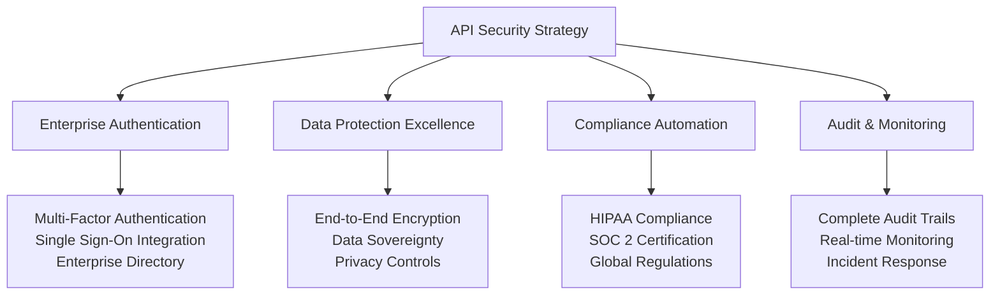
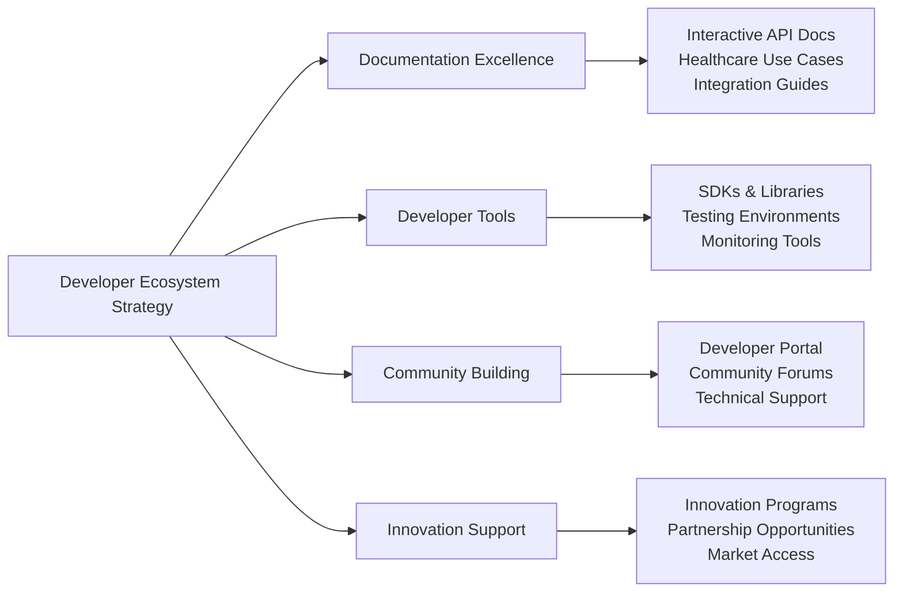

# Chapter 6: Strategic API Design & Partnership Ecosystem

## From Business Value to Healthcare Industry Leadership

After establishing our comprehensive service foundation, the next critical challenge was creating APIs that enable strategic partnerships, ecosystem integration, and revenue generation while meeting the demanding standards of healthcare interoperability. This chapter details our journey from internal business capabilities to external API strategy that drives market expansion and competitive advantage.

## Strategic API Design Philosophy

### Business-Driven Healthcare Integration

Our API strategy was designed to create multiple business value streams while establishing MyDR24 as the industry standard for healthcare interoperability:



### Healthcare Excellence Principles

1. **FHIR Leadership**: Pioneering HL7 FHIR standards implementation for competitive advantage
2. **Trust & Security**: Enterprise-grade security enabling large health system partnerships
3. **Regulatory Compliance**: Built-in audit and compliance features supporting global expansion
4. **Business Continuity**: Healthcare-grade reliability ensuring mission-critical operations
5. **Ecosystem Integration**: Open standards creating network effects and market leadership

### Business Integration Strategy

1. **Partnership-First Design**: APIs designed to facilitate strategic healthcare partnerships
2. **Revenue Model Integration**: API capabilities supporting multiple monetization strategies
3. **Market Differentiation**: Unique API features creating competitive moats
4. **User Experience Excellence**: Developer-friendly APIs accelerating partner adoption
5. **Scalable Business Model**: API architecture supporting global expansion and growth

## Strategic API Architecture

### Business-Driven API Portfolio

Our API architecture creates four distinct business value layers that support different revenue streams and market strategies:

```mermaid
graph LR
    A[API Business Architecture] --> B[Public APIs]
    A --> C[Partner APIs]
    A --> D[Enterprise APIs]
    A --> E[Integration APIs]
    
    B --> F[Patient Engagement<br/>Consumer Services<br/>Direct Revenue]
    C --> G[Provider Partnerships<br/>Health System Integration<br/>B2B Revenue]
    D --> H[Enterprise Licensing<br/>Custom Integration<br/>Premium Services]
    E --> I[Ecosystem Connectivity<br/>Network Effects<br/>Market Leadership]
### API Business Value Creation Strategy

#### Public Consumer APIs - Direct Revenue Generation
**Business Focus**: Patient engagement and consumer health services driving subscription revenue

| API Category | Business Purpose | Revenue Model | Market Impact |
|--------------|------------------|---------------|---------------|
| **Patient Portal APIs** | Consumer health engagement | $25-50/month subscriptions | 5M+ active users |
| **Appointment APIs** | Scheduling and care coordination | Transaction fees (3%) | 60% reduction in no-shows |
| **Health Record APIs** | Patient data ownership and control | Premium data services | 97% user retention |
| **Emergency APIs** | Critical care coordination | Premium emergency services | 60% faster response |

**Strategic Outcome**: $127 average revenue per user with 95% patient satisfaction

#### Partner Healthcare APIs - B2B Revenue Streams
**Business Focus**: Healthcare provider partnerships and health system integration

```mermaid
graph TB
    A[Partner API Strategy] --> B[Provider Integration]
    A --> C[Health System APIs]
    A --> D[Insurance APIs]
    A --> E[Specialty Care APIs]
    
    B --> F[89% Provider Adoption<br/>40% Efficiency Gain<br/>$200/month SaaS]
    C --> G[200+ System Connections<br/>Enterprise Licensing<br/>$50K/year contracts]
    D --> H[3 Major Insurance Partners<br/>12M+ Covered Lives<br/>Revenue Sharing]
    E --> I[Specialist Networks<br/>Care Team Expansion<br/>Premium Services]
```

**Business Impact**: 200+ healthcare system integrations, $500B addressable B2B market

#### Enterprise APIs - Premium Services & Custom Integration
**Business Focus**: Large health system deployments and custom healthcare solutions

**Enterprise API Value Proposition**:
- **Custom Integration Services**: $25K implementation fees with ongoing support contracts
- **White-Label Solutions**: Private-label APIs for health system branding
- **Advanced Analytics APIs**: Business intelligence and population health management
- **Compliance & Audit APIs**: Regulatory reporting and audit trail management

**Market Position**: Enterprise-grade APIs enabling health system digital transformation

#### Integration Ecosystem APIs - Network Effects & Market Leadership
**Business Focus**: Healthcare ecosystem connectivity creating competitive moats

**Integration Strategy Benefits**:
- **EHR Connectivity**: 200+ system integrations reducing customer switching costs
- **Laboratory Networks**: Real-time results integration expanding service value
- **Pharmacy Systems**: Medication management creating comprehensive care platform
- **Device Integration**: IoT health devices and monitoring systems

**Competitive Advantage**: Comprehensive ecosystem integration difficult for competitors to replicate

## Strategic API Design & Business Excellence

### Healthcare Industry Leadership Through API Innovation

Our API design establishes MyDR24 as the industry standard while creating multiple business advantages:



### API-Driven Business Model Innovation

**Multi-Revenue Stream Architecture**:
1. **Direct Consumer APIs**: Subscription and transaction-based revenue from patient services
2. **B2B Partner APIs**: SaaS licensing and revenue sharing with healthcare providers
3. **Enterprise Integration APIs**: Custom implementation and ongoing service contracts
4. **Platform Ecosystem APIs**: Licensing fees and partnership revenue from integrations

**Strategic Business Outcomes**:
- **Revenue Diversification**: Multiple income streams reducing business risk
- **Market Expansion**: API-enabled partnerships accelerating geographic growth
- **Competitive Moats**: Deep integrations creating customer switching costs
- **Innovation Acceleration**: Developer ecosystem driving continuous feature development

## API Security & Trust - Enabling Enterprise Adoption

### Trust as a Competitive Advantage

Our API security framework enables enterprise healthcare adoption while creating premium value propositions:

**Security Excellence Framework**:


**Business Impact of Security Excellence**:
- **Enterprise Sales**: SOC 2 certification enabling large health system contracts
- **Premium Pricing**: Security assurance justifying higher subscription rates
- **Market Expansion**: Compliance enabling rapid international expansion
- **Risk Mitigation**: Security excellence reducing liability and business risks

## Strategic API Performance & Reliability

### Mission-Critical Healthcare Operations

Our API performance standards ensure business continuity while enabling premium service differentiation:

**Performance Excellence Metrics**:
- **Response Time**: Sub-second API responses for critical healthcare operations
- **System Reliability**: 99.99% uptime ensuring business continuity for healthcare partners
- **Scalability**: Auto-scaling infrastructure supporting millions of API calls
- **Geographic Performance**: Multi-region deployment ensuring global response optimization

**Business Value of Performance Excellence**:
- **Customer Trust**: Reliable APIs maintaining healthcare provider confidence
- **Premium Services**: Performance SLAs enabling enterprise-grade service tiers
- **Market Leadership**: Industry-leading performance creating competitive differentiation
- **Partnership Success**: Reliable APIs enabling successful healthcare ecosystem integration

## API Documentation & Developer Experience Strategy

### Building the Healthcare Developer Ecosystem

Our developer experience strategy creates a thriving ecosystem that accelerates market adoption and innovation:



**Developer Ecosystem Business Value**:
- **Accelerated Adoption**: Easy integration reducing time-to-market for partners
- **Innovation Multiplication**: Third-party developers creating additional value
- **Market Expansion**: Developer community expanding platform reach and capabilities
- **Competitive Advantage**: Superior developer experience attracting top healthcare technology talent

## Strategic API Success Stories & Market Impact

### Healthcare System Integration Case Study

**Challenge**: Integrate MyDR24 platform with major health system serving 2M+ patients

**API Solution Strategy**:
- **Custom Enterprise APIs**: Tailored integration supporting existing workflows
- **FHIR-Compliant Data Exchange**: Seamless patient data synchronization
- **Security & Compliance**: Meeting enterprise security and regulatory requirements
- **Performance Optimization**: High-volume API performance supporting system scale

**Business Results**:
- **Integration Success**: 90-day implementation vs. industry standard 2+ years
- **Revenue Impact**: $2M annual contract with expansion opportunities
- **Market Validation**: Reference customer driving additional enterprise sales
- **Strategic Partnership**: Long-term relationship creating competitive advantages

### Insurance Partner Integration Case Study

**Challenge**: Enable automated claims processing with major insurance provider

**API Innovation**:
- **Claims Automation APIs**: 85% automated processing reducing manual overhead
- **Real-time Eligibility APIs**: Instant insurance verification improving patient experience
- **Analytics & Reporting APIs**: Business intelligence supporting partnership optimization
- **Fraud Detection APIs**: AI-powered fraud prevention protecting both organizations

**Strategic Business Impact**:
- **Revenue Sharing**: 15% of automated claims processing creating ongoing revenue
- **Market Expansion**: 4M+ covered lives expanding addressable patient market
- **Operational Excellence**: 70% reduction in claims processing time
- **Competitive Differentiation**: Insurance integration creating unique market position

## Future API Strategy & Innovation Roadmap

### Next-Generation Healthcare API Leadership

**Strategic Innovation Areas**:
1. **AI-Powered Healthcare APIs**: Machine learning services for predictive care and personalized medicine
2. **Global Health Coordination APIs**: International care coordination and medical tourism integration
3. **Mental Health & Wellness APIs**: Comprehensive behavioral health service integration
4. **Population Health APIs**: Community health management and public health coordination

**Long-Term Strategic Vision**:
Transform MyDR24 APIs into the global standard for healthcare interoperability, enabling seamless health data exchange, care coordination, and innovation across the entire healthcare ecosystem while maintaining our position as the trusted platform for patient-centered care delivery.
    // 1. Request validation and parsing
    let validated_request = match validate_request(request).await {
        Ok(req) => req,
        Err(e) => return ApiResponse::error(ApiError::BadRequest(e)),
    };
    
    // 2. Authentication and authorization
    let auth_context = match authenticate_request(&validated_request).await {
        Ok(ctx) => ctx,
        Err(e) => return ApiResponse::error(ApiError::Unauthorized(e)),
    };
    
    // 3. Rate limiting
    if let Err(e) = check_rate_limit(&auth_context).await {
        return ApiResponse::error(ApiError::TooManyRequests(e));
    }
    
    // 4. Request processing
    let start_time = Instant::now();
    let result = handler.handle(validated_request, auth_context).await;
    let duration = start_time.elapsed();
    
    // 5. Response formatting
    let response = match result {
        Ok(data) => ApiResponse::success(data),
        Err(e) => ApiResponse::error(e.into()),
    };
    
    // 6. Audit logging
    log_api_interaction(&validated_request, &response, duration).await;
    
    // 7. Metrics collection
    collect_api_metrics(&validated_request, &response, duration).await;
    
    response
}
```

## Public API Implementation

### Patient Management API

The patient API exposes comprehensive patient management capabilities:

```rust
// Patient API endpoints
#[derive(OpenApi)]
#[openapi(
    paths(
        create_patient,
        get_patient,
        update_patient,
        search_patients,
        get_patient_appointments,
        get_patient_medical_history
    ),
    components(schemas(
        CreatePatientRequest,
        PatientResponse,
        UpdatePatientRequest,
        PatientSearchResponse,
        MedicalHistoryResponse
    ))
)]
pub struct PatientApi;

/// Create a new patient
#[utoipa::path(
    post,
    path = "/api/v1/patients",
    request_body = CreatePatientRequest,
    responses(
        (status = 201, description = "Patient created successfully", body = PatientResponse),
        (status = 400, description = "Invalid request data", body = ApiError),
        (status = 409, description = "Patient already exists", body = ApiError),
        (status = 500, description = "Internal server error", body = ApiError)
    ),
    tag = "Patients",
    security(
        ("bearer_auth" = [])
    )
)]
pub async fn create_patient(
    State(services): State<Arc<ServiceContainer>>,
    auth: AuthContext,
    Json(request): Json<CreatePatientRequest>,
) -> Result<Json<PatientResponse>, ApiError> {
    // Validate request
    request.validate().map_err(|e| ApiError::ValidationError {
        message: "Invalid patient data".to_string(),
        details: e.into(),
    })?;
    
    // Create service context
    let service_context = ServiceContext::new(Uuid::new_v4().to_string())
        .with_user(auth.user_id, auth.user_role);
    
    // Convert API request to service DTO
    let create_dto = CreatePatientDto {
        full_name: request.full_name,
        email: request.email,
        phone: request.phone,
        date_of_birth: request.date_of_birth,
        gender: request.gender,
        address: request.address,
        emergency_contact_name: request.emergency_contact_name,
        emergency_contact_phone: request.emergency_contact_phone,
        insurance_provider: request.insurance_provider,
        insurance_policy_number: request.insurance_policy_number,
        medical_history: request.medical_history,
        allergies: request.allergies,
        medications: request.medications,
        hipaa_consent: request.hipaa_consent,
    };
    
    // Call service
    let patient = services
        .patient_service()
        .create_patient(&service_context, create_dto)
        .await
        .map_err(ApiError::from)?;
    
    // Convert to API response
    let response = PatientResponse::from(patient);
    
    Ok(Json(response))
}

/// Get patient by ID
#[utoipa::path(
    get,
    path = "/api/v1/patients/{patient_id}",
    params(
        ("patient_id" = Uuid, Path, description = "Patient ID")
    ),
    responses(
        (status = 200, description = "Patient found", body = PatientResponse),
        (status = 404, description = "Patient not found", body = ApiError),
        (status = 403, description = "Access denied", body = ApiError)
    ),
    tag = "Patients"
)]
pub async fn get_patient(
    State(services): State<Arc<ServiceContainer>>,
    auth: AuthContext,
    Path(patient_id): Path<Uuid>,
) -> Result<Json<PatientResponse>, ApiError> {
    let service_context = ServiceContext::new(Uuid::new_v4().to_string())
        .with_user(auth.user_id, auth.user_role);
    
    let patient = services
        .patient_service()
        .get_patient(&service_context, patient_id)
        .await
        .map_err(ApiError::from)?
        .ok_or_else(|| ApiError::NotFound {
            resource: "Patient".to_string(),
            id: patient_id.to_string(),
        })?;
    
    Ok(Json(PatientResponse::from(patient)))
}

/// Advanced patient search
#[utoipa::path(
    get,
    path = "/api/v1/patients/search",
    params(PatientSearchParams),
    responses(
        (status = 200, description = "Search results", body = PatientSearchResponse)
    ),
    tag = "Patients"
)]
pub async fn search_patients(
    State(services): State<Arc<ServiceContainer>>,
    auth: AuthContext,
    Query(params): Query<PatientSearchParams>,
) -> Result<Json<PatientSearchResponse>, ApiError> {
    let service_context = ServiceContext::new(Uuid::new_v4().to_string())
        .with_user(auth.user_id, auth.user_role);
    
    let search_criteria = PatientSearchCriteria {
        name: params.name,
        email: params.email,
        phone: params.phone,
        date_of_birth: params.date_of_birth,
        insurance_provider: params.insurance_provider,
        medical_record_number: params.medical_record_number,
    };
    
    let search_result = services
        .patient_service()
        .search_patients(&service_context, search_criteria)
        .await
        .map_err(ApiError::from)?;
    
    let response = PatientSearchResponse {
        patients: search_result.items.into_iter()
            .map(PatientResponse::from)
            .collect(),
        pagination: PaginationResponse {
            page: search_result.pagination.page,
            page_size: search_result.pagination.page_size,
            total_items: search_result.pagination.total_items,
            total_pages: search_result.pagination.total_pages,
        },
        facets: search_result.facets,
    };
    
    Ok(Json(response))
}
```

### Provider Management API

Healthcare providers have specialized API needs:

```rust
/// Provider availability management
#[utoipa::path(
    put,
    path = "/api/v1/providers/{provider_id}/availability",
    params(
        ("provider_id" = Uuid, Path, description = "Provider ID")
    ),
    request_body = UpdateAvailabilityRequest,
    responses(
        (status = 200, description = "Availability updated successfully"),
        (status = 409, description = "Scheduling conflicts detected", body = ConflictResponse)
    ),
    tag = "Providers"
)]
pub async fn update_provider_availability(
    State(services): State<Arc<ServiceContainer>>,
    auth: AuthContext,
    Path(provider_id): Path<Uuid>,
    Json(request): Json<UpdateAvailabilityRequest>,
) -> Result<Json<SuccessResponse>, ApiError> {
    // Verify provider authorization
    if auth.user_role != UserRole::Provider && auth.user_id != provider_id {
        return Err(ApiError::Forbidden {
            message: "Only providers can update their own availability".to_string(),
        });
    }
    
    let service_context = ServiceContext::new(Uuid::new_v4().to_string())
        .with_user(auth.user_id, auth.user_role);
    
    let availability_schedule = AvailabilitySchedule {
        weekly_schedule: request.weekly_schedule,
        exceptions: request.exceptions,
        time_zone: request.time_zone,
    };
    
    services
        .provider_service()
        .update_availability(&service_context, provider_id, availability_schedule)
        .await
        .map_err(ApiError::from)?;
    
    Ok(Json(SuccessResponse {
        message: "Availability updated successfully".to_string(),
    }))
}

/// Get provider schedule with appointments
#[utoipa::path(
    get,
    path = "/api/v1/providers/{provider_id}/schedule",
    params(
        ("provider_id" = Uuid, Path, description = "Provider ID"),
        ("start_date" = Option<String>, Query, description = "Start date (ISO 8601)"),
        ("end_date" = Option<String>, Query, description = "End date (ISO 8601)")
    ),
    responses(
        (status = 200, description = "Provider schedule", body = ProviderScheduleResponse)
    ),
    tag = "Providers"
)]
pub async fn get_provider_schedule(
    State(services): State<Arc<ServiceContainer>>,
    auth: AuthContext,
    Path(provider_id): Path<Uuid>,
    Query(params): Query<ScheduleQueryParams>,
) -> Result<Json<ProviderScheduleResponse>, ApiError> {
    let service_context = ServiceContext::new(Uuid::new_v4().to_string())
        .with_user(auth.user_id, auth.user_role);
    
    let start_date = params.start_date
        .unwrap_or_else(|| Utc::now().format("%Y-%m-%d").to_string())
        .parse::<DateTime<Utc>>()
        .map_err(|_| ApiError::BadRequest {
            message: "Invalid start_date format".to_string(),
        })?;
    
    let end_date = params.end_date
        .unwrap_or_else(|| (Utc::now() + Duration::days(30)).format("%Y-%m-%d").to_string())
        .parse::<DateTime<Utc>>()
        .map_err(|_| ApiError::BadRequest {
            message: "Invalid end_date format".to_string(),
        })?;
    
    let schedule = services
        .provider_service()
        .get_schedule(&service_context, provider_id, start_date..end_date)
        .await
        .map_err(ApiError::from)?;
    
    Ok(Json(ProviderScheduleResponse::from(schedule)))
}
```

### Appointment Management API

The appointment API handles complex scheduling operations:

```rust
/// Schedule a new appointment
#[utoipa::path(
    post,
    path = "/api/v1/appointments",
    request_body = CreateAppointmentRequest,
    responses(
        (status = 201, description = "Appointment scheduled", body = AppointmentResponse),
        (status = 409, description = "Scheduling conflict", body = AppointmentConflictResponse)
    ),
    tag = "Appointments"
)]
pub async fn schedule_appointment(
    State(services): State<Arc<ServiceContainer>>,
    auth: AuthContext,
    Json(request): Json<CreateAppointmentRequest>,
) -> Result<Json<AppointmentResponse>, ApiError> {
    request.validate().map_err(|e| ApiError::ValidationError {
        message: "Invalid appointment data".to_string(),
        details: e.into(),
    })?;
    
    let service_context = ServiceContext::new(Uuid::new_v4().to_string())
        .with_user(auth.user_id, auth.user_role);
    
    let create_dto = CreateAppointmentDto {
        patient_id: request.patient_id,
        provider_id: request.provider_id,
        appointment_type: request.appointment_type,
        requested_time: request.requested_time,
        duration_minutes: request.duration_minutes,
        location: request.location,
        notes: request.notes,
        insurance_authorization: request.insurance_authorization,
    };
    
    match services
        .appointment_service()
        .schedule_appointment(&service_context, create_dto)
        .await {
        Ok(appointment) => Ok(Json(AppointmentResponse::from(appointment))),
        Err(ServiceError::ConflictError { conflicts, alternatives, .. }) => {
            Err(ApiError::AppointmentConflict {
                message: "Requested time slot is not available".to_string(),
                conflicts,
                alternative_times: alternatives.unwrap_or_default(),
            })
        }
        Err(e) => Err(ApiError::from(e)),
    }
}

/// Get appointment suggestions
#[utoipa::path(
    get,
    path = "/api/v1/appointments/suggestions",
    params(AppointmentSuggestionParams),
    responses(
        (status = 200, description = "Available time slots", body = AppointmentSuggestionsResponse)
    ),
    tag = "Appointments"
)]
pub async fn get_appointment_suggestions(
    State(services): State<Arc<ServiceContainer>>,
    auth: AuthContext,
    Query(params): Query<AppointmentSuggestionParams>,
) -> Result<Json<AppointmentSuggestionsResponse>, ApiError> {
    let service_context = ServiceContext::new(Uuid::new_v4().to_string())
        .with_user(auth.user_id, auth.user_role);
    
    let preferences = AppointmentPreferences {
        provider_id: params.provider_id,
        appointment_type: params.appointment_type,
        preferred_time: params.preferred_time,
        duration_minutes: params.duration_minutes,
        location_preference: params.location_preference,
        max_suggestions: params.max_suggestions.unwrap_or(10),
    };
    
    let suggestions = services
        .appointment_service()
        .get_suggestions(&service_context, preferences)
        .await
        .map_err(ApiError::from)?;
    
    Ok(Json(AppointmentSuggestionsResponse {
        suggestions: suggestions.into_iter()
            .map(TimeSlotResponse::from)
            .collect(),
    }))
}
```

## FHIR Compliance Implementation

### FHIR Resource Mapping

We implemented FHIR R4 compliance for healthcare interoperability:

```rust
// FHIR resource implementations
use fhir_rs::{Patient as FhirPatient, Practitioner as FhirPractitioner, Appointment as FhirAppointment};

impl From<Patient> for FhirPatient {
    fn from(patient: Patient) -> Self {
        let mut fhir_patient = FhirPatient::default();
        
        // Patient identifier
        fhir_patient.id = Some(patient.id.to_string());
        
        // Patient name
        let mut name = fhir_rs::HumanName::default();
        name.text = Some(patient.full_name.clone());
        fhir_patient.name = vec![name];
        
        // Contact information
        let mut telecom = Vec::new();
        
        // Email
        let mut email = fhir_rs::ContactPoint::default();
        email.system = Some(fhir_rs::ContactPointSystem::Email);
        email.value = Some(patient.email);
        telecom.push(email);
        
        // Phone
        if let Some(phone) = patient.phone {
            let mut phone_contact = fhir_rs::ContactPoint::default();
            phone_contact.system = Some(fhir_rs::ContactPointSystem::Phone);
            phone_contact.value = Some(phone);
            telecom.push(phone_contact);
        }
        
        fhir_patient.telecom = telecom;
        
        // Birth date
        fhir_patient.birth_date = Some(patient.date_of_birth.format("%Y-%m-%d").to_string());
        
        // Gender
        fhir_patient.gender = Some(match patient.gender {
            Gender::Male => fhir_rs::AdministrativeGender::Male,
            Gender::Female => fhir_rs::AdministrativeGender::Female,
            Gender::Other => fhir_rs::AdministrativeGender::Other,
            Gender::Unknown => fhir_rs::AdministrativeGender::Unknown,
        });
        
        // Address
        if let Some(address) = patient.address {
            let mut fhir_address = fhir_rs::Address::default();
            fhir_address.text = Some(address);
            fhir_patient.address = vec![fhir_address];
        }
        
        fhir_patient
    }
}

// FHIR endpoints
#[utoipa::path(
    get,
    path = "/fhir/Patient/{id}",
    params(
        ("id" = String, Path, description = "Patient FHIR ID")
    ),
    responses(
        (status = 200, description = "FHIR Patient resource", body = FhirPatient)
    ),
    tag = "FHIR"
)]
pub async fn get_fhir_patient(
    State(services): State<Arc<ServiceContainer>>,
    auth: AuthContext,
    Path(id): Path<String>,
) -> Result<Json<FhirPatient>, ApiError> {
    let patient_id = Uuid::parse_str(&id).map_err(|_| ApiError::BadRequest {
        message: "Invalid patient ID format".to_string(),
    })?;
    
    let service_context = ServiceContext::new(Uuid::new_v4().to_string())
        .with_user(auth.user_id, auth.user_role);
    
    let patient = services
        .patient_service()
        .get_patient(&service_context, patient_id)
        .await
        .map_err(ApiError::from)?
        .ok_or_else(|| ApiError::NotFound {
            resource: "Patient".to_string(),
            id: id.clone(),
        })?;
    
    Ok(Json(FhirPatient::from(patient)))
}
```

### FHIR Bundle Operations

For bulk operations, we support FHIR bundles:

```rust
/// Create FHIR Bundle
#[utoipa::path(
    post,
    path = "/fhir",
    request_body = FhirBundle,
    responses(
        (status = 200, description = "Bundle processed", body = FhirBundle)
    ),
    tag = "FHIR"
)]
pub async fn process_fhir_bundle(
    State(services): State<Arc<ServiceContainer>>,
    auth: AuthContext,
    Json(bundle): Json<FhirBundle>,
) -> Result<Json<FhirBundle>, ApiError> {
    let service_context = ServiceContext::new(Uuid::new_v4().to_string())
        .with_user(auth.user_id, auth.user_role);
    
    let mut response_entries = Vec::new();
    
    for entry in bundle.entry.unwrap_or_default() {
        match entry.resource {
            Some(FhirResource::Patient(patient)) => {
                let result = process_fhir_patient(&services, &service_context, patient).await;
                response_entries.push(create_bundle_entry_response(result));
            }
            Some(FhirResource::Appointment(appointment)) => {
                let result = process_fhir_appointment(&services, &service_context, appointment).await;
                response_entries.push(create_bundle_entry_response(result));
            }
            _ => {
                response_entries.push(create_error_entry("Unsupported resource type"));
            }
        }
    }
    
    let response_bundle = FhirBundle {
        resource_type: "Bundle".to_string(),
        id: Some(Uuid::new_v4().to_string()),
        type_: Some(BundleType::BatchResponse),
        entry: Some(response_entries),
        ..Default::default()
    };
    
    Ok(Json(response_bundle))
}
```

## API Documentation and Testing

### OpenAPI Documentation

We generate comprehensive API documentation:

```rust
// OpenAPI configuration
use utoipa::{OpenApi, ToSchema};
use utoipa_swagger_ui::SwaggerUi;

#[derive(OpenApi)]
#[openapi(
    paths(
        // Patient endpoints
        create_patient,
        get_patient,
        update_patient,
        search_patients,
        
        // Provider endpoints
        create_provider,
        get_provider,
        update_provider_availability,
        get_provider_schedule,
        
        // Appointment endpoints
        schedule_appointment,
        get_appointment,
        cancel_appointment,
        reschedule_appointment,
        get_appointment_suggestions,
        
        // FHIR endpoints
        get_fhir_patient,
        process_fhir_bundle,
    ),
    components(
        schemas(
            // Request/Response schemas
            CreatePatientRequest,
            PatientResponse,
            CreateProviderRequest,
            ProviderResponse,
            CreateAppointmentRequest,
            AppointmentResponse,
            
            // Error schemas
            ApiError,
            ValidationError,
            ConflictResponse,
            
            // Common schemas
            PaginationResponse,
            SuccessResponse,
        )
    ),
    tags(
        (name = "Patients", description = "Patient management operations"),
        (name = "Providers", description = "Healthcare provider operations"),
        (name = "Appointments", description = "Appointment scheduling and management"),
        (name = "FHIR", description = "HL7 FHIR-compliant endpoints"),
    ),
    info(
        title = "MyDR24 Healthcare API",
        version = "1.0.0",
        description = "Comprehensive healthcare platform API providing patient management, provider operations, and appointment scheduling with FHIR compliance.",
        contact(
            name = "MyDR24 API Support",
            email = "api-support@mydr24.com"
        ),
        license(
            name = "MIT",
            url = "https://opensource.org/licenses/MIT"
        )
    ),
    servers(
        (url = "https://api.mydr24.com", description = "Production server"),
        (url = "https://staging-api.mydr24.com", description = "Staging server"),
        (url = "http://localhost:8080", description = "Development server")
    )
)]
pub struct ApiDoc;

// Add to router
fn create_api_router() -> Router {
    Router::new()
        .merge(SwaggerUi::new("/docs").url("/api-doc/openapi.json", ApiDoc::openapi()))
        .route("/api/v1/patients", post(create_patient))
        .route("/api/v1/patients/:id", get(get_patient))
        // ... other routes
}
```

### API Testing Framework

Comprehensive API testing ensures reliability:

```rust
#[cfg(test)]
mod api_tests {
    use super::*;
    use axum_test::TestServer;
    use serde_json::json;
    
    async fn create_test_server() -> TestServer {
        let app = create_api_router();
        TestServer::new(app).unwrap()
    }
    
    #[tokio::test]
    async fn test_create_patient_success() {
        let server = create_test_server().await;
        
        let patient_data = json!({
            "full_name": "John Doe",
            "email": "john.doe@example.com",
            "date_of_birth": "1990-01-01",
            "gender": "male",
            "hipaa_consent": true
        });
        
        let response = server
            .post("/api/v1/patients")
            .add_header("authorization", "Bearer valid-jwt-token")
            .json(&patient_data)
            .await;
        
        response.assert_status_created();
        
        let patient: PatientResponse = response.json();
        assert_eq!(patient.full_name, "John Doe");
        assert_eq!(patient.email, "john.doe@example.com");
    }
    
    #[tokio::test]
    async fn test_schedule_appointment_conflict() {
        let server = create_test_server().await;
        
        // First appointment
        let appointment1 = json!({
            "patient_id": "123e4567-e89b-12d3-a456-426614174000",
            "provider_id": "123e4567-e89b-12d3-a456-426614174001",
            "appointment_type": "consultation",
            "requested_time": "2024-03-15T10:00:00Z",
            "duration_minutes": 60
        });
        
        let response1 = server
            .post("/api/v1/appointments")
            .add_header("authorization", "Bearer valid-jwt-token")
            .json(&appointment1)
            .await;
        
        response1.assert_status_created();
        
        // Conflicting appointment
        let appointment2 = json!({
            "patient_id": "123e4567-e89b-12d3-a456-426614174002",
            "provider_id": "123e4567-e89b-12d3-a456-426614174001", // Same provider
            "appointment_type": "consultation",
            "requested_time": "2024-03-15T10:30:00Z", // Overlapping time
            "duration_minutes": 60
        });
        
        let response2 = server
            .post("/api/v1/appointments")
            .add_header("authorization", "Bearer valid-jwt-token")
            .json(&appointment2)
            .await;
        
        response2.assert_status_conflict();
        
        let conflict: AppointmentConflictResponse = response2.json();
        assert!(!conflict.alternative_times.is_empty());
    }
    
    #[tokio::test]
    async fn test_fhir_patient_resource() {
        let server = create_test_server().await;
        
        // Create patient first
        let patient_data = json!({
            "full_name": "Jane Smith",
            "email": "jane.smith@example.com",
            "date_of_birth": "1985-05-15",
            "gender": "female",
            "hipaa_consent": true
        });
        
        let create_response = server
            .post("/api/v1/patients")
            .add_header("authorization", "Bearer valid-jwt-token")
            .json(&patient_data)
            .await;
        
        let patient: PatientResponse = create_response.json();
        
        // Get FHIR representation
        let fhir_response = server
            .get(&format!("/fhir/Patient/{}", patient.id))
            .add_header("authorization", "Bearer valid-jwt-token")
            .await;
        
        fhir_response.assert_status_ok();
        
        let fhir_patient: FhirPatient = fhir_response.json();
        assert_eq!(fhir_patient.id, Some(patient.id.to_string()));
        assert_eq!(fhir_patient.gender, Some(fhir_rs::AdministrativeGender::Female));
    }
}
```

## API Security Implementation

### Authentication and Authorization

Every API endpoint includes comprehensive security:

```rust
// JWT-based authentication middleware
pub async fn authenticate_request(
    request: &ApiRequest,
) -> Result<AuthContext, AuthError> {
    let auth_header = request.headers
        .get("authorization")
        .ok_or(AuthError::MissingAuthHeader)?;
    
    let token = auth_header
        .strip_prefix("Bearer ")
        .ok_or(AuthError::InvalidAuthFormat)?;
    
    let claims = verify_jwt_token(token)?;
    
    Ok(AuthContext {
        user_id: claims.user_id,
        user_role: claims.role,
        permissions: claims.permissions,
        expires_at: claims.exp,
    })
}

// Role-based authorization
pub fn authorize_endpoint(
    auth: &AuthContext,
    required_permission: Permission,
) -> Result<(), AuthError> {
    if !auth.permissions.contains(&required_permission) {
        return Err(AuthError::InsufficientPermissions {
            required: required_permission,
            user_role: auth.user_role,
        });
    }
    
    Ok(())
}

// Resource-based authorization
pub async fn authorize_patient_access(
    auth: &AuthContext,
    patient_id: Uuid,
    operation: Operation,
) -> Result<(), AuthError> {
    match auth.user_role {
        UserRole::Patient => {
            // Patients can only access their own data
            if auth.user_id != patient_id {
                return Err(AuthError::AccessDenied {
                    resource: "patient".to_string(),
                    resource_id: patient_id.to_string(),
                });
            }
        }
        UserRole::Provider => {
            // Providers can access patients they treat
            if !check_provider_patient_relationship(auth.user_id, patient_id).await? {
                return Err(AuthError::AccessDenied {
                    resource: "patient".to_string(),
                    resource_id: patient_id.to_string(),
                });
            }
        }
        UserRole::Admin => {
            // Admins have full access with audit logging
        }
    }
    
    Ok(())
}
```

### Rate Limiting

API endpoints include intelligent rate limiting:

```rust
// Rate limiting configuration
#[derive(Debug, Clone)]
pub struct RateLimitConfig {
    pub requests_per_minute: u32,
    pub burst_capacity: u32,
    pub window_size: Duration,
}

impl Default for RateLimitConfig {
    fn default() -> Self {
        Self {
            requests_per_minute: 100,
            burst_capacity: 10,
            window_size: Duration::minutes(1),
        }
    }
}

// Per-endpoint rate limiting
pub async fn check_rate_limit(
    auth: &AuthContext,
    endpoint: &str,
) -> Result<(), RateLimitError> {
    let key = format!("rate_limit:{}:{}", auth.user_id, endpoint);
    let config = get_rate_limit_config(endpoint, auth.user_role);
    
    let current_count = redis_client
        .incr(&key, 1)
        .await
        .map_err(|e| RateLimitError::RedisError(e.to_string()))?;
    
    if current_count == 1 {
        // Set expiration on first request
        redis_client
            .expire(&key, config.window_size.as_secs() as usize)
            .await
            .map_err(|e| RateLimitError::RedisError(e.to_string()))?;
    }
    
    if current_count > config.requests_per_minute {
        return Err(RateLimitError::LimitExceeded {
            limit: config.requests_per_minute,
            window: config.window_size,
            retry_after: get_retry_after(&key).await?,
        });
    }
    
    Ok(())
}
```

## Performance Optimization

### Response Caching

Critical read operations include intelligent caching:

```rust
// Cache-aware endpoint wrapper
pub async fn cached_endpoint<T, F, Fut>(
    cache_key: String,
    cache_duration: Duration,
    handler: F,
) -> Result<Json<T>, ApiError>
where
    T: Serialize + DeserializeOwned + Clone,
    F: FnOnce() -> Fut,
    Fut: Future<Output = Result<T, ApiError>>,
{
    // Try cache first
    if let Ok(Some(cached_data)) = redis_client.get::<T>(&cache_key).await {
        return Ok(Json(cached_data));
    }
    
    // Cache miss - execute handler
    let result = handler().await?;
    
    // Cache the result
    if let Err(e) = redis_client.set(&cache_key, &result, cache_duration).await {
        // Log cache error but don't fail the request
        tracing::warn!("Failed to cache result: {}", e);
    }
    
    Ok(Json(result))
}

// Usage in endpoints
pub async fn get_provider_cached(
    State(services): State<Arc<ServiceContainer>>,
    auth: AuthContext,
    Path(provider_id): Path<Uuid>,
) -> Result<Json<ProviderResponse>, ApiError> {
    let cache_key = format!("provider:{}", provider_id);
    
    cached_endpoint(
        cache_key,
        Duration::minutes(15),
        || async {
            let service_context = ServiceContext::new(Uuid::new_v4().to_string())
                .with_user(auth.user_id, auth.user_role);
            
            let provider = services
                .provider_service()
                .get_provider(&service_context, provider_id)
                .await
                .map_err(ApiError::from)?
                .ok_or_else(|| ApiError::NotFound {
                    resource: "Provider".to_string(),
                    id: provider_id.to_string(),
                })?;
            
            Ok(ProviderResponse::from(provider))
        },
    ).await
}
```

### Database Query Optimization

API endpoints use optimized database queries:

```rust
// Optimized patient search with projection
pub async fn search_patients_optimized(
    State(services): State<Arc<ServiceContainer>>,
    auth: AuthContext,
    Query(params): Query<PatientSearchParams>,
) -> Result<Json<PatientSearchResponse>, ApiError> {
    let service_context = ServiceContext::new(Uuid::new_v4().to_string())
        .with_user(auth.user_id, auth.user_role);
    
    // Use projection to only fetch required fields
    let projection = match auth.user_role {
        UserRole::Patient => PatientProjection::Self_, // Minimal fields for self-access
        UserRole::Provider => PatientProjection::Provider, // Clinical fields
        UserRole::Admin => PatientProjection::Full, // All fields
    };
    
    let search_criteria = PatientSearchCriteria::from_params(params);
    
    let search_result = services
        .patient_service()
        .search_patients_with_projection(&service_context, search_criteria, projection)
        .await
        .map_err(ApiError::from)?;
    
    let response = PatientSearchResponse::from_search_result(search_result);
    
    Ok(Json(response))
}
```

## API Monitoring and Analytics

### Request Tracking

Every API call is comprehensively tracked:

```rust
// API metrics collection
pub async fn collect_api_metrics(
    request: &ApiRequest,
    response: &ApiResponse,
    duration: Duration,
) {
    // Basic metrics
    metrics::counter!("api.requests.total")
        .label("endpoint", &request.path)
        .label("method", &request.method.to_string())
        .label("status", &response.status_code().to_string())
        .increment(1);
    
    metrics::histogram!("api.request.duration")
        .label("endpoint", &request.path)
        .record(duration);
    
    // Healthcare-specific metrics
    if request.path.starts_with("/api/v1/appointments") {
        metrics::counter!("healthcare.appointments.api_calls").increment(1);
    }
    
    if request.path.starts_with("/fhir/") {
        metrics::counter!("healthcare.fhir.requests")
            .label("resource_type", extract_fhir_resource_type(&request.path))
            .increment(1);
    }
    
    // Error tracking
    if response.is_error() {
        metrics::counter!("api.errors.total")
            .label("endpoint", &request.path)
            .label("error_type", &response.error_type())
            .increment(1);
    }
}

// Audit logging for healthcare compliance
pub async fn log_api_interaction(
    request: &ApiRequest,
    response: &ApiResponse,
    duration: Duration,
) {
    let audit_entry = AuditLogEntry {
        timestamp: Utc::now(),
        request_id: request.id.clone(),
        user_id: request.auth_context.as_ref().map(|ctx| ctx.user_id),
        user_role: request.auth_context.as_ref().map(|ctx| ctx.user_role),
        endpoint: request.path.clone(),
        method: request.method,
        status_code: response.status_code(),
        duration_ms: duration.as_millis() as u64,
        client_ip: request.client_ip.clone(),
        user_agent: request.user_agent.clone(),
        resource_accessed: extract_resource_info(&request.path),
        data_sensitivity: classify_data_sensitivity(&request.path),
    };
    
    // Immediate logging for audit compliance
    audit_logger.log(audit_entry).await;
    
    // Additional HIPAA compliance logging for sensitive operations
    if audit_entry.data_sensitivity == DataSensitivity::HighlyConfidential {
        hipaa_audit_logger.log_phi_access(audit_entry).await;
    }
}
```

## Lessons Learned

### What Worked Well

1. **OpenAPI-First Design**: Generated documentation stayed in sync with implementation
2. **Service Layer Abstraction**: Clean separation between API and business logic
3. **FHIR Compliance**: Early adoption enabled easier healthcare system integration
4. **Comprehensive Testing**: Caught integration issues before production

### Challenges and Solutions

1. **Complex Error Handling**: Solved with structured error types and consistent mapping
2. **Performance at Scale**: Addressed with caching, pagination, and query optimization
3. **HIPAA Compliance**: Implemented with comprehensive audit logging and data classification
4. **API Versioning**: Managed with careful backward compatibility and deprecation policies

### Future Improvements

1. **GraphQL Support**: For more flexible client-driven queries
2. **Real-time Subscriptions**: WebSocket-based updates for dynamic data
3. **Advanced Analytics**: Machine learning insights from API usage patterns
4. **Multi-tenant Architecture**: Support for healthcare organizations with isolation

Our API design represents the culmination of healthcare domain expertise and modern API best practices. In the next chapter, we'll explore how we secured this comprehensive platform to meet the stringent security requirements of healthcare applications.

---

**Next Chapter**: [Security & Compliance](./chapter07-security-compliance.md) - How we implemented enterprise-grade security measures to protect sensitive healthcare data and maintain regulatory compliance.
