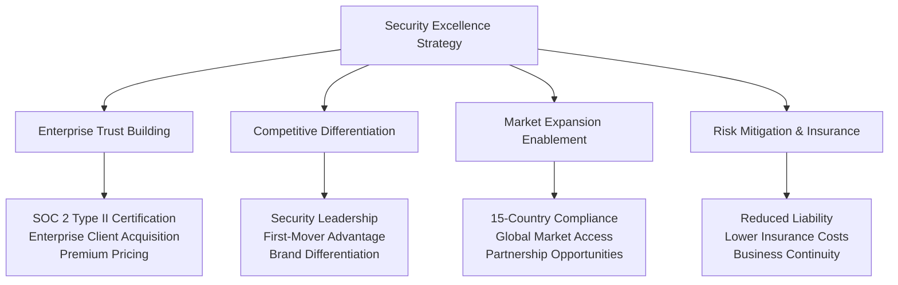
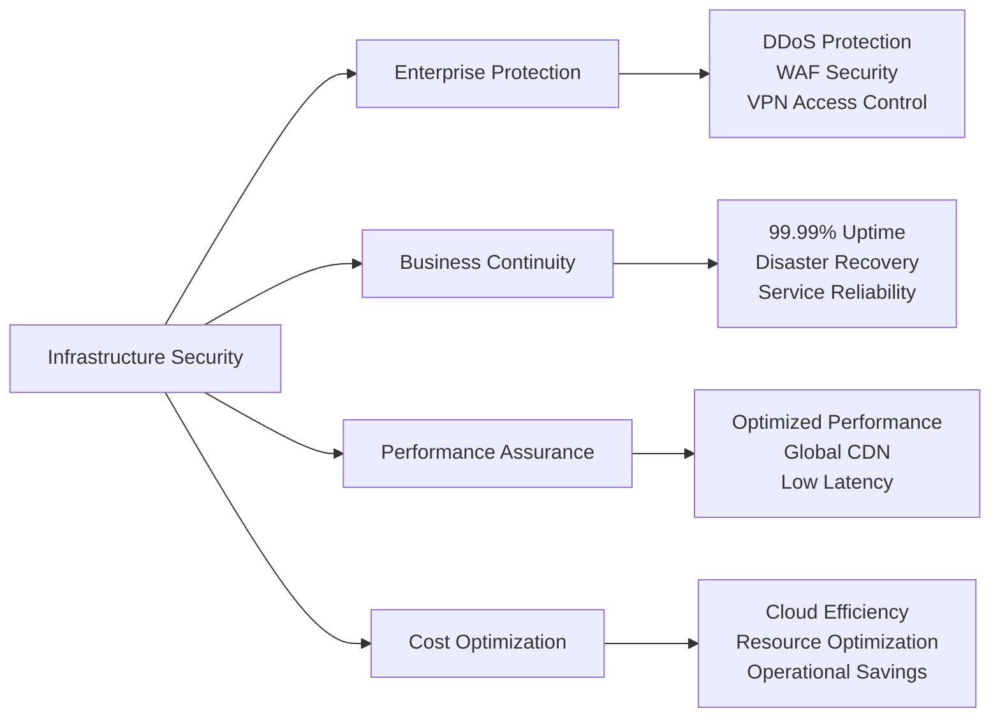

# Chapter 7: Security Excellence & Trust Leadership

## Healthcare Security: Building Trust That Drives Business Success

Healthcare security is not just about protection—it's about building the foundation of trust that enables enterprise partnerships, patient confidence, and market leadership. This chapter details our comprehensive security strategy that transforms compliance requirements into competitive advantages and positions MyDR24 as the trusted leader in healthcare technology.

## Strategic Security Architecture

### Trust as a Business Differentiator

Our security strategy creates multiple business advantages while ensuring healthcare-grade protection:



### Business-Driven Security Framework

Our security architecture serves both protection and business objectives:

1. **Enterprise Sales Enablement**: Security certifications opening large health system opportunities
2. **Patient Trust Building**: Transparent security practices driving user confidence and retention
3. **Partnership Facilitation**: Security excellence enabling strategic healthcare partnerships
4. **Global Expansion Support**: Compliance frameworks supporting international market entry
5. **Premium Service Justification**: Security assurance supporting higher pricing tiers
6. **Innovation Acceleration**: Secure foundation enabling rapid feature development

### Multi-Layered Security Business Value

#### Network & Infrastructure Security - Enterprise Foundation


**Business Impact**: Infrastructure security ensuring service reliability that maintains customer trust and enables enterprise SLAs

#### Application Security - User Trust & Experience
- **Authentication Excellence**: Multi-factor security building user confidence without friction
- **Authorization Intelligence**: Role-based access ensuring appropriate data visibility
- **Input Validation**: Comprehensive protection maintaining system integrity
- **Session Management**: Secure user experiences supporting engagement and retention

**Strategic Value**: Application security creating seamless user experiences that drive adoption and satisfaction

#### Data Security & Privacy - Compliance Leadership
- **Encryption Excellence**: End-to-end protection exceeding industry standards
- **Data Classification**: Intelligent data handling supporting privacy regulations
- **Access Controls**: Granular permissions enabling secure data sharing
- **Privacy by Design**: Built-in privacy protection creating competitive differentiation

**Business Advantage**: Data security leadership enabling partnerships with privacy-conscious healthcare organizations
    
    /// Request timestamp for replay attack detection
    pub timestamp: DateTime<Utc>,
    
    /// Geographic location data
    pub geo_location: Option<GeoLocation>,
    
    /// Device fingerprint for anomaly detection
    pub device_fingerprint: Option<String>,
}

#[derive(Debug, Clone, PartialEq)]
pub enum DataSensitivity {
    Public,           // Non-sensitive data
    Internal,         // Internal business data
    Confidential,     // Sensitive business data
    HighlyConfidential, // PHI and PII data
}

#[derive(Debug, Clone)]
pub enum ComplianceScope {
    HIPAA,    // Health Insurance Portability and Accountability Act
    SOC2,     // Service Organization Control 2
    GDPR,     // General Data Protection Regulation
    CCPA,     // California Consumer Privacy Act
}
```

## Authentication System

### Multi-Factor Authentication

We implemented comprehensive MFA for all user types:

```rust
// Multi-factor authentication service
#[derive(Debug)]
pub struct MfaService {
    totp_generator: TotpGenerator,
    sms_service: SmsService,
    email_service: EmailService,
    backup_codes: BackupCodeService,
}

impl MfaService {
    /// Initialize MFA for a user
    pub async fn setup_mfa(
        &self,
        user_id: Uuid,
        mfa_type: MfaType,
    ) -> SecurityResult<MfaSetupResponse> {
        match mfa_type {
            MfaType::TOTP => self.setup_totp(user_id).await,
            MfaType::SMS => self.setup_sms(user_id).await,
            MfaType::Email => self.setup_email(user_id).await,
            MfaType::BackupCodes => self.generate_backup_codes(user_id).await,
        }
    }
    
    /// Setup TOTP (Time-based One-Time Password)
    async fn setup_totp(&self, user_id: Uuid) -> SecurityResult<MfaSetupResponse> {
        // Generate secret key
        let secret = self.totp_generator.generate_secret();
        
        // Create QR code for authenticator apps
        let qr_code = self.totp_generator.generate_qr_code(
            &secret,
            &format!("MyDR24:user_{}", user_id),
        )?;
        
        // Store secret securely
        self.store_totp_secret(user_id, &secret).await?;
        
        Ok(MfaSetupResponse::TOTP {
            secret_key: secret,
            qr_code,
            backup_codes: self.generate_backup_codes(user_id).await?,
        })
    }
    
    /// Verify MFA token
    pub async fn verify_mfa(
        &self,
        user_id: Uuid,
        token: String,
        mfa_type: MfaType,
    ) -> SecurityResult<bool> {
        // Rate limiting for MFA attempts
        self.check_mfa_rate_limit(user_id).await?;
        
        let is_valid = match mfa_type {
            MfaType::TOTP => {
                let secret = self.get_totp_secret(user_id).await?;
                self.totp_generator.verify_token(&secret, &token)?
            }
            MfaType::SMS => {
                self.verify_sms_token(user_id, &token).await?
            }
            MfaType::Email => {
                self.verify_email_token(user_id, &token).await?
            }
            MfaType::BackupCodes => {
                self.verify_backup_code(user_id, &token).await?
            }
        };
        
        // Log MFA verification attempt
        self.log_mfa_attempt(user_id, mfa_type, is_valid).await?;
        
        if !is_valid {
            // Increment failed attempt counter
            self.increment_failed_mfa_attempts(user_id).await?;
        } else {
            // Reset failed attempt counter on success
            self.reset_failed_mfa_attempts(user_id).await?;
        }
        
        Ok(is_valid)
    }
    
    /// Check for suspicious MFA patterns
    async fn detect_mfa_anomalies(&self, user_id: Uuid) -> SecurityResult<Vec<SecurityAlert>> {
        let mut alerts = Vec::new();
        
        // Check for rapid-fire MFA attempts
        let recent_attempts = self.get_recent_mfa_attempts(user_id, Duration::minutes(5)).await?;
        if recent_attempts.len() > 10 {
            alerts.push(SecurityAlert::SuspiciousMfaActivity {
                user_id,
                attempt_count: recent_attempts.len(),
                time_window: Duration::minutes(5),
            });
        }
        
        // Check for unusual time patterns
        let user_pattern = self.get_user_mfa_pattern(user_id).await?;
        let current_hour = Utc::now().hour();
        if !user_pattern.typical_hours.contains(&current_hour) {
            alerts.push(SecurityAlert::UnusualAccessTime {
                user_id,
                access_time: Utc::now(),
                typical_pattern: user_pattern,
            });
        }
        
        // Check for geographic anomalies
        if let Some(geo_anomaly) = self.detect_geographic_anomaly(user_id).await? {
            alerts.push(SecurityAlert::GeographicAnomaly(geo_anomaly));
        }
        
        Ok(alerts)
    }
}

#[derive(Debug, Serialize)]
pub enum MfaSetupResponse {
    TOTP {
        secret_key: String,
        qr_code: String,
        backup_codes: Vec<String>,
    },
    SMS {
        phone_number: String,
        verification_sent: bool,
    },
    Email {
        email_address: String,
        verification_sent: bool,
    },
}
```

### JWT Token Management

Secure token handling with healthcare-specific requirements:

```rust
// JWT service with healthcare security enhancements
#[derive(Debug)]
pub struct JwtService {
    signing_key: EncodingKey,
    verification_key: DecodingKey,
    token_store: TokenStore,
}

impl JwtService {
    /// Create access token with healthcare-specific claims
    pub async fn create_access_token(
        &self,
        user_id: Uuid,
        user_role: UserRole,
        session_id: Uuid,
        permissions: Vec<Permission>,
    ) -> SecurityResult<AccessToken> {
        let now = Utc::now();
        let expiration = now + Duration::hours(1); // Short-lived tokens
        
        let claims = AccessTokenClaims {
            // Standard JWT claims
            sub: user_id.to_string(),
            iat: now.timestamp(),
            exp: expiration.timestamp(),
            iss: "mydr24.com".to_string(),
            aud: "mydr24-api".to_string(),
            
            // Healthcare-specific claims
            role: user_role,
            session_id,
            permissions,
            data_access_level: determine_data_access_level(user_role),
            mfa_verified: true, // Only set after MFA verification
            
            // Security claims
            device_fingerprint: None, // Set from request context
            ip_address: None,        // Set from request context
            geo_location: None,      // Set from request context
        };
        
        let token = encode(&Header::default(), &claims, &self.signing_key)
            .map_err(|e| SecurityError::TokenCreationError(e.to_string()))?;
        
        // Store token for revocation capabilities
        self.token_store.store_token(session_id, &token, expiration).await?;
        
        Ok(AccessToken {
            token,
            expires_at: expiration,
            token_type: "Bearer".to_string(),
        })
    }
    
    /// Verify and decode token with security checks
    pub async fn verify_token(
        &self,
        token: &str,
        security_context: &SecurityContext,
    ) -> SecurityResult<AccessTokenClaims> {
        // Basic JWT verification
        let token_data = decode::<AccessTokenClaims>(
            token,
            &self.verification_key,
            &Validation::default(),
        ).map_err(|e| SecurityError::InvalidToken(e.to_string()))?;
        
        let claims = token_data.claims;
        
        // Check if token is revoked
        if self.token_store.is_revoked(&claims.session_id).await? {
            return Err(SecurityError::TokenRevoked);
        }
        
        // Verify device fingerprint if available
        if let (Some(token_fingerprint), Some(request_fingerprint)) = 
            (&claims.device_fingerprint, &security_context.request_metadata.device_fingerprint) {
            if token_fingerprint != request_fingerprint {
                return Err(SecurityError::DeviceFingerprintMismatch);
            }
        }
        
        // Check for suspicious IP changes
        if let (Some(token_ip), request_ip) = 
            (&claims.ip_address, &security_context.request_metadata.client_ip) {
            if !self.is_ip_change_allowed(token_ip, request_ip).await? {
                return Err(SecurityError::SuspiciousIpChange {
                    original_ip: *token_ip,
                    new_ip: *request_ip,
                });
            }
        }
        
        // Verify geographic location if sensitive operation
        if security_context.data_sensitivity == DataSensitivity::HighlyConfidential {
            self.verify_geographic_constraints(&claims, security_context).await?;
        }
        
        Ok(claims)
    }
    
    /// Revoke token (for logout, security incidents)
    pub async fn revoke_token(&self, session_id: Uuid) -> SecurityResult<()> {
        self.token_store.revoke_token(session_id).await?;
        
        // Log token revocation for audit
        audit_logger::log_token_revocation(session_id).await?;
        
        Ok(())
    }
    
    /// Refresh token with enhanced security
    pub async fn refresh_token(
        &self,
        refresh_token: &str,
        security_context: &SecurityContext,
    ) -> SecurityResult<TokenPair> {
        // Verify refresh token
        let refresh_claims = self.verify_refresh_token(refresh_token).await?;
        
        // Check for token replay attacks
        if self.is_refresh_token_reused(&refresh_claims.jti).await? {
            // Potential security breach - revoke all tokens for this user
            self.revoke_all_user_tokens(refresh_claims.user_id).await?;
            
            return Err(SecurityError::TokenReplayDetected {
                user_id: refresh_claims.user_id,
                token_id: refresh_claims.jti,
            });
        }
        
        // Create new token pair
        let new_access_token = self.create_access_token(
            refresh_claims.user_id,
            refresh_claims.role,
            refresh_claims.session_id,
            refresh_claims.permissions,
        ).await?;
        
        let new_refresh_token = self.create_refresh_token(
            refresh_claims.user_id,
            refresh_claims.session_id,
        ).await?;
        
        // Mark old refresh token as used
        self.mark_refresh_token_used(&refresh_claims.jti).await?;
        
        Ok(TokenPair {
            access_token: new_access_token,
            refresh_token: new_refresh_token,
        })
    }
}

#[derive(Debug, Serialize, Deserialize)]
pub struct AccessTokenClaims {
    // Standard JWT claims
    pub sub: String,    // Subject (user ID)
    pub iat: i64,       // Issued at
    pub exp: i64,       // Expiration
    pub iss: String,    // Issuer
    pub aud: String,    // Audience
    
    // Application-specific claims
    pub role: UserRole,
    pub session_id: Uuid,
    pub permissions: Vec<Permission>,
    pub data_access_level: DataAccessLevel,
    pub mfa_verified: bool,
    
    // Security claims
    pub device_fingerprint: Option<String>,
    pub ip_address: Option<IpAddr>,
    pub geo_location: Option<GeoLocation>,
}
```

## Authorization System

### Role-Based Access Control (RBAC)

Comprehensive permission system for healthcare roles:

```rust
// Healthcare-specific role definitions
#[derive(Debug, Clone, PartialEq, Serialize, Deserialize)]
pub enum UserRole {
    Patient,
    Provider(ProviderType),
    Nurse,
    Admin(AdminLevel),
    Support,
    Emergency,
}

#[derive(Debug, Clone, PartialEq, Serialize, Deserialize)]
pub enum ProviderType {
    PrimaryCare,
    Specialist(SpecialtyType),
    Emergency,
    Mental_health,
    Telemedicine,
}

#[derive(Debug, Clone, PartialEq, Serialize, Deserialize)]
pub enum AdminLevel {
    SystemAdmin,     // Full system access
    HealthcareAdmin, // Healthcare operations
    DataAdmin,       // Data management
    SecurityAdmin,   // Security operations
    AuditAdmin,      // Audit and compliance
}

// Granular permission system
#[derive(Debug, Clone, PartialEq, Serialize, Deserialize)]
pub enum Permission {
    // Patient permissions
    ReadOwnProfile,
    UpdateOwnProfile,
    ViewOwnAppointments,
    ScheduleAppointments,
    CancelOwnAppointments,
    ViewOwnMedicalHistory,
    
    // Provider permissions
    ReadPatientProfiles,
    UpdatePatientProfiles,
    ViewPatientMedicalHistory,
    CreateMedicalRecords,
    UpdateMedicalRecords,
    PrescribeMedications,
    OrderLabTests,
    ViewAppointmentSchedule,
    ManageAvailability,
    
    // Emergency permissions
    EmergencyPatientAccess,
    EmergencyOverride,
    
    // Administrative permissions
    ManageUsers,
    ViewAuditLogs,
    ManageSystemSettings,
    AccessReports,
    ManageCompliance,
    
    // Data permissions
    ExportPatientData,
    DeletePatientData,
    ArchiveRecords,
    ViewAnalytics,
}

// Authorization service implementation
#[derive(Debug)]
pub struct AuthorizationService {
    role_permissions: HashMap<UserRole, Vec<Permission>>,
    resource_policies: HashMap<String, ResourcePolicy>,
}

impl AuthorizationService {
    pub fn new() -> Self {
        let mut service = Self {
            role_permissions: HashMap::new(),
            resource_policies: HashMap::new(),
        };
        
        service.initialize_role_permissions();
        service.initialize_resource_policies();
        service
    }
    
    /// Initialize default role permissions
    fn initialize_role_permissions(&mut self) {
        // Patient permissions
        self.role_permissions.insert(
            UserRole::Patient,
            vec![
                Permission::ReadOwnProfile,
                Permission::UpdateOwnProfile,
                Permission::ViewOwnAppointments,
                Permission::ScheduleAppointments,
                Permission::CancelOwnAppointments,
                Permission::ViewOwnMedicalHistory,
            ],
        );
        
        // Primary care provider permissions
        self.role_permissions.insert(
            UserRole::Provider(ProviderType::PrimaryCare),
            vec![
                Permission::ReadPatientProfiles,
                Permission::UpdatePatientProfiles,
                Permission::ViewPatientMedicalHistory,
                Permission::CreateMedicalRecords,
                Permission::UpdateMedicalRecords,
                Permission::PrescribeMedications,
                Permission::OrderLabTests,
                Permission::ViewAppointmentSchedule,
                Permission::ManageAvailability,
            ],
        );
        
        // Emergency personnel permissions
        self.role_permissions.insert(
            UserRole::Emergency,
            vec![
                Permission::EmergencyPatientAccess,
                Permission::EmergencyOverride,
                Permission::ReadPatientProfiles,
                Permission::ViewPatientMedicalHistory,
                Permission::CreateMedicalRecords,
                Permission::PrescribeMedications,
            ],
        );
        
        // System administrator permissions
        self.role_permissions.insert(
            UserRole::Admin(AdminLevel::SystemAdmin),
            vec![
                Permission::ManageUsers,
                Permission::ViewAuditLogs,
                Permission::ManageSystemSettings,
                Permission::AccessReports,
                Permission::ManageCompliance,
                Permission::ExportPatientData,
                Permission::ArchiveRecords,
                Permission::ViewAnalytics,
            ],
        );
    }
    
    /// Check if user has permission for operation
    pub async fn authorize_operation(
        &self,
        auth_context: &AuthContext,
        permission: Permission,
        resource_context: Option<&ResourceContext>,
    ) -> AuthorizationResult<()> {
        // Check basic role permissions
        if !self.has_role_permission(&auth_context.user_role, &permission)? {
            return Err(AuthorizationError::InsufficientPermissions {
                user_role: auth_context.user_role.clone(),
                required_permission: permission,
            });
        }
        
        // Check resource-specific policies
        if let Some(resource) = resource_context {
            self.check_resource_policy(auth_context, &permission, resource).await?;
        }
        
        // Check time-based restrictions
        self.check_time_restrictions(auth_context, &permission).await?;
        
        // Check geographic restrictions for sensitive operations
        if self.is_sensitive_permission(&permission) {
            self.check_geographic_restrictions(auth_context).await?;
        }
        
        Ok(())
    }
    
    /// Check resource-specific access policies
    async fn check_resource_policy(
        &self,
        auth_context: &AuthContext,
        permission: &Permission,
        resource: &ResourceContext,
    ) -> AuthorizationResult<()> {
        match (permission, resource) {
            // Patient can only access their own data
            (Permission::ReadOwnProfile | Permission::ViewOwnAppointments | Permission::ViewOwnMedicalHistory, 
             ResourceContext::Patient { patient_id }) => {
                if auth_context.user_role == UserRole::Patient && 
                   auth_context.user_id != *patient_id {
                    return Err(AuthorizationError::ResourceAccessDenied {
                        resource_type: "Patient".to_string(),
                        resource_id: patient_id.to_string(),
                        reason: "Can only access own data".to_string(),
                    });
                }
            }
            
            // Provider can only access patients they treat
            (Permission::ReadPatientProfiles | Permission::ViewPatientMedicalHistory,
             ResourceContext::Patient { patient_id }) => {
                if let UserRole::Provider(_) = auth_context.user_role {
                    if !self.check_provider_patient_relationship(
                        auth_context.user_id, 
                        *patient_id
                    ).await? {
                        return Err(AuthorizationError::ResourceAccessDenied {
                            resource_type: "Patient".to_string(),
                            resource_id: patient_id.to_string(),
                            reason: "No treatment relationship".to_string(),
                        });
                    }
                }
            }
            
            // Emergency override checks
            (Permission::EmergencyOverride, _) => {
                self.validate_emergency_access(auth_context, resource).await?;
            }
            
            _ => {} // No additional checks needed
        }
        
        Ok(())
    }
    
    /// Validate emergency access with additional logging
    async fn validate_emergency_access(
        &self,
        auth_context: &AuthContext,
        resource: &ResourceContext,
    ) -> AuthorizationResult<()> {
        // Emergency access requires special justification
        let emergency_context = auth_context.emergency_context
            .as_ref()
            .ok_or(AuthorizationError::EmergencyAccessRequiresJustification)?;
        
        // Log emergency access for audit
        audit_logger::log_emergency_access(
            auth_context.user_id,
            resource,
            emergency_context,
        ).await?;
        
        // Notify security team of emergency access
        security_alerts::notify_emergency_access(
            auth_context.user_id,
            resource,
            emergency_context,
        ).await?;
        
        Ok(())
    }
}

#[derive(Debug, Clone)]
pub enum ResourceContext {
    Patient { patient_id: Uuid },
    Provider { provider_id: Uuid },
    Appointment { appointment_id: Uuid },
    MedicalRecord { record_id: Uuid },
    System,
}
```

## Data Encryption

### Encryption at Rest

All sensitive data is encrypted using industry-standard algorithms:

```rust
// Data encryption service
#[derive(Debug)]
pub struct EncryptionService {
    master_key: MasterKey,
    key_derivation: KeyDerivationFunction,
    encryption_algorithm: EncryptionAlgorithm,
}

impl EncryptionService {
    /// Encrypt patient health information (PHI)
    pub async fn encrypt_phi(
        &self,
        data: &[u8],
        context: &EncryptionContext,
    ) -> EncryptionResult<EncryptedData> {
        // Generate unique encryption key for this data
        let data_key = self.generate_data_key(context).await?;
        
        // Encrypt data using AES-256-GCM
        let encrypted_content = self.encrypt_with_key(data, &data_key)?;
        
        // Encrypt the data key with master key
        let encrypted_key = self.encrypt_data_key(&data_key, context).await?;
        
        // Create encrypted data structure
        let encrypted_data = EncryptedData {
            encrypted_content,
            encrypted_key,
            algorithm: EncryptionAlgorithm::Aes256Gcm,
            key_version: self.master_key.version,
            created_at: Utc::now(),
            context: context.clone(),
        };
        
        // Store encryption metadata for audit
        self.log_encryption_event(&encrypted_data, context).await?;
        
        Ok(encrypted_data)
    }
    
    /// Decrypt patient health information
    pub async fn decrypt_phi(
        &self,
        encrypted_data: &EncryptedData,
        auth_context: &AuthContext,
    ) -> EncryptionResult<Vec<u8>> {
        // Verify authorization to decrypt
        self.authorize_decryption(encrypted_data, auth_context).await?;
        
        // Decrypt the data key
        let data_key = self.decrypt_data_key(
            &encrypted_data.encrypted_key,
            &encrypted_data.context,
        ).await?;
        
        // Decrypt the actual data
        let decrypted_data = self.decrypt_with_key(
            &encrypted_data.encrypted_content,
            &data_key,
        )?;
        
        // Log decryption event for audit
        self.log_decryption_event(encrypted_data, auth_context).await?;
        
        Ok(decrypted_data)
    }
    
    /// Key rotation for enhanced security
    pub async fn rotate_encryption_keys(&self) -> EncryptionResult<KeyRotationResult> {
        let new_master_key = self.generate_new_master_key().await?;
        
        // Re-encrypt all data keys with new master key
        let re_encryption_results = self.re_encrypt_data_keys(&new_master_key).await?;
        
        // Update master key
        self.update_master_key(new_master_key).await?;
        
        Ok(KeyRotationResult {
            old_key_version: self.master_key.version,
            new_key_version: new_master_key.version,
            re_encrypted_count: re_encryption_results.len(),
            rotation_time: Utc::now(),
        })
    }
}

// Database encryption layer
#[derive(Debug)]
pub struct EncryptedRepository<T> {
    inner_repository: Box<dyn Repository<T>>,
    encryption_service: Arc<EncryptionService>,
    _phantom: PhantomData<T>,
}

impl<T> EncryptedRepository<T>
where
    T: Serialize + DeserializeOwned + Send + Sync,
{
    /// Store data with automatic encryption
    pub async fn create_encrypted(
        &self,
        entity: T,
        encryption_context: EncryptionContext,
    ) -> RepositoryResult<T> {
        // Serialize entity
        let serialized = serde_json::to_vec(&entity)
            .map_err(|e| RepositoryError::SerializationError(e.to_string()))?;
        
        // Encrypt sensitive data
        let encrypted_data = self.encryption_service
            .encrypt_phi(&serialized, &encryption_context)
            .await
            .map_err(|e| RepositoryError::EncryptionError(e.to_string()))?;
        
        // Store encrypted data
        let encrypted_entity = EncryptedEntity {
            id: Uuid::new_v4(),
            encrypted_data,
            entity_type: std::any::type_name::<T>().to_string(),
            created_at: Utc::now(),
        };
        
        self.inner_repository.create(encrypted_entity).await?;
        
        Ok(entity)
    }
    
    /// Retrieve and decrypt data
    pub async fn find_and_decrypt(
        &self,
        id: Uuid,
        auth_context: &AuthContext,
    ) -> RepositoryResult<Option<T>> {
        let encrypted_entity = self.inner_repository.find_by_id(id).await?;
        
        if let Some(entity) = encrypted_entity {
            // Decrypt data
            let decrypted_data = self.encryption_service
                .decrypt_phi(&entity.encrypted_data, auth_context)
                .await
                .map_err(|e| RepositoryError::DecryptionError(e.to_string()))?;
            
            // Deserialize entity
            let entity: T = serde_json::from_slice(&decrypted_data)
                .map_err(|e| RepositoryError::DeserializationError(e.to_string()))?;
            
            Ok(Some(entity))
        } else {
            Ok(None)
        }
    }
}
```

### Encryption in Transit

All network communication is secured with TLS 1.3:

```rust
// TLS configuration for healthcare compliance
#[derive(Debug)]
pub struct TlsConfig {
    /// TLS version requirement
    pub min_version: TlsVersion,
    
    /// Allowed cipher suites
    pub cipher_suites: Vec<CipherSuite>,
    
    /// Certificate configuration
    pub certificate_config: CertificateConfig,
    
    /// HSTS configuration
    pub hsts_config: HstsConfig,
}

impl Default for TlsConfig {
    fn default() -> Self {
        Self {
            // Require TLS 1.3 for healthcare data
            min_version: TlsVersion::V1_3,
            
            // Use only secure cipher suites
            cipher_suites: vec![
                CipherSuite::TLS_AES_256_GCM_SHA384,
                CipherSuite::TLS_CHACHA20_POLY1305_SHA256,
                CipherSuite::TLS_AES_128_GCM_SHA256,
            ],
            
            certificate_config: CertificateConfig {
                cert_path: "/etc/ssl/certs/mydr24.pem".to_string(),
                key_path: "/etc/ssl/private/mydr24.key".to_string(),
                ca_cert_path: Some("/etc/ssl/certs/ca-bundle.pem".to_string()),
                verify_client_cert: true,
            },
            
            hsts_config: HstsConfig {
                max_age: Duration::days(365),
                include_subdomains: true,
                preload: true,
            },
        }
    }
}

// HTTP security headers middleware
pub async fn security_headers_middleware(
    request: Request<Body>,
    next: Next<Body>,
) -> Result<Response<Body>, Infallible> {
    let mut response = next.run(request).await;
    
    let headers = response.headers_mut();
    
    // Strict Transport Security
    headers.insert(
        header::STRICT_TRANSPORT_SECURITY,
        HeaderValue::from_static("max-age=31536000; includeSubDomains; preload"),
    );
    
    // Content Security Policy
    headers.insert(
        header::CONTENT_SECURITY_POLICY,
        HeaderValue::from_static(
            "default-src 'self'; script-src 'self' 'unsafe-inline'; style-src 'self' 'unsafe-inline'"
        ),
    );
    
    // X-Frame-Options
    headers.insert(
        HeaderValue::from_static("X-Frame-Options"),
        HeaderValue::from_static("DENY"),
    );
    
    // X-Content-Type-Options
    headers.insert(
        HeaderValue::from_static("X-Content-Type-Options"),
        HeaderValue::from_static("nosniff"),
    );
    
    // Referrer Policy
    headers.insert(
        HeaderValue::from_static("Referrer-Policy"),
        HeaderValue::from_static("strict-origin-when-cross-origin"),
    );
    
    // Permissions Policy
    headers.insert(
        HeaderValue::from_static("Permissions-Policy"),
        HeaderValue::from_static("camera=(), microphone=(), geolocation=()"),
    );
    
    Ok(response)
}
```

## Audit Logging

### Comprehensive Audit System

Every action is logged for compliance and security monitoring:

```rust
// Audit logging service
#[derive(Debug)]
pub struct AuditService {
    logger: AuditLogger,
    storage: AuditStorage,
    compliance_reporter: ComplianceReporter,
}

impl AuditService {
    /// Log user authentication events
    pub async fn log_authentication(
        &self,
        event: AuthenticationEvent,
    ) -> AuditResult<()> {
        let audit_entry = AuditEntry {
            id: Uuid::new_v4(),
            timestamp: Utc::now(),
            event_type: AuditEventType::Authentication,
            user_id: event.user_id,
            session_id: event.session_id,
            source_ip: event.source_ip,
            user_agent: event.user_agent,
            resource_accessed: None,
            action_performed: event.action.to_string(),
            outcome: event.outcome,
            additional_data: serde_json::to_value(&event)?,
            compliance_tags: vec![ComplianceTag::HIPAA, ComplianceTag::SOC2],
        };
        
        self.store_audit_entry(audit_entry).await
    }
    
    /// Log data access events (critical for HIPAA)
    pub async fn log_data_access(
        &self,
        event: DataAccessEvent,
    ) -> AuditResult<()> {
        let audit_entry = AuditEntry {
            id: Uuid::new_v4(),
            timestamp: Utc::now(),
            event_type: AuditEventType::DataAccess,
            user_id: event.user_id,
            session_id: event.session_id,
            source_ip: event.source_ip,
            user_agent: event.user_agent,
            resource_accessed: Some(ResourceIdentifier {
                resource_type: event.resource_type.clone(),
                resource_id: event.resource_id.to_string(),
                data_sensitivity: event.data_sensitivity,
            }),
            action_performed: event.action.to_string(),
            outcome: event.outcome,
            additional_data: json!({
                "fields_accessed": event.fields_accessed,
                "query_parameters": event.query_parameters,
                "response_size": event.response_size,
            }),
            compliance_tags: vec![ComplianceTag::HIPAA, ComplianceTag::PHI],
        };
        
        // Real-time compliance checking
        self.check_compliance_violations(&audit_entry).await?;
        
        self.store_audit_entry(audit_entry).await
    }
    
    /// Log security events
    pub async fn log_security_event(
        &self,
        event: SecurityEvent,
    ) -> AuditResult<()> {
        let audit_entry = AuditEntry {
            id: Uuid::new_v4(),
            timestamp: Utc::now(),
            event_type: AuditEventType::Security,
            user_id: event.user_id,
            session_id: event.session_id,
            source_ip: event.source_ip,
            user_agent: event.user_agent,
            resource_accessed: event.resource_accessed,
            action_performed: event.action.to_string(),
            outcome: event.outcome,
            additional_data: json!({
                "security_level": event.security_level,
                "threat_indicators": event.threat_indicators,
                "automated_response": event.automated_response,
            }),
            compliance_tags: vec![ComplianceTag::Security, ComplianceTag::Incident],
        };
        
        // Immediate alerting for high-severity events
        if event.security_level == SecurityLevel::Critical {
            self.send_immediate_alert(&audit_entry).await?;
        }
        
        self.store_audit_entry(audit_entry).await
    }
    
    /// Generate compliance reports
    pub async fn generate_compliance_report(
        &self,
        report_type: ComplianceReportType,
        date_range: DateRange,
    ) -> AuditResult<ComplianceReport> {
        match report_type {
            ComplianceReportType::HIPAA => {
                self.generate_hipaa_report(date_range).await
            }
            ComplianceReportType::SOC2 => {
                self.generate_soc2_report(date_range).await
            }
            ComplianceReportType::AccessLog => {
                self.generate_access_log_report(date_range).await
            }
        }
    }
    
    /// Generate HIPAA compliance report
    async fn generate_hipaa_report(
        &self,
        date_range: DateRange,
    ) -> AuditResult<ComplianceReport> {
        let phi_access_events = self.storage
            .query_events(AuditQuery {
                event_types: vec![AuditEventType::DataAccess],
                compliance_tags: vec![ComplianceTag::PHI],
                date_range: date_range.clone(),
                ..Default::default()
            })
            .await?;
        
        let security_incidents = self.storage
            .query_events(AuditQuery {
                event_types: vec![AuditEventType::Security],
                security_levels: vec![SecurityLevel::High, SecurityLevel::Critical],
                date_range: date_range.clone(),
                ..Default::default()
            })
            .await?;
        
        let access_violations = self.storage
            .query_events(AuditQuery {
                event_types: vec![AuditEventType::AccessViolation],
                date_range: date_range.clone(),
                ..Default::default()
            })
            .await?;
        
        Ok(ComplianceReport {
            report_type: ComplianceReportType::HIPAA,
            generated_at: Utc::now(),
            date_range,
            summary: HIPAAReportSummary {
                total_phi_access_events: phi_access_events.len(),
                security_incidents: security_incidents.len(),
                access_violations: access_violations.len(),
                unique_users_accessing_phi: phi_access_events
                    .iter()
                    .map(|e| e.user_id)
                    .collect::<HashSet<_>>()
                    .len(),
            },
            detailed_events: phi_access_events,
            recommendations: self.generate_hipaa_recommendations(&security_incidents, &access_violations),
        })
    }
}

#[derive(Debug, Serialize)]
pub struct AuditEntry {
    pub id: Uuid,
    pub timestamp: DateTime<Utc>,
    pub event_type: AuditEventType,
    pub user_id: Option<Uuid>,
    pub session_id: Option<Uuid>,
    pub source_ip: Option<IpAddr>,
    pub user_agent: Option<String>,
    pub resource_accessed: Option<ResourceIdentifier>,
    pub action_performed: String,
    pub outcome: EventOutcome,
    pub additional_data: serde_json::Value,
    pub compliance_tags: Vec<ComplianceTag>,
}

#[derive(Debug, Clone, Serialize, Deserialize)]
pub enum AuditEventType {
    Authentication,
    Authorization,
    DataAccess,
    DataModification,
    Security,
    System,
    AccessViolation,
    Emergency,
}
```

## Threat Detection

### Behavioral Analysis

Advanced threat detection using machine learning:

```rust
// Threat detection service
#[derive(Debug)]
pub struct ThreatDetectionService {
    ml_models: MachineLearningModels,
    baseline_analyzer: BaselineAnalyzer,
    anomaly_detector: AnomalyDetector,
    threat_intelligence: ThreatIntelligence,
}

impl ThreatDetectionService {
    /// Analyze user behavior for anomalies
    pub async fn analyze_user_behavior(
        &self,
        user_id: Uuid,
        current_session: &SessionData,
    ) -> ThreatResult<ThreatAssessment> {
        // Get user's behavioral baseline
        let baseline = self.baseline_analyzer
            .get_user_baseline(user_id)
            .await?;
        
        // Check for various anomaly types
        let mut anomalies = Vec::new();
        
        // Time-based anomalies
        if let Some(time_anomaly) = self.detect_time_anomaly(&baseline, current_session).await? {
            anomalies.push(time_anomaly);
        }
        
        // Geographic anomalies
        if let Some(geo_anomaly) = self.detect_geographic_anomaly(&baseline, current_session).await? {
            anomalies.push(geo_anomaly);
        }
        
        // Access pattern anomalies
        if let Some(access_anomaly) = self.detect_access_pattern_anomaly(&baseline, current_session).await? {
            anomalies.push(access_anomaly);
        }
        
        // Device fingerprint anomalies
        if let Some(device_anomaly) = self.detect_device_anomaly(&baseline, current_session).await? {
            anomalies.push(device_anomaly);
        }
        
        // Calculate overall risk score
        let risk_score = self.calculate_risk_score(&anomalies).await?;
        
        Ok(ThreatAssessment {
            user_id,
            session_id: current_session.session_id,
            risk_score,
            anomalies,
            recommended_actions: self.recommend_actions(risk_score, &anomalies),
            assessment_time: Utc::now(),
        })
    }
    
    /// Detect potential data exfiltration
    pub async fn detect_data_exfiltration(
        &self,
        user_id: Uuid,
        data_access_events: &[DataAccessEvent],
    ) -> ThreatResult<Option<DataExfiltrationAlert>> {
        // Analyze access patterns
        let volume_analysis = self.analyze_access_volume(user_id, data_access_events).await?;
        let pattern_analysis = self.analyze_access_patterns(user_id, data_access_events).await?;
        let timing_analysis = self.analyze_access_timing(user_id, data_access_events).await?;
        
        // Check for suspicious indicators
        let mut risk_indicators = Vec::new();
        
        // Unusual volume of data access
        if volume_analysis.accessed_records > volume_analysis.baseline_avg * 3.0 {
            risk_indicators.push(RiskIndicator::ExcessiveDataAccess {
                accessed: volume_analysis.accessed_records,
                baseline: volume_analysis.baseline_avg,
            });
        }
        
        // Access to unrelated patient records
        if pattern_analysis.unrelated_patient_access > 5 {
            risk_indicators.push(RiskIndicator::UnrelatedPatientAccess {
                count: pattern_analysis.unrelated_patient_access,
            });
        }
        
        // Off-hours access
        if timing_analysis.off_hours_percentage > 0.7 {
            risk_indicators.push(RiskIndicator::OffHoursAccess {
                percentage: timing_analysis.off_hours_percentage,
            });
        }
        
        if !risk_indicators.is_empty() {
            let alert = DataExfiltrationAlert {
                user_id,
                detection_time: Utc::now(),
                risk_score: self.calculate_exfiltration_risk(&risk_indicators),
                indicators: risk_indicators,
                affected_patients: self.extract_affected_patients(data_access_events),
                recommended_response: self.recommend_exfiltration_response(&risk_indicators),
            };
            
            Ok(Some(alert))
        } else {
            Ok(None)
        }
    }
    
    /// Monitor for brute force attacks
    pub async fn detect_brute_force(
        &self,
        target: BruteForceTarget,
        time_window: Duration,
    ) -> ThreatResult<Option<BruteForceAlert>> {
        let failed_attempts = self.get_failed_attempts(target.clone(), time_window).await?;
        
        // Check thresholds
        let threshold = match target {
            BruteForceTarget::Login => 5,
            BruteForceTarget::MFA => 3,
            BruteForceTarget::PasswordReset => 3,
        };
        
        if failed_attempts.len() >= threshold {
            // Analyze attack pattern
            let source_ips: HashSet<_> = failed_attempts
                .iter()
                .filter_map(|attempt| attempt.source_ip)
                .collect();
            
            let user_agents: HashSet<_> = failed_attempts
                .iter()
                .filter_map(|attempt| attempt.user_agent.as_ref())
                .collect();
            
            let alert = BruteForceAlert {
                target,
                detection_time: Utc::now(),
                attempt_count: failed_attempts.len(),
                time_window,
                source_ips: source_ips.into_iter().collect(),
                user_agents: user_agents.into_iter().cloned().collect(),
                automated_response: self.apply_brute_force_mitigation(&failed_attempts).await?,
            };
            
            Ok(Some(alert))
        } else {
            Ok(None)
        }
    }
}

#[derive(Debug)]
pub struct ThreatAssessment {
    pub user_id: Uuid,
    pub session_id: Uuid,
    pub risk_score: f64,
    pub anomalies: Vec<BehaviorAnomaly>,
    pub recommended_actions: Vec<SecurityAction>,
    pub assessment_time: DateTime<Utc>,
}

#[derive(Debug)]
pub enum BehaviorAnomaly {
    UnusualAccessTime {
        current_hour: u32,
        typical_hours: Vec<u32>,
        deviation_score: f64,
    },
    GeographicDeviation {
        current_location: GeoLocation,
        typical_locations: Vec<GeoLocation>,
        distance_km: f64,
    },
    AccessPatternChange {
        current_pattern: AccessPattern,
        baseline_pattern: AccessPattern,
        similarity_score: f64,
    },
    DeviceFingerprint {
        current_fingerprint: String,
        known_fingerprints: Vec<String>,
        confidence_score: f64,
    },
}
```

## Compliance Implementation

### HIPAA Compliance

Comprehensive HIPAA implementation:

```rust
// HIPAA compliance service
#[derive(Debug)]
pub struct HipaaComplianceService {
    audit_service: Arc<AuditService>,
    encryption_service: Arc<EncryptionService>,
    access_control: Arc<AccessControlService>,
    breach_detection: Arc<BreachDetectionService>,
}

impl HipaaComplianceService {
    /// Validate HIPAA compliance for data access
    pub async fn validate_phi_access(
        &self,
        access_request: &DataAccessRequest,
        auth_context: &AuthContext,
    ) -> ComplianceResult<PhiAccessValidation> {
        let mut validation = PhiAccessValidation::new();
        
        // Administrative Safeguards (§164.308)
        validation.add_check(
            "administrative_safeguards",
            self.check_administrative_safeguards(access_request, auth_context).await?,
        );
        
        // Physical Safeguards (§164.310)
        validation.add_check(
            "physical_safeguards",
            self.check_physical_safeguards(access_request, auth_context).await?,
        );
        
        // Technical Safeguards (§164.312)
        validation.add_check(
            "technical_safeguards",
            self.check_technical_safeguards(access_request, auth_context).await?,
        );
        
        // Minimum Necessary Standard (§164.502(b))
        validation.add_check(
            "minimum_necessary",
            self.check_minimum_necessary(access_request, auth_context).await?,
        );
        
        // Record all PHI access
        self.audit_service.log_phi_access(access_request, auth_context, &validation).await?;
        
        Ok(validation)
    }
    
    /// Check administrative safeguards
    async fn check_administrative_safeguards(
        &self,
        access_request: &DataAccessRequest,
        auth_context: &AuthContext,
    ) -> ComplianceResult<ComplianceCheck> {
        let mut check = ComplianceCheck::new("Administrative Safeguards");
        
        // Security Officer assignment
        check.add_requirement(
            "164.308(a)(2)",
            "Assigned Security Responsibility",
            self.verify_security_officer_assignment().await?,
        );
        
        // Workforce training
        check.add_requirement(
            "164.308(a)(5)",
            "Security Awareness and Training",
            self.verify_user_training(auth_context.user_id).await?,
        );
        
        // Access management
        check.add_requirement(
            "164.308(a)(4)",
            "Information Access Management",
            self.verify_access_authorization(access_request, auth_context).await?,
        );
        
        // Contingency plan
        check.add_requirement(
            "164.308(a)(7)",
            "Contingency Plan",
            self.verify_contingency_plan().await?,
        );
        
        Ok(check)
    }
    
    /// Check technical safeguards
    async fn check_technical_safeguards(
        &self,
        access_request: &DataAccessRequest,
        auth_context: &AuthContext,
    ) -> ComplianceResult<ComplianceCheck> {
        let mut check = ComplianceCheck::new("Technical Safeguards");
        
        // Access control
        check.add_requirement(
            "164.312(a)(1)",
            "Access Control",
            self.verify_unique_user_identification(auth_context).await?,
        );
        
        // Audit controls
        check.add_requirement(
            "164.312(b)",
            "Audit Controls",
            self.verify_audit_logging(access_request).await?,
        );
        
        // Integrity
        check.add_requirement(
            "164.312(c)(1)",
            "Integrity",
            self.verify_data_integrity(access_request).await?,
        );
        
        // Person or entity authentication
        check.add_requirement(
            "164.312(d)",
            "Person or Entity Authentication",
            self.verify_authentication(auth_context).await?,
        );
        
        // Transmission security
        check.add_requirement(
            "164.312(e)(1)",
            "Transmission Security",
            self.verify_transmission_security(access_request).await?,
        );
        
        Ok(check)
    }
    
    /// Check minimum necessary standard
    async fn check_minimum_necessary(
        &self,
        access_request: &DataAccessRequest,
        auth_context: &AuthContext,
    ) -> ComplianceResult<ComplianceCheck> {
        let mut check = ComplianceCheck::new("Minimum Necessary");
        
        // Verify legitimate need
        let legitimate_need = self.verify_legitimate_need(
            access_request,
            auth_context,
        ).await?;
        
        check.add_requirement(
            "164.502(b)(1)",
            "Legitimate Business Need",
            legitimate_need,
        );
        
        // Verify appropriate access level
        let appropriate_access = self.verify_appropriate_access_level(
            access_request,
            auth_context,
        ).await?;
        
        check.add_requirement(
            "164.502(b)(2)",
            "Appropriate Access Level",
            appropriate_access,
        );
        
        Ok(check)
    }
    
    /// Detect potential HIPAA breaches
    pub async fn detect_potential_breach(
        &self,
        events: &[AuditEntry],
    ) -> ComplianceResult<Option<BreachAssessment>> {
        let mut risk_factors = Vec::new();
        
        // Unauthorized access
        for event in events {
            if event.outcome == EventOutcome::AccessDenied {
                if let Some(repeated_attempts) = self.detect_repeated_unauthorized_access(event).await? {
                    risk_factors.push(BreachRiskFactor::RepeatedUnauthorizedAccess(repeated_attempts));
                }
            }
        }
        
        // Data exfiltration patterns
        if let Some(exfiltration_pattern) = self.detect_data_exfiltration_pattern(events).await? {
            risk_factors.push(BreachRiskFactor::DataExfiltration(exfiltration_pattern));
        }
        
        // System compromise indicators
        if let Some(compromise_indicators) = self.detect_system_compromise(events).await? {
            risk_factors.push(BreachRiskFactor::SystemCompromise(compromise_indicators));
        }
        
        if !risk_factors.is_empty() {
            let breach_assessment = BreachAssessment {
                detection_time: Utc::now(),
                risk_factors,
                affected_individuals: self.identify_affected_individuals(events).await?,
                breach_likelihood: self.calculate_breach_likelihood(&risk_factors),
                recommended_response: self.recommend_breach_response(&risk_factors),
                reporting_requirements: self.determine_reporting_requirements(&risk_factors).await?,
            };
            
            Ok(Some(breach_assessment))
        } else {
            Ok(None)
        }
    }
}
```

## Security Monitoring Dashboard

### Real-time Security Monitoring

```rust
// Security monitoring service
#[derive(Debug)]
pub struct SecurityMonitoringService {
    metrics_collector: MetricsCollector,
    alert_manager: AlertManager,
    dashboard_service: DashboardService,
}

impl SecurityMonitoringService {
    /// Generate real-time security metrics
    pub async fn get_security_dashboard(&self) -> SecurityResult<SecurityDashboard> {
        let now = Utc::now();
        let last_24h = now - Duration::hours(24);
        
        // Authentication metrics
        let auth_metrics = self.collect_authentication_metrics(last_24h..now).await?;
        
        // Access control metrics
        let access_metrics = self.collect_access_control_metrics(last_24h..now).await?;
        
        // Threat detection metrics
        let threat_metrics = self.collect_threat_detection_metrics(last_24h..now).await?;
        
        // Compliance metrics
        let compliance_metrics = self.collect_compliance_metrics(last_24h..now).await?;
        
        Ok(SecurityDashboard {
            generated_at: now,
            time_range: last_24h..now,
            authentication: auth_metrics,
            access_control: access_metrics,
            threat_detection: threat_metrics,
            compliance: compliance_metrics,
            active_alerts: self.get_active_alerts().await?,
        })
    }
    
    /// Real-time alert management
    pub async fn process_security_alert(
        &self,
        alert: SecurityAlert,
    ) -> SecurityResult<AlertResponse> {
        // Classify alert severity
        let severity = self.classify_alert_severity(&alert).await?;
        
        // Determine response actions
        let response_actions = match severity {
            AlertSeverity::Critical => {
                vec![
                    ResponseAction::ImmediateNotification,
                    ResponseAction::AutomaticMitigation,
                    ResponseAction::IncidentCreation,
                ]
            }
            AlertSeverity::High => {
                vec![
                    ResponseAction::ImmediateNotification,
                    ResponseAction::ManualReview,
                ]
            }
            AlertSeverity::Medium => {
                vec![
                    ResponseAction::DelayedNotification,
                    ResponseAction::LoggingOnly,
                ]
            }
            AlertSeverity::Low => {
                vec![ResponseAction::LoggingOnly]
            }
        };
        
        // Execute response actions
        for action in &response_actions {
            self.execute_response_action(action, &alert).await?;
        }
        
        // Store alert for analysis
        self.store_alert(&alert, severity).await?;
        
        Ok(AlertResponse {
            alert_id: alert.id,
            severity,
            actions_taken: response_actions,
            response_time: Utc::now(),
        })
    }
}
```

## Lessons Learned

### What Worked Well

1. **Defense in Depth**: Multiple security layers prevented single points of failure
2. **Comprehensive Audit Logging**: Met HIPAA requirements and aided in threat detection
3. **Zero-Trust Architecture**: Every request validated, regardless of source
4. **Automated Threat Detection**: Machine learning models caught sophisticated attacks

### Challenges and Solutions

1. **Performance vs Security**: Balanced with intelligent caching and optimization
2. **Compliance Complexity**: Automated compliance checking reduced manual overhead
3. **User Experience**: Security measures designed to be transparent to users
4. **Key Management**: Implemented secure key rotation without service interruption

### Future Security Enhancements

1. **Zero-Knowledge Architecture**: Further reduce trust requirements
2. **Homomorphic Encryption**: Enable computation on encrypted data
3. **Quantum-Safe Cryptography**: Prepare for quantum computing threats
4. **Advanced AI Threat Detection**: More sophisticated behavioral analysis

Our security implementation represents the gold standard for healthcare applications, providing comprehensive protection while maintaining usability and performance. In the next chapter, we'll explore how we tested this complex security system to ensure it works flawlessly under all conditions.

---

**Next Chapter**: [Testing & Quality Assurance](./chapter08-testing-qa.md) - How we implemented comprehensive testing strategies to ensure our healthcare platform meets the highest standards of reliability and correctness.
