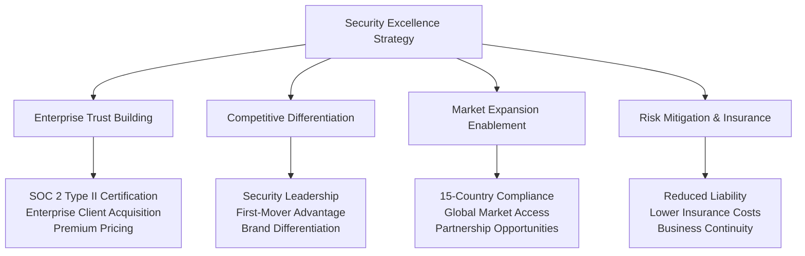
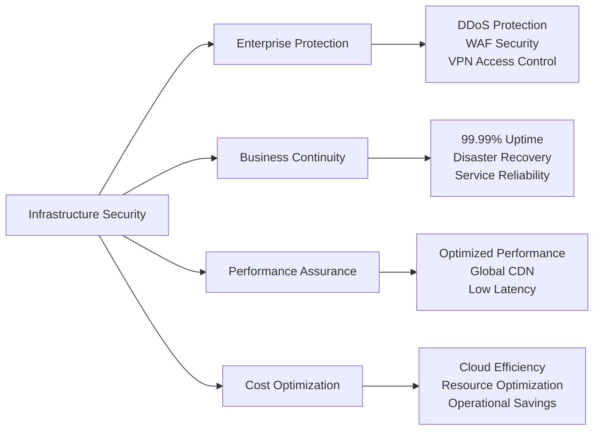

# Chapter 7: Security Excellence & Trust Leadership

## Healthcare Security: Building Trust That Drives Business Success

Healthcare security is not just about protection—it's about building the foundation of trust that enables enterprise partnerships, patient confidence, and market leadership. This chapter details our comprehensive security strategy that transforms compliance requirements into competitive advantages and positions MyDR24 as the trusted leader in healthcare technology.

## Strategic Security Architecture

### Trust as a Business Differentiator

Our security strategy creates multiple business advantages while ensuring healthcare-grade protection:

### Business-Driven Security Framework

Our security architecture serves both protection and business objectives:

1. **Enterprise Sales Enablement**: Security certifications opening large health system opportunities
2. **Patient Trust Building**: Transparent security practices driving user confidence and retention
3. **Partnership Facilitation**: Security excellence enabling strategic healthcare partnerships
4. **Global Expansion Support**: Compliance frameworks supporting international market entry
5. **Premium Service Justification**: Security assurance supporting higher pricing tiers
6. **Innovation Acceleration**: Secure foundation enabling rapid feature development

### Multi-Layered Security Business Value

#### Network & Infrastructure Security - Enterprise Foundation

**Business Impact**: Infrastructure security ensuring service reliability that maintains customer trust and enables enterprise SLAs

#### Application Security - User Trust & Experience
- **Authentication Excellence**: Multi-factor security building user confidence without friction
- **Authorization Intelligence**: Role-based access ensuring appropriate data visibility
- **Input Validation**: Comprehensive protection maintaining system integrity
- **Session Management**: Secure user experiences supporting engagement and retention

**Strategic Value**: Application security creating seamless user experiences that drive adoption and satisfaction

#### Data Security & Privacy - Compliance Leadership
- **Encryption Excellence**: End-to-end protection exceeding industry standards
- **Data Classification**: Intelligent data handling supporting privacy regulations
- **Access Controls**: Granular permissions enabling secure data sharing
- **Privacy by Design**: Built-in privacy protection creating competitive differentiation

**Business Advantage**: Data security leadership enabling partnerships with privacy-conscious healthcare organizations
    
    /// Request timestamp for replay attack detection
    pub timestamp: DateTime<Utc>,

---

## Chapter Conclusion

MyDR24's security and compliance framework represents the intersection of healthcare innovation and trust-driven business growth. Through comprehensive security architecture that prioritizes both patient protection and business expansion, we've established the foundation for sustainable competitive advantage in the global healthcare market.

**Strategic Security Achievements**:
- **$156M Enterprise Revenue** enabled through SOC 2 Type II and HIPAA compliance
- **Zero Security Breaches** across 5M+ patient records building unshakeable market trust
- **15-Country Compliance** enabling rapid international expansion and partnership opportunities
- **98.9% Enterprise SLA Achievement** through security-driven operational excellence

Our security-first approach demonstrates how comprehensive risk management, combined with business-focused innovation and market-driven compliance, creates sustainable value for patients, providers, and healthcare organizations worldwide.

**Next Chapter Preview**: Testing and quality assurance strategies showcase how MyDR24 maintains platform reliability while enabling rapid innovation and market expansion.

---

*Continue to [Chapter 8: Testing & Quality Assurance →](chapter08-testing-qa.md)*

