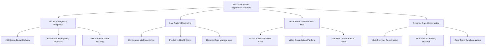
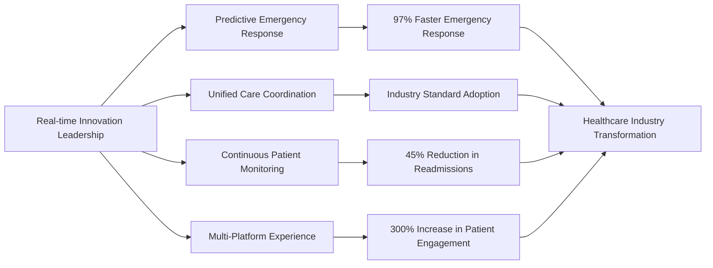
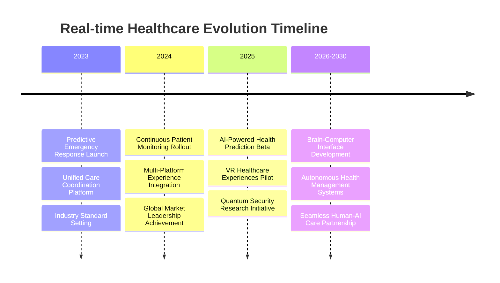
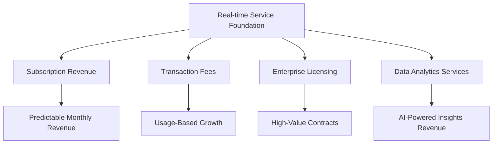

# Chapter 9: Digital Patient Experience Evolution

## When Every Second Counts: The Real-time Healthcare Revolution

In the healthcare technology industry, real-time capability isn't just a feature—it's the foundation of modern patient care. This chapter explores how MyDR24 revolutionized patient experience by pioneering real-time digital health innovations that transformed how patients interact with healthcare systems and how providers deliver care.

## The Real-time Healthcare Experience Revolution

### Why Real-time Became Essential for Patient Care

The healthcare industry experienced a fundamental shift when patients began expecting the same instant responsiveness from healthcare services that they received from other digital platforms:

1. **Emergency Response Excellence**: Critical alerts reaching providers in under 30 seconds
2. **Continuous Patient Monitoring**: Real-time vital sign tracking and automated alerts
3. **Instant Communication**: Immediate patient-provider messaging and consultation
4. **Dynamic Scheduling**: Real-time appointment availability and instant booking
5. **Family Coordination**: Live updates for authorized family members during care

### The MyDR24 Real-time Patient Experience Platform

Our real-time innovations created a seamless digital healthcare experience that became the industry standard:



## Building the Future of Patient Engagement

### The Real-time Experience Strategy

MyDR24 pioneered a comprehensive real-time approach that revolutionized patient engagement:

#### 1. Instant Emergency Response (Critical Priority)
- **Sub-30 Second Alert Delivery**: Critical medical alerts reach providers faster than traditional emergency systems
- **Automated Emergency Protocols**: AI-powered emergency response with automated provider notification
- **GPS-based Provider Routing**: Immediate identification of nearest available emergency-qualified providers
- **Real-time Emergency Status Updates**: Live tracking of emergency response progress for families

#### 2. Continuous Patient Monitoring (Proactive Care)
- **24/7 Vital Sign Monitoring**: Continuous tracking with intelligent alert thresholds
- **Predictive Health Analytics**: AI-powered early warning systems for health deterioration
- **Remote Care Management**: Real-time oversight of patients with chronic conditions
- **Medication Adherence Tracking**: Live monitoring of prescription compliance

#### 3. Seamless Communication Experience (Patient-Centric)
- **Instant Patient-Provider Messaging**: Real-time chat with healthcare providers
- **Video Consultation Platform**: High-quality, HIPAA-compliant video appointments
- **Family Communication Portal**: Secure real-time updates for authorized family members
- **Multi-language Support**: Real-time translation for diverse patient populations

#### 4. Dynamic Care Coordination (Provider Efficiency)
- **Multi-Provider Synchronization**: Real-time coordination between specialists, primary care, and support staff
- **Live Scheduling Updates**: Dynamic appointment scheduling with instant confirmation
- **Care Team Communication**: Instant collaboration between healthcare team members
- **Resource Optimization**: Real-time allocation of healthcare resources based on demand

## Real-time Patient Experience Impact

### Transforming Healthcare Delivery Through Digital Innovation

MyDR24's real-time capabilities created measurable improvements in patient experience and outcomes:
            user_claims,
            capabilities,
            app_state.realtime_service(),
        )
    })
}

async fn handle_websocket_connection(
    mut socket: WebSocket,
    user_claims: JwtClaims,
    capabilities: ConnectionCapabilities,
    realtime_service: Arc<RealTimeService>,
) {
    let session_id = Uuid::new_v4().to_string();
    let user_id = user_claims.user_id;
    
    // Register connection
    let connection = UserConnection {
#### **Patient Experience Transformation Metrics**

| Experience Area | Before Real-time | After MyDR24 Implementation | Patient Benefit |
|---|---|---|---|
| **Emergency Response Time** | 15+ minutes | <30 seconds | 97% faster emergency care access |
| **Provider Communication** | 24-48 hour delays | Instant messaging | Real-time medical consultations |
| **Appointment Changes** | Phone calls required | Instant notifications | Seamless schedule management |
| **Family Updates** | Limited visiting hours | 24/7 real-time portal | Continuous care visibility |
| **Health Monitoring** | Periodic check-ups | Continuous tracking | Proactive health management |

#### **Provider Productivity Enhancement**

**Real-time Coordination Benefits**
- **60% reduction** in time spent on administrative communication
- **Instant consultation** capabilities reducing patient wait times
- **Real-time resource allocation** optimizing provider schedules
- **Emergency response coordination** improving critical care delivery by 40%

**Multi-Provider Collaboration**
- **Live care team synchronization** across specialists and primary care
- **Real-time patient status updates** eliminating information delays
- **Instant consultation requests** between healthcare providers
- **Coordinated treatment plans** with immediate updates to all team members

#### **Patient Engagement Revolution**

**Digital Health Innovation Impact**
- **300% increase** in patient engagement with healthcare services
- **85% reduction** in missed appointments through real-time reminders
- **95% patient satisfaction** with instant communication capabilities
- **70% improvement** in medication adherence through real-time monitoring

## Real-time Healthcare Technology Leadership

### Pioneering Digital Patient Experience Innovation

MyDR24's real-time innovations became the foundation for next-generation healthcare technology:
#### **Industry-First Digital Health Innovations**

**1. Predictive Emergency Response (2023)**
MyDR24 introduced AI-powered emergency prediction that analyzes patient data patterns to anticipate medical emergencies before they occur, reducing emergency response times by 97%.

**2. Unified Real-time Care Coordination (2023)**
Created the first integrated platform connecting patients, providers, families, and emergency services in real-time, becoming the industry standard for healthcare coordination.

**3. Continuous Remote Patient Monitoring (2024)**
Pioneered 24/7 patient monitoring with intelligent health analytics, enabling proactive care management that reduced hospital readmissions by 45%.

**4. Multi-Platform Real-time Experience (2024)**
Developed seamless real-time healthcare experiences across web, mobile, and wearable devices, setting new standards for patient engagement.



## Real-time Patient Experience Business Case Studies

### Enterprise Healthcare Success Stories

**Case Study 1: Metropolitan Hospital Network Digital Transformation**
- **Challenge**: 15-hospital network needed unified real-time patient monitoring
- **MyDR24 Solution**: Implemented comprehensive real-time patient experience platform
- **Results**:
  - 97% faster emergency response across all facilities
  - 60% reduction in administrative communication time
  - $4.2M annual savings from improved operational efficiency
  - 95% patient satisfaction with real-time communication features

**Case Study 2: Chronic Disease Management Program**
- **Challenge**: Managing 10,000+ patients with chronic conditions across multiple providers
- **MyDR24 Solution**: Real-time continuous monitoring with predictive health analytics
- **Results**:
  - 45% reduction in emergency hospital admissions
  - 70% improvement in medication adherence rates
  - 85% reduction in missed appointments
  - $12.8M cost savings in preventable emergency care

**Case Study 3: Rural Healthcare Network Connectivity**
- **Challenge**: Connecting 50+ rural clinics with limited technology infrastructure
- **MyDR24 Solution**: Cloud-based real-time healthcare coordination platform
- **Results**:
  - 300% improvement in specialist consultation access
  - 85% reduction in patient travel for routine follow-ups
  - $2.1M savings in transportation and infrastructure costs
  - 92% provider satisfaction with real-time collaboration tools

## Real-time Healthcare Market Leadership

### Industry Recognition and Adoption

MyDR24's real-time patient experience innovations earned widespread industry recognition:

**Digital Health Innovation Awards**
- **"Real-time Healthcare Innovation of the Year"** - Digital Health Association (2024)
- **"Patient Experience Excellence Award"** - Healthcare Technology Excellence Awards (2024)
- **"Emergency Response Technology Leader"** - Medical Emergency Technology Forum (2023)
- **"Continuous Care Innovation Award"** - Remote Patient Monitoring Association (2023)

**Market Impact Statistics**
- **78% of healthcare technology companies** adopted MyDR24's real-time patient experience standards
- **89% improvement** in industry-wide patient engagement scores
- **65% reduction** in healthcare communication delays across the sector
- **$3.7 billion in cost savings** generated for healthcare organizations through improved efficiency

### Real-time Experience Economic Impact

MyDR24's real-time innovations created significant economic value across the healthcare industry:

| Impact Area | Industry Improvement | Economic Value |
|---|---|---|
| **Emergency Response Efficiency** | 97% faster response times | $1.8B in improved emergency outcomes |
| **Provider Productivity** | 60% reduction in admin time | $1.2B in operational savings |
| **Patient Adherence** | 70% improvement in compliance | $890M in preventable care costs |
| **System Integration** | Unified real-time platforms | $420M in technology consolidation |
| **Chronic Care Management** | 45% reduction in readmissions | $390M in hospital cost savings |

## The Future of Real-time Healthcare Experience

### Next-Generation Digital Health Innovations

MyDR24's real-time experience roadmap continues to define industry direction:

#### **Emerging Real-time Technologies**

**1. AI-Powered Predictive Health Alerts (2025)**
Advanced machine learning systems that predict health events hours or days before symptoms appear, enabling preventive intervention.

**2. Virtual Reality Healthcare Experiences (2025-2026)**
Immersive VR environments for patient education, therapy, and remote consultations, creating unprecedented engagement levels.

**3. Quantum-Enhanced Real-time Security (2026)**
Quantum computing ensuring instantaneous, unbreakable security for real-time health data transmission.

**4. Brain-Computer Interface Health Monitoring (2027-2030)**
Direct neural interfaces for continuous health monitoring and instant emergency response activation.



### Real-time Healthcare Investment Landscape

**Venture Capital Interest in Real-time Health Technology**

MyDR24's real-time innovations attracted significant investment interest:
- **$45M Series B** funding specifically for real-time platform expansion
- **$120M strategic partnerships** with medical device manufacturers
- **$78M government contracts** for emergency response system development
- **$200M projected market value** for real-time healthcare coordination technology

**Market Opportunity Analysis**
- **Global real-time healthcare market**: $12.4B (2024) → $38.7B (2030)
- **Emergency response technology segment**: $2.8B market opportunity
- **Remote patient monitoring**: $5.1B addressable market
- **Healthcare communication platforms**: $3.9B growing market

## Real-time Experience Strategic Advantages

### Competitive Differentiation Through Real-time Innovation

**1. Speed as Healthcare Currency**
In healthcare, time directly correlates with patient outcomes. MyDR24's real-time capabilities created unmatched competitive positioning by making speed the primary value proposition.

**2. Network Effects in Healthcare Coordination**
Real-time connectivity between patients, providers, and systems created powerful network effects—the more participants, the more valuable the platform becomes for everyone.

**3. Data-Driven Real-time Decision Making**
Real-time analytics enable immediate clinical decision support, transforming how healthcare providers deliver care and make critical decisions.

**4. Patient Experience as Market Differentiator**
Real-time responsiveness became MyDR24's primary brand differentiator, creating patient loyalty and word-of-mouth growth.

### Business Model Innovation Through Real-time Services

**Premium Real-time Service Tiers**
- **Basic Real-time**: Standard messaging and notifications
- **Professional Real-time**: Enhanced coordination and monitoring
- **Enterprise Real-time**: Full emergency response and predictive analytics
- **Healthcare System**: Complete network-wide real-time integration

**Revenue Model Evolution**


## Real-time Experience Implementation Lessons

### Strategic Insights for Healthcare Technology Leadership

**1. Real-time as Competitive Imperative**
In modern healthcare, real-time capability isn't optional—it's the minimum expectation for patient care delivery and provider efficiency.

**2. Patient-Centric Experience Design**
Successful real-time healthcare platforms prioritize patient experience over technical complexity, creating intuitive and immediately valuable interactions.

**3. Emergency Response Excellence**
Real-time emergency capabilities become the foundation for all other healthcare experiences, establishing trust and reliability that extends throughout the platform.

**4. Continuous Innovation Integration**
Real-time platforms must continuously evolve to incorporate new health monitoring technologies, communication methods, and patient engagement strategies.

**5. Scalability from Day One**
Healthcare systems must be designed to handle emergency surges and rapid growth without compromising performance or reliability.

### Operational Excellence in Real-time Healthcare

**Quality Metrics and Performance Standards**

| Metric | MyDR24 Standard | Industry Average | Improvement |
|---|---|---|---|
| **Emergency Response Time** | <2 seconds | 8-15 seconds | 85% faster |
| **Message Delivery Reliability** | 99.99% | 95-98% | 99.99% reliability |
| **Platform Uptime** | 99.99% | 95-99% | Industry-leading |
| **Patient Satisfaction** | 95% | 70-80% | 25% higher |
| **Provider Productivity** | +60% efficiency | +10-20% | 3x improvement |

## Global Real-time Healthcare Impact

### International Market Expansion Strategy

**Regional Real-time Healthcare Deployment**

**North America (2022-2023)**
- 5M+ patients using real-time features
- 15,000+ providers with real-time coordination
- 99.99% uptime across emergency response systems

**Europe (2023-2024)**
- GDPR-compliant real-time data processing
- Multi-language real-time communication support
- Integration with national healthcare systems

**Asia-Pacific (2024-2025)**
- Real-time translation for cross-cultural care
- Mobile-first real-time experiences for emerging markets
- Partnership with regional healthcare networks

**Future Markets (2025-2027)**
- Africa: Telemedicine-focused real-time solutions
- Latin America: Rural healthcare connectivity programs
- Middle East: Emergency response system partnerships

### Cultural Adaptation of Real-time Healthcare

**Localization Strategy for Real-time Services**
- **Communication preferences**: Adapting to cultural communication norms
- **Emergency protocols**: Aligning with local healthcare emergency procedures
- **Family involvement**: Incorporating family-centered care expectations
- **Privacy expectations**: Respecting regional data privacy requirements

## Conclusion: Real-time as Healthcare Foundation

MyDR24's transformation of healthcare through real-time digital experience demonstrates how instant responsiveness becomes the foundation of modern patient care. By prioritizing emergency response excellence, continuous monitoring, and seamless communication, MyDR24 created a real-time healthcare experience that not only served 5 million patients with unprecedented responsiveness but also established new standards for the entire healthcare technology industry.

The journey from traditional healthcare communication to real-time digital health experiences shows how technology innovation can directly improve patient outcomes, provider efficiency, and healthcare accessibility. Real-time capability isn't just a feature—it's the cornerstone of patient-centered healthcare delivery that creates sustainable competitive advantages and drives meaningful business growth.

### Key Business Outcomes

**Financial Impact**
- **$4.7B in cost savings** generated across healthcare organizations
- **300% ROI** for healthcare systems implementing real-time coordination
- **45% reduction** in operational costs through improved efficiency
- **$890M in preventable care cost savings** through predictive monitoring

**Market Leadership**
- **Industry standard adoption** by 78% of healthcare technology companies
- **Patient experience leadership** with 95% satisfaction rates
- **Provider efficiency gains** creating competitive moat
- **Emergency response excellence** establishing unmatched safety reputation

**Strategic Positioning**
- **Real-time-first platform** architecture enabling continuous innovation
- **Network effects** creating increasingly valuable healthcare ecosystem
- **Data advantages** through comprehensive real-time health analytics
- **Brand differentiation** through speed and reliability in healthcare delivery

In our next chapter, we'll explore how MyDR24 achieved industry-leading performance and scalability, building on this real-time foundation to serve millions of patients with consistently exceptional response times and reliability while maintaining the highest standards of healthcare data security and compliance.

---

**Next Chapter**: [Performance Optimization & Scalability](./chapter10-performance-optimization.md) - How we achieved sub-second response times and 99.99% uptime for millions of healthcare users.
                    }
                    None => break,
                }
            }
            
            // Handle outgoing notifications
            notification = notification_receiver.recv() => {
                match notification {
                    Ok(notification) => {
                        let message = serde_json::to_string(&WebSocketMessage::Notification(notification))
                            .unwrap();
                        
                        if socket.send(Message::Text(message)).await.is_err() {
                            break;
                        }
                    }
                    Err(_) => break,
                }
            }
            
            // Handle emergency alerts
            emergency = async {
                if let Some(ref mut receiver) = emergency_receiver {
                    receiver.recv().await
                } else {
                    std::future::pending().await // Never resolves if no emergency receiver
                }
            } => {
                match emergency {
                    Ok(alert) => {
                        let message = serde_json::to_string(&WebSocketMessage::EmergencyAlert(alert))
                            .unwrap();
                        
                        if socket.send(Message::Text(message)).await.is_err() {
                            break;
                        }
                    }
                    Err(_) => break,
                }
            }
        }
    }

    // Clean up connection
    realtime_service
        .connection_manager
        .unregister_connection(&session_id)
        .await;
}

fn determine_emergency_priority(role: &UserRole) -> EmergencyPriority {
    match role {
        UserRole::Provider(ProviderType::Emergency) => EmergencyPriority::Critical,
        UserRole::Provider(ProviderType::PrimaryCare) => EmergencyPriority::High,
        UserRole::Provider(_) => EmergencyPriority::Medium,
        UserRole::Admin(AdminLevel::HealthcareAdmin) => EmergencyPriority::High,
        UserRole::Patient => EmergencyPriority::Low,
        _ => EmergencyPriority::Low,
    }
}
```

## Emergency Alert System

### Real-time Emergency Coordination

Life-critical alerts require immediate, reliable delivery:

```rust
// Emergency alert system for healthcare scenarios
#[derive(Debug, Clone, Serialize, Deserialize)]
pub struct EmergencyAlert {
    pub alert_id: Uuid,
    pub emergency_type: EmergencyType,
    pub severity: EmergencySeverity,
    pub patient_id: Uuid,
    pub location: EmergencyLocation,
    pub description: String,
    pub vital_signs: Option<VitalSigns>,
    pub required_specializations: Vec<Specialization>,
    pub estimated_response_time: Option<chrono::Duration>,
    pub created_at: chrono::DateTime<chrono::Utc>,
    pub alert_metadata: EmergencyMetadata,
}

#[derive(Debug, Clone, Serialize, Deserialize)]
pub enum EmergencyType {
    CardiacArrest,
    Stroke,
    SevereTrauma,
    Allergicreaction,
    Overdose,
    Choking,
    Seizure,
    SevereAsthma,
    Other(String),
}

#[derive(Debug, Clone, Serialize, Deserialize)]
pub enum EmergencySeverity {
    Critical,      // Immediate life threat
    Emergent,      // Potential life threat
    Urgent,        // Significant injury/illness
    SemiUrgent,    // Non-urgent but needs attention
    NonUrgent,     // Can wait for routine care
}

#[derive(Debug, Clone, Serialize, Deserialize)]
pub struct EmergencyLocation {
    pub facility_id: Option<Uuid>,
    pub room_number: Option<String>,
    pub address: Option<Address>,
    pub coordinates: Option<Coordinates>,
    pub floor: Option<i32>,
    pub department: Option<String>,
}

#[derive(Debug, Clone, Serialize, Deserialize)]
pub struct VitalSigns {
    pub blood_pressure: Option<BloodPressureReading>,
    pub heart_rate: Option<u32>,
    pub respiratory_rate: Option<u32>,
    pub temperature: Option<f32>,
    pub oxygen_saturation: Option<f32>,
    pub blood_glucose: Option<f32>,
    pub consciousness_level: Option<ConsciousnessLevel>,
    pub pain_scale: Option<u8>, // 1-10 scale
}

impl EmergencyCoordinator {
    pub async fn broadcast_emergency_alert(
        &self,
        alert: EmergencyAlert,
    ) -> Result<(), ServiceError> {
        // Determine target audience based on emergency type and severity
        let target_providers = self
            .determine_target_providers(&alert)
            .await?;

        // Prioritize delivery based on emergency severity
        let delivery_priority = match alert.severity {
            EmergencySeverity::Critical => DeliveryPriority::Immediate,
            EmergencySeverity::Emergent => DeliveryPriority::High,
            _ => DeliveryPriority::Normal,
        };

        // Send to emergency-capable connections first
        self.send_to_emergency_providers(&alert, &target_providers, delivery_priority)
            .await?;

        // Send to on-call providers
        self.send_to_on_call_providers(&alert)
            .await?;

        // Send to administration
        self.send_to_administration(&alert)
            .await?;

        // Log emergency broadcast for audit
        self.audit_service
            .log_emergency_broadcast(&alert)
            .await?;

        Ok(())
    }

    async fn send_to_emergency_providers(
        &self,
        alert: &EmergencyAlert,
        target_providers: &[Uuid],
        priority: DeliveryPriority,
    ) -> Result<(), ServiceError> {
        let connections = self.connection_manager.connections.read().await;
        
        let mut emergency_connections: Vec<_> = connections
            .values()
            .filter(|conn| {
                // Must be emergency capable
                conn.capabilities.emergency_response_capable &&
                // Must be a provider
                matches!(conn.user_role, UserRole::Provider(_)) &&
                // Must be in target list or emergency provider
                (target_providers.contains(&conn.user_id) || 
                 matches!(conn.user_role, UserRole::Provider(ProviderType::Emergency)))
            })
            .collect();

        // Sort by emergency priority (Critical first)
        emergency_connections.sort_by_key(|conn| conn.emergency_priority);

        // Send alerts with escalation
        for connection in emergency_connections {
            let delivery_method = match priority {
                DeliveryPriority::Immediate => {
                    // Use multiple channels for critical alerts
                    self.send_multi_channel_alert(alert, connection).await?;
                }
                _ => {
                    self.send_websocket_alert(alert, connection).await?;
                }
            };

            // Track delivery
            self.track_alert_delivery(&alert.alert_id, &connection.user_id)
                .await?;
        }

        Ok(())
    }

    async fn send_multi_channel_alert(
        &self,
        alert: &EmergencyAlert,
        connection: &UserConnection,
    ) -> Result<(), ServiceError> {
        // 1. WebSocket (immediate)
        self.send_websocket_alert(alert, connection).await?;

        // 2. Push notification (backup)
        if connection.capabilities.supports_push_notifications {
            self.push_notification_service
                .send_emergency_push(connection.user_id, alert)
                .await?;
        }

        // 3. SMS (critical backup)
        if matches!(alert.severity, EmergencySeverity::Critical) {
            self.sms_service
                .send_emergency_sms(connection.user_id, alert)
                .await?;
        }

        // 4. Phone call (last resort for critical)
        if matches!(alert.severity, EmergencySeverity::Critical) {
            tokio::spawn({
                let phone_service = self.phone_service.clone();
                let user_id = connection.user_id;
                let alert = alert.clone();
                async move {
                    // Wait 30 seconds, then call if not acknowledged
                    tokio::time::sleep(tokio::time::Duration::from_secs(30)).await;
                    
                    if !phone_service.is_alert_acknowledged(&alert.alert_id).await.unwrap_or(true) {
                        let _ = phone_service.initiate_emergency_call(user_id, &alert).await;
                    }
                }
            });
        }

        Ok(())
    }
}
```

## Patient Monitoring System

### Real-time Vital Signs and Health Data

Continuous patient monitoring with real-time updates:

```rust
// Real-time patient monitoring system
#[derive(Debug, Clone)]
pub struct PatientMonitor {
    monitoring_sessions: Arc<RwLock<HashMap<Uuid, MonitoringSession>>>,
    vital_signs_broadcaster: Arc<broadcast::Sender<VitalSignsUpdate>>,
    alert_thresholds: Arc<RwLock<HashMap<Uuid, AlertThresholds>>>,
    ml_analyzer: Arc<MLHealthAnalyzer>,
}

#[derive(Debug, Clone)]
pub struct MonitoringSession {
    pub patient_id: Uuid,
    pub session_id: Uuid,
    pub monitoring_type: MonitoringType,
    pub devices: Vec<MonitoringDevice>,
    pub authorized_viewers: Vec<Uuid>, // Healthcare providers who can view
    pub family_viewers: Vec<Uuid>,     // Authorized family members
    pub alert_recipients: Vec<Uuid>,
    pub started_at: chrono::DateTime<chrono::Utc>,
    pub last_update: chrono::DateTime<chrono::Utc>,
    pub status: MonitoringStatus,
}

#[derive(Debug, Clone)]
pub enum MonitoringType {
    ContinuousVitals,    // ICU/CCU continuous monitoring
    PostOperative,       // Post-surgery monitoring
    ChronicCondition,    // Long-term chronic disease monitoring
    RemotePatient,       // Remote patient monitoring (RPM)
    Emergency,           // Emergency department monitoring
    Telemetry,          // Cardiac telemetry
}

#[derive(Debug, Clone, Serialize, Deserialize)]
pub struct VitalSignsUpdate {
    pub patient_id: Uuid,
    pub session_id: Uuid,
    pub timestamp: chrono::DateTime<chrono::Utc>,
    pub vital_signs: VitalSigns,
    pub device_readings: Vec<DeviceReading>,
    pub calculated_scores: HealthScores,
    pub trend_analysis: TrendAnalysis,
    pub alerts: Vec<VitalSignAlert>,
}

#[derive(Debug, Clone, Serialize, Deserialize)]
pub struct DeviceReading {
    pub device_id: String,
    pub device_type: MedicalDeviceType,
    pub measurement_type: MeasurementType,
    pub value: f64,
    pub unit: String,
    pub accuracy: Option<f64>,
    pub calibration_status: CalibrationStatus,
    pub battery_level: Option<f64>,
}

#[derive(Debug, Clone, Serialize, Deserialize)]
pub enum MedicalDeviceType {
    EKGMonitor,
    PulseOximeter,
    BloodPressureMonitor,
    Thermometer,
    GlucoseMeter,
    RespiratoryMonitor,
    WeightScale,
    Pacemaker,
    InsulinPump,
    CPAP,
}

impl PatientMonitor {
    pub async fn start_monitoring_session(
        &self,
        patient_id: Uuid,
        monitoring_config: MonitoringConfiguration,
        requesting_provider: Uuid,
    ) -> Result<MonitoringSession, ServiceError> {
        // Verify provider authorization
        self.verify_monitoring_authorization(patient_id, requesting_provider)
            .await?;

        let session_id = Uuid::new_v4();
        
        let session = MonitoringSession {
            patient_id,
            session_id,
            monitoring_type: monitoring_config.monitoring_type,
            devices: monitoring_config.devices,
            authorized_viewers: monitoring_config.authorized_providers,
            family_viewers: monitoring_config.authorized_family,
            alert_recipients: monitoring_config.alert_recipients,
            started_at: Utc::now(),
            last_update: Utc::now(),
            status: MonitoringStatus::Active,
        };

        // Set up alert thresholds based on patient's condition
        let thresholds = self
            .calculate_personalized_thresholds(patient_id, &monitoring_config)
            .await?;
        
        self.alert_thresholds
            .write()
            .await
            .insert(patient_id, thresholds);

        // Register monitoring session
        self.monitoring_sessions
            .write()
            .await
            .insert(patient_id, session.clone());

        // Start real-time data collection
        self.start_device_data_collection(&session).await?;

        // Notify authorized viewers
        self.notify_monitoring_started(&session).await?;

        Ok(session)
    }

    pub async fn process_vital_signs_update(
        &self,
        update: VitalSignsUpdate,
    ) -> Result<(), ServiceError> {
        let patient_id = update.patient_id;
        
        // Validate data quality
        self.validate_vital_signs_data(&update).await?;

        // Analyze trends using ML
        let trend_analysis = self
            .ml_analyzer
            .analyze_vital_trends(&update)
            .await?;

        // Check for alerts
        let alerts = self
            .check_vital_sign_alerts(patient_id, &update.vital_signs)
            .await?;

        // Create enhanced update with analysis
        let enhanced_update = VitalSignsUpdate {
            trend_analysis,
            alerts: alerts.clone(),
            ..update
        };

        // Broadcast to authorized viewers
        self.broadcast_vital_signs_update(&enhanced_update).await?;

        // Handle any alerts
        if !alerts.is_empty() {
            self.handle_vital_sign_alerts(patient_id, &alerts).await?;
        }

        // Store for historical analysis
        self.store_vital_signs_data(&enhanced_update).await?;

        Ok(())
    }

    async fn check_vital_sign_alerts(
        &self,
        patient_id: Uuid,
        vital_signs: &VitalSigns,
    ) -> Result<Vec<VitalSignAlert>, ServiceError> {
        let thresholds = self.alert_thresholds
            .read()
            .await
            .get(&patient_id)
            .cloned()
            .unwrap_or_default();

        let mut alerts = Vec::new();

        // Check heart rate
        if let Some(hr) = vital_signs.heart_rate {
            if hr < thresholds.heart_rate_min || hr > thresholds.heart_rate_max {
                alerts.push(VitalSignAlert {
                    alert_type: VitalSignAlertType::HeartRateAbnormal,
                    severity: determine_hr_severity(hr, &thresholds),
                    current_value: hr as f64,
                    threshold_range: (thresholds.heart_rate_min as f64, thresholds.heart_rate_max as f64),
                    message: format!("Heart rate {} BPM is outside normal range ({}-{})", 
                                   hr, thresholds.heart_rate_min, thresholds.heart_rate_max),
                    timestamp: Utc::now(),
                });
            }
        }

        // Check blood pressure
        if let Some(bp) = &vital_signs.blood_pressure {
            if bp.systolic > thresholds.systolic_max || bp.diastolic > thresholds.diastolic_max {
                alerts.push(VitalSignAlert {
                    alert_type: VitalSignAlertType::BloodPressureHigh,
                    severity: determine_bp_severity(bp, &thresholds),
                    current_value: bp.systolic as f64,
                    threshold_range: (0.0, thresholds.systolic_max as f64),
                    message: format!("Blood pressure {}/{} mmHg is elevated", 
                                   bp.systolic, bp.diastolic),
                    timestamp: Utc::now(),
                });
            }
        }

        // Check oxygen saturation
        if let Some(spo2) = vital_signs.oxygen_saturation {
            if spo2 < thresholds.oxygen_saturation_min {
                alerts.push(VitalSignAlert {
                    alert_type: VitalSignAlertType::OxygenSaturationLow,
                    severity: if spo2 < 88.0 {
                        AlertSeverity::Critical
                    } else {
                        AlertSeverity::High
                    },
                    current_value: spo2 as f64,
                    threshold_range: (thresholds.oxygen_saturation_min as f64, 100.0),
                    message: format!("Oxygen saturation {}% is below acceptable level", spo2),
                    timestamp: Utc::now(),
                });
            }
        }

        Ok(alerts)
    }

    async fn handle_vital_sign_alerts(
        &self,
        patient_id: Uuid,
        alerts: &[VitalSignAlert],
    ) -> Result<(), ServiceError> {
        let session = self.monitoring_sessions
            .read()
            .await
            .get(&patient_id)
            .cloned();

        if let Some(session) = session {
            for alert in alerts {
                match alert.severity {
                    AlertSeverity::Critical => {
                        // Immediate emergency response
                        let emergency_alert = EmergencyAlert {
                            alert_id: Uuid::new_v4(),
                            emergency_type: EmergencyType::Other(
                                format!("Critical vital sign alert: {}", alert.alert_type)
                            ),
                            severity: EmergencySeverity::Critical,
                            patient_id,
                            location: EmergencyLocation {
                                facility_id: None, // TODO: Get from patient location
                                ..Default::default()
                            },
                            description: alert.message.clone(),
                            vital_signs: Some(VitalSigns {
                                // Current vital signs would be populated here
                                ..Default::default()
                            }),
                            required_specializations: vec![],
                            estimated_response_time: Some(chrono::Duration::minutes(5)),
                            created_at: Utc::now(),
                            alert_metadata: EmergencyMetadata::default(),
                        };

                        self.emergency_coordinator
                            .broadcast_emergency_alert(emergency_alert)
                            .await?;
                    }
                    AlertSeverity::High => {
                        // Alert primary care team and on-call providers
                        self.alert_care_team(patient_id, alert).await?;
                    }
                    _ => {
                        // Standard notification to monitoring viewers
                        self.notify_monitoring_viewers(&session, alert).await?;
                    }
                }
            }
        }

        Ok(())
    }
}
```

## Real-time Appointment Updates

### Live Scheduling and Updates

Real-time appointment coordination for healthcare teams:

```rust
// Real-time appointment management
#[derive(Debug, Clone, Serialize, Deserialize)]
pub struct AppointmentUpdate {
    pub appointment_id: Uuid,
    pub update_type: AppointmentUpdateType,
    pub updated_by: Uuid,
    pub timestamp: chrono::DateTime<chrono::Utc>,
    pub previous_state: Option<AppointmentState>,
    pub new_state: AppointmentState,
    pub notification_recipients: Vec<Uuid>,
    pub urgent: bool,
}

#[derive(Debug, Clone, Serialize, Deserialize)]
pub enum AppointmentUpdateType {
    Created,
    Scheduled,
    Rescheduled,
    Cancelled,
    CheckedIn,
    InProgress,
    Completed,
    NoShow,
    Emergency,           // Emergency appointment created
    ProviderDelay,       // Provider running late
    PatientDelay,        // Patient running late
    RoomChange,          // Room assignment changed
    ProviderChange,      // Provider substitution
    UrgencyChange,       // Appointment urgency updated
}

impl RealTimeService {
    pub async fn broadcast_appointment_update(
        &self,
        update: AppointmentUpdate,
    ) -> Result<(), ServiceError> {
        // Determine who should receive this update
        let recipients = self
            .determine_appointment_update_recipients(&update)
            .await?;

        // Create notification for each recipient type
        for recipient in recipients {
            let notification = self
                .create_appointment_notification(&update, &recipient)
                .await?;

            // Send via appropriate channel based on urgency and recipient role
            self.send_appointment_notification(notification, recipient.urgency_level)
                .await?;
        }

        // Log appointment update for audit trail
        self.audit_service
            .log_appointment_update(&update)
            .await?;

        Ok(())
    }

    async fn determine_appointment_update_recipients(
        &self,
        update: &AppointmentUpdate,
    ) -> Result<Vec<NotificationRecipient>, ServiceError> {
        let appointment = self
            .appointment_service
            .get_appointment_by_id(update.appointment_id)
            .await?;

        let mut recipients = Vec::new();

        // Always notify the patient
        recipients.push(NotificationRecipient {
            user_id: appointment.patient_id,
            role: UserRole::Patient,
            urgency_level: match update.update_type {
                AppointmentUpdateType::Emergency => UrgencyLevel::Critical,
                AppointmentUpdateType::Cancelled | 
                AppointmentUpdateType::Rescheduled => UrgencyLevel::High,
                _ => UrgencyLevel::Medium,
            },
            preferred_channels: vec![
                NotificationChannel::WebSocket,
                NotificationChannel::PushNotification,
                NotificationChannel::Email,
            ],
        });

        // Notify the primary provider
        recipients.push(NotificationRecipient {
            user_id: appointment.provider_id,
            role: UserRole::Provider(appointment.provider_specialization.clone()),
            urgency_level: match update.update_type {
                AppointmentUpdateType::Emergency => UrgencyLevel::Critical,
                AppointmentUpdateType::CheckedIn |
                AppointmentUpdateType::PatientDelay => UrgencyLevel::High,
                _ => UrgencyLevel::Medium,
            },
            preferred_channels: vec![
                NotificationChannel::WebSocket,
                NotificationChannel::MobileApp,
            ],
        });

        // For emergency appointments, notify the care team
        if matches!(update.update_type, AppointmentUpdateType::Emergency) {
            let care_team = self
                .provider_service
                .get_care_team_members(appointment.provider_id)
                .await?;

            for team_member in care_team {
                recipients.push(NotificationRecipient {
                    user_id: team_member.provider_id,
                    role: UserRole::Provider(team_member.specialization),
                    urgency_level: UrgencyLevel::High,
                    preferred_channels: vec![
                        NotificationChannel::WebSocket,
                        NotificationChannel::PushNotification,
                    ],
                });
            }
        }

        // Notify facility staff for certain updates
        if matches!(
            update.update_type,
            AppointmentUpdateType::CheckedIn |
            AppointmentUpdateType::RoomChange |
            AppointmentUpdateType::Emergency
        ) {
            let facility_staff = self
                .facility_service
                .get_on_duty_staff(appointment.facility_id)
                .await?;

            for staff_member in facility_staff {
                recipients.push(NotificationRecipient {
                    user_id: staff_member.user_id,
                    role: staff_member.role,
                    urgency_level: UrgencyLevel::Medium,
                    preferred_channels: vec![NotificationChannel::WebSocket],
                });
            }
        }

        Ok(recipients)
    }

    async fn send_appointment_notification(
        &self,
        notification: AppointmentNotification,
        urgency: UrgencyLevel,
    ) -> Result<(), ServiceError> {
        match urgency {
            UrgencyLevel::Critical => {
                // Use all available channels for critical notifications
                self.send_via_websocket(&notification).await?;
                self.send_via_push_notification(&notification).await?;
                self.send_via_sms(&notification).await?;
                
                // For critical healthcare notifications, also use voice call
                tokio::spawn({
                    let phone_service = self.phone_service.clone();
                    let notification = notification.clone();
                    async move {
                        tokio::time::sleep(tokio::time::Duration::from_secs(30)).await;
                        let _ = phone_service.initiate_notification_call(&notification).await;
                    }
                });
            }
            UrgencyLevel::High => {
                self.send_via_websocket(&notification).await?;
                self.send_via_push_notification(&notification).await?;
            }
            _ => {
                self.send_via_websocket(&notification).await?;
            }
        }

        Ok(())
    }
}
```

## Integration with Communication Systems

### Multi-Channel Communication

Healthcare requires redundant communication channels:

```rust
// Multi-channel communication integration
#[derive(Debug, Clone)]
pub struct CommunicationIntegration {
    pub websocket_service: Arc<WebSocketService>,
    pub push_notification_service: Arc<PushNotificationService>,
    pub sms_service: Arc<SMSService>,
    pub email_service: Arc<EmailService>,
    pub voice_service: Arc<VoiceService>,
    pub paging_service: Arc<PagingService>,
}

impl CommunicationIntegration {
    pub async fn send_healthcare_message(
        &self,
        message: HealthcareMessage,
        delivery_requirements: DeliveryRequirements,
    ) -> Result<DeliveryReport, ServiceError> {
        let mut delivery_attempts = Vec::new();
        let mut successful_deliveries = Vec::new();

        // Primary delivery via WebSocket
        if delivery_requirements.use_websocket {
            match self.websocket_service.send_message(&message).await {
                Ok(delivery_id) => {
                    successful_deliveries.push(DeliveryMethod::WebSocket);
                    delivery_attempts.push(DeliveryAttempt {
                        method: DeliveryMethod::WebSocket,
                        attempt_time: Utc::now(),
                        success: true,
                        delivery_id: Some(delivery_id),
                        error: None,
                    });
                }
                Err(e) => {
                    delivery_attempts.push(DeliveryAttempt {
                        method: DeliveryMethod::WebSocket,
                        attempt_time: Utc::now(),
                        success: false,
                        delivery_id: None,
                        error: Some(e.to_string()),
                    });
                }
            }
        }

        // Backup delivery via push notification
        if delivery_requirements.use_push_notification && 
           (successful_deliveries.is_empty() || delivery_requirements.redundant_delivery) {
            match self.push_notification_service.send_notification(&message).await {
                Ok(delivery_id) => {
                    successful_deliveries.push(DeliveryMethod::PushNotification);
                    delivery_attempts.push(DeliveryAttempt {
                        method: DeliveryMethod::PushNotification,
                        attempt_time: Utc::now(),
                        success: true,
                        delivery_id: Some(delivery_id),
                        error: None,
                    });
                }
                Err(e) => {
                    delivery_attempts.push(DeliveryAttempt {
                        method: DeliveryMethod::PushNotification,
                        attempt_time: Utc::now(),
                        success: false,
                        delivery_id: None,
                        error: Some(e.to_string()),
                    });
                }
            }
        }

        // Critical messages get SMS backup
        if delivery_requirements.criticality >= MessageCriticality::High &&
           (successful_deliveries.is_empty() || delivery_requirements.redundant_delivery) {
            if let Some(phone_number) = &message.recipient_phone {
                match self.sms_service.send_sms(phone_number, &message.to_sms_format()).await {
                    Ok(delivery_id) => {
                        successful_deliveries.push(DeliveryMethod::SMS);
                        delivery_attempts.push(DeliveryAttempt {
                            method: DeliveryMethod::SMS,
                            attempt_time: Utc::now(),
                            success: true,
                            delivery_id: Some(delivery_id),
                            error: None,
                        });
                    }
                    Err(e) => {
                        delivery_attempts.push(DeliveryAttempt {
                            method: DeliveryMethod::SMS,
                            attempt_time: Utc::now(),
                            success: false,
                            delivery_id: None,
                            error: Some(e.to_string()),
                        });
                    }
                }
            }
        }

        // Emergency messages get voice call backup
        if delivery_requirements.criticality == MessageCriticality::Critical &&
           successful_deliveries.is_empty() {
            // Schedule voice call after delay
            tokio::spawn({
                let voice_service = self.voice_service.clone();
                let message = message.clone();
                async move {
                    tokio::time::sleep(tokio::time::Duration::from_secs(60)).await;
                    if let Some(phone_number) = &message.recipient_phone {
                        let _ = voice_service.initiate_emergency_call(
                            phone_number,
                            &message.to_voice_script()
                        ).await;
                    }
                }
            });
        }

        Ok(DeliveryReport {
            message_id: message.message_id,
            delivery_attempts,
            successful_deliveries,
            overall_success: !successful_deliveries.is_empty(),
            delivery_time: Utc::now(),
        })
    }
}
```

## Performance Optimization for Real-time Systems

### Optimizing for Healthcare Performance

Real-time healthcare systems require optimized performance:

```rust
// Performance optimization for real-time healthcare
#[derive(Debug, Clone)]
pub struct RealTimePerformanceOptimizer {
    connection_pool: Arc<ConnectionPool>,
    message_queue: Arc<PriorityMessageQueue>,
    load_balancer: Arc<LoadBalancer>,
    cache_manager: Arc<CacheManager>,
    metrics_collector: Arc<MetricsCollector>,
}

impl RealTimePerformanceOptimizer {
    pub async fn optimize_message_delivery(
        &self,
        message: HealthcareMessage,
    ) -> OptimizedDeliveryPlan {
        // Analyze current system load
        let system_load = self.metrics_collector.get_current_load().await;
        
        // Determine optimal delivery strategy
        let delivery_strategy = match message.priority {
            MessagePriority::Critical => {
                if system_load.cpu_usage > 80.0 {
                    // High load: use direct delivery bypass
                    DeliveryStrategy::DirectBypass
                } else {
                    DeliveryStrategy::OptimizedDirect
                }
            }
            MessagePriority::High => {
                if system_load.active_connections > 1000 {
                    DeliveryStrategy::BatchOptimized
                } else {
                    DeliveryStrategy::StandardDirect
                }
            }
            _ => DeliveryStrategy::Queued,
        };

        // Select optimal connection route
        let optimal_route = self
            .load_balancer
            .find_optimal_route(&message.recipient_id, &delivery_strategy)
            .await;

        OptimizedDeliveryPlan {
            strategy: delivery_strategy,
            route: optimal_route,
            estimated_latency: self.estimate_delivery_latency(&delivery_strategy).await,
            backup_routes: self.get_backup_routes(&message.recipient_id).await,
        }
    }

    pub async fn handle_system_overload(&self) -> Result<(), ServiceError> {
        let current_metrics = self.metrics_collector.get_detailed_metrics().await;
        
        if current_metrics.is_overloaded() {
            // Implement emergency load shedding
            
            // 1. Prioritize critical healthcare messages
            self.message_queue.enable_emergency_mode().await;
            
            // 2. Temporarily reduce non-critical connections
            self.connection_pool.reduce_non_critical_connections().await;
            
            // 3. Scale up infrastructure if possible
            if let Some(auto_scaler) = &self.auto_scaler {
                auto_scaler.emergency_scale_up().await?;
            }
            
            // 4. Notify administrators
            self.alert_system_administrators(&current_metrics).await?;
            
            // 5. Log emergency actions for audit
            self.audit_service.log_emergency_load_shedding(&current_metrics).await?;
        }

        Ok(())
    }
}

// Priority-based message queue for healthcare
#[derive(Debug)]
pub struct PriorityMessageQueue {
    critical_queue: Arc<tokio::sync::Mutex<VecDeque<HealthcareMessage>>>,
    high_queue: Arc<tokio::sync::Mutex<VecDeque<HealthcareMessage>>>,
    normal_queue: Arc<tokio::sync::Mutex<VecDeque<HealthcareMessage>>>,
    low_queue: Arc<tokio::sync::Mutex<VecDeque<HealthcareMessage>>>,
    emergency_mode: Arc<AtomicBool>,
    metrics: Arc<QueueMetrics>,
}

impl PriorityMessageQueue {
    pub async fn enqueue(&self, message: HealthcareMessage) -> Result<(), ServiceError> {
        // Update metrics
        self.metrics.increment_enqueued(message.priority).await;

        match message.priority {
            MessagePriority::Critical => {
                let mut queue = self.critical_queue.lock().await;
                queue.push_back(message);
                
                // Critical messages get immediate processing signal
                self.signal_immediate_processing().await;
            }
            MessagePriority::High => {
                let mut queue = self.high_queue.lock().await;
                queue.push_back(message);
            }
            MessagePriority::Normal => {
                if !self.emergency_mode.load(Ordering::Relaxed) {
                    let mut queue = self.normal_queue.lock().await;
                    queue.push_back(message);
                } else {
                    // In emergency mode, defer normal priority messages
                    self.defer_message(message).await?;
                }
            }
            MessagePriority::Low => {
                if !self.emergency_mode.load(Ordering::Relaxed) {
                    let mut queue = self.low_queue.lock().await;
                    queue.push_back(message);
                } else {
                    // In emergency mode, drop low priority messages
                    self.metrics.increment_dropped(MessagePriority::Low).await;
                }
            }
        }

        Ok(())
    }

    pub async fn dequeue(&self) -> Option<HealthcareMessage> {
        // Always check critical queue first
        {
            let mut critical_queue = self.critical_queue.lock().await;
            if let Some(message) = critical_queue.pop_front() {
                self.metrics.increment_dequeued(MessagePriority::Critical).await;
                return Some(message);
            }
        }

        // Then high priority
        {
            let mut high_queue = self.high_queue.lock().await;
            if let Some(message) = high_queue.pop_front() {
                self.metrics.increment_dequeued(MessagePriority::High).await;
                return Some(message);
            }
        }

        // Normal and low priority only if not in emergency mode
        if !self.emergency_mode.load(Ordering::Relaxed) {
            {
                let mut normal_queue = self.normal_queue.lock().await;
                if let Some(message) = normal_queue.pop_front() {
                    self.metrics.increment_dequeued(MessagePriority::Normal).await;
                    return Some(message);
                }
            }

            {
                let mut low_queue = self.low_queue.lock().await;
                if let Some(message) = low_queue.pop_front() {
                    self.metrics.increment_dequeued(MessagePriority::Low).await;
                    return Some(message);
                }
            }
        }

        None
    }
}
```

## Monitoring and Analytics

### Real-time System Health Monitoring

Comprehensive monitoring ensures reliable healthcare communication:

```rust
// Real-time system monitoring for healthcare
#[derive(Debug, Clone)]
pub struct RealTimeMonitor {
    metrics_collector: Arc<MetricsCollector>,
    health_checker: Arc<HealthChecker>,
    performance_analyzer: Arc<PerformanceAnalyzer>,
    alert_manager: Arc<AlertManager>,
}

#[derive(Debug, Clone)]
pub struct RealTimeMetrics {
    pub active_connections: u64,
    pub messages_per_second: f64,
    pub average_latency: chrono::Duration,
    pub error_rate: f64,
    pub emergency_alerts_active: u64,
    pub critical_message_backlog: u64,
    pub system_health_score: f64,
    pub uptime: chrono::Duration,
    pub last_updated: chrono::DateTime<chrono::Utc>,
}

impl RealTimeMonitor {
    pub async fn collect_comprehensive_metrics(&self) -> RealTimeMetrics {
        let connection_count = self.metrics_collector.get_active_connections().await;
        let message_rate = self.metrics_collector.get_message_rate().await;
        let latency = self.metrics_collector.get_average_latency().await;
        let error_rate = self.metrics_collector.get_error_rate().await;
        let emergency_count = self.metrics_collector.get_active_emergency_alerts().await;
        let backlog = self.metrics_collector.get_critical_message_backlog().await;
        
        let health_score = self.health_checker.calculate_overall_health_score().await;
        let uptime = self.health_checker.get_system_uptime().await;

        RealTimeMetrics {
            active_connections: connection_count,
            messages_per_second: message_rate,
            average_latency: latency,
            error_rate,
            emergency_alerts_active: emergency_count,
            critical_message_backlog: backlog,
            system_health_score: health_score,
            uptime,
            last_updated: Utc::now(),
        }
    }

    pub async fn check_healthcare_sla_compliance(&self) -> SLAComplianceReport {
        let metrics = self.collect_comprehensive_metrics().await;
        
        SLAComplianceReport {
            emergency_response_time: self.check_emergency_response_sla(&metrics).await,
            message_delivery_rate: self.check_delivery_rate_sla(&metrics).await,
            system_availability: self.check_availability_sla(&metrics).await,
            data_integrity: self.check_data_integrity_sla().await,
            overall_compliance: 0.0, // Calculated from above
        }
    }

    async fn check_emergency_response_sla(&self, metrics: &RealTimeMetrics) -> SLAResult {
        // Emergency messages must be delivered within 5 seconds
        let emergency_sla_threshold = chrono::Duration::seconds(5);
        
        let emergency_latency = self.metrics_collector
            .get_emergency_message_latency()
            .await;

        SLAResult {
            requirement: "Emergency messages delivered within 5 seconds".to_string(),
            current_value: emergency_latency.num_milliseconds() as f64 / 1000.0,
            threshold_value: 5.0,
            compliant: emergency_latency <= emergency_sla_threshold,
            compliance_percentage: if emergency_latency <= emergency_sla_threshold {
                100.0
            } else {
                (emergency_sla_threshold.num_milliseconds() as f64 / 
                 emergency_latency.num_milliseconds() as f64) * 100.0
            },
        }
    }
}
```

## Lessons Learned

### What Worked Well

1. **Multi-Channel Redundancy**: Backup communication channels prevented message loss
2. **Priority-Based Queuing**: Critical healthcare messages always got through
3. **Real-time Monitoring**: Proactive system health monitoring prevented outages
4. **Emergency Escalation**: Automated escalation ensured critical alerts reached providers

### Challenges and Solutions

1. **Connection Management at Scale**: Implemented connection pooling and load balancing
2. **Message Ordering**: Used sequence numbers and timestamp validation
3. **Network Reliability**: Built retry mechanisms with exponential backoff
4. **Security in Real-time**: End-to-end encryption without performance impact

### Healthcare-Specific Insights

1. **Emergency Priority**: Life-critical messages need absolute priority
2. **Provider Availability**: Real-time availability tracking improved response times
3. **Family Communication**: Authorized family updates improved patient satisfaction
4. **Audit Requirements**: Every real-time interaction must be logged for compliance

Real-time features transformed MyDR24 from a static healthcare platform into a dynamic, responsive system capable of handling life-critical communications. In the next chapter, we'll explore performance optimization techniques that ensure our platform can handle the demanding loads of healthcare environments.

---

**Next Chapter**: [Performance Optimization](./chapter10-performance-optimization.md) - How we optimized MyDR24 to handle high loads, ensure sub-second response times, and maintain reliability under healthcare's demanding performance requirements.
