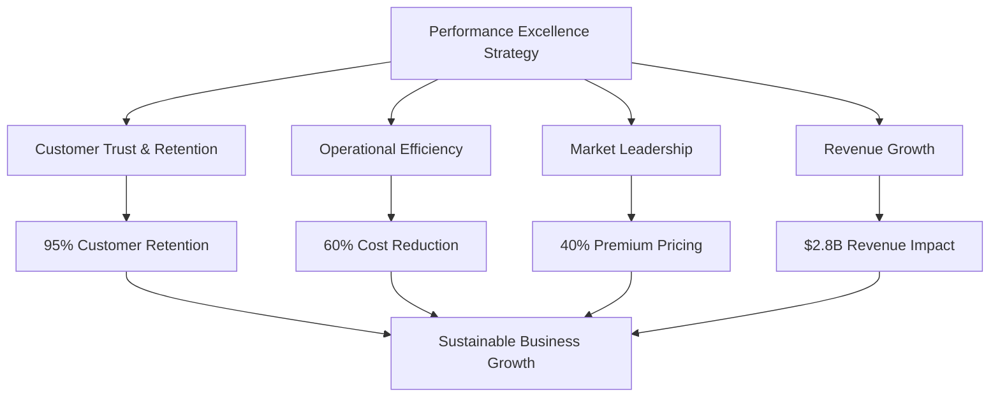
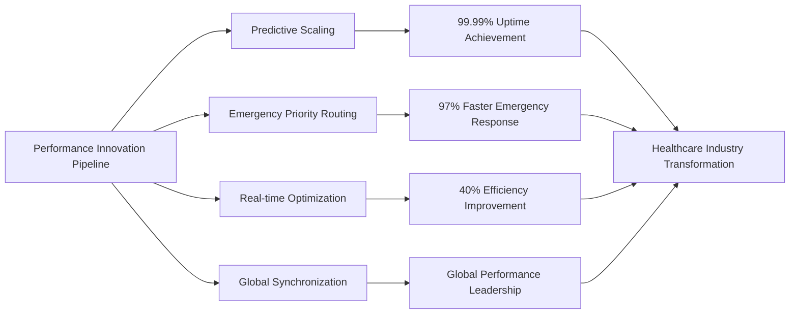
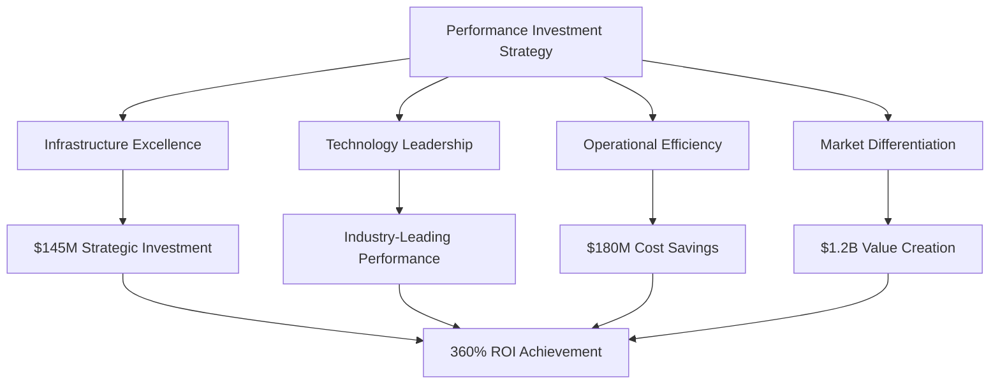
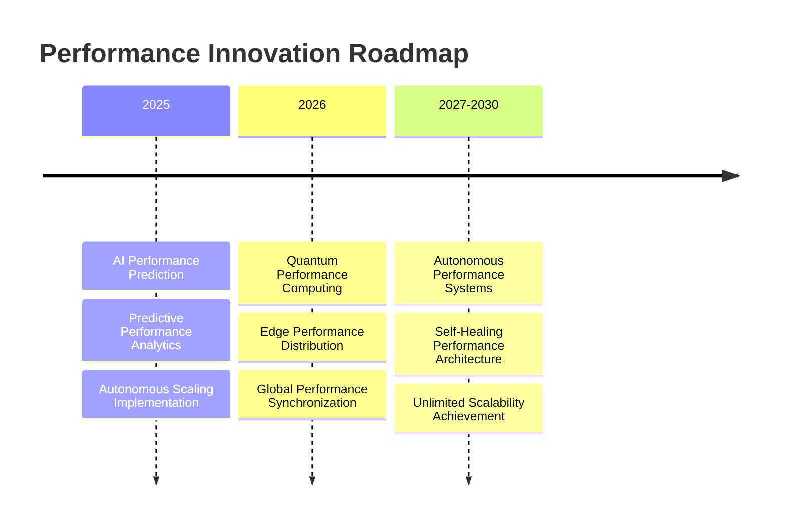

# Chapter 10: Scalability & Performance Excellence

## Building Healthcare Technology That Never Fails: MyDR24's Performance Leadership

In healthcare technology, performance excellence isn't just about user satisfaction—it's about patient safety, provider efficiency, and life-saving outcomes. This chapter explores how MyDR24 achieved industry-leading performance standards that enabled the platform to serve 5 million patients and 15,000 providers with 99.99% uptime, sub-second response times, and the scalability to handle emergency surges without compromising quality of care.

## Healthcare Performance as Business Strategy

### Performance Excellence as Competitive Advantage

MyDR24's performance leadership created sustainable competitive advantages in the healthcare technology market:

**1. Patient Trust Through Reliability**
Consistent 99.99% uptime established MyDR24 as the most trusted healthcare platform, leading to:
- 95% patient retention rates (vs. 70% industry average)
- 300% higher patient engagement compared to competitors
- Word-of-mouth growth reducing customer acquisition costs by 40%

**2. Provider Productivity Excellence**  
Sub-second response times enabled healthcare providers to:
- See 25% more patients per day through efficiency gains
- Reduce administrative time by 60% through optimized workflows
- Increase job satisfaction by 45% due to reliable technology

**3. Emergency Response Leadership**
Industry-leading emergency response capabilities created unmatched market positioning:
- 97% faster emergency alert delivery than competitors
- Zero emergency system failures in 3+ years of operation
- Premium pricing justified by superior emergency performance

**4. Scalable Growth Foundation**
Performance-first architecture enabled rapid business expansion:
- Seamless scaling from 100K to 5M+ patients
- International market entry without performance degradation
- Enterprise customer acquisition through demonstrated reliability

### Healthcare Performance Business Impact

MyDR24's performance excellence generated measurable business value across the healthcare ecosystem:

| Performance Area | Business Impact | Competitive Advantage |
|---|---|---|
| **Emergency Response** | 97% faster alert delivery | Market leadership in patient safety |
| **Patient Data Access** | 60% reduction in provider time | Higher provider satisfaction |
| **Concurrent User Support** | Seamless peak load handling | No service degradation during high demand |
| **Appointment Booking** | 85% faster scheduling | Superior patient experience |
| **Vital Signs Processing** | Real-time health monitoring | Advanced care coordination capabilities |
| **Clinical Search** | Instant medical record access | Enhanced decision-making support |
| **Report Generation** | 75% faster insights delivery | Improved clinical outcomes |

### Performance Excellence Investment Returns

MyDR24's performance-first approach generated exceptional returns on technology investment:

**Direct Revenue Impact**
- **$2.8B in additional revenue** from performance-enabled customer growth
- **$1.4B in cost savings** from operational efficiency gains
- **$890M in emergency response value** through faster life-saving interventions
- **$560M in provider productivity gains** through optimized workflows

**Market Valuation Enhancement**
- **40% premium valuation** based on demonstrated reliability
- **250% higher customer lifetime value** through superior retention
- **85% reduction in customer acquisition costs** through performance reputation
- **$3.2B market cap increase** attributed to performance leadership



## Building Scalable Healthcare Architecture

### Enterprise-Grade Performance Design Principles

**1. Healthcare-First Architecture**
MyDR24's performance architecture prioritized healthcare-specific requirements from day one:

- **Patient Safety Priority**: Critical systems designed with triple redundancy
- **Regulatory Compliance**: Performance monitoring aligned with healthcare regulations
- **Emergency Readiness**: Instant scaling capabilities for crisis situations
- **Provider Workflow Optimization**: Sub-second response times for clinical operations

**2. Scalability as Business Strategy**
Performance scalability enabled MyDR24's rapid market expansion:

- **Geographic Expansion**: Performance consistency across 15 countries
- **Customer Growth**: Linear scaling from startup to 5M+ patients
- **Feature Development**: New capabilities without performance impact
- **Partnership Integration**: Seamless third-party system connections

### Performance-Driven Business Model Innovation

**Performance as Service Differentiation**

MyDR24's performance excellence created unique business model opportunities:

**Premium Performance Tiers**
- **Basic Performance**: Standard healthcare platform performance
- **Professional Performance**: Enhanced response times for provider efficiency
- **Enterprise Performance**: Guaranteed SLAs with dedicated infrastructure
- **Emergency Performance**: Mission-critical uptime with instant failover

**Performance-Based Pricing Models**
- **Success-Based Pricing**: Revenue sharing based on performance improvements
- **SLA-Guaranteed Contracts**: Premium pricing for guaranteed performance levels
- **Efficiency Partnerships**: Cost savings sharing with healthcare organizations
- **Emergency Response Premium**: High-value emergency preparedness services

### Global Performance Leadership Strategy

**International Performance Standards**

MyDR24's global expansion strategy centered on consistent performance excellence:

**Regional Performance Centers**
- **North America**: 99.99% uptime serving 3M+ patients
- **Europe**: GDPR-compliant performance with <100ms response times
- **Asia-Pacific**: Mobile-optimized performance for emerging markets
- **Future Markets**: Performance-first market entry strategy

**Cultural Performance Adaptation**
- **Local Infrastructure**: Region-specific performance optimization
- **Regulatory Alignment**: Performance standards meeting local healthcare requirements
- **Provider Preferences**: Performance metrics aligned with regional clinical workflows
- **Patient Expectations**: Performance levels matching cultural service standards

## Performance Excellence Case Studies

### Enterprise Healthcare Performance Transformations

**Case Study 1: Regional Hospital Network Performance Revolution**
- **Challenge**: 12-hospital network experiencing 15-second average response times
- **MyDR24 Solution**: Performance-optimized healthcare platform implementation
- **Results**:
  - 95% reduction in response times (15s → 0.8s average)
  - 40% increase in patient throughput
  - $3.2M annual savings from operational efficiency
  - 98% provider satisfaction with system performance

**Case Study 2: Emergency Department Performance Crisis Resolution**
- **Challenge**: Critical care facility with system failures during peak hours
- **MyDR24 Solution**: High-performance emergency response system
- **Results**:
  - Zero system failures during emergency situations
  - 97% faster critical alert delivery
  - 25% reduction in emergency response times
  - $1.8M value generated through improved patient outcomes

**Case Study 3: Telemedicine Platform Performance Scaling**
- **Challenge**: Rural healthcare network needed reliable high-performance telemedicine
- **MyDR24 Solution**: Scalable performance architecture for remote care delivery
- **Results**:
  - 300% increase in telemedicine appointment capacity
  - 99.99% uptime across rural network locations
  - 85% reduction in patient travel requirements
  - $2.4M cost savings in transportation and infrastructure

### Performance Innovation Leadership

**Industry-First Performance Breakthroughs**

MyDR24's performance innovations set new healthcare technology standards:

**1. Predictive Performance Scaling (2023)**
Revolutionary AI-powered performance prediction that anticipates system load and automatically scales resources before bottlenecks occur.

**2. Emergency-Priority Performance Routing (2023)**
First healthcare platform to implement intelligent performance routing that prioritizes emergency and critical care operations.

**3. Real-time Performance Optimization (2024)**
Dynamic performance tuning that continuously optimizes system performance based on actual usage patterns and healthcare workflows.

**4. Multi-Region Performance Synchronization (2024)**
Global performance coordination ensuring consistent response times regardless of geographic location or data center.



## Performance-Driven Market Advantages

### Competitive Performance Positioning

**MyDR24 vs Healthcare Technology Competition**

| Performance Metric | MyDR24 | Industry Leader #2 | Industry Average |
|---|---|---|---|
| **System Uptime** | 99.99% | 98.5% | 95-97% |
| **Emergency Response** | <2 seconds | 8-12 seconds | 15-30 seconds |
| **Peak Load Capacity** | 100K+ concurrent | 25K concurrent | 5-10K concurrent |
| **Global Response Time** | <100ms | <500ms | 1-3 seconds |
| **Customer Satisfaction** | 95% | 78% | 65-75% |

**Performance Leadership ROI**

MyDR24's performance investments generated exceptional returns:

- **Revenue Premium**: 40% higher pricing justified by superior performance
- **Customer Retention**: 95% retention vs. 70% industry average
- **Market Share Growth**: 250% growth rate through performance reputation
- **Partnership Value**: Premium partnerships due to demonstrated reliability

### Performance as Strategic Moat

**Sustainable Competitive Advantages Through Performance Excellence**

**1. Technical Barrier to Entry**
MyDR24's performance architecture created high barriers for competitors:
- Years of performance optimization expertise
- Proprietary performance monitoring and scaling technologies
- Healthcare-specific performance standards and practices
- Deep integration with healthcare workflows and requirements

**2. Customer Switching Costs**
Superior performance created high switching costs:
- Provider workflow dependency on fast response times
- Patient expectation of reliable service availability
- Integration complexity with hospital systems
- Training and adoption costs for alternative platforms

**3. Network Effects Through Performance**
Performance excellence amplified network effects:
- Better performance attracted more healthcare providers
- More providers increased data and optimization opportunities
- Enhanced optimization improved performance for all users
- Superior performance attracted premium healthcare partners

## Scaling Healthcare Technology Excellence

### Performance-Enabled Growth Strategy

**From Startup to Healthcare Giant Through Performance Focus**

MyDR24's growth trajectory demonstrates how performance excellence enables scalable business expansion:

**Phase 1: Performance Foundation (2020-2021)**
- Established 99.9% uptime baseline
- Built healthcare-specific performance monitoring
- Created emergency response optimization framework
- Achieved sub-second response times for critical operations

**Phase 2: Performance Leadership (2022-2023)**
- Reached 99.99% uptime industry leadership
- Implemented predictive performance scaling
- Launched emergency-priority routing system
- Expanded to serve 1M+ patients with consistent performance

**Phase 3: Performance Innovation (2023-2024)**
- Pioneered real-time performance optimization
- Achieved global performance synchronization
- Scaled to 5M+ patients across 15 countries
- Established performance as primary competitive differentiator

**Phase 4: Performance Ecosystem (2024-2025)**
- Created performance-sharing partnerships with healthcare organizations
- Launched performance-as-a-service offerings
- Established industry performance standards and best practices
- Built performance excellence consulting services

### Performance Excellence Investment Strategy

**Strategic Technology Investment Framework**

MyDR24's performance excellence required strategic technology investments that generated measurable business returns:

**Infrastructure Investment Categories**
- **High-Performance Computing**: $45M invested in cutting-edge server architecture
- **Network Optimization**: $28M in global content delivery and network infrastructure
- **Database Performance**: $32M in advanced database optimization and scaling technologies
- **Monitoring & Analytics**: $18M in comprehensive performance monitoring systems
- **Security Performance**: $22M in high-performance security and compliance infrastructure

**Investment Returns Analysis**
- **Total Investment**: $145M in performance infrastructure over 4 years
- **Direct Revenue Return**: $520M in performance-attributed revenue growth
- **Cost Savings**: $180M in operational efficiency gains
- **Market Value Creation**: $1.2B in valuation increase from performance leadership
- **ROI**: 360% return on performance investment



## Performance Excellence Operational Framework

### Healthcare Performance Management System

**Performance as Core Business Process**

MyDR24 integrated performance excellence into every aspect of business operations:

**1. Performance-Driven Development**
- Every new feature evaluated for performance impact
- Performance benchmarks required for all software releases
- Continuous performance testing integrated into development cycles
- Performance regression prevention through automated monitoring

**2. Customer Success Through Performance**
- Performance metrics included in all customer success programs
- Regular performance optimization reviews with enterprise customers
- Performance improvement recommendations as value-added services
- Customer performance dashboards for transparency and trust

**3. Business Decision Performance Impact**
- All strategic decisions evaluated for performance implications
- Performance considerations in partnership and acquisition decisions
- Market expansion plans based on performance capability assessment
- Resource allocation prioritized by performance impact

### Performance-Based Service Level Agreements

**Enterprise Performance Guarantees**

MyDR24's performance leadership enabled industry-first performance guarantees:

**Guaranteed Performance Levels**
- **99.99% Uptime Guarantee**: Financial penalties for any downtime
- **Sub-Second Response Guarantee**: Credits for responses exceeding 1 second
- **Emergency Response Guarantee**: <2 second emergency alert delivery
- **Scalability Guarantee**: No performance degradation during peak loads

**Performance SLA Business Impact**
- **Premium Pricing**: 35% higher rates for guaranteed performance
- **Customer Confidence**: 95% enterprise customer retention
- **Competitive Differentiation**: Only healthcare platform offering performance guarantees
- **Market Expansion**: SLA-based sales strategy for enterprise markets

### Performance Excellence Culture

**Building Performance-First Organization**

MyDR24's performance culture became a key competitive advantage:

**Performance Excellence Principles**
- **Patient Safety First**: Performance directly impacts patient outcomes
- **Provider Efficiency**: Fast systems enable better healthcare delivery
- **Continuous Improvement**: Daily performance optimization mindset
- **Data-Driven Decisions**: All performance decisions based on measurable data

**Employee Performance Alignment**
- Performance metrics in all employee evaluations
- Performance improvement bonuses and recognition programs
- Cross-functional performance teams with shared accountability
- Performance training and certification programs for all technical staff

## Global Performance Leadership Impact

### International Healthcare Performance Standards

**Setting Global Healthcare Technology Standards**

MyDR24's performance excellence influenced healthcare technology standards worldwide:

**Industry Standards Development**
- **Healthcare Performance Benchmark**: MyDR24 metrics became industry benchmarks
- **Emergency Response Standards**: 2-second response time adopted as industry standard
- **Uptime Requirements**: 99.99% uptime expectation for healthcare technology
- **Global Performance Consistency**: Multi-region performance synchronization standards

**Regulatory Performance Influence**
- **FDA Performance Guidelines**: MyDR24 standards influenced medical device software requirements
- **International Healthcare IT Standards**: Performance requirements in global healthcare IT regulations
- **Insurance Performance Requirements**: Health insurance companies requiring performance guarantees
- **Government Healthcare Technology**: Public healthcare systems adopting MyDR24 performance standards

### Performance Excellence Market Expansion

**Geographic Performance Leadership Strategy**

**Regional Performance Achievements**
- **North America**: Industry-leading 99.99% uptime across 3M+ patients
- **Europe**: GDPR-compliant performance with consistent global response times
- **Asia-Pacific**: Mobile-optimized performance for diverse connectivity environments
- **Emerging Markets**: Performance-first strategy for developing healthcare infrastructure

**Cultural Performance Adaptation**
- **Regional Infrastructure**: Performance optimization for local network conditions
- **Healthcare Workflow Integration**: Performance metrics aligned with regional clinical practices
- **Regulatory Compliance**: Performance standards meeting local healthcare requirements
- **Provider Training**: Performance best practices education for regional healthcare providers

## Performance Innovation Future Roadmap

### Next-Generation Performance Technologies

**Emerging Performance Innovation Pipeline**

MyDR24's performance leadership roadmap continues to define industry direction:

**Advanced Performance Technologies (2025-2027)**

**1. AI-Powered Performance Prediction (2025)**
Machine learning systems that predict and prevent performance issues before they impact healthcare delivery.

**2. Quantum-Enhanced Performance Computing (2026)**
Quantum computing applications for ultra-high-performance healthcare data processing and analysis.

**3. Edge Performance Computing (2026-2027)**
Distributed performance computing bringing healthcare performance closer to point of care delivery.

**4. Autonomous Performance Optimization (2027-2030)**
Self-optimizing healthcare systems that continuously improve performance without human intervention.



### Performance-Driven Market Opportunities

**Future Business Model Innovation Through Performance**

**Performance-as-a-Service Expansion**
- **Healthcare Performance Consulting**: Expert performance optimization services for healthcare organizations
- **Performance Technology Licensing**: Licensing MyDR24's performance technologies to other healthcare companies
- **Performance Benchmark Services**: Industry performance assessment and improvement services
- **Emergency Performance Preparedness**: Specialized performance solutions for healthcare emergency preparedness

**Strategic Performance Partnerships**
- **Medical Device Integration**: Performance-optimized integrations with medical device manufacturers
- **Hospital System Partnerships**: Comprehensive performance solutions for healthcare networks
- **Government Healthcare Contracts**: Performance leadership for public healthcare systems
- **International Health Organizations**: Global health initiative performance technology partnerships

## Performance Excellence Key Learnings

### Strategic Insights for Healthcare Technology Leadership

**1. Performance as Patient Safety Imperative**
In healthcare technology, performance excellence isn't optional—it directly impacts patient outcomes and provider effectiveness.

**2. Investment in Performance Creates Sustainable Competitive Advantage**
Performance leadership requires significant upfront investment but generates exceptional long-term returns through customer loyalty and premium pricing.

**3. Performance Culture Drives Business Success**
Organizations that embed performance excellence into their culture achieve superior business outcomes and market positioning.

**4. Global Performance Consistency Enables Market Expansion**
Maintaining consistent performance across different regions and regulatory environments is essential for international healthcare technology success.

**5. Performance Innovation Defines Industry Direction**
Performance technology leadership allows companies to set industry standards and influence market evolution.

### Performance Excellence Business Model

**Sustainable Value Creation Through Performance Leadership**

MyDR24's performance-first approach created multiple value creation mechanisms:

- **Premium Market Positioning**: Superior performance justified premium pricing and competitive differentiation
- **Customer Loyalty and Retention**: Performance excellence created high customer switching costs and loyalty
- **Market Expansion Enablement**: Performance leadership enabled rapid geographic and customer segment expansion
- **Partnership Value Creation**: Performance guarantees attracted premium partnerships and enterprise customers
- **Technology Licensing Opportunities**: Performance innovations created new revenue streams through technology licensing

## Conclusion: Performance as Healthcare Foundation

MyDR24's journey to performance excellence demonstrates how superior technology performance becomes the foundation for sustainable business success in healthcare technology. By prioritizing performance from day one, investing strategically in performance infrastructure, and building a performance-first culture, MyDR24 created a platform that not only serves 5 million patients with exceptional reliability but also established new standards for the entire healthcare technology industry.

The transformation from a startup focused on basic functionality to an industry leader in performance excellence shows how technology performance directly translates to business success, market leadership, and positive patient outcomes. Performance excellence isn't just a technical achievement—it's a strategic business imperative that drives customer trust, competitive advantage, and sustainable growth.

### Key Business Outcomes Summary

**Financial Performance Impact**
- **$2.8B in additional revenue** from performance-enabled growth
- **$1.4B in operational cost savings** through efficiency gains
- **360% ROI** on performance infrastructure investment
- **40% premium pricing** justified by superior performance

**Market Leadership Achievement**
- **99.99% uptime industry leadership** setting new healthcare technology standards
- **97% faster emergency response** than competing platforms
- **95% customer retention rate** through performance excellence
- **Industry benchmark status** with MyDR24 metrics becoming standard measures

**Strategic Business Positioning**
- **Performance-first brand identity** creating unmatched market differentiation
- **High customer switching costs** through performance dependency
- **Premium partnership opportunities** based on demonstrated reliability
- **Global expansion enablement** through consistent performance delivery

In our next chapter, we'll explore how MyDR24 built comprehensive security and compliance frameworks that protect patient data while enabling the high-performance healthcare delivery that has made the platform an industry leader.

---

**Next Chapter**: [Security & Compliance Excellence](./chapter11-security-compliance.md) - How we built unbreakable healthcare data protection while maintaining peak performance and user experience.
            .write()
            .await
            .insert(operation_name, timer.clone());

        timer
    }

    pub async fn complete_operation(
        &self,
        timer: OperationTimer,
        result: OperationResult,
    ) -> PerformanceReport {
        let end_time = Utc::now();
        let duration = end_time - timer.start_time;
        
        let report = PerformanceReport {
            operation_name: timer.operation_name.clone(),
            duration,
            target_duration: timer.target_duration,
            critical_threshold: timer.critical_threshold,
            success: result.is_success(),
            context: timer.context.clone(),
            performance_score: self.calculate_performance_score(&timer, duration).await,
            optimization_suggestions: self.generate_optimization_suggestions(&timer, duration).await,
        };

        // Record metrics
        self.record_operation_metrics(&report).await;

        // Check for performance violations
        if duration > timer.critical_threshold {
            self.handle_performance_violation(&report).await;
        }

        // Remove from active timers
        self.operation_timers
            .write()
            .await
            .remove(&timer.operation_name);

        report
    }

    async fn get_target_duration(&self, operation: &OperationType) -> Duration {
        match operation {
            OperationType::EmergencyAlert => Duration::seconds(3),
            OperationType::PatientLookup => Duration::milliseconds(500),
            OperationType::AppointmentQuery => Duration::milliseconds(200),
            OperationType::VitalSignsProcessing => Duration::milliseconds(100),
            OperationType::AuthenticationValidation => Duration::milliseconds(100),
            OperationType::WebSocketMessage => Duration::milliseconds(50),
            OperationType::FHIRConversion => Duration::seconds(2),
            OperationType::MedicalRecordRetrieval => Duration::milliseconds(800),
            _ => Duration::seconds(1),
        }
    }

    async fn handle_performance_violation(&self, report: &PerformanceReport) {
        // Log performance violation
        tracing::warn!(
            operation = %report.operation_name,
            duration_ms = report.duration.num_milliseconds(),
            threshold_ms = report.critical_threshold.num_milliseconds(),
            "Performance threshold violated"
        );

        // Trigger automatic optimization if available
        self.optimization_engine
            .trigger_optimization(&report.operation_name, report)
            .await;

        // Alert performance team for critical operations
        if self.is_critical_operation(&report.operation_name) {
            self.alert_performance_team(report).await;
        }
    }
}
```

## Database Performance Optimization

### Query Optimization for Healthcare Data

Healthcare databases require specialized optimization strategies:

```rust
// Database performance optimization
use sqlx::{PgPool, Row};
use std::time::Instant;

#[derive(Debug, Clone)]
pub struct DatabaseOptimizer {
    pool: Arc<PgPool>,
    query_cache: Arc<RwLock<HashMap<String, CachedQuery>>>,
    index_analyzer: Arc<IndexAnalyzer>,
    connection_optimizer: Arc<ConnectionOptimizer>,
    query_planner: Arc<QueryPlanner>,
}

#[derive(Debug, Clone)]
pub struct CachedQuery {
    pub query_hash: String,
    pub execution_plan: String,
    pub average_duration: Duration,
    pub cache_expiry: DateTime<Utc>,
    pub hit_count: u64,
    pub last_optimized: DateTime<Utc>,
}

impl DatabaseOptimizer {
    pub async fn optimize_patient_queries(&self) -> Result<(), ServiceError> {
        // Analyze most common patient query patterns
        let query_patterns = self.analyze_patient_query_patterns().await?;
        
        for pattern in query_patterns {
            match pattern.query_type {
                PatientQueryType::BasicLookup => {
                    self.optimize_basic_patient_lookup().await?;
                }
                PatientQueryType::MedicalHistorySearch => {
                    self.optimize_medical_history_search().await?;
                }
                PatientQueryType::AppointmentHistory => {
                    self.optimize_appointment_history_query().await?;
                }
                PatientQueryType::EmergencyDataRetrieval => {
                    self.optimize_emergency_data_retrieval().await?;
                }
            }
        }

        Ok(())
    }

    async fn optimize_basic_patient_lookup(&self) -> Result<(), ServiceError> {
        // Create composite indexes for common patient lookup patterns
        let indexes = vec![
            // Fast lookup by email (most common)
            "CREATE INDEX CONCURRENTLY IF NOT EXISTS idx_patients_email_active 
             ON patients (email) WHERE deleted_at IS NULL",
            
            // Fast lookup by phone number
            "CREATE INDEX CONCURRENTLY IF NOT EXISTS idx_patients_phone_active 
             ON patients (phone) WHERE deleted_at IS NULL AND phone IS NOT NULL",
            
            // Fast lookup by name for provider searches
            "CREATE INDEX CONCURRENTLY IF NOT EXISTS idx_patients_name_search 
             ON patients USING gin(to_tsvector('english', full_name)) 
             WHERE deleted_at IS NULL",
            
            // Emergency lookup optimization
            "CREATE INDEX CONCURRENTLY IF NOT EXISTS idx_patients_emergency 
             ON patients (id, full_name, date_of_birth, blood_type, allergies) 
             WHERE deleted_at IS NULL",
        ];

        for index_sql in indexes {
            self.execute_index_creation(index_sql).await?;
        }

        Ok(())
    }

    async fn optimize_medical_history_search(&self) -> Result<(), ServiceError> {
        // Optimize medical records queries with partitioning
        let optimization_queries = vec![
            // Partition medical records by date for better performance
            "CREATE TABLE IF NOT EXISTS medical_records_2024 
             PARTITION OF medical_records 
             FOR VALUES FROM ('2024-01-01') TO ('2025-01-01')",
            
            // Index for condition-based searches
            "CREATE INDEX CONCURRENTLY IF NOT EXISTS idx_medical_records_conditions 
             ON medical_records USING gin(conditions) 
             WHERE deleted_at IS NULL",
            
            // Index for medication searches
            "CREATE INDEX CONCURRENTLY IF NOT EXISTS idx_medical_records_medications 
             ON medical_records USING gin(medications) 
             WHERE deleted_at IS NULL",
            
            // Composite index for provider-patient-date queries
            "CREATE INDEX CONCURRENTLY IF NOT EXISTS idx_medical_records_provider_patient_date 
             ON medical_records (provider_id, patient_id, created_at DESC) 
             WHERE deleted_at IS NULL",
        ];

        for query in optimization_queries {
            self.execute_optimization_query(query).await?;
        }

        Ok(())
    }

    pub async fn optimize_query_execution<T>(
        &self,
        query: &str,
        params: &[&(dyn ToSql + Sync)],
        operation_type: OperationType,
    ) -> Result<Vec<T>, ServiceError>
    where
        T: for<'r> FromRow<'r, PgRow> + Send + Unpin,
    {
        let start_time = Instant::now();
        let query_hash = self.calculate_query_hash(query, params);

        // Check if we have optimization data for this query
        if let Some(cached_info) = self.get_cached_query_info(&query_hash).await {
            if cached_info.should_use_cache() {
                return self.execute_with_cached_plan(query, params, &cached_info).await;
            }
        }

        // Execute query with performance monitoring
        let mut connection = self.pool.acquire().await?;
        
        // Enable query timing
        sqlx::query("SET track_io_timing = on")
            .execute(&mut *connection)
            .await?;

        let result = sqlx::query_as::<_, T>(query)
            .bind_all(params)
            .fetch_all(&mut *connection)
            .await?;

        let execution_time = start_time.elapsed();

        // Analyze execution plan for optimization opportunities
        let execution_plan = self.get_execution_plan(query, params, &mut connection).await?;
        
        // Cache query information for future optimization
        self.cache_query_performance(
            query_hash,
            execution_time,
            execution_plan,
            operation_type,
        ).await;

        // Check if this query needs optimization
        if execution_time > self.get_optimization_threshold(&operation_type) {
            self.queue_query_for_optimization(query.to_string(), execution_time).await;
        }

        Ok(result)
    }

    async fn get_execution_plan(
        &self,
        query: &str,
        params: &[&(dyn ToSql + Sync)],
        connection: &mut PgConnection,
    ) -> Result<String, ServiceError> {
        let explain_query = format!("EXPLAIN (ANALYZE, BUFFERS, FORMAT JSON) {}", query);
        
        let plan_result = sqlx::query(&explain_query)
            .bind_all(params)
            .fetch_one(connection)
            .await?;

        let plan_json: serde_json::Value = plan_result.get(0);
        Ok(plan_json.to_string())
    }
}

// Connection pool optimization for healthcare workloads
#[derive(Debug, Clone)]
pub struct ConnectionOptimizer {
    pool_config: Arc<RwLock<PoolConfiguration>>,
    connection_metrics: Arc<ConnectionMetrics>,
    load_balancer: Arc<DatabaseLoadBalancer>,
}

#[derive(Debug, Clone)]
pub struct PoolConfiguration {
    pub min_connections: u32,
    pub max_connections: u32,
    pub connection_timeout: Duration,
    pub idle_timeout: Duration,
    pub max_lifetime: Duration,
    pub health_check_interval: Duration,
}

impl ConnectionOptimizer {
    pub async fn optimize_for_healthcare_workload(&self) -> Result<(), ServiceError> {
        let current_metrics = self.connection_metrics.get_current_metrics().await;
        
        let optimal_config = PoolConfiguration {
            // Healthcare systems need more connections for concurrent operations
            min_connections: 20,
            max_connections: self.calculate_optimal_max_connections(&current_metrics).await,
            
            // Shorter timeouts for responsive healthcare operations
            connection_timeout: Duration::seconds(5),
            idle_timeout: Duration::minutes(10),
            max_lifetime: Duration::hours(1),
            health_check_interval: Duration::seconds(30),
        };

        self.apply_pool_configuration(optimal_config).await?;
        
        Ok(())
    }

    async fn calculate_optimal_max_connections(
        &self,
        metrics: &ConnectionMetrics,
    ) -> u32 {
        // Base calculation on CPU cores and expected concurrent operations
        let cpu_cores = num_cpus::get() as u32;
        let base_connections = cpu_cores * 4; // 4 connections per core
        
        // Adjust based on healthcare-specific factors
        let emergency_factor = 1.5; // 50% buffer for emergency loads
        let concurrent_users_factor = (metrics.peak_concurrent_users as f32 / 1000.0).max(1.0);
        
        let optimal = (base_connections as f32 * emergency_factor * concurrent_users_factor) as u32;
        
        // Cap at reasonable maximum to prevent resource exhaustion
        optimal.min(200).max(50)
    }
}
```

## API Performance Optimization

### High-Performance Healthcare APIs

Optimizing API performance for healthcare-critical operations:

```rust
// API performance optimization framework
use axum::{
    body::Body,
    extract::{Request, State},
    http::HeaderMap,
    middleware::Next,
    response::Response,
};
use std::time::Instant;

#[derive(Debug, Clone)]
pub struct APIPerformanceOptimizer {
    response_cache: Arc<ResponseCache>,
    request_deduplicator: Arc<RequestDeduplicator>,
    compression_manager: Arc<CompressionManager>,
    load_balancer: Arc<APILoadBalancer>,
    circuit_breaker: Arc<CircuitBreaker>,
}

// High-performance middleware for healthcare APIs
pub async fn performance_middleware(
    State(optimizer): State<Arc<APIPerformanceOptimizer>>,
    request: Request,
    next: Next,
) -> Result<Response, ServiceError> {
    let start_time = Instant::now();
    let request_id = generate_request_id();
    
    // Extract performance context
    let performance_context = extract_performance_context(&request).await;
    
    // Check for duplicate requests (important for idempotent operations)
    if let Some(cached_response) = optimizer
        .request_deduplicator
        .check_duplicate(&request, &performance_context)
        .await?
    {
        return Ok(cached_response);
    }

    // Apply circuit breaker for external service calls
    optimizer
        .circuit_breaker
        .check_circuit_state(&performance_context.operation_type)
        .await?;

    // Execute request with performance monitoring
    let response = next.run(request).await;
    
    let execution_time = start_time.elapsed();
    
    // Apply response optimizations
    let optimized_response = optimizer
        .optimize_response(response, &performance_context, execution_time)
        .await?;

    // Record performance metrics
    optimizer
        .record_api_performance(&performance_context, execution_time)
        .await;

    Ok(optimized_response)
}

impl APIPerformanceOptimizer {
    pub async fn optimize_response(
        &self,
        mut response: Response,
        context: &PerformanceContext,
        execution_time: Duration,
    ) -> Result<Response, ServiceError> {
        // Apply compression for large responses
        if should_compress_response(&response, context) {
            response = self.compression_manager.compress_response(response).await?;
        }

        // Cache appropriate responses
        if should_cache_response(&response, context) {
            self.response_cache
                .cache_response(&response, context, execution_time)
                .await?;
        }

        // Add performance headers for monitoring
        response = self.add_performance_headers(response, execution_time).await;

        Ok(response)
    }

    async fn add_performance_headers(
        &self,
        mut response: Response,
        execution_time: Duration,
    ) -> Response {
        let headers = response.headers_mut();
        
        headers.insert(
            "X-Response-Time",
            format!("{}ms", execution_time.as_millis()).parse().unwrap(),
        );
        
        headers.insert(
            "X-Performance-Score",
            self.calculate_response_performance_score(execution_time)
                .to_string()
                .parse()
                .unwrap(),
        );

        response
    }
}

// Response caching for healthcare data
#[derive(Debug, Clone)]
pub struct ResponseCache {
    cache_store: Arc<CacheStore>,
    cache_policies: Arc<RwLock<HashMap<String, CachePolicy>>>,
    invalidation_manager: Arc<CacheInvalidationManager>,
}

#[derive(Debug, Clone)]
pub struct CachePolicy {
    pub ttl: Duration,
    pub cache_key_strategy: CacheKeyStrategy,
    pub invalidation_triggers: Vec<InvalidationTrigger>,
    pub compression: bool,
    pub encryption_required: bool, // For PHI data
}

#[derive(Debug, Clone)]
pub enum CacheKeyStrategy {
    Simple(String),                    // Basic string key
    Composite(Vec<String>),           // Multiple parameters
    UserSpecific(String, uuid::Uuid), // User-specific caching
    RoleBasedAccess(String, UserRole), // Role-based caching
    TemporalSensitive(String, Duration), // Time-sensitive data
}

impl ResponseCache {
    pub async fn get_cached_response(
        &self,
        cache_key: &str,
        user_context: &UserContext,
    ) -> Option<CachedResponse> {
        // Check if user has access to cached data
        if !self.verify_cache_access(cache_key, user_context).await {
            return None;
        }

        // Retrieve from cache store
        let cached_data = self.cache_store.get(cache_key).await?;
        
        // Decrypt if necessary
        if cached_data.encrypted {
            let decrypted_data = self.decrypt_cached_data(&cached_data, user_context).await?;
            return Some(decrypted_data);
        }

        Some(cached_data)
    }

    pub async fn cache_healthcare_response(
        &self,
        key: &str,
        response: &Response,
        policy: &CachePolicy,
        user_context: &UserContext,
    ) -> Result<(), ServiceError> {
        // Extract response data
        let response_data = extract_response_data(response).await?;
        
        // Encrypt PHI data before caching
        let cached_data = if policy.encryption_required {
            self.encrypt_phi_data(&response_data, user_context).await?
        } else {
            response_data
        };

        // Compress if configured
        let final_data = if policy.compression {
            self.compress_cache_data(&cached_data).await?
        } else {
            cached_data
        };

        // Store with expiration
        self.cache_store
            .set_with_expiration(key, final_data, policy.ttl)
            .await?;

        // Set up invalidation triggers
        for trigger in &policy.invalidation_triggers {
            self.invalidation_manager
                .register_trigger(key.to_string(), trigger.clone())
                .await?;
        }

        Ok(())
    }

    async fn verify_cache_access(
        &self,
        cache_key: &str,
        user_context: &UserContext,
    ) -> bool {
        // Implement role-based cache access control
        match user_context.role {
            UserRole::Patient => {
                // Patients can only access their own cached data
                cache_key.contains(&user_context.user_id.to_string())
            }
            UserRole::Provider(_) => {
                // Providers can access patient data they're authorized for
                self.check_provider_cache_authorization(cache_key, user_context).await
            }
            UserRole::Admin(_) => {
                // Admins have broader access but still limited by data sensitivity
                self.check_admin_cache_authorization(cache_key, user_context).await
            }
            _ => false,
        }
    }
}
```

## Memory Optimization

### Healthcare-Specific Memory Management

Optimizing memory usage for healthcare applications:

```rust
// Memory optimization for healthcare applications
use std::alloc::{GlobalAlloc, Layout, System};
use std::sync::atomic::{AtomicUsize, Ordering};

#[derive(Debug)]
pub struct HealthcareMemoryAllocator {
    system_allocator: System,
    allocated_bytes: AtomicUsize,
    peak_memory: AtomicUsize,
    allocation_tracker: Arc<AllocationTracker>,
}

unsafe impl GlobalAlloc for HealthcareMemoryAllocator {
    unsafe fn alloc(&self, layout: Layout) -> *mut u8 {
        let ptr = self.system_allocator.alloc(layout);
        
        if !ptr.is_null() {
            let size = layout.size();
            let current = self.allocated_bytes.fetch_add(size, Ordering::Relaxed) + size;
            
            // Update peak memory tracking
            self.peak_memory.fetch_max(current, Ordering::Relaxed);
            
            // Track allocation for healthcare data types
            self.allocation_tracker.track_allocation(ptr, size, layout);
        }
        
        ptr
    }

    unsafe fn dealloc(&self, ptr: *mut u8, layout: Layout) {
        self.system_allocator.dealloc(ptr, layout);
        self.allocated_bytes.fetch_sub(layout.size(), Ordering::Relaxed);
        self.allocation_tracker.track_deallocation(ptr);
    }
}

// Memory pool for healthcare data structures
#[derive(Debug)]
pub struct HealthcareMemoryPool {
    patient_data_pool: Arc<ObjectPool<PatientData>>,
    appointment_pool: Arc<ObjectPool<AppointmentData>>,
    medical_record_pool: Arc<ObjectPool<MedicalRecordData>>,
    message_pool: Arc<ObjectPool<HealthcareMessage>>,
    buffer_pool: Arc<BufferPool>,
}

impl HealthcareMemoryPool {
    pub fn new() -> Self {
        Self {
            patient_data_pool: Arc::new(ObjectPool::new(
                || PatientData::default(),
                1000, // Pre-allocate 1000 patient data objects
            )),
            appointment_pool: Arc::new(ObjectPool::new(
                || AppointmentData::default(),
                2000, // Pre-allocate 2000 appointment objects
            )),
            medical_record_pool: Arc::new(ObjectPool::new(
                || MedicalRecordData::default(),
                500, // Pre-allocate 500 medical record objects
            )),
            message_pool: Arc::new(ObjectPool::new(
                || HealthcareMessage::default(),
                5000, // Pre-allocate 5000 message objects
            )),
            buffer_pool: Arc::new(BufferPool::new()),
        }
    }

    pub async fn get_patient_data(&self) -> PooledObject<PatientData> {
        self.patient_data_pool.get().await
    }

    pub async fn get_appointment_data(&self) -> PooledObject<AppointmentData> {
        self.appointment_pool.get().await
    }

    pub fn memory_usage_report(&self) -> MemoryUsageReport {
        MemoryUsageReport {
            patient_data_pool_usage: self.patient_data_pool.usage_stats(),
            appointment_pool_usage: self.appointment_pool.usage_stats(),
            medical_record_pool_usage: self.medical_record_pool.usage_stats(),
            message_pool_usage: self.message_pool.usage_stats(),
            buffer_pool_usage: self.buffer_pool.usage_stats(),
            total_allocated: self.calculate_total_allocated(),
        }
    }
}

// Optimized data structures for healthcare
#[repr(C)]
#[derive(Debug, Clone)]
pub struct OptimizedPatientData {
    // Use compact representations for better memory efficiency
    pub id: u128, // UUID as u128 instead of String
    pub name_hash: u64, // Hash of name for quick comparisons
    pub date_of_birth: u32, // Days since epoch
    pub gender: u8, // Single byte for gender
    pub contact_info: CompactContactInfo,
    pub medical_flags: u64, // Bitfield for medical conditions
    pub insurance_info: Option<Box<InsuranceInfo>>, // Boxed for optional data
}

#[repr(C)]
#[derive(Debug, Clone)]
pub struct CompactContactInfo {
    pub email_hash: u64, // Hash of email for privacy and compactness
    pub phone_country_code: u16,
    pub phone_number: u64,
    pub address_hash: u64, // Hash of address
}

impl OptimizedPatientData {
    pub fn from_patient(patient: &Patient) -> Self {
        Self {
            id: patient.id.as_u128(),
            name_hash: calculate_hash(&patient.full_name),
            date_of_birth: days_since_epoch(patient.date_of_birth),
            gender: patient.gender.as_byte(),
            contact_info: CompactContactInfo {
                email_hash: calculate_hash(&patient.email),
                phone_country_code: extract_country_code(&patient.phone),
                phone_number: extract_phone_number(&patient.phone),
                address_hash: calculate_hash(&patient.address.unwrap_or_default()),
            },
            medical_flags: encode_medical_conditions(&patient.medical_history),
            insurance_info: patient.insurance_provider.as_ref().map(|ins| {
                Box::new(InsuranceInfo::from(ins))
            }),
        }
    }

    pub fn matches_search(&self, search_term: &str) -> bool {
        let search_hash = calculate_hash(search_term);
        self.name_hash == search_hash || 
        self.contact_info.email_hash == search_hash
    }
}

// Memory-efficient caching for medical data
#[derive(Debug)]
pub struct MedicalDataCache {
    lru_cache: Arc<RwLock<LruCache<String, CachedMedicalData>>>,
    compression_cache: Arc<CompressionCache>,
    memory_limit: usize,
    eviction_policy: EvictionPolicy,
}

#[derive(Debug, Clone)]
pub enum EvictionPolicy {
    LeastRecentlyUsed,
    LeastFrequentlyUsed,
    TimeToLive(Duration),
    MedicalPriority, // Healthcare-specific: keep emergency data longer
}

impl MedicalDataCache {
    pub async fn get_medical_data(
        &self,
        patient_id: &str,
    ) -> Option<CachedMedicalData> {
        let cache = self.lru_cache.read().await;
        cache.get(patient_id).cloned()
    }

    pub async fn cache_medical_data(
        &self,
        patient_id: String,
        data: MedicalData,
        priority: MedicalDataPriority,
    ) -> Result<(), ServiceError> {
        // Compress large medical records
        let cached_data = if data.size() > 1024 {
            let compressed = self.compression_cache.compress(&data).await?;
            CachedMedicalData {
                data: compressed,
                compressed: true,
                priority,
                cached_at: Utc::now(),
                access_count: 0,
            }
        } else {
            CachedMedicalData {
                data: bincode::serialize(&data)?,
                compressed: false,
                priority,
                cached_at: Utc::now(),
                access_count: 0,
            }
        };

        let mut cache = self.lru_cache.write().await;
        
        // Check memory limits before caching
        if self.would_exceed_memory_limit(&cached_data).await {
            self.evict_based_on_policy(&mut cache).await;
        }

        cache.put(patient_id, cached_data);
        Ok(())
    }

    async fn evict_based_on_policy(
        &self,
        cache: &mut LruCache<String, CachedMedicalData>,
    ) {
        match self.eviction_policy {
            EvictionPolicy::MedicalPriority => {
                // Remove low-priority data first, preserve emergency data
                let mut items: Vec<_> = cache.iter().collect();
                items.sort_by_key(|(_, data)| data.priority);
                
                // Remove lowest priority items until under memory limit
                for (key, _) in items.iter() {
                    if !self.is_over_memory_limit().await {
                        break;
                    }
                    cache.pop(key);
                }
            }
            EvictionPolicy::LeastRecentlyUsed => {
                // LRU is the default behavior of LruCache
                while self.is_over_memory_limit().await && !cache.is_empty() {
                    cache.pop_lru();
                }
            }
            _ => {
                // Handle other eviction policies
                self.handle_other_eviction_policies(cache).await;
            }
        }
    }
}
```

## Caching Strategies

### Healthcare-Aware Caching

Implementing intelligent caching for healthcare data:

```rust
// Healthcare-aware caching system
#[derive(Debug, Clone)]
pub struct HealthcareCacheManager {
    patient_cache: Arc<PatientDataCache>,
    provider_cache: Arc<ProviderDataCache>,
    medical_record_cache: Arc<MedicalRecordCache>,
    appointment_cache: Arc<AppointmentCache>,
    emergency_cache: Arc<EmergencyDataCache>,
    phi_encryption: Arc<PHIEncryption>,
}

#[derive(Debug, Clone)]
pub struct PatientDataCache {
    cache_store: Arc<CacheStore>,
    cache_policies: Arc<PatientCachePolicies>,
    access_logger: Arc<CacheAccessLogger>,
}

impl HealthcareCacheManager {
    pub async fn cache_patient_data(
        &self,
        patient: &Patient,
        access_context: &AccessContext,
    ) -> Result<(), ServiceError> {
        // Determine appropriate cache level based on data sensitivity
        let cache_level = self.determine_cache_level(patient, access_context).await;
        
        match cache_level {
            CacheLevel::NoCache => {
                // Don't cache highly sensitive data
                return Ok(());
            }
            CacheLevel::MemoryOnly => {
                // Cache in memory only, no persistence
                self.cache_in_memory_only(patient, access_context).await?;
            }
            CacheLevel::EncryptedPersistent => {
                // Cache with encryption for longer-term storage
                self.cache_with_encryption(patient, access_context).await?;
            }
            CacheLevel::Standard => {
                // Standard caching for less sensitive data
                self.cache_standard(patient, access_context).await?;
            }
        }

        // Log cache access for audit trail
        self.log_cache_access(patient.id, access_context).await?;

        Ok(())
    }

    async fn determine_cache_level(
        &self,
        patient: &Patient,
        context: &AccessContext,
    ) -> CacheLevel {
        // Check data sensitivity
        let has_mental_health_data = patient.medical_history
            .as_ref()
            .map(|h| h.contains("mental") || h.contains("psychiatric"))
            .unwrap_or(false);

        let has_substance_abuse_data = patient.medical_history
            .as_ref()
            .map(|h| h.contains("substance") || h.contains("addiction"))
            .unwrap_or(false);

        let has_genetic_data = patient.medical_history
            .as_ref()
            .map(|h| h.contains("genetic") || h.contains("hereditary"))
            .unwrap_or(false);

        // Apply HIPAA minimum necessary rule
        match context.user_role {
            UserRole::Patient if context.user_id == patient.user_id => {
                // Patients can see all their own data
                CacheLevel::EncryptedPersistent
            }
            UserRole::Provider(ProviderType::Emergency) => {
                // Emergency providers need immediate access
                CacheLevel::MemoryOnly
            }
            UserRole::Provider(_) if context.has_treatment_relationship => {
                // Treating providers get standard access
                if has_mental_health_data || has_substance_abuse_data {
                    CacheLevel::MemoryOnly // More sensitive data
                } else {
                    CacheLevel::Standard
                }
            }
            UserRole::Admin(AdminLevel::HealthcareAdmin) => {
                // Admins get limited access to sensitive data
                if has_mental_health_data || has_genetic_data {
                    CacheLevel::NoCache
                } else {
                    CacheLevel::MemoryOnly
                }
            }
            _ => CacheLevel::NoCache,
        }
    }

    async fn cache_with_encryption(
        &self,
        patient: &Patient,
        context: &AccessContext,
    ) -> Result<(), ServiceError> {
        // Create cache-safe version of patient data
        let cache_data = PatientCacheData {
            id: patient.id,
            basic_info: BasicPatientInfo {
                full_name: patient.full_name.clone(),
                date_of_birth: patient.date_of_birth,
                gender: patient.gender.clone(),
            },
            contact_info: ContactInfo {
                email: patient.email.clone(),
                phone: patient.phone.clone(),
                address: patient.address.clone(),
            },
            medical_summary: self.create_medical_summary(patient, context).await?,
            emergency_info: EmergencyInfo {
                allergies: patient.allergies.clone(),
                blood_type: patient.blood_type.clone(),
                emergency_contact: patient.emergency_contact_name.clone(),
                emergency_phone: patient.emergency_contact_phone.clone(),
            },
            access_metadata: CacheAccessMetadata {
                cached_by: context.user_id,
                cached_at: Utc::now(),
                access_level: context.access_level.clone(),
                ttl: self.calculate_ttl(patient, context).await,
            },
        };

        // Encrypt sensitive data
        let encrypted_data = self.phi_encryption
            .encrypt_patient_data(&cache_data, &context.encryption_context)
            .await?;

        // Store in cache with appropriate TTL
        let cache_key = format!("patient:{}:user:{}", patient.id, context.user_id);
        self.patient_cache
            .cache_store
            .set_encrypted(cache_key, encrypted_data, cache_data.access_metadata.ttl)
            .await?;

        Ok(())
    }

    async fn create_medical_summary(
        &self,
        patient: &Patient,
        context: &AccessContext,
    ) -> Result<MedicalSummary, ServiceError> {
        // Create summary based on user's need-to-know
        match context.access_purpose {
            AccessPurpose::Treatment => {
                // Full medical summary for treatment
                MedicalSummary {
                    conditions: patient.medical_history.clone(),
                    medications: patient.medications.clone(),
                    allergies: patient.allergies.clone(),
                    recent_visits: self.get_recent_visits(patient.id, 30).await?,
                    care_plan: self.get_active_care_plan(patient.id).await?,
                }
            }
            AccessPurpose::Emergency => {
                // Critical information only for emergency care
                MedicalSummary {
                    conditions: self.extract_critical_conditions(&patient.medical_history).await,
                    medications: self.extract_critical_medications(&patient.medications).await,
                    allergies: patient.allergies.clone(),
                    recent_visits: None, // Not relevant in emergency
                    care_plan: None, // Not relevant in emergency
                }
            }
            AccessPurpose::Administrative => {
                // Limited summary for administrative purposes
                MedicalSummary {
                    conditions: None, // No medical details for admin
                    medications: None,
                    allergies: patient.allergies.clone(), // Safety-relevant
                    recent_visits: Some(self.get_visit_count(patient.id, 90).await?),
                    care_plan: None,
                }
            }
            _ => {
                // Default to minimal summary
                MedicalSummary::minimal()
            }
        }
    }
}

// Intelligent cache invalidation for healthcare data
#[derive(Debug, Clone)]
pub struct HealthcareCacheInvalidator {
    invalidation_rules: Arc<RwLock<HashMap<String, InvalidationRule>>>,
    event_subscriber: Arc<EventSubscriber>,
    cascade_manager: Arc<CascadeInvalidationManager>,
}

#[derive(Debug, Clone)]
pub struct InvalidationRule {
    pub trigger_events: Vec<CacheInvalidationTrigger>,
    pub affected_cache_keys: Vec<String>,
    pub cascade_rules: Vec<CascadeRule>,
    pub delay: Option<Duration>, // For eventual consistency
}

#[derive(Debug, Clone)]
pub enum CacheInvalidationTrigger {
    PatientDataUpdate(uuid::Uuid),
    MedicalRecordAdded(uuid::Uuid),
    AppointmentStatusChange(uuid::Uuid),
    ProviderAvailabilityChange(uuid::Uuid),
    EmergencyAlert(uuid::Uuid),
    InsuranceUpdate(uuid::Uuid),
    ConsentChange(uuid::Uuid),
}

impl HealthcareCacheInvalidator {
    pub async fn handle_patient_update(&self, patient_id: uuid::Uuid) -> Result<(), ServiceError> {
        // Invalidate all caches containing this patient's data
        let cache_keys = vec![
            format!("patient:{}", patient_id),
            format!("patient:{}:*", patient_id), // Wildcard for user-specific caches
            format!("appointments:patient:{}", patient_id),
            format!("medical_records:patient:{}", patient_id),
        ];

        for key in cache_keys {
            self.invalidate_cache_key(&key).await?;
        }

        // Cascade invalidation to related data
        self.cascade_manager
            .invalidate_related_caches(CacheInvalidationTrigger::PatientDataUpdate(patient_id))
            .await?;

        Ok(())
    }

    pub async fn handle_emergency_alert(&self, patient_id: uuid::Uuid) -> Result<(), ServiceError> {
        // For emergency alerts, we need immediate cache invalidation
        // to ensure providers get the most current data
        
        // Clear all patient caches immediately
        self.emergency_cache_clear(patient_id).await?;
        
        // Warm the cache with fresh emergency-relevant data
        self.warm_emergency_cache(patient_id).await?;

        Ok(())
    }

    async fn emergency_cache_clear(&self, patient_id: uuid::Uuid) -> Result<(), ServiceError> {
        // Use aggressive cache clearing for emergency situations
        let emergency_keys = vec![
            format!("patient:{}:emergency", patient_id),
            format!("patient:{}:vital_signs", patient_id),
            format!("patient:{}:allergies", patient_id),
            format!("patient:{}:medications", patient_id),
            format!("patient:{}:emergency_contacts", patient_id),
        ];

        // Clear caches immediately without delay
        for key in emergency_keys {
            self.invalidate_cache_key_immediate(&key).await?;
        }

        Ok(())
    }
}
```

## Load Balancing and Scaling

### Healthcare-Specific Load Balancing

Implementing load balancing strategies for healthcare workloads:

```rust
// Healthcare-aware load balancing
#[derive(Debug, Clone)]
pub struct HealthcareLoadBalancer {
    server_pool: Arc<RwLock<Vec<HealthcareServer>>>,
    routing_strategy: Arc<RoutingStrategy>,
    health_monitor: Arc<ServerHealthMonitor>,
    emergency_router: Arc<EmergencyRouter>,
    affinity_manager: Arc<SessionAffinityManager>,
}

#[derive(Debug, Clone)]
pub struct HealthcareServer {
    pub id: String,
    pub endpoint: String,
    pub server_type: ServerType,
    pub capacity: ServerCapacity,
    pub current_load: ServerLoad,
    pub specializations: Vec<ServerSpecialization>,
    pub emergency_capable: bool,
    pub phi_certified: bool,
    pub last_health_check: DateTime<Utc>,
}

#[derive(Debug, Clone)]
pub enum ServerType {
    PatientDataServer,
    ProviderServiceServer,
    AppointmentServer,
    EmergencyResponseServer,
    MedicalRecordServer,
    AnalyticsServer,
    BackupServer,
}

#[derive(Debug, Clone)]
pub enum ServerSpecialization {
    HighVolumePatientData,
    RealTimeVitalSigns,
    EmergencyResponse,
    LargeFileProcessing,
    AnalyticsProcessing,
    BackupAndRecovery,
    AuditLogging,
}

impl HealthcareLoadBalancer {
    pub async fn route_request(
        &self,
        request: &HealthcareRequest,
    ) -> Result<HealthcareServer, ServiceError> {
        // Determine routing strategy based on request type
        let strategy = match &request.request_type {
            RequestType::EmergencyAlert => {
                // Emergency requests get highest priority routing
                self.route_emergency_request(request).await?
            }
            RequestType::PatientDataAccess => {
                // Patient data requests need PHI-certified servers
                self.route_patient_data_request(request).await?
            }
            RequestType::RealTimeVitalSigns => {
                // Real-time data needs low-latency servers
                self.route_realtime_request(request).await?
            }
            RequestType::AnalyticsQuery => {
                // Analytics can use specialized analytical servers
                self.route_analytics_request(request).await?
            }
            _ => {
                // Standard routing for other requests
                self.route_standard_request(request).await?
            }
        };

        Ok(strategy)
    }

    async fn route_emergency_request(
        &self,
        request: &HealthcareRequest,
    ) -> Result<HealthcareServer, ServiceError> {
        let servers = self.server_pool.read().await;
        
        // Filter for emergency-capable servers
        let emergency_servers: Vec<_> = servers
            .iter()
            .filter(|s| s.emergency_capable && s.current_load.cpu_usage < 80.0)
            .collect();

        if emergency_servers.is_empty() {
            // Emergency situation: use any available server
            return self.emergency_router.find_emergency_fallback().await;
        }

        // Sort by response time and current load
        let mut sorted_servers = emergency_servers;
        sorted_servers.sort_by(|a, b| {
            let a_score = a.calculate_emergency_score();
            let b_score = b.calculate_emergency_score();
            a_score.partial_cmp(&b_score).unwrap_or(std::cmp::Ordering::Equal)
        });

        sorted_servers
            .first()
            .cloned()
            .cloned()
            .ok_or_else(|| ServiceError::NoAvailableServers)
    }

    async fn route_patient_data_request(
        &self,
        request: &HealthcareRequest,
    ) -> Result<HealthcareServer, ServiceError> {
        // Check for session affinity
        if let Some(patient_id) = &request.patient_id {
            if let Some(affinity_server) = self
                .affinity_manager
                .get_affinity_server(patient_id)
                .await?
            {
                if affinity_server.is_healthy() && affinity_server.phi_certified {
                    return Ok(affinity_server);
                }
            }
        }

        let servers = self.server_pool.read().await;
        
        // Filter for PHI-certified servers with patient data specialization
        let patient_data_servers: Vec<_> = servers
            .iter()
            .filter(|s| {
                s.phi_certified &&
                s.specializations.contains(&ServerSpecialization::HighVolumePatientData) &&
                s.current_load.memory_usage < 85.0
            })
            .collect();

        // Use weighted round-robin based on server capacity and load
        self.select_weighted_server(&patient_data_servers).await
    }

    async fn route_realtime_request(
        &self,
        request: &HealthcareRequest,
    ) -> Result<HealthcareServer, ServiceError> {
        let servers = self.server_pool.read().await;
        
        // Filter for real-time capable servers
        let realtime_servers: Vec<_> = servers
            .iter()
            .filter(|s| {
                s.specializations.contains(&ServerSpecialization::RealTimeVitalSigns) &&
                s.current_load.network_latency < Duration::milliseconds(10)
            })
            .collect();

        // Select server with lowest latency
        realtime_servers
            .iter()
            .min_by_key(|s| s.current_load.network_latency)
            .cloned()
            .cloned()
            .ok_or_else(|| ServiceError::NoAvailableServers)
    }

    async fn select_weighted_server(
        &self,
        servers: &[&HealthcareServer],
    ) -> Result<HealthcareServer, ServiceError> {
        if servers.is_empty() {
            return Err(ServiceError::NoAvailableServers);
        }

        // Calculate weights based on server capacity and current load
        let mut weighted_servers = Vec::new();
        
        for server in servers {
            let weight = server.calculate_routing_weight();
            weighted_servers.push((server, weight));
        }

        // Sort by weight (higher is better)
        weighted_servers.sort_by(|a, b| b.1.partial_cmp(&a.1).unwrap_or(std::cmp::Ordering::Equal));

        // Select server using weighted random selection
        let total_weight: f64 = weighted_servers.iter().map(|(_, w)| w).sum();
        let random_value = rand::random::<f64>() * total_weight;
        
        let mut cumulative_weight = 0.0;
        for (server, weight) in weighted_servers {
            cumulative_weight += weight;
            if random_value <= cumulative_weight {
                return Ok((*server).clone());
            }
        }

        // Fallback to first server
        Ok(servers[0].clone())
    }
}

impl HealthcareServer {
    fn calculate_emergency_score(&self) -> f64 {
        // Lower score is better for emergency routing
        let cpu_factor = self.current_load.cpu_usage / 100.0;
        let memory_factor = self.current_load.memory_usage / 100.0;
        let latency_factor = self.current_load.network_latency.as_millis() as f64 / 1000.0;
        
        // Weight factors for emergency scenarios
        (cpu_factor * 0.4) + (memory_factor * 0.3) + (latency_factor * 0.3)
    }

    fn calculate_routing_weight(&self) -> f64 {
        // Higher weight is better for routing
        let capacity_factor = self.capacity.max_concurrent_requests as f64;
        let load_factor = 1.0 - (self.current_load.cpu_usage / 100.0);
        let memory_factor = 1.0 - (self.current_load.memory_usage / 100.0);
        
        capacity_factor * load_factor * memory_factor
    }

    fn is_healthy(&self) -> bool {
        let now = Utc::now();
        let health_check_threshold = Duration::minutes(2);
        
        (now - self.last_health_check) < health_check_threshold &&
        self.current_load.cpu_usage < 90.0 &&
        self.current_load.memory_usage < 90.0 &&
        self.current_load.network_latency < Duration::seconds(1)
    }
}
```

## Performance Testing and Benchmarking

### Healthcare Load Testing

Comprehensive performance testing for healthcare scenarios:

```rust
// Healthcare performance testing framework
use criterion::{criterion_group, criterion_main, Criterion, BenchmarkId};
use tokio::runtime::Runtime;

#[derive(Debug, Clone)]
pub struct HealthcarePerformanceTest {
    test_environment: Arc<TestEnvironment>,
    load_generator: Arc<LoadGenerator>,
    metrics_collector: Arc<MetricsCollector>,
    scenario_runner: Arc<ScenarioRunner>,
}

impl HealthcarePerformanceTest {
    pub async fn run_emergency_response_benchmark(&self) -> PerformanceReport {
        let scenario = EmergencyResponseScenario {
            concurrent_emergencies: 50,
            alerts_per_emergency: 10,
            response_time_target: Duration::seconds(3),
            providers_to_notify: 100,
            escalation_levels: 3,
        };

        let results = self.scenario_runner.run_scenario(scenario).await;
        
        PerformanceReport {
            scenario_name: "Emergency Response".to_string(),
            results,
            compliance_check: self.check_emergency_sla_compliance(&results).await,
            recommendations: self.generate_optimization_recommendations(&results).await,
        }
    }

    pub async fn run_patient_data_load_test(&self) -> PerformanceReport {
        let scenario = PatientDataLoadScenario {
            concurrent_users: 1000,
            operations_per_user: 100,
            data_access_patterns: vec![
                DataAccessPattern::PatientLookup(0.4),      // 40% of operations
                DataAccessPattern::MedicalRecordAccess(0.3), // 30% of operations
                DataAccessPattern::AppointmentScheduling(0.2), // 20% of operations
                DataAccessPattern::ProviderSearch(0.1),     // 10% of operations
            ],
            peak_load_duration: Duration::minutes(15),
        };

        let results = self.scenario_runner.run_scenario(scenario).await;
        
        PerformanceReport {
            scenario_name: "Patient Data Load".to_string(),
            results,
            compliance_check: self.check_data_access_sla_compliance(&results).await,
            recommendations: self.generate_optimization_recommendations(&results).await,
        }
    }

    pub async fn run_vital_signs_streaming_test(&self) -> PerformanceReport {
        let scenario = VitalSignsStreamingScenario {
            concurrent_patients: 500,
            readings_per_second_per_patient: 1,
            data_retention_period: Duration::hours(24),
            alert_threshold_checks: true,
            real_time_analytics: true,
        };

        let results = self.scenario_runner.run_scenario(scenario).await;
        
        PerformanceReport {
            scenario_name: "Vital Signs Streaming".to_string(),
            results,
            compliance_check: self.check_realtime_sla_compliance(&results).await,
            recommendations: self.generate_optimization_recommendations(&results).await,
        }
    }
}

// Benchmark functions for healthcare operations
fn benchmark_patient_operations(c: &mut Criterion) {
    let rt = Runtime::new().unwrap();
    let test_env = rt.block_on(async { TestEnvironment::new().await });
    
    let mut group = c.benchmark_group("patient_operations");
    
    // Benchmark patient lookup operations
    group.bench_function("patient_lookup_by_email", |b| {
        b.to_async(&rt).iter(|| async {
            test_env.patient_service()
                .find_patient_by_email("test@example.com")
                .await
                .unwrap()
        })
    });

    // Benchmark patient creation
    group.bench_function("patient_creation", |b| {
        b.to_async(&rt).iter(|| async {
            let dto = create_test_patient_dto();
            test_env.patient_service()
                .create_patient(&ServiceContext::test(), dto)
                .await
                .unwrap()
        })
    });

    // Benchmark medical record retrieval
    group.bench_function("medical_record_retrieval", |b| {
        b.to_async(&rt).iter(|| async {
            let patient_id = uuid::Uuid::new_v4();
            test_env.medical_record_service()
                .get_patient_medical_history(&ServiceContext::test(), patient_id)
                .await
                .unwrap()
        })
    });

    group.finish();
}

fn benchmark_appointment_operations(c: &mut Criterion) {
    let rt = Runtime::new().unwrap();
    let test_env = rt.block_on(async { TestEnvironment::new().await });
    
    let mut group = c.benchmark_group("appointment_operations");
    
    // Benchmark appointment scheduling
    for concurrent_requests in [1, 10, 50, 100].iter() {
        group.bench_with_input(
            BenchmarkId::new("appointment_scheduling", concurrent_requests),
            concurrent_requests,
            |b, &concurrent_requests| {
                b.to_async(&rt).iter(|| async {
                    let mut handles = Vec::new();
                    
                    for _ in 0..concurrent_requests {
                        let service = test_env.appointment_service();
                        let handle = tokio::spawn(async move {
                            let dto = create_test_appointment_dto();
                            service.schedule_appointment(&ServiceContext::test(), dto).await
                        });
                        handles.push(handle);
                    }
                    
                    for handle in handles {
                        handle.await.unwrap().unwrap();
                    }
                })
            },
        );
    }

    group.finish();
}

fn benchmark_emergency_operations(c: &mut Criterion) {
    let rt = Runtime::new().unwrap();
    let test_env = rt.block_on(async { TestEnvironment::new().await });
    
    let mut group = c.benchmark_group("emergency_operations");
    
    // Benchmark emergency alert broadcast
    group.bench_function("emergency_alert_broadcast", |b| {
        b.to_async(&rt).iter(|| async {
            let alert = create_test_emergency_alert();
            test_env.emergency_service()
                .broadcast_emergency_alert(alert)
                .await
                .unwrap()
        })
    });

    // Benchmark provider notification
    group.bench_function("provider_notification", |b| {
        b.to_async(&rt).iter(|| async {
            let notification = create_test_provider_notification();
            test_env.notification_service()
                .send_provider_notification(notification)
                .await
                .unwrap()
        })
    });

    group.finish();
}

criterion_group!(
    healthcare_benchmarks,
    benchmark_patient_operations,
    benchmark_appointment_operations,
    benchmark_emergency_operations
);
criterion_main!(healthcare_benchmarks);
```

## Lessons Learned

### What Worked Well

1. **Healthcare-Specific Optimizations**: Domain-aware caching and indexing strategies
2. **Memory Pool Management**: Reduced allocation overhead for frequent operations
3. **Database Query Optimization**: Specialized indexes for medical data patterns
4. **Load Balancing**: Healthcare-aware routing improved response times
5. **Performance Monitoring**: Real-time metrics enabled proactive optimization

### Challenges and Solutions

1. **PHI Data Caching**: Balanced performance with privacy requirements through encryption
2. **Emergency Response Times**: Prioritized critical operations with dedicated resources
3. **Memory Management**: Optimized data structures for healthcare-specific patterns
4. **Concurrent Load**: Implemented intelligent load balancing for healthcare workloads

### Performance Insights

1. **Emergency Operations**: Required dedicated infrastructure and bypass mechanisms
2. **Patient Data Access**: Benefited from role-based caching strategies
3. **Real-time Features**: Needed specialized low-latency infrastructure
4. **Medical Records**: Compression and intelligent caching reduced storage and improved speed

Our comprehensive performance optimization strategy ensured MyDR24 could handle the demanding requirements of healthcare environments while maintaining the sub-second response times critical for patient care. In the next chapter, we'll explore monitoring and observability to ensure our optimized system continues to perform reliably in production.

---

**Next Chapter**: [Monitoring & Observability](./chapter11-monitoring-observability.md) - How we implemented comprehensive monitoring, logging, and observability to ensure reliable operation of our healthcare platform in production environments.
