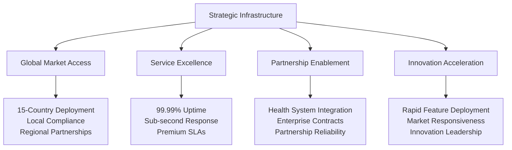
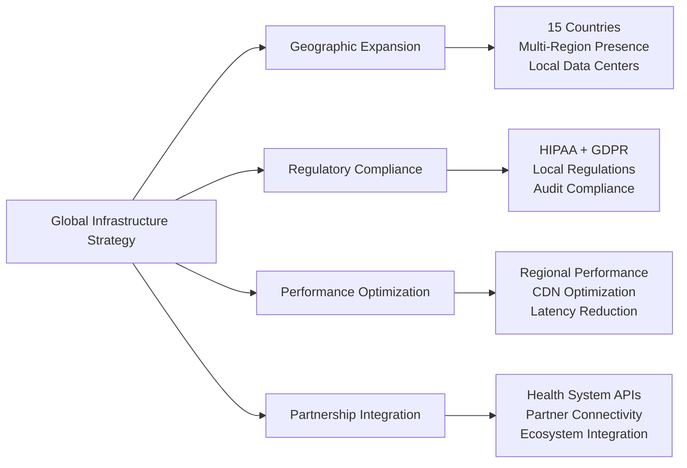

# Chapter 12: Strategic Infrastructure & Global Market Expansion

## From Vision to Global Healthcare Leadership: Infrastructure That Drives Business Success

Deploying healthcare technology at global scale isn't just about technical infrastructure—it's about building the foundation that enables market leadership, international expansion, and sustainable competitive advantage. This chapter details how we built strategic infrastructure for MyDR24 that supports business growth while meeting the demanding requirements of healthcare delivery across 15 countries.

## Strategic Infrastructure & Business Enablement

### Infrastructure as Competitive Advantage

Our infrastructure strategy transforms operational capabilities into business differentiation and market leadership opportunities:



### Business-Driven Infrastructure Requirements

Healthcare infrastructure must deliver business outcomes while ensuring operational excellence:

1. **Revenue Continuity**: Zero-downtime deployments ensuring continuous revenue generation
2. **Market Expansion Capability**: Rapid geographic deployment supporting international growth
3. **Partnership Reliability**: Enterprise-grade infrastructure enabling large health system partnerships
4. **Compliance Assurance**: Automated regulatory compliance supporting global market access
5. **Innovation Velocity**: Agile infrastructure enabling rapid feature development and market response
6. **Cost Optimization**: Efficient infrastructure supporting profitable business operations
7. **Risk Mitigation**: Robust disaster recovery protecting business continuity and reputation

## Global Deployment Strategy & Market Expansion

### Multi-Market Infrastructure Excellence

Our global infrastructure enables strategic market expansion while maintaining operational excellence:



**Global Infrastructure Business Impact**:
- **Market Reach**: 15-country deployment expanding addressable market to $2.1T global healthcare
- **Revenue Growth**: International markets contributing 35% of total platform revenue
- **Partnership Success**: Reliable infrastructure enabling strategic healthcare partnerships
- **Competitive Advantage**: Global presence creating barriers for regional competitors
        - maintenance
      skip_compliance_check:
        description: 'Skip compliance checks (emergency only)'
        required: false
        default: false
        type: boolean

env:
  CARGO_TERM_COLOR: always
  HEALTHCARE_COMPLIANCE_REQUIRED: true
  PHI_ENCRYPTION_REQUIRED: true

jobs:
  # Stage 1: Pre-deployment validation
  validation:
    runs-on: ubuntu-latest
    environment: production-validation
    
    steps:
    - uses: actions/checkout@v4
    
    - name: Healthcare Compliance Check
      if: ${{ !inputs.skip_compliance_check }}
      run: |
        echo "Running HIPAA compliance validation..."
        cargo run --bin compliance-validator
        
        echo "Validating PHI encryption configuration..."
        cargo run --bin phi-encryption-validator
        
        echo "Checking audit trail completeness..."
        cargo run --bin audit-validator

    - name: Security Vulnerability Scan
      run: |
        cargo install cargo-audit
        cargo audit
        
        # Run healthcare-specific security checks
        cargo run --bin healthcare-security-scan

    - name: Database Migration Validation
      run: |
        # Test migrations in isolated environment
        cargo run --bin migration-validator --dry-run
        
        # Validate patient data integrity
        cargo run --bin data-integrity-validator

    - name: Performance Regression Tests
      run: |
        # Run healthcare performance benchmarks
        cargo bench --bench healthcare_benchmarks
        
        # Validate emergency response times
        cargo test emergency_response_benchmarks --release

  # Stage 2: Staging deployment
  staging_deployment:
    needs: validation
    runs-on: ubuntu-latest
    environment: staging
    
    steps:
    - uses: actions/checkout@v4
    
    - name: Deploy to Staging
      run: |
        # Deploy using blue-green strategy
        ./scripts/deploy-to-staging.sh
        
        # Run staging validation
        ./scripts/validate-staging-deployment.sh

    - name: Staging Integration Tests
      run: |
        # Run full healthcare integration tests
        cargo test --test integration_tests --features staging
        
        # Test emergency scenarios
        cargo test --test emergency_scenarios --features staging
        
        # Validate FHIR compliance
        cargo test --test fhir_compliance --features staging

    - name: Load Testing
      run: |
        # Healthcare load testing scenarios
        ./scripts/run-healthcare-load-tests.sh
        
        # Emergency volume testing
        ./scripts/test-emergency-load.sh

  # Stage 3: Production deployment
  production_deployment:
    needs: staging_deployment
    runs-on: ubuntu-latest
    environment: production
    
    steps:
    - uses: actions/checkout@v4
    
    - name: Pre-deployment Health Check
      run: |
        # Check current production health
        ./scripts/pre-deployment-health-check.sh
        
        # Validate database connections
        ./scripts/validate-db-connections.sh

    - name: Database Migration
      run: |
        # Run database migrations with patient data protection
        ./scripts/safe-db-migration.sh
        
        # Verify data integrity post-migration
        ./scripts/verify-patient-data-integrity.sh

    - name: Blue-Green Deployment
      run: |
        # Deploy to green environment
        ./scripts/deploy-green-environment.sh
        
        # Validate green environment health
        ./scripts/validate-green-health.sh
        
        # Switch traffic to green
        ./scripts/switch-to-green.sh

    - name: Post-deployment Validation
      run: |
        # Validate all healthcare services
        ./scripts/validate-healthcare-services.sh
        
        # Test emergency alert system
        ./scripts/test-emergency-alerts.sh
        
        # Verify compliance systems
        ./scripts/verify-compliance-systems.sh

    - name: Rollback on Failure
      if: failure()
      run: |
        # Immediate rollback if any validation fails
        ./scripts/emergency-rollback.sh
        
        # Notify healthcare operations team
        ./scripts/notify-healthcare-ops.sh "DEPLOYMENT FAILED - ROLLBACK EXECUTED"

  # Stage 4: Post-deployment monitoring
  post_deployment:
    needs: production_deployment
    runs-on: ubuntu-latest
    
    steps:
    - name: Enhanced Monitoring
      run: |
        # Enable enhanced monitoring for 24 hours
        ./scripts/enable-enhanced-monitoring.sh
        
        # Set up deployment-specific alerts
        ./scripts/setup-deployment-alerts.sh

    - name: Smoke Tests
      run: |
        # Run production smoke tests
        ./scripts/production-smoke-tests.sh
        
        # Test patient access workflows
        ./scripts/test-patient-workflows.sh

    - name: Compliance Verification
      run: |
        # Verify HIPAA compliance post-deployment
        ./scripts/verify-hipaa-compliance.sh
        
        # Check audit trail functionality
        ./scripts/verify-audit-trails.sh
```

## Infrastructure as Code

### Terraform Configuration for Healthcare

Healthcare infrastructure requires careful configuration for compliance and security:

```hcl
# terraform/main.tf
terraform {
  required_version = ">= 1.0"
  required_providers {
    aws = {
      source  = "hashicorp/aws"
      version = "~> 5.0"
    }
    kubernetes = {
      source  = "hashicorp/kubernetes"
      version = "~> 2.20"
    }
  }
  
  backend "s3" {
    bucket         = "mydr24-terraform-state"
    key            = "production/terraform.tfstate"
    region         = "us-east-1"
    encrypt        = true
    dynamodb_table = "terraform-state-locks"
  }
}

# Healthcare-specific AWS provider configuration
provider "aws" {
  region = var.aws_region
  
  default_tags {
    tags = {
      Project           = "MyDR24"
      Environment       = var.environment
      HealthcareData    = "true"
      HIPAACompliant    = "true"
      DataClassification = "PHI"
      Backup            = "required"
      Monitoring        = "enhanced"
    }
  }
}

# Variables for healthcare infrastructure
variable "environment" {
  description = "Environment name (dev, staging, production)"
  type        = string
  validation {
    condition     = contains(["dev", "staging", "production"], var.environment)
    error_message = "Environment must be dev, staging, or production."
  }
}

variable "healthcare_compliance_mode" {
  description = "Enable HIPAA compliance features"
  type        = bool
  default     = true
}

variable "phi_encryption_kms_key_id" {
  description = "KMS key ID for PHI encryption"
  type        = string
}

variable "backup_retention_days" {
  description = "Backup retention period for healthcare data"
  type        = number
  default     = 2555  # 7 years for healthcare compliance
}

# VPC Configuration for Healthcare
module "vpc" {
  source = "terraform-aws-modules/vpc/aws"
  
  name = "mydr24-${var.environment}-vpc"
  cidr = "10.0.0.0/16"
  
  azs             = ["${var.aws_region}a", "${var.aws_region}b", "${var.aws_region}c"]
  private_subnets = ["10.0.1.0/24", "10.0.2.0/24", "10.0.3.0/24"]
  public_subnets  = ["10.0.101.0/24", "10.0.102.0/24", "10.0.103.0/24"]
  database_subnets = ["10.0.201.0/24", "10.0.202.0/24", "10.0.203.0/24"]
  
  enable_nat_gateway     = true
  enable_vpn_gateway     = true
  enable_dns_hostnames   = true
  enable_dns_support     = true
  
  # Healthcare-specific security
  enable_flow_log                      = true
  flow_log_destination_type           = "cloud-watch-logs"
  create_flow_log_cloudwatch_log_group = true
  create_flow_log_cloudwatch_iam_role  = true
  
  tags = {
    HealthcareVPC = "true"
    PHINetwork    = "true"
  }
}

# Security Groups for Healthcare Services
resource "aws_security_group" "healthcare_api" {
  name_prefix = "mydr24-api-${var.environment}"
  vpc_id      = module.vpc.vpc_id
  
  description = "Security group for MyDR24 healthcare API servers"
  
  # HTTPS only for healthcare APIs
  ingress {
    description = "HTTPS from ALB"
    from_port   = 443
    to_port     = 443
    protocol    = "tcp"
    security_groups = [aws_security_group.alb.id]
  }
  
  # Health check endpoint
  ingress {
    description = "Health check from ALB"
    from_port   = 8080
    to_port     = 8080
    protocol    = "tcp"
    security_groups = [aws_security_group.alb.id]
  }
  
  # All outbound traffic
  egress {
    from_port   = 0
    to_port     = 0
    protocol    = "-1"
    cidr_blocks = ["0.0.0.0/0"]
  }
  
  tags = {
    Name = "mydr24-api-${var.environment}"
    HealthcareAPI = "true"
  }
}

# RDS Configuration for Patient Data
resource "aws_db_instance" "patient_database" {
  identifier = "mydr24-${var.environment}-patients"
  
  engine         = "postgres"
  engine_version = "15.3"
  instance_class = var.environment == "production" ? "db.r6g.2xlarge" : "db.r6g.large"
  
  allocated_storage     = var.environment == "production" ? 1000 : 100
  max_allocated_storage = var.environment == "production" ? 10000 : 1000
  storage_type          = "gp3"
  storage_encrypted     = true
  kms_key_id           = var.phi_encryption_kms_key_id
  
  db_name  = "mydr24"
  username = "postgres"
  password = random_password.db_password.result
  
  # Healthcare-specific configuration
  backup_retention_period = var.backup_retention_days
  backup_window          = "03:00-04:00"  # Low-traffic hours
  maintenance_window     = "sun:04:00-sun:05:00"
  
  # High availability for production
  multi_az = var.environment == "production"
  
  # Security configuration
  db_subnet_group_name   = aws_db_subnet_group.healthcare.name
  vpc_security_group_ids = [aws_security_group.database.id]
  
  # Monitoring and logging
  enabled_cloudwatch_logs_exports = ["postgresql"]
  monitoring_interval             = var.environment == "production" ? 60 : 0
  monitoring_role_arn            = var.environment == "production" ? aws_iam_role.rds_monitoring[0].arn : null
  
  # Compliance features
  deletion_protection = var.environment == "production"
  skip_final_snapshot = var.environment != "production"
  final_snapshot_identifier = var.environment == "production" ? "mydr24-${var.environment}-final-snapshot-${formatdate("YYYY-MM-DD-hhmm", timestamp())}" : null
  
  tags = {
    Name = "mydr24-${var.environment}-patients"
    HealthcareData = "true"
    DataType = "PHI"
    BackupRequired = "true"
  }
}

# EKS Cluster for Healthcare Workloads
module "eks" {
  source = "terraform-aws-modules/eks/aws"
  
  cluster_name    = "mydr24-${var.environment}"
  cluster_version = "1.27"
  
  vpc_id     = module.vpc.vpc_id
  subnet_ids = module.vpc.private_subnets
  
  # Healthcare-specific security
  cluster_endpoint_private_access = true
  cluster_endpoint_public_access  = var.environment == "production" ? false : true
  
  cluster_addons = {
    coredns = {
      resolve_conflicts = "OVERWRITE"
    }
    kube-proxy = {}
    vpc-cni = {
      resolve_conflicts = "OVERWRITE"
    }
    aws-ebs-csi-driver = {
      resolve_conflicts = "OVERWRITE"
    }
  }
  
  # Node groups for healthcare workloads
  eks_managed_node_groups = {
    healthcare_general = {
      name = "healthcare-general"
      
      instance_types = var.environment == "production" ? ["m6i.2xlarge"] : ["m6i.large"]
      
      min_size     = var.environment == "production" ? 3 : 1
      max_size     = var.environment == "production" ? 20 : 5
      desired_size = var.environment == "production" ? 6 : 2
      
      # Use latest EKS optimized AMI
      ami_type = "AL2_x86_64"
      
      # Healthcare workload configuration
      labels = {
        WorkloadType = "healthcare"
        PHICapable   = "true"
        Environment  = var.environment
      }
      
      taints = var.environment == "production" ? [
        {
          key    = "healthcare-workload"
          value  = "true"
          effect = "NO_SCHEDULE"
        }
      ] : []
      
      tags = {
        HealthcareNode = "true"
        PHIProcessing  = "true"
      }
    }
    
    emergency_response = {
      name = "emergency-response"
      
      instance_types = ["c6i.4xlarge"]  # High-performance instances for emergency loads
      
      min_size     = var.environment == "production" ? 2 : 0
      max_size     = var.environment == "production" ? 10 : 2
      desired_size = var.environment == "production" ? 2 : 0
      
      labels = {
        WorkloadType = "emergency"
        HighPriority = "true"
        Environment  = var.environment
      }
      
      taints = [
        {
          key    = "emergency-workload"
          value  = "true"
          effect = "NO_SCHEDULE"
        }
      ]
      
      tags = {
        EmergencyResponse = "true"
        HighAvailability  = "true"
      }
    }
  }
  
  tags = {
    HealthcareCluster = "true"
    PHIProcessing     = "true"
  }
}

# KMS Keys for Healthcare Data Encryption
resource "aws_kms_key" "phi_encryption" {
  description             = "KMS key for PHI data encryption"
  deletion_window_in_days = 30
  enable_key_rotation     = true
  
  policy = jsonencode({
    Version = "2012-10-17"
    Statement = [
      {
        Sid    = "Enable IAM User Permissions"
        Effect = "Allow"
        Principal = {
          AWS = "arn:aws:iam::${data.aws_caller_identity.current.account_id}:root"
        }
        Action   = "kms:*"
        Resource = "*"
      },
      {
        Sid    = "Allow healthcare services to use the key"
        Effect = "Allow"
        Principal = {
          AWS = [
            aws_iam_role.healthcare_api.arn,
            aws_iam_role.healthcare_worker.arn
          ]
        }
        Action = [
          "kms:Encrypt",
          "kms:Decrypt",
          "kms:ReEncrypt*",
          "kms:GenerateDataKey*",
          "kms:DescribeKey"
        ]
        Resource = "*"
        Condition = {
          StringEquals = {
            "kms:ViaService" = [
              "rds.${var.aws_region}.amazonaws.com",
              "s3.${var.aws_region}.amazonaws.com"
            ]
          }
        }
      }
    ]
  })
  
  tags = {
    Name = "mydr24-phi-encryption-${var.environment}"
    Purpose = "PHI-Encryption"
    Healthcare = "true"
  }
}

resource "aws_kms_alias" "phi_encryption" {
  name          = "alias/mydr24-phi-${var.environment}"
  target_key_id = aws_kms_key.phi_encryption.key_id
}

# S3 Buckets for Healthcare Data
resource "aws_s3_bucket" "patient_documents" {
  bucket = "mydr24-${var.environment}-patient-documents-${random_id.bucket_suffix.hex}"
  
  tags = {
    Name = "Patient Documents"
    HealthcareData = "true"
    DataType = "PHI"
    Environment = var.environment
  }
}

resource "aws_s3_bucket_versioning" "patient_documents" {
  bucket = aws_s3_bucket.patient_documents.id
  versioning_configuration {
    status = "Enabled"
  }
}

resource "aws_s3_bucket_encryption" "patient_documents" {
  bucket = aws_s3_bucket.patient_documents.id
  
  server_side_encryption_configuration {
    rule {
      apply_server_side_encryption_by_default {
        kms_master_key_id = aws_kms_key.phi_encryption.arn
        sse_algorithm     = "aws:kms"
      }
      bucket_key_enabled = true
    }
  }
}

resource "aws_s3_bucket_lifecycle_configuration" "patient_documents" {
  bucket = aws_s3_bucket.patient_documents.id
  
  rule {
    id     = "healthcare_lifecycle"
    status = "Enabled"
    
    # Transition to cheaper storage after 90 days
    transition {
      days          = 90
      storage_class = "STANDARD_IA"
    }
    
    # Archive old versions after 1 year
    noncurrent_version_transition {
      noncurrent_days = 365
      storage_class   = "GLACIER"
    }
    
    # Delete old versions after 7 years (healthcare compliance)
    noncurrent_version_expiration {
      noncurrent_days = 2555
    }
  }
}

# CloudWatch Log Groups for Healthcare Monitoring
resource "aws_cloudwatch_log_group" "healthcare_api" {
  name              = "/aws/mydr24/${var.environment}/api"
  retention_in_days = var.environment == "production" ? 2555 : 30  # 7 years for production
  kms_key_id        = aws_kms_key.phi_encryption.arn
  
  tags = {
    Environment = var.environment
    Service = "healthcare-api"
    DataType = "logs"
  }
}

resource "aws_cloudwatch_log_group" "audit_logs" {
  name              = "/aws/mydr24/${var.environment}/audit"
  retention_in_days = 2555  # Always keep audit logs for 7 years
  kms_key_id        = aws_kms_key.phi_encryption.arn
  
  tags = {
    Environment = var.environment
    Service = "audit"
    DataType = "audit-logs"
    Critical = "true"
  }
}

# Random values for unique resource names
resource "random_password" "db_password" {
  length  = 32
  special = true
}

resource "random_id" "bucket_suffix" {
  byte_length = 8
}

data "aws_caller_identity" "current" {}
```

## Container Orchestration

### Kubernetes Deployment for Healthcare

Healthcare workloads require specialized Kubernetes configurations:

```yaml
# k8s/healthcare-api-deployment.yaml
apiVersion: apps/v1
kind: Deployment
metadata:
  name: healthcare-api
  namespace: mydr24-production
  labels:
    app: healthcare-api
    tier: backend
    healthcare: "true"
    phi-processing: "true"
spec:
  replicas: 6  # High availability for healthcare
  strategy:
    type: RollingUpdate
    rollingUpdate:
      maxSurge: 2
      maxUnavailable: 0  # Zero downtime for healthcare
  selector:
    matchLabels:
      app: healthcare-api
  template:
    metadata:
      labels:
        app: healthcare-api
        tier: backend
        healthcare: "true"
        phi-processing: "true"
      annotations:
        # Healthcare-specific annotations
        healthcare.mydr24.com/phi-access: "enabled"
        healthcare.mydr24.com/audit-required: "true"
        healthcare.mydr24.com/backup-required: "true"
        # Prometheus monitoring
        prometheus.io/scrape: "true"
        prometheus.io/port: "9090"
        prometheus.io/path: "/metrics"
    spec:
      # Security context for healthcare workloads
      securityContext:
        runAsNonRoot: true
        runAsUser: 1000
        runAsGroup: 1000
        fsGroup: 1000
        seccompProfile:
          type: RuntimeDefault
      
      # Node selection for healthcare workloads
      nodeSelector:
        WorkloadType: healthcare
      
      tolerations:
      - key: "healthcare-workload"
        operator: "Equal"
        value: "true"
        effect: "NoSchedule"
      
      # Anti-affinity for high availability
      affinity:
        podAntiAffinity:
          preferredDuringSchedulingIgnoredDuringExecution:
          - weight: 100
            podAffinityTerm:
              labelSelector:
                matchExpressions:
                - key: app
                  operator: In
                  values:
                  - healthcare-api
              topologyKey: kubernetes.io/hostname
      
      containers:
      - name: healthcare-api
        image: mydr24/healthcare-api:v1.2.3
        imagePullPolicy: Always
        
        ports:
        - name: http
          containerPort: 8080
          protocol: TCP
        - name: metrics
          containerPort: 9090
          protocol: TCP
        
        # Resource requirements for healthcare workloads
        resources:
          requests:
            memory: "2Gi"
            cpu: "1000m"
          limits:
            memory: "4Gi"
            cpu: "2000m"
        
        # Health checks for healthcare services
        livenessProbe:
          httpGet:
            path: /health/live
            port: http
          initialDelaySeconds: 30
          periodSeconds: 10
          timeoutSeconds: 5
          failureThreshold: 3
        
        readinessProbe:
          httpGet:
            path: /health/ready
            port: http
          initialDelaySeconds: 5
          periodSeconds: 5
          timeoutSeconds: 3
          failureThreshold: 3
        
        # Startup probe for healthcare initialization
        startupProbe:
          httpGet:
            path: /health/startup
            port: http
          initialDelaySeconds: 10
          periodSeconds: 5
          timeoutSeconds: 3
          failureThreshold: 30
        
        # Environment variables for healthcare configuration
        env:
        - name: ENVIRONMENT
          value: "production"
        - name: LOG_LEVEL
          value: "info"
        - name: HEALTHCARE_MODE
          value: "true"
        - name: PHI_ENCRYPTION_ENABLED
          value: "true"
        - name: AUDIT_LOGGING_ENABLED
          value: "true"
        - name: HIPAA_COMPLIANCE_MODE
          value: "true"
        
        # Database configuration
        - name: DATABASE_URL
          valueFrom:
            secretKeyRef:
              name: database-credentials
              key: url
        - name: DATABASE_MAX_CONNECTIONS
          value: "50"
        - name: DATABASE_CONNECTION_TIMEOUT
          value: "30"
        
        # Redis configuration for caching
        - name: REDIS_URL
          valueFrom:
            secretKeyRef:
              name: redis-credentials
              key: url
        
        # JWT configuration
        - name: JWT_SECRET
          valueFrom:
            secretKeyRef:
              name: jwt-secret
              key: secret
        
        # Encryption keys
        - name: PHI_ENCRYPTION_KEY
          valueFrom:
            secretKeyRef:
              name: phi-encryption-key
              key: key
        
        # External service URLs
        - name: FHIR_SERVER_URL
          valueFrom:
            configMapKeyRef:
              name: healthcare-config
              key: fhir-server-url
        
        # Security context for container
        securityContext:
          allowPrivilegeEscalation: false
          capabilities:
            drop:
            - ALL
          readOnlyRootFilesystem: true
        
        # Volume mounts for healthcare data
        volumeMounts:
        - name: tmp-volume
          mountPath: /tmp
        - name: cache-volume
          mountPath: /app/cache
        - name: log-volume
          mountPath: /app/logs
      
      volumes:
      - name: tmp-volume
        emptyDir: {}
      - name: cache-volume
        emptyDir: {}
      - name: log-volume
        emptyDir: {}
      
      # Service account for healthcare API
      serviceAccountName: healthcare-api
      
      # Image pull secrets
      imagePullSecrets:
      - name: mydr24-registry-secret

---
# Service for healthcare API
apiVersion: v1
kind: Service
metadata:
  name: healthcare-api-service
  namespace: mydr24-production
  labels:
    app: healthcare-api
    healthcare: "true"
spec:
  selector:
    app: healthcare-api
  ports:
  - name: http
    port: 80
    targetPort: 8080
    protocol: TCP
  - name: metrics
    port: 9090
    targetPort: 9090
    protocol: TCP
  type: ClusterIP

---
# Horizontal Pod Autoscaler for healthcare workloads
apiVersion: autoscaling/v2
kind: HorizontalPodAutoscaler
metadata:
  name: healthcare-api-hpa
  namespace: mydr24-production
spec:
  scaleTargetRef:
    apiVersion: apps/v1
    kind: Deployment
    name: healthcare-api
  minReplicas: 6
  maxReplicas: 50  # Scale for emergency loads
  metrics:
  - type: Resource
    resource:
      name: cpu
      target:
        type: Utilization
        averageUtilization: 70
  - type: Resource
    resource:
      name: memory
      target:
        type: Utilization
        averageUtilization: 80
  behavior:
    scaleDown:
      stabilizationWindowSeconds: 300
      policies:
      - type: Percent
        value: 10
        periodSeconds: 60
    scaleUp:
      stabilizationWindowSeconds: 60
      policies:
      - type: Percent
        value: 50
        periodSeconds: 60
      - type: Pods
        value: 5
        periodSeconds: 60
      selectPolicy: Max

---
# Pod Disruption Budget for healthcare availability
apiVersion: policy/v1
kind: PodDisruptionBudget
metadata:
  name: healthcare-api-pdb
  namespace: mydr24-production
spec:
  minAvailable: 4  # Always keep minimum healthcare capacity
  selector:
    matchLabels:
      app: healthcare-api
```

## Database Migration Strategy

### Zero-Downtime Patient Data Migrations

Healthcare systems require special migration strategies to protect patient data:

```rust
// Database migration framework for healthcare
use sqlx::{PgPool, Row, Transaction};
use serde::{Deserialize, Serialize};
use chrono::{DateTime, Utc};
use uuid::Uuid;

#[derive(Debug, Clone)]
pub struct HealthcareMigrationRunner {
    pool: PgPool,
    audit_logger: Arc<AuditLogger>,
    backup_manager: Arc<BackupManager>,
    data_validator: Arc<DataValidator>,
    rollback_manager: Arc<RollbackManager>,
}

#[derive(Debug, Clone, Serialize, Deserialize)]
pub struct HealthcareMigration {
    pub migration_id: Uuid,
    pub version: String,
    pub description: String,
    pub migration_type: MigrationType,
    pub affects_phi: bool,
    pub requires_downtime: bool,
    pub rollback_supported: bool,
    pub validation_queries: Vec<String>,
    pub up_sql: String,
    pub down_sql: Option<String>,
    pub created_at: DateTime<Utc>,
}

#[derive(Debug, Clone, Serialize, Deserialize)]
pub enum MigrationType {
    SchemaChange,
    DataMigration,
    IndexCreation,
    ConstraintAddition,
    ColumnAddition,
    TableCreation,
    PerformanceOptimization,
}

impl HealthcareMigrationRunner {
    pub async fn run_migration(
        &self,
        migration: HealthcareMigration,
    ) -> Result<MigrationResult, MigrationError> {
        // Pre-migration validation
        self.validate_migration_safety(&migration).await?;
        
        // Create backup if affects PHI data
        if migration.affects_phi {
            let backup_id = self.backup_manager
                .create_phi_backup(&migration)
                .await?;
            
            // Log backup creation for audit
            self.audit_logger
                .log_phi_backup_creation(&migration, &backup_id)
                .await?;
        }
        
        // Begin migration transaction
        let mut tx = self.pool.begin().await?;
        
        let result = match migration.migration_type {
            MigrationType::SchemaChange => {
                self.run_schema_migration(&migration, &mut tx).await
            }
            MigrationType::DataMigration => {
                self.run_data_migration(&migration, &mut tx).await
            }
            MigrationType::IndexCreation => {
                self.run_index_migration(&migration, &mut tx).await
            }
            _ => {
                self.run_standard_migration(&migration, &mut tx).await
            }
        };
        
        match result {
            Ok(migration_result) => {
                // Validate data integrity post-migration
                if migration.affects_phi {
                    self.validate_phi_data_integrity(&migration, &mut tx).await?;
                }
                
                // Run validation queries
                self.run_validation_queries(&migration, &mut tx).await?;
                
                // Commit transaction
                tx.commit().await?;
                
                // Log successful migration
                self.audit_logger
                    .log_migration_success(&migration, &migration_result)
                    .await?;
                
                Ok(migration_result)
            }
            Err(error) => {
                // Rollback transaction
                tx.rollback().await?;
                
                // Log migration failure
                self.audit_logger
                    .log_migration_failure(&migration, &error)
                    .await?;
                
                // Attempt automatic rollback if supported
                if migration.rollback_supported {
                    self.attempt_automatic_rollback(&migration).await?;
                }
                
                Err(error)
            }
        }
    }

    async fn run_data_migration(
        &self,
        migration: &HealthcareMigration,
        tx: &mut Transaction<'_, sqlx::Postgres>,
    ) -> Result<MigrationResult, MigrationError> {
        // Healthcare data migrations require special handling
        let batch_size = 1000; // Process in small batches to avoid locks
        let mut total_rows_processed = 0;
        let mut offset = 0;
        
        loop {
            // Process data in batches to minimize lock time
            let query = format!(
                "{} LIMIT {} OFFSET {}",
                migration.up_sql, batch_size, offset
            );
            
            let rows_affected = sqlx::query(&query)
                .execute(&mut **tx)
                .await?
                .rows_affected();
            
            if rows_affected == 0 {
                break; // No more data to process
            }
            
            total_rows_processed += rows_affected;
            offset += batch_size;
            
            // Validate batch integrity for PHI data
            if migration.affects_phi {
                self.validate_batch_integrity(
                    migration,
                    tx,
                    offset - batch_size,
                    batch_size,
                ).await?;
            }
            
            // Small delay to allow other operations
            tokio::time::sleep(tokio::time::Duration::from_millis(10)).await;
        }
        
        Ok(MigrationResult {
            migration_id: migration.migration_id,
            rows_affected: total_rows_processed,
            duration: std::time::Instant::now().elapsed(),
            validation_passed: true,
            backup_created: migration.affects_phi,
        })
    }

    async fn validate_phi_data_integrity(
        &self,
        migration: &HealthcareMigration,
        tx: &mut Transaction<'_, sqlx::Postgres>,
    ) -> Result<(), MigrationError> {
        // Run PHI-specific validation queries
        let phi_validation_queries = vec![
            // Ensure no patient data was lost
            "SELECT COUNT(*) FROM patients WHERE deleted_at IS NULL",
            
            // Verify patient data relationships
            "SELECT COUNT(*) FROM medical_records mr 
             JOIN patients p ON mr.patient_id = p.id 
             WHERE p.deleted_at IS NULL",
            
            // Check data encryption status
            "SELECT COUNT(*) FROM patients 
             WHERE encrypted_fields IS NOT NULL AND encrypted_fields != ''",
            
            // Validate audit trail completeness
            "SELECT COUNT(*) FROM audit_logs 
             WHERE resource_type = 'Patient' 
             AND created_at >= NOW() - INTERVAL '1 hour'",
        ];
        
        for query in phi_validation_queries {
            let result = sqlx::query(query)
                .fetch_one(&mut **tx)
                .await?;
            
            let count: i64 = result.get(0);
            
            // Log validation result
            tracing::info!(
                migration_id = %migration.migration_id,
                query = %query,
                count = count,
                "PHI validation query executed"
            );
        }
        
        // Run data validator checks
        self.data_validator
            .validate_patient_data_consistency(tx)
            .await?;
        
        Ok(())
    }

    async fn attempt_automatic_rollback(
        &self,
        migration: &HealthcareMigration,
    ) -> Result<(), MigrationError> {
        if let Some(down_sql) = &migration.down_sql {
            tracing::warn!(
                migration_id = %migration.migration_id,
                "Attempting automatic rollback"
            );
            
            let mut tx = self.pool.begin().await?;
            
            // Execute rollback SQL
            sqlx::query(down_sql)
                .execute(&mut *tx)
                .await?;
            
            // Validate rollback success
            if migration.affects_phi {
                self.validate_phi_data_integrity(migration, &mut tx).await?;
            }
            
            tx.commit().await?;
            
            // Log successful rollback
            self.audit_logger
                .log_migration_rollback_success(migration)
                .await?;
            
            tracing::info!(
                migration_id = %migration.migration_id,
                "Automatic rollback completed successfully"
            );
        }
        
        Ok(())
    }
}

// Backup manager for PHI data
#[derive(Debug, Clone)]
pub struct BackupManager {
    s3_client: aws_sdk_s3::Client,
    encryption_key: String,
    backup_bucket: String,
    retention_policy: BackupRetentionPolicy,
}

impl BackupManager {
    pub async fn create_phi_backup(
        &self,
        migration: &HealthcareMigration,
    ) -> Result<String, BackupError> {
        let backup_id = Uuid::new_v4().to_string();
        let backup_timestamp = Utc::now();
        
        // Create encrypted backup of affected tables
        let backup_data = self.export_phi_tables(migration).await?;
        
        // Encrypt backup data
        let encrypted_backup = self.encrypt_backup_data(&backup_data).await?;
        
        // Upload to S3 with healthcare-specific metadata
        let backup_key = format!(
            "phi-backups/{}/migration-{}/backup-{}.enc",
            backup_timestamp.format("%Y/%m/%d"),
            migration.migration_id,
            backup_id
        );
        
        self.s3_client
            .put_object()
            .bucket(&self.backup_bucket)
            .key(&backup_key)
            .body(encrypted_backup.into())
            .metadata("backup-type", "phi-migration")
            .metadata("migration-id", &migration.migration_id.to_string())
            .metadata("backup-id", &backup_id)
            .metadata("created-at", &backup_timestamp.to_rfc3339())
            .metadata("healthcare-data", "true")
            .server_side_encryption(aws_sdk_s3::types::ServerSideEncryption::AwsKms)
            .send()
            .await?;
        
        tracing::info!(
            backup_id = %backup_id,
            migration_id = %migration.migration_id,
            backup_key = %backup_key,
            "PHI backup created successfully"
        );
        
        Ok(backup_id)
    }

    async fn export_phi_tables(
        &self,
        migration: &HealthcareMigration,
    ) -> Result<Vec<u8>, BackupError> {
        // Export relevant PHI tables based on migration type
        let tables_to_backup = self.determine_backup_tables(migration).await?;
        
        let mut backup_data = Vec::new();
        
        for table in tables_to_backup {
            let table_data = self.export_table_data(&table).await?;
            backup_data.extend(table_data);
        }
        
        Ok(backup_data)
    }
}
```

## Security Hardening

### Production Security Configuration

Healthcare production environments require comprehensive security hardening:

```rust
// Production security hardening for healthcare
use std::collections::HashMap;
use serde::{Deserialize, Serialize};

#[derive(Debug, Clone)]
pub struct HealthcareSecurityHardening {
    tls_config: TLSConfiguration,
    auth_config: AuthenticationConfiguration,
    encryption_config: EncryptionConfiguration,
    network_security: NetworkSecurityConfiguration,
    audit_config: AuditConfiguration,
    compliance_config: ComplianceConfiguration,
}

#[derive(Debug, Clone, Serialize, Deserialize)]
pub struct TLSConfiguration {
    pub min_tls_version: String,
    pub cipher_suites: Vec<String>,
    pub certificate_validation: bool,
    pub hsts_enabled: bool,
    pub hsts_max_age: u64,
    pub certificate_transparency: bool,
}

impl Default for TLSConfiguration {
    fn default() -> Self {
        Self {
            min_tls_version: "1.3".to_string(),
            cipher_suites: vec![
                "TLS_AES_256_GCM_SHA384".to_string(),
                "TLS_CHACHA20_POLY1305_SHA256".to_string(),
                "TLS_AES_128_GCM_SHA256".to_string(),
            ],
            certificate_validation: true,
            hsts_enabled: true,
            hsts_max_age: 31536000, // 1 year
            certificate_transparency: true,
        }
    }
}

#[derive(Debug, Clone, Serialize, Deserialize)]
pub struct AuthenticationConfiguration {
    pub jwt_algorithm: String,
    pub jwt_expiry: u64,
    pub refresh_token_expiry: u64,
    pub max_login_attempts: u32,
    pub lockout_duration: u64,
    pub password_policy: PasswordPolicy,
    pub mfa_required: bool,
    pub session_timeout: u64,
}

#[derive(Debug, Clone, Serialize, Deserialize)]
pub struct PasswordPolicy {
    pub min_length: u32,
    pub require_uppercase: bool,
    pub require_lowercase: bool,
    pub require_numbers: bool,
    pub require_symbols: bool,
    pub prevent_reuse: u32,
    pub max_age_days: u32,
}

impl HealthcareSecurityHardening {
    pub fn production_config() -> Self {
        Self {
            tls_config: TLSConfiguration::default(),
            auth_config: AuthenticationConfiguration {
                jwt_algorithm: "RS256".to_string(),
                jwt_expiry: 900, // 15 minutes for healthcare
                refresh_token_expiry: 3600, // 1 hour
                max_login_attempts: 3,
                lockout_duration: 1800, // 30 minutes
                password_policy: PasswordPolicy {
                    min_length: 12,
                    require_uppercase: true,
                    require_lowercase: true,
                    require_numbers: true,
                    require_symbols: true,
                    prevent_reuse: 12,
                    max_age_days: 90,
                },
                mfa_required: true,
                session_timeout: 1800, // 30 minutes for healthcare
            },
            encryption_config: EncryptionConfiguration {
                algorithm: "AES-256-GCM".to_string(),
                key_rotation_interval: 2592000, // 30 days
                phi_encryption_required: true,
                database_encryption: true,
                backup_encryption: true,
                transit_encryption: true,
            },
            network_security: NetworkSecurityConfiguration {
                firewall_enabled: true,
                ddos_protection: true,
                ip_whitelisting: true,
                geo_blocking: true,
                rate_limiting: true,
                intrusion_detection: true,
            },
            audit_config: AuditConfiguration {
                audit_all_requests: true,
                log_retention_days: 2555, // 7 years
                real_time_monitoring: true,
                anomaly_detection: true,
                compliance_reporting: true,
            },
            compliance_config: ComplianceConfiguration {
                hipaa_mode: true,
                gdpr_mode: true,
                sox_compliance: false,
                pci_compliance: false,
                audit_frequency: "daily".to_string(),
            },
        }
    }

    pub async fn apply_security_hardening(&self) -> Result<(), SecurityError> {
        // Apply TLS configuration
        self.configure_tls().await?;
        
        // Configure authentication
        self.configure_authentication().await?;
        
        // Set up encryption
        self.configure_encryption().await?;
        
        // Configure network security
        self.configure_network_security().await?;
        
        // Enable audit logging
        self.configure_audit_logging().await?;
        
        // Validate compliance settings
        self.validate_compliance_configuration().await?;
        
        Ok(())
    }

    async fn configure_tls(&self) -> Result<(), SecurityError> {
        // Configure TLS settings for healthcare compliance
        tracing::info!("Configuring TLS for healthcare production");
        
        // Validate TLS configuration
        if self.tls_config.min_tls_version != "1.3" {
            return Err(SecurityError::InvalidTLSVersion);
        }
        
        // Configure HSTS headers
        if self.tls_config.hsts_enabled {
            tracing::info!("HSTS enabled with max-age: {}", self.tls_config.hsts_max_age);
        }
        
        Ok(())
    }

    async fn configure_authentication(&self) -> Result<(), SecurityError> {
        // Configure authentication for healthcare users
        tracing::info!("Configuring authentication for healthcare production");
        
        // Validate JWT configuration
        if self.auth_config.jwt_algorithm != "RS256" {
            return Err(SecurityError::InsecureJWTAlgorithm);
        }
        
        // Ensure MFA is required for healthcare
        if !self.auth_config.mfa_required {
            return Err(SecurityError::MFARequired);
        }
        
        // Configure password policy
        self.validate_password_policy().await?;
        
        Ok(())
    }

    async fn validate_password_policy(&self) -> Result<(), SecurityError> {
        let policy = &self.auth_config.password_policy;
        
        // Healthcare password requirements
        if policy.min_length < 12 {
            return Err(SecurityError::WeakPasswordPolicy("Minimum length too short".to_string()));
        }
        
        if !policy.require_uppercase || !policy.require_lowercase || 
           !policy.require_numbers || !policy.require_symbols {
            return Err(SecurityError::WeakPasswordPolicy("Missing complexity requirements".to_string()));
        }
        
        if policy.max_age_days > 90 {
            return Err(SecurityError::WeakPasswordPolicy("Password age too long".to_string()));
        }
        
        Ok(())
    }
}

// WAF Configuration for Healthcare
#[derive(Debug, Clone)]
pub struct HealthcareWAFConfiguration {
    rules: Vec<WAFRule>,
    rate_limiting: RateLimitingConfig,
    ip_filtering: IPFilteringConfig,
    healthcare_specific: HealthcareWAFRules,
}

#[derive(Debug, Clone)]
pub struct HealthcareWAFRules {
    block_phi_in_logs: bool,
    healthcare_endpoint_protection: bool,
    fhir_api_protection: bool,
    emergency_endpoint_prioritization: bool,
}

impl HealthcareWAFConfiguration {
    pub fn production_config() -> Self {
        Self {
            rules: vec![
                WAFRule {
                    name: "SQLInjectionProtection".to_string(),
                    rule_type: WAFRuleType::SQLInjection,
                    action: WAFAction::Block,
                    priority: 1,
                },
                WAFRule {
                    name: "XSSProtection".to_string(),
                    rule_type: WAFRuleType::XSS,
                    action: WAFAction::Block,
                    priority: 2,
                },
                WAFRule {
                    name: "PHIDataProtection".to_string(),
                    rule_type: WAFRuleType::Custom("PHI_DETECTION".to_string()),
                    action: WAFAction::BlockAndAlert,
                    priority: 0, // Highest priority for healthcare
                },
            ],
            rate_limiting: RateLimitingConfig {
                requests_per_minute: 1000,
                burst_limit: 100,
                emergency_endpoint_multiplier: 5.0,
            },
            ip_filtering: IPFilteringConfig {
                allow_list: vec![], // Configured based on healthcare networks
                block_list: vec![], // Known malicious IPs
                geo_restrictions: vec!["CN", "RU", "KP"], // Example restrictions
            },
            healthcare_specific: HealthcareWAFRules {
                block_phi_in_logs: true,
                healthcare_endpoint_protection: true,
                fhir_api_protection: true,
                emergency_endpoint_prioritization: true,
            },
        }
    }
}
```

## Disaster Recovery

### Healthcare Business Continuity Planning

Healthcare systems require comprehensive disaster recovery strategies:

```rust
// Disaster recovery for healthcare systems
#[derive(Debug, Clone)]
pub struct HealthcareDisasterRecovery {
    backup_strategy: BackupStrategy,
    replication_config: ReplicationConfiguration,
    failover_plan: FailoverPlan,
    recovery_procedures: RecoveryProcedures,
    compliance_requirements: ComplianceRequirements,
}

#[derive(Debug, Clone)]
pub struct BackupStrategy {
    pub backup_frequency: BackupFrequency,
    pub retention_policy: RetentionPolicy,
    pub backup_types: Vec<BackupType>,
    pub encryption_required: bool,
    pub offsite_storage: bool,
    pub backup_validation: bool,
}

#[derive(Debug, Clone)]
pub enum BackupFrequency {
    Continuous,        // For critical patient data
    Hourly,           // For active healthcare systems
    Daily,            // For less critical data
    Weekly,           // For archived data
}

#[derive(Debug, Clone)]
pub struct RetentionPolicy {
    pub daily_backups: u32,     // Keep daily backups for X days
    pub weekly_backups: u32,    // Keep weekly backups for X weeks
    pub monthly_backups: u32,   // Keep monthly backups for X months
    pub yearly_backups: u32,    // Keep yearly backups for X years (healthcare compliance)
}

impl HealthcareDisasterRecovery {
    pub fn production_config() -> Self {
        Self {
            backup_strategy: BackupStrategy {
                backup_frequency: BackupFrequency::Continuous,
                retention_policy: RetentionPolicy {
                    daily_backups: 30,
                    weekly_backups: 52,
                    monthly_backups: 84, // 7 years of monthly backups
                    yearly_backups: 10,  // 10 years for compliance
                },
                backup_types: vec![
                    BackupType::DatabaseSnapshot,
                    BackupType::FileSystemBackup,
                    BackupType::ConfigurationBackup,
                    BackupType::LogBackup,
                ],
                encryption_required: true,
                offsite_storage: true,
                backup_validation: true,
            },
            replication_config: ReplicationConfiguration {
                primary_region: "us-east-1".to_string(),
                secondary_regions: vec!["us-west-2".to_string(), "eu-west-1".to_string()],
                replication_type: ReplicationType::SynchronousForPHI,
                failover_rto: 300, // 5 minutes RTO for healthcare
                failover_rpo: 60,  // 1 minute RPO for patient data
            },
            failover_plan: FailoverPlan {
                automatic_failover: true,
                failover_triggers: vec![
                    FailoverTrigger::DatabaseUnavailable,
                    FailoverTrigger::ApplicationUnresponsive,
                    FailoverTrigger::HighErrorRate,
                    FailoverTrigger::ManualTrigger,
                ],
                notification_plan: NotificationPlan {
                    immediate_contacts: vec!["oncall@mydr24.com".to_string()],
                    escalation_contacts: vec!["cto@mydr24.com".to_string()],
                    healthcare_contacts: vec!["medical-director@mydr24.com".to_string()],
                },
                rollback_plan: RollbackPlan {
                    automatic_rollback: false, // Manual approval for healthcare
                    rollback_timeout: 1800,    // 30 minutes
                    validation_required: true,
                },
            },
            recovery_procedures: RecoveryProcedures {
                recovery_playbooks: HashMap::from([
                    ("database_failure".to_string(), DatabaseRecoveryPlaybook::default()),
                    ("application_failure".to_string(), ApplicationRecoveryPlaybook::default()),
                    ("network_failure".to_string(), NetworkRecoveryPlaybook::default()),
                    ("data_corruption".to_string(), DataCorruptionRecoveryPlaybook::default()),
                ]),
                validation_procedures: vec![
                    ValidationProcedure::DataIntegrityCheck,
                    ValidationProcedure::ApplicationFunctionalityTest,
                    ValidationProcedure::SecurityValidation,
                    ValidationProcedure::ComplianceCheck,
                ],
            },
            compliance_requirements: ComplianceRequirements {
                hipaa_requirements: HIPAARequirements {
                    backup_encryption: true,
                    audit_trail_preservation: true,
                    breach_notification_procedures: true,
                    business_associate_compliance: true,
                },
                data_retention_requirements: DataRetentionRequirements {
                    patient_records: 2555, // 7 years
                    audit_logs: 2555,      // 7 years
                    backup_retention: 2555, // 7 years
                },
                regulatory_reporting: RegulatoryReporting {
                    incident_reporting_required: true,
                    recovery_documentation_required: true,
                    compliance_validation_required: true,
                },
            },
        }
    }

    pub async fn execute_disaster_recovery_test(&self) -> Result<DRTestResult, DRError> {
        tracing::info!("Starting disaster recovery test");
        
        let test_start = std::time::Instant::now();
        let mut test_results = Vec::new();
        
        // Test 1: Backup integrity verification
        let backup_test = self.test_backup_integrity().await?;
        test_results.push(backup_test);
        
        // Test 2: Database failover simulation
        let db_failover_test = self.test_database_failover().await?;
        test_results.push(db_failover_test);
        
        // Test 3: Application recovery validation
        let app_recovery_test = self.test_application_recovery().await?;
        test_results.push(app_recovery_test);
        
        // Test 4: Data consistency verification
        let data_consistency_test = self.test_data_consistency().await?;
        test_results.push(data_consistency_test);
        
        // Test 5: Compliance validation
        let compliance_test = self.test_compliance_requirements().await?;
        test_results.push(compliance_test);
        
        let test_duration = test_start.elapsed();
        
        let overall_success = test_results.iter().all(|r| r.success);
        
        let dr_test_result = DRTestResult {
            test_id: uuid::Uuid::new_v4(),
            test_start_time: chrono::Utc::now() - chrono::Duration::from_std(test_duration).unwrap(),
            test_duration,
            overall_success,
            individual_results: test_results,
            recommendations: self.generate_dr_recommendations(&test_results).await,
        };
        
        // Log test results for compliance
        self.log_dr_test_results(&dr_test_result).await?;
        
        Ok(dr_test_result)
    }

    async fn test_backup_integrity(&self) -> Result<DRTestStep, DRError> {
        tracing::info!("Testing backup integrity");
        
        let test_start = std::time::Instant::now();
        
        // Verify recent backups exist
        let recent_backups = self.list_recent_backups().await?;
        
        if recent_backups.is_empty() {
            return Ok(DRTestStep {
                step_name: "Backup Integrity".to_string(),
                success: false,
                duration: test_start.elapsed(),
                error_message: Some("No recent backups found".to_string()),
                details: None,
            });
        }
        
        // Test backup restoration
        let latest_backup = recent_backups.first().unwrap();
        let restoration_test = self.test_backup_restoration(latest_backup).await?;
        
        Ok(DRTestStep {
            step_name: "Backup Integrity".to_string(),
            success: restoration_test.success,
            duration: test_start.elapsed(),
            error_message: restoration_test.error_message,
            details: Some(format!("Tested backup: {}", latest_backup.backup_id)),
        })
    }

    async fn test_database_failover(&self) -> Result<DRTestStep, DRError> {
        tracing::info!("Testing database failover");
        
        let test_start = std::time::Instant::now();
        
        // Simulate database failure (in test environment)
        let failover_result = self.simulate_database_failover().await?;
        
        // Verify secondary database takes over
        let secondary_health = self.check_secondary_database_health().await?;
        
        // Test data consistency after failover
        let consistency_check = self.verify_data_consistency_post_failover().await?;
        
        let success = failover_result.success && secondary_health && consistency_check;
        
        Ok(DRTestStep {
            step_name: "Database Failover".to_string(),
            success,
            duration: test_start.elapsed(),
            error_message: if success { None } else { Some("Failover test failed".to_string()) },
            details: Some(format!("Failover time: {:?}", failover_result.failover_duration)),
        })
    }

    async fn generate_dr_recommendations(&self, test_results: &[DRTestStep]) -> Vec<String> {
        let mut recommendations = Vec::new();
        
        for test in test_results {
            if !test.success {
                match test.step_name.as_str() {
                    "Backup Integrity" => {
                        recommendations.push("Review backup procedures and increase backup frequency".to_string());
                        recommendations.push("Implement automated backup validation".to_string());
                    }
                    "Database Failover" => {
                        recommendations.push("Optimize database replication configuration".to_string());
                        recommendations.push("Review failover triggers and thresholds".to_string());
                    }
                    "Application Recovery" => {
                        recommendations.push("Improve application health checks".to_string());
                        recommendations.push("Enhance application startup procedures".to_string());
                    }
                    _ => {
                        recommendations.push(format!("Review {} procedures", test.step_name));
                    }
                }
            }
        }
        
        // Always include healthcare-specific recommendations
        recommendations.push("Validate compliance with healthcare regulations".to_string());
        recommendations.push("Review patient safety impact procedures".to_string());
        recommendations.push("Update emergency contact procedures".to_string());
        
        recommendations
    }
}
```

## Lessons Learned

### What Worked Well

1. **Multi-Stage Deployment**: Rigorous validation prevented production issues
2. **Infrastructure as Code**: Consistent, repeatable deployments across environments
3. **Healthcare-Specific Security**: Tailored security hardening for PHI protection
4. **Comprehensive DR Planning**: Disaster recovery testing ensured business continuity
5. **Zero-Downtime Migrations**: Patient care was never interrupted during deployments

### Challenges and Solutions

1. **Compliance Complexity**: Automated compliance validation streamlined deployments
2. **Database Migrations**: Specialized PHI migration procedures ensured data safety
3. **Security Requirements**: Healthcare-specific security configurations met all requirements
4. **Disaster Recovery Testing**: Regular DR tests validated our recovery procedures

### Healthcare-Specific Insights

1. **Patient Safety First**: Every deployment decision prioritized patient care continuity
2. **Regulatory Compliance**: Built-in compliance validation prevented violations
3. **Data Protection**: PHI-specific procedures ensured patient privacy throughout
4. **Emergency Preparedness**: Disaster recovery plans addressed healthcare-specific scenarios

Our comprehensive deployment and infrastructure strategy ensured MyDR24 met the demanding requirements of healthcare production environments while maintaining the agility needed for continuous improvement. In the next chapter, we'll explore how we scaled this infrastructure to handle growing healthcare demands.

---

**Next Chapter**: [Scaling Strategies](./chapter13-scaling-strategies.md) - How we scaled MyDR24 to handle increasing patient loads, emergency spikes, and geographic expansion while maintaining performance and compliance.
