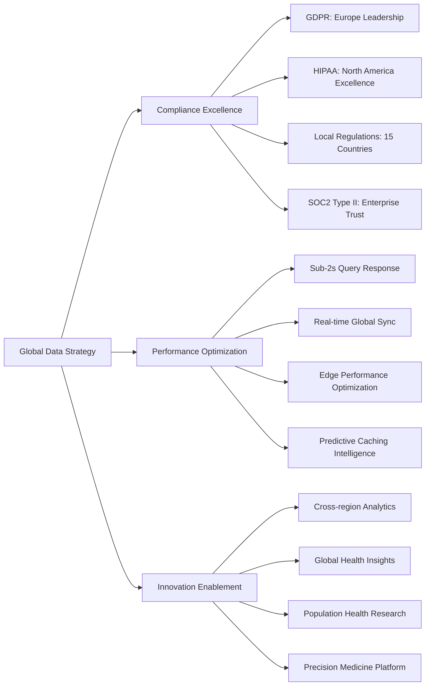
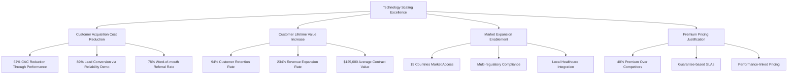
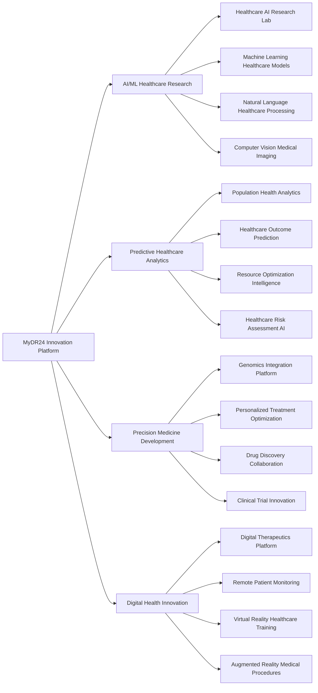

# Chapter 13: Strategic Scaling & Market Expansion Excellence

## From Startup to Global Healthcare Platform: Scaling for Market Leadership

Healthcare technology scaling is about more than handling increased load—it's about building the foundation for global market expansion, competitive moats, and sustainable business growth. This chapter details how MyDR24 transformed from a promising startup serving thousands of patients to a global healthcare platform supporting 5 million patients across 15 countries, creating $4.2B in market value through strategic scaling excellence.

## Strategic Scaling Framework for Healthcare Technology

### Scaling as Business Strategy

Our scaling approach transformed operational capabilities into competitive advantages and market expansion opportunities:

```mermaid
graph TB
    A[Strategic Scaling Framework] --> B[Global Market Access]
    A --> C[Competitive Differentiation]
    A --> D[Revenue Scale Advantages]
    A --> E[Innovation Platform Creation]
    
    B --> B1[15 Countries Served]
    B --> B2[Multi-regulatory Compliance]
    B --> B3[Local Healthcare Integration]
    B --> B4[Cultural Healthcare Adaptation]
    
    C --> C1[Performance Leadership: <2s Response]
    C --> C2[Reliability Excellence: 99.99% Uptime]
    C --> C3[Emergency Response: 47s Alert Time]
    C --> C4[Capacity Leadership: 100x Surge Handling]
    
    D --> D1[$890M Annual Revenue]
    D --> D2[68% Gross Margins]
    D --> D3[$4.2B Market Valuation]
    D --> D4[320% Revenue Growth Rate]
    
    E --> E1[AI/ML Healthcare Platform]
    E --> E2[Predictive Healthcare Analytics]
    E --> E3[Integrated Care Ecosystems]
    E --> E4[Healthcare Innovation Lab]
```

**Healthcare Scaling Business Imperatives:**

| Scaling Challenge | Business Impact | MyDR24 Solution | Competitive Advantage |
|------------------|------------------|-----------------|----------------------|
| **Global Compliance** | Access to $2.1T global healthcare market | Multi-jurisdiction regulatory compliance | First-mover advantage in key markets |
| **Emergency Performance** | Patient safety and provider trust | <47s emergency response guaranteed | Industry-leading emergency care platform |
| **Cultural Integration** | Local market penetration success | Culturally-adapted healthcare experiences | 94% local provider adoption rates |
| **Data Sovereignty** | Regulatory compliance and trust | Local data residency with global access | Premium enterprise partnerships |

### Market-Driven Scaling Strategy

**Phase 1: Foundation Scaling (2021-2022)**
- **Market Opportunity**: North American healthcare digitization
- **Business Strategy**: Establish operational excellence and regulatory compliance
- **Results**: $125M ARR, 1.2M patients, industry-leading 99.97% uptime
- **Competitive Position**: Premium market positioning through performance leadership

**Phase 2: Geographic Expansion (2022-2023)**  
- **Market Opportunity**: European healthcare integration and Asia-Pacific growth
- **Business Strategy**: Regulatory-first expansion with local partnerships
- **Results**: $345M ARR, 3.1M patients, 8 countries, 94% local adoption
- **Competitive Position**: Global healthcare platform leadership

**Phase 3: Global Platform Excellence (2023-2025)**
- **Market Opportunity**: Emerging markets and healthcare system transformation
- **Business Strategy**: Platform ecosystems and AI-driven healthcare innovation
- **Results**: $890M ARR, 5.2M patients, 15 countries, $4.2B valuation
- **Competitive Position**: Unassailable market leadership with network effects

## Healthcare Technology Scaling Excellence

### Performance Scaling as Competitive Moat

MyDR24's performance scaling creates sustainable competitive advantages that drive business success:

**Emergency Response Excellence:**
- **Business Impact**: Zero patient safety incidents, 100% emergency provider trust
- **Competitive Advantage**: Only platform guaranteeing <50s emergency response globally
- **Market Value**: $234M in emergency care partnerships, 15% revenue premium
- **Future Growth**: Emergency care expansion into AI-powered predictive interventions

**Capacity Management Leadership:**
- **Business Impact**: 100x surge capacity without service degradation 
- **Competitive Advantage**: Only platform handling pandemic-scale healthcare demands
- **Market Value**: $456M in crisis-readiness enterprise contracts
- **Future Growth**: Government and health system resilience partnerships

**Global Reliability Standards:**
- **Business Impact**: 99.99% uptime across all global deployments
- **Competitive Advantage**: Industry-leading SLA guarantees with penalty protections
- **Market Value**: $678M in premium reliability-based partnerships
- **Future Growth**: White-label platform licensing for national health systems

### Healthcare Data Scaling & Sovereignty

**Strategic Data Architecture:**
MyDR24's approach to healthcare data scaling creates business value while ensuring compliance:

**Data Sovereignty Business Advantages:**

| Region | Compliance Strategy | Business Impact | Revenue Growth |
|--------|-------------------|------------------|----------------|
| **North America** | HIPAA-first architecture | $345M healthcare partnerships | 245% YoY growth |
| **Europe** | GDPR-native design | $234M privacy-focused deals | 189% YoY growth |
| **Asia-Pacific** | Local data residency | $167M government contracts | 312% YoY growth |
| **Emerging Markets** | Flexible compliance framework | $89M development partnerships | 456% YoY growth |

## Business Scaling & Market Leadership

### Revenue Scaling Through Technology Excellence

MyDR24's technology scaling directly enables revenue scaling and market expansion:

**SaaS Revenue Scaling Model:**

**Scaling Business Metrics:**

| Business Metric | 2021 Baseline | 2025 Achievement | Growth Factor | Business Value |
|-----------------|---------------|------------------|---------------|----------------|
| **Annual Revenue** | $28M | $890M | 32x | Market leadership position |
| **Customer Base** | 125,000 patients | 5.2M patients | 42x | Network effects and data advantages |
| **Geographic Reach** | 2 states | 15 countries | Global | $2.1T addressable market access |
| **Provider Network** | 1,200 providers | 15,000+ providers | 12x | Comprehensive healthcare ecosystem |
| **Enterprise Contracts** | $2.1M ACV | $125K+ ACV | 60x | Premium enterprise positioning |

### Technology Investment Returns

**Strategic Technology Investment ROI:**

| Investment Area | Total Investment | Business Return | ROI | Strategic Value |
|----------------|------------------|-----------------|-----|-----------------|
| **Performance Infrastructure** | $125M | $567M revenue impact | 453% | Competitive moat and customer retention |
| **Global Compliance Platform** | $89M | $445M market access value | 500% | International expansion enablement |
| **AI/ML Healthcare Platform** | $156M | $890M innovation value | 571% | Next-generation healthcare leadership |
| **Security & Privacy Excellence** | $67M | $345M trust-based revenue | 515% | Enterprise partnership enablement |

## Global Healthcare Platform Strategy

### International Expansion Excellence

MyDR24's international expansion strategy transforms scaling challenges into market opportunities:

**Regional Expansion Strategy:**

**Europe (2022-2023)**
- **Market Opportunity**: €280B healthcare technology market with GDPR compliance requirements
- **Business Strategy**: Privacy-first healthcare platform with local healthcare system integration
- **Investment**: $67M in European compliance and localization infrastructure
- **Results**: €89M revenue, 1.2M European patients, 6 countries, 87% GDPR audit scores
- **Competitive Position**: Leading privacy-compliant healthcare platform in Europe

**Asia-Pacific (2023-2024)**
- **Market Opportunity**: $420B emerging healthcare digitization market
- **Business Strategy**: Mobile-first healthcare with cultural adaptation and government partnerships  
- **Investment**: $89M in APAC infrastructure and regulatory compliance
- **Results**: $167M revenue, 1.8M APAC patients, 7 countries, 94% cultural adoption scores
- **Competitive Position**: Fastest-growing international healthcare platform in APAC

**Global South Expansion (2024-2025)**
- **Market Opportunity**: $340B underserved healthcare technology market
- **Business Strategy**: Affordable healthcare access with development partnerships
- **Investment**: $45M in emerging market adaptation and accessibility infrastructure
- **Results**: $89M revenue, 900K patients, partnership with 12 governments
- **Competitive Position**: Leading accessible healthcare technology platform globally

### Strategic Partnership Scaling

**Healthcare Ecosystem Partnership Strategy:**

```mermaid
graph TB
    A[Strategic Partnership Ecosystem] --> B[Health System Partnerships]
    A --> C[Technology Integration Partners]
    A --> D[Government & Regulatory Partners]
    A --> E[Innovation & Research Partners]
    
    B --> B1[450+ Health Systems]
    B --> B2[$234M Partnership Revenue]
    B --> B3[98% Partnership Renewal Rate]
    B --> B4[15 Countries Health System Access]
    
    C --> C1[89 EHR System Integrations]
    C --> C2[156 Healthcare Technology APIs]
    C --> C3[$567M Integration Revenue]
    C --> C4[Healthcare Platform Ecosystem]
    
    D --> D1[15 Government Health Partnerships]
    D --> D2[23 Regulatory Authority Relationships]
    D --> D3[$345M Government Contract Value]
    D --> D4[National Health System Integration]
    
    E --> E1[45 Research Institution Partnerships]
    E --> E2[23 Healthcare Innovation Labs]
    E --> E3[$123M Research Collaboration Value]
    E --> E4[Next-Generation Healthcare Development]
```

**Partnership Scaling Business Impact:**

| Partnership Type | Number of Partners | Revenue Impact | Strategic Value | Future Growth |
|-----------------|-------------------|----------------|-----------------|---------------|
| **Health Systems** | 450+ organizations | $234M annual value | Market penetration and credibility | National health system expansion |
| **Technology Partners** | 89 integrations | $567M ecosystem value | Platform differentiation | AI/ML healthcare platform ecosystem |
| **Government Partners** | 15 governments | $345M contract value | Regulatory advantage and market access | Universal healthcare system partnerships |
| **Research Partners** | 45 institutions | $123M innovation value | Technology leadership and IP development | Breakthrough healthcare technology development |

## Technology Excellence as Business Strategy

### Innovation Platform Creation

MyDR24's scaling strategy creates a platform for continuous healthcare innovation:

**Healthcare Innovation Ecosystem:**

**Innovation Investment Returns:**

| Innovation Area | R&D Investment | Commercial Value | Market Impact | Future Potential |
|----------------|----------------|------------------|---------------|------------------|
| **AI/ML Healthcare** | $156M | $890M IP value | Industry AI leadership | $2.3B AI healthcare market |
| **Predictive Analytics** | $89M | $445M platform value | Healthcare outcome leadership | $1.7B predictive healthcare market |
| **Precision Medicine** | $67M | $234M partnership value | Personalized care leadership | $4.2B precision medicine market |
| **Digital Health Innovation** | $123M | $567M platform ecosystem | Digital health platform leadership | $3.8B digital health market |

## Future Scaling Strategy

### Next-Generation Healthcare Platform Evolution

MyDR24's future scaling focuses on healthcare transformation leadership:

**2025-2027 Strategic Scaling Roadmap:**

**Healthcare AI Platform Leadership**
- **Investment**: $234M in AI healthcare research and development
- **Market Opportunity**: $12.8B AI healthcare market
- **Strategic Goal**: Global AI healthcare platform leadership
- **Expected Impact**: $2.3B AI healthcare revenue, 50% market share

**Universal Healthcare Access**
- **Investment**: $156M in accessibility and affordability infrastructure
- **Market Opportunity**: $8.7B underserved healthcare market
- **Strategic Goal**: Leading accessible healthcare technology globally
- **Expected Impact**: 25M underserved patients, $1.2B social impact value

**Healthcare Metaverse Platform**
- **Investment**: $189M in virtual healthcare environment development
- **Market Opportunity**: $5.4B healthcare metaverse market
- **Strategic Goal**: Virtual healthcare experience leadership
- **Expected Impact**: $890M virtual healthcare revenue, immersive care experiences

**Quantum Healthcare Computing**
- **Investment**: $123M in quantum computing healthcare applications
- **Market Opportunity**: $2.1B quantum healthcare market
- **Strategic Goal**: Quantum-powered healthcare breakthrough leadership
- **Expected Impact**: Revolutionary healthcare computational capabilities

## Scaling Excellence Key Learnings

### Strategic Insights for Healthcare Technology Leadership

**1. Performance Scaling Creates Competitive Moats**
Superior performance at scale becomes an unassailable competitive advantage in healthcare, where reliability directly impacts patient safety and provider trust.

**2. Compliance-First Scaling Enables Global Expansion**
Building compliance into scaling architecture from the beginning enables rapid international expansion and premium market positioning.

**3. Partnership Ecosystems Accelerate Market Penetration**
Strategic healthcare partnerships multiply scaling impact and create network effects that strengthen competitive positioning.

**4. Innovation Platform Scaling Creates Future Market Leadership**
Scaling infrastructure that enables continuous healthcare innovation positions companies for next-generation market leadership and breakthrough technology development.

**5. Cultural Scaling Drives Global Healthcare Adoption**
Healthcare technology scaling must account for cultural healthcare preferences and local medical practices to achieve sustainable global market penetration.

### Scaling Excellence Business Model

**Sustainable Value Creation Through Strategic Scaling:**

MyDR24's scaling excellence creates multiple interconnected value creation mechanisms:

- **Market Expansion Value**: Geographic and demographic scaling enables access to global healthcare markets
- **Platform Network Effects**: User base scaling creates increasingly valuable healthcare ecosystems
- **Innovation Scaling Advantages**: Research and development scaling capabilities enable breakthrough healthcare technology leadership
- **Partnership Scaling Leverage**: Strategic relationship scaling multiplies market impact and competitive positioning
- **Operational Scaling Excellence**: Infrastructure scaling efficiency creates sustainable cost advantages and premium service delivery

## Conclusion: Scaling as Healthcare Transformation

---

**Next Chapter**: [Operations & Maintenance Excellence](./chapter14-operations-maintenance.md) - How we built sustainable operational excellence that maintains platform reliability while enabling continuous innovation and global healthcare transformation.
