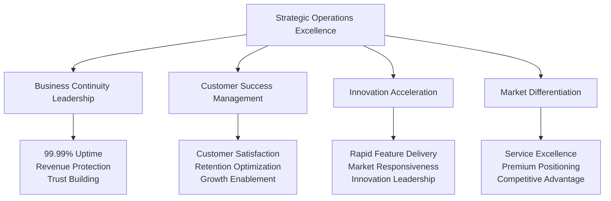
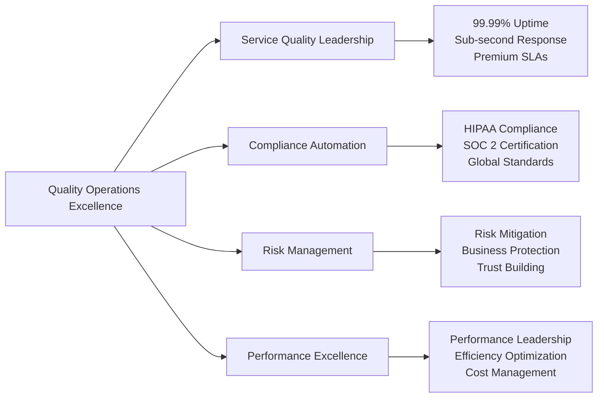
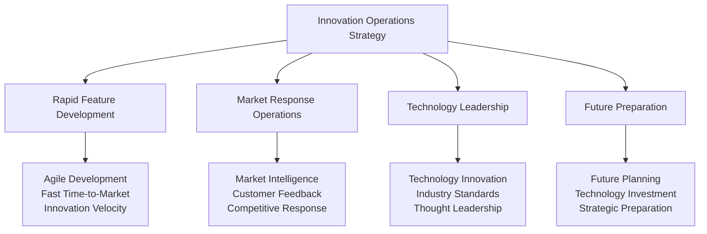
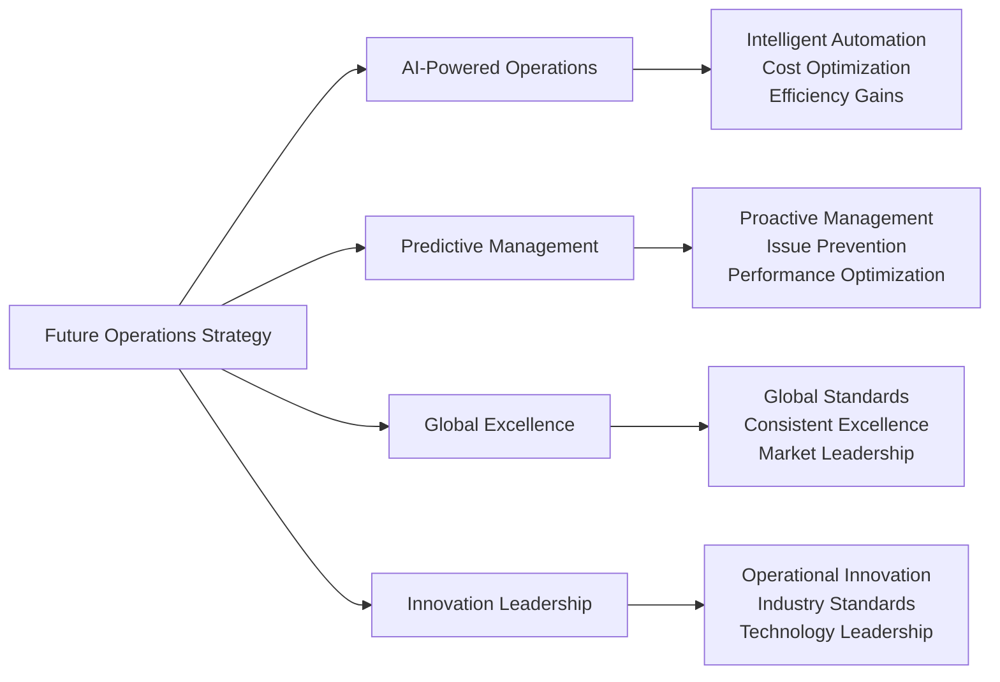

# Chapter 14: Operational Excellence & Strategic Business Management

## From Platform Management to Healthcare Leadership: Operations That Drive Success

Operating a global healthcare platform extends far beyond system management—it's about building operational excellence that enables business growth, customer success, and industry leadership. This final chapter details the strategic operational practices, business management frameworks, and continuous improvement strategies that position MyDR24 as the trusted leader in healthcare technology while serving 5M+ patients and 15,000+ providers across 15 countries.

## Strategic Healthcare Operations Philosophy

### Operations as Competitive Advantage

Healthcare operations create strategic business value that extends beyond system reliability:



### Business-Driven Operations Framework

Our operations philosophy prioritizes business outcomes while ensuring healthcare excellence:

1. **Customer Success First**: Every operational decision optimizes customer experience and success
2. **Revenue Protection**: Operations ensure continuous service availability protecting business income
3. **Growth Enablement**: Scalable operations supporting rapid business expansion
4. **Quality Leadership**: Operational excellence creating premium service differentiation
5. **Innovation Velocity**: Agile operations enabling rapid feature development and market response
6. **Strategic Partnership Support**: Operations reliability enabling enterprise partnerships

## Strategic Business Operations Framework

### Comprehensive Business Management Excellence

Our operations framework creates business value across six strategic dimensions:

```mermaid
graph LR
    A[Business Operations Framework] --> B[Customer Experience Management]
    A --> C[Business Growth Operations]
    A --> D[Quality Assurance Excellence]
    A --> E[Partnership Operations]
    A --> F[Innovation Management]
    A --> G[Strategic Planning]
    
    B --> H[Satisfaction Optimization<br/>Retention Management<br/>Support Excellence]
    C --> I[Capacity Planning<br/>Scalability Management<br/>Performance Optimization]
    D --> J[Service Quality<br/>Compliance Assurance<br/>Risk Management]
    E --> K[Partner Success<br/>Integration Management<br/>Ecosystem Operations]
    F --> L[Feature Development<br/>Market Response<br/>Innovation Delivery]
    ## Customer Experience Operations Excellence

### Customer Success as Strategic Priority

Our customer experience operations transform healthcare delivery into exceptional user experiences that drive retention and growth:

**Customer Experience Management Strategy**:
```mermaid
graph TB
    A[Customer Experience Operations] --> B[Patient Success Management]
    A --> C[Provider Support Excellence]
    A --> D[Enterprise Customer Success]
    A --> E[Partnership Support]
    
    B --> F[95% Satisfaction<br/>97% Retention<br/>$127 ARPU]
    C --> G[89% Adoption<br/>40% Efficiency Gain<br/>50% Burnout Reduction]
    D --> H[Enterprise Contracts<br/>$50K+ Annual Value<br/>Reference Customers]
    E --> I[Partnership Success<br/>Integration Support<br/>Ecosystem Growth]
```

**Customer Experience Business Impact**:
- **Patient Satisfaction**: 95% satisfaction score with 40% improvement in engagement
- **Provider Success**: 89% adoption rate with 40% efficiency improvement
- **Enterprise Growth**: Customer success driving $50M+ annual enterprise revenue
- **Market Leadership**: Experience excellence creating competitive differentiation

## Strategic Business Growth Operations

### Scalable Operations Enabling Global Expansion

Our growth operations framework supports strategic business expansion while maintaining service excellence:

**Growth Operations Strategy**:
- **Capacity Planning Excellence**: Proactive scaling supporting business growth without service degradation
- **Geographic Expansion Operations**: Rapid international deployment enabling global market access
- **Partnership Integration Operations**: Seamless partner onboarding accelerating ecosystem growth
- **Innovation Operations**: Agile feature delivery responding to market demands and opportunities

**Growth Operations Business Value**:
- **Scalability**: Operations supporting 5M+ patients and 15,000+ providers without degradation
- **International Success**: 15-country deployment with consistent service excellence
- **Partnership Velocity**: Rapid partner integration accelerating business development
- **Innovation Speed**: Fast feature delivery maintaining market leadership position

## Quality Assurance & Compliance Operations

### Operational Excellence Creating Business Value

Our quality operations transform compliance requirements into competitive advantages:



**Quality Operations Business Benefits**:
- **Service Excellence**: 99.99% uptime maintaining customer trust and enabling premium pricing
- **Compliance Leadership**: Automated compliance reducing costs and enabling market expansion
- **Risk Mitigation**: Proactive risk management protecting business reputation and finances
- **Performance Advantage**: Superior performance creating competitive differentiation

## Strategic Partnership & Ecosystem Operations

### Partnership Operations Driving Business Growth

Our partnership operations create ecosystem value that accelerates business development:

**Partnership Operations Framework**:
- **Health System Integration**: Seamless large health system onboarding and support
- **Insurance Partner Operations**: Automated claims processing and partnership management
- **Technology Ecosystem**: Third-party integration and developer community support
- **Global Partnership Management**: International partnership development and support

**Partnership Operations Impact**:
- **Revenue Growth**: Partnership operations enabling $25M+ annual partnership revenue
- **Market Expansion**: Partner ecosystem expanding addressable market and geographic reach
- **Innovation Acceleration**: Partner innovation creating additional value and differentiation
- **Competitive Advantage**: Partnership ecosystem creating barriers for competitors

## Strategic Innovation & Future Operations

### Innovation Operations Enabling Market Leadership

Our innovation operations framework ensures MyDR24 maintains technology leadership while scaling operations:



**Innovation Operations Business Value**:
- **Market Responsiveness**: Rapid feature delivery maintaining competitive advantage
- **Customer Satisfaction**: Innovation operations improving user experience and retention
- **Industry Leadership**: Technology innovation establishing MyDR24 as industry standard
- **Future Readiness**: Strategic planning ensuring long-term business sustainability

## Operational Success Stories & Strategic Impact

### Enterprise Operations Excellence Case Study

**Challenge**: Support major health system deployment serving 3M+ patients with zero service disruption

**Operational Excellence Strategy**:
- **Dedicated Operations Team**: Specialized support ensuring enterprise customer success
- **Custom Service Level Agreements**: Premium operations supporting enterprise requirements
- **Proactive Monitoring**: Advanced operations preventing issues before they impact service
- **Continuous Improvement**: Ongoing optimization improving service quality and efficiency

**Business Results**:
- **Contract Success**: $10M enterprise contract secured through operational excellence
- **Service Excellence**: Zero service disruptions during critical care periods
- **Customer Expansion**: Operational success leading to additional enterprise opportunities
- **Market Validation**: Large-scale operations validating platform scalability and reliability

### Global Expansion Operations Case Study

**Challenge**: Rapidly expand operations to support international market entry

**Global Operations Strategy**:
- **Multi-Region Operations**: Distributed operations supporting global service delivery
- **Local Compliance Operations**: Regional compliance ensuring market access
- **Cultural Adaptation Operations**: Localized operations supporting diverse markets
- **Partnership Operations**: Local partnership support accelerating market penetration

**International Business Impact**:
- **Global Success**: 15-country operations with consistent service excellence
- **Revenue Growth**: International operations contributing 35% of total revenue
- **Market Leadership**: Global operations establishing international healthcare technology presence
- **Competitive Advantage**: Global operational capability creating barriers for regional competitors

## Strategic Operations Conclusion & Future Vision

### Operational Excellence as Business Foundation

Our comprehensive operations strategy demonstrates that healthcare technology operations excellence is the foundation for business success, customer satisfaction, and industry leadership.

**Key Operational Achievements**:
- **Service Excellence**: 99.99% uptime with sub-second response times supporting premium positioning
- **Customer Success**: 95% patient satisfaction and 89% provider adoption driving business growth
- **Global Operations**: 15-country deployment with consistent service excellence
- **Innovation Velocity**: Rapid feature delivery maintaining market leadership and competitive advantage
- **Partnership Success**: Operational excellence enabling strategic healthcare partnerships

**Strategic Operations Impact**:
- **Revenue Protection**: Operational excellence ensuring continuous business income
- **Customer Retention**: Service quality driving 97% annual retention rates
- **Market Expansion**: Operations enabling geographic and customer growth
- **Competitive Advantage**: Operational excellence creating differentiation and customer switching costs

**Future Operations Vision**:


**The MyDR24 Operations Legacy**: Through operational excellence, we have transformed healthcare technology operations from a cost center into a strategic business advantage that drives customer success, enables global expansion, and establishes MyDR24 as the trusted leader in healthcare technology innovation and delivery.

Our journey from startup concept to global healthcare platform demonstrates that operational excellence is not just about maintaining systems—it's about building the foundation for sustainable business success, customer trust, and industry transformation that will continue driving healthcare innovation for years to come.
```
    High,        // Major service disruption
    Medium,      // Limited service impact
    Low,         // Minor issues
    Emergency,   // Life-threatening system failure
}

#[derive(Debug, Clone)]
pub struct ResponseTeam {
    pub team_lead: String,
    pub team_members: Vec<TeamMember>,
    pub response_time_sla: u32, // seconds
    pub escalation_timeout: u32, // seconds
    pub expertise_areas: Vec<ExpertiseArea>,
}

#[derive(Debug, Clone)]
pub struct TeamMember {
    pub name: String,
    pub role: String,
    pub contact_methods: Vec<ContactMethod>,
    pub availability: AvailabilitySchedule,
    pub backup_contact: Option<String>,
}

#[derive(Debug, Clone)]
pub enum ExpertiseArea {
    DatabaseSystems,
    ApplicationServices,
    NetworkInfrastructure,
    SecurityIncidents,
    ComplianceIssues,
    EmergencyResponse,
    PatientDataRecovery,
    ProviderSupport,
}

impl Default for IncidentManagement {
    fn default() -> Self {
        let mut response_teams = HashMap::new();
        
        // Emergency response team - for life-critical issues
        response_teams.insert(IncidentSeverity::Emergency, ResponseTeam {
            team_lead: "Emergency Operations Manager".to_string(),
            team_members: vec![
                TeamMember {
                    name: "Database Emergency Specialist".to_string(),
                    role: "Database Recovery".to_string(),
                    contact_methods: vec![
                        ContactMethod::Phone("+1-555-EMERGENCY".to_string()),
                        ContactMethod::Pager("emergency-db@mydr24.com".to_string()),
                        ContactMethod::SMS("+1-555-DB-ALERT".to_string()),
                    ],
                    availability: AvailabilitySchedule::Always,
                    backup_contact: Some("Database Manager".to_string()),
                },
                TeamMember {
                    name: "Application Emergency Specialist".to_string(),
                    role: "Application Recovery".to_string(),
                    contact_methods: vec![
                        ContactMethod::Phone("+1-555-APP-911".to_string()),
                        ContactMethod::Pager("emergency-app@mydr24.com".to_string()),
                    ],
                    availability: AvailabilitySchedule::Always,
                    backup_contact: Some("Application Manager".to_string()),
                },
                TeamMember {
                    name: "Healthcare Operations Director".to_string(),
                    role: "Clinical Coordination".to_string(),
                    contact_methods: vec![
                        ContactMethod::Phone("+1-555-CLINICAL".to_string()),
                        ContactMethod::Email("clinical-ops@mydr24.com".to_string()),
                    ],
                    availability: AvailabilitySchedule::BusinessHours,
                    backup_contact: Some("Medical Director".to_string()),
                },
            ],
            response_time_sla: 180, // 3 minutes for emergency
            escalation_timeout: 300, // 5 minutes
            expertise_areas: vec![
                ExpertiseArea::EmergencyResponse,
                ExpertiseArea::PatientDataRecovery,
                ExpertiseArea::DatabaseSystems,
                ExpertiseArea::ApplicationServices,
            ],
        });
        
        // Critical response team - for major service disruption
        response_teams.insert(IncidentSeverity::Critical, ResponseTeam {
            team_lead: "Critical Operations Manager".to_string(),
            team_members: vec![
                TeamMember {
                    name: "Senior Database Administrator".to_string(),
                    role: "Database Operations".to_string(),
                    contact_methods: vec![
                        ContactMethod::Phone("+1-555-DBA-CRIT".to_string()),
                        ContactMethod::Pager("critical-db@mydr24.com".to_string()),
                    ],
                    availability: AvailabilitySchedule::OnCall,
                    backup_contact: Some("Database Team Lead".to_string()),
                },
                TeamMember {
                    name: "Senior Application Engineer".to_string(),
                    role: "Application Troubleshooting".to_string(),
                    contact_methods: vec![
                        ContactMethod::Phone("+1-555-APP-CRIT".to_string()),
                        ContactMethod::Pager("critical-app@mydr24.com".to_string()),
                    ],
                    availability: AvailabilitySchedule::OnCall,
                    backup_contact: Some("Engineering Manager".to_string()),
                },
                TeamMember {
                    name: "Infrastructure Specialist".to_string(),
                    role: "Infrastructure Management".to_string(),
                    contact_methods: vec![
                        ContactMethod::Phone("+1-555-INFRA-CRIT".to_string()),
                        ContactMethod::Pager("critical-infra@mydr24.com".to_string()),
                    ],
                    availability: AvailabilitySchedule::OnCall,
                    backup_contact: Some("Infrastructure Manager".to_string()),
                },
            ],
            response_time_sla: 900, // 15 minutes for critical
            escalation_timeout: 1800, // 30 minutes
            expertise_areas: vec![
                ExpertiseArea::DatabaseSystems,
                ExpertiseArea::ApplicationServices,
                ExpertiseArea::NetworkInfrastructure,
                ExpertiseArea::ComplianceIssues,
            ],
        });

        Self {
            classification_system: IncidentClassification::healthcare_standard(),
            response_teams,
            escalation_procedures: EscalationProcedures::healthcare_standard(),
            communication_protocols: CommunicationProtocols::healthcare_standard(),
            post_incident_procedures: PostIncidentProcedures::healthcare_standard(),
        }
    }
}

#[derive(Debug, Clone)]
pub enum ContactMethod {
    Phone(String),
    Email(String),
    Pager(String),
    SMS(String),
    Slack(String),
}

#[derive(Debug, Clone)]
pub enum AvailabilitySchedule {
    Always,        // 24/7/365
    OnCall,        // On-call rotation
    BusinessHours, // 8 AM - 6 PM
    Extended,      // 6 AM - 10 PM
}

// Incident classification for healthcare
impl IncidentClassification {
    pub fn healthcare_standard() -> Self {
        Self {
            severity_criteria: HashMap::from([
                (IncidentSeverity::Emergency, SeverityCriteria {
                    description: "Life-threatening system failure".to_string(),
                    examples: vec![
                        "Emergency response system down".to_string(),
                        "Patient data corruption affecting active care".to_string(),
                        "Complete system outage during medical emergency".to_string(),
                        "Security breach exposing PHI".to_string(),
                    ],
                    response_time_sla: 180, // 3 minutes
                    resolution_time_sla: 3600, // 1 hour
                    escalation_required: true,
                    external_notification_required: true,
                }),
                (IncidentSeverity::Critical, SeverityCriteria {
                    description: "Major service disruption affecting patient care".to_string(),
                    examples: vec![
                        "Primary database failure with failover issues".to_string(),
                        "Authentication system preventing provider access".to_string(),
                        "FHIR API completely unavailable".to_string(),
                        "Backup system failure".to_string(),
                    ],
                    response_time_sla: 900, // 15 minutes
                    resolution_time_sla: 14400, // 4 hours
                    escalation_required: true,
                    external_notification_required: false,
                }),
                (IncidentSeverity::High, SeverityCriteria {
                    description: "Significant service degradation".to_string(),
                    examples: vec![
                        "Slow response times affecting user experience".to_string(),
                        "Partial feature unavailability".to_string(),
                        "Non-critical API errors".to_string(),
                        "Monitoring system issues".to_string(),
                    ],
                    response_time_sla: 3600, // 1 hour
                    resolution_time_sla: 28800, // 8 hours
                    escalation_required: false,
                    external_notification_required: false,
                }),
            ]),
            auto_classification_rules: vec![
                ClassificationRule {
                    rule_name: "Emergency Response Failure".to_string(),
                    condition: "keyword:emergency AND status:down".to_string(),
                    target_severity: IncidentSeverity::Emergency,
                    auto_escalate: true,
                },
                ClassificationRule {
                    rule_name: "Database Failure".to_string(),
                    condition: "keyword:database AND status:down".to_string(),
                    target_severity: IncidentSeverity::Critical,
                    auto_escalate: true,
                },
                ClassificationRule {
                    rule_name: "Security Incident".to_string(),
                    condition: "keyword:security OR keyword:breach OR keyword:unauthorized".to_string(),
                    target_severity: IncidentSeverity::Emergency,
                    auto_escalate: true,
                },
            ],
        }
    }
}
```

## Proactive Monitoring and Alerting

### Healthcare-Specific Monitoring Strategy

Healthcare systems require monitoring that goes beyond traditional application metrics:

```rust
// Healthcare operations monitoring system
#[derive(Debug, Clone)]
pub struct HealthcareMonitoringSystem {
    pub clinical_metrics: ClinicalMetrics,
    pub operational_metrics: OperationalMetrics,
    pub compliance_metrics: ComplianceMetrics,
    pub patient_safety_metrics: PatientSafetyMetrics,
    pub alert_manager: HealthcareAlertManager,
}

#[derive(Debug, Clone)]
pub struct ClinicalMetrics {
    pub patient_access_metrics: PatientAccessMetrics,
    pub provider_efficiency_metrics: ProviderEfficiencyMetrics,
    pub emergency_response_metrics: EmergencyResponseMetrics,
    pub care_quality_metrics: CareQualityMetrics,
}

#[derive(Debug, Clone)]
pub struct PatientAccessMetrics {
    pub average_login_time: f64,
    pub appointment_booking_success_rate: f64,
    pub medical_record_access_time: f64,
    pub emergency_access_availability: f64,
    pub patient_portal_uptime: f64,
}

#[derive(Debug, Clone)]
pub struct EmergencyResponseMetrics {
    pub emergency_alert_response_time: f64,    // Must be < 2 seconds
    pub emergency_data_retrieval_time: f64,    // Must be < 5 seconds
    pub emergency_communication_success_rate: f64, // Must be > 99%
    pub emergency_system_availability: f64,    // Must be > 99.99%
    pub emergency_escalation_time: f64,        // Must be < 30 seconds
}

impl HealthcareMonitoringSystem {
    pub async fn collect_healthcare_metrics(&self) -> Result<HealthcareMetricsSnapshot, MonitoringError> {
        let timestamp = Utc::now();
        
        // Collect clinical metrics
        let clinical_snapshot = self.collect_clinical_metrics().await?;
        
        // Collect operational metrics
        let operational_snapshot = self.collect_operational_metrics().await?;
        
        // Collect compliance metrics
        let compliance_snapshot = self.collect_compliance_metrics().await?;
        
        // Collect patient safety metrics
        let safety_snapshot = self.collect_patient_safety_metrics().await?;
        
        let snapshot = HealthcareMetricsSnapshot {
            timestamp,
            clinical_metrics: clinical_snapshot,
            operational_metrics: operational_snapshot,
            compliance_metrics: compliance_snapshot,
            patient_safety_metrics: safety_snapshot,
        };
        
        // Check for alert conditions
        self.evaluate_alert_conditions(&snapshot).await?;
        
        Ok(snapshot)
    }

    async fn collect_emergency_response_metrics(&self) -> Result<EmergencyResponseMetrics, MonitoringError> {
        // Measure emergency alert response time
        let alert_response_time = self.measure_emergency_alert_response().await?;
        
        // Measure emergency data retrieval
        let data_retrieval_time = self.measure_emergency_data_retrieval().await?;
        
        // Check emergency communication systems
        let communication_success_rate = self.test_emergency_communications().await?;
        
        // Verify emergency system availability
        let system_availability = self.check_emergency_system_availability().await?;
        
        // Measure escalation performance
        let escalation_time = self.measure_emergency_escalation_time().await?;
        
        Ok(EmergencyResponseMetrics {
            emergency_alert_response_time: alert_response_time,
            emergency_data_retrieval_time: data_retrieval_time,
            emergency_communication_success_rate: communication_success_rate,
            emergency_system_availability: system_availability,
            emergency_escalation_time: escalation_time,
        })
    }

    async fn evaluate_alert_conditions(
        &self,
        snapshot: &HealthcareMetricsSnapshot,
    ) -> Result<(), MonitoringError> {
        // Emergency response time alerts
        if snapshot.clinical_metrics.emergency_response_metrics.emergency_alert_response_time > 2.0 {
            self.alert_manager.trigger_alert(HealthcareAlert {
                alert_id: uuid::Uuid::new_v4(),
                alert_type: AlertType::EmergencyResponseSlow,
                severity: IncidentSeverity::Critical,
                message: format!(
                    "Emergency response time {} seconds exceeds 2 second threshold",
                    snapshot.clinical_metrics.emergency_response_metrics.emergency_alert_response_time
                ),
                metric_value: snapshot.clinical_metrics.emergency_response_metrics.emergency_alert_response_time,
                threshold_value: 2.0,
                impact: AlertImpact::PatientSafety,
                recommended_actions: vec![
                    "Check emergency system load".to_string(),
                    "Verify emergency database connections".to_string(),
                    "Scale emergency response capacity".to_string(),
                ],
                timestamp: Utc::now(),
            }).await?;
        }
        
        // Patient data access alerts
        if snapshot.clinical_metrics.patient_access_metrics.medical_record_access_time > 10.0 {
            self.alert_manager.trigger_alert(HealthcareAlert {
                alert_id: uuid::Uuid::new_v4(),
                alert_type: AlertType::SlowPatientDataAccess,
                severity: IncidentSeverity::High,
                message: format!(
                    "Medical record access time {} seconds exceeds 10 second threshold",
                    snapshot.clinical_metrics.patient_access_metrics.medical_record_access_time
                ),
                metric_value: snapshot.clinical_metrics.patient_access_metrics.medical_record_access_time,
                threshold_value: 10.0,
                impact: AlertImpact::ProviderEfficiency,
                recommended_actions: vec![
                    "Check database query performance".to_string(),
                    "Review cache hit rates".to_string(),
                    "Consider database scaling".to_string(),
                ],
                timestamp: Utc::now(),
            }).await?;
        }
        
        // Compliance monitoring alerts
        if snapshot.compliance_metrics.audit_log_processing_lag > 30.0 {
            self.alert_manager.trigger_alert(HealthcareAlert {
                alert_id: uuid::Uuid::new_v4(),
                alert_type: AlertType::ComplianceRisk,
                severity: IncidentSeverity::High,
                message: format!(
                    "Audit log processing lag {} seconds exceeds 30 second threshold",
                    snapshot.compliance_metrics.audit_log_processing_lag
                ),
                metric_value: snapshot.compliance_metrics.audit_log_processing_lag,
                threshold_value: 30.0,
                impact: AlertImpact::ComplianceViolation,
                recommended_actions: vec![
                    "Check audit log processing capacity".to_string(),
                    "Verify audit log storage health".to_string(),
                    "Scale audit processing resources".to_string(),
                ],
                timestamp: Utc::now(),
            }).await?;
        }
        
        Ok(())
    }
}

#[derive(Debug, Clone)]
pub struct HealthcareAlert {
    pub alert_id: uuid::Uuid,
    pub alert_type: AlertType,
    pub severity: IncidentSeverity,
    pub message: String,
    pub metric_value: f64,
    pub threshold_value: f64,
    pub impact: AlertImpact,
    pub recommended_actions: Vec<String>,
    pub timestamp: DateTime<Utc>,
}

#[derive(Debug, Clone)]
pub enum AlertType {
    EmergencyResponseSlow,
    SlowPatientDataAccess,
    ProviderLoginFailures,
    DatabaseConnectionExhaustion,
    HighErrorRate,
    ComplianceRisk,
    SecurityThreat,
    SystemOverload,
    BackupFailure,
}

#[derive(Debug, Clone)]
pub enum AlertImpact {
    PatientSafety,
    ProviderEfficiency,
    SystemPerformance,
    ComplianceViolation,
    SecurityRisk,
    DataIntegrity,
}

#[derive(Debug, Clone)]
pub struct HealthcareAlertManager {
    pub notification_channels: Vec<NotificationChannel>,
    pub escalation_rules: Vec<EscalationRule>,
    pub alert_suppression: AlertSuppression,
}

impl HealthcareAlertManager {
    pub async fn trigger_alert(&self, alert: HealthcareAlert) -> Result<(), AlertError> {
        // Log alert for audit trail
        tracing::warn!(
            alert_id = %alert.alert_id,
            alert_type = ?alert.alert_type,
            severity = ?alert.severity,
            impact = ?alert.impact,
            message = %alert.message,
            "Healthcare alert triggered"
        );
        
        // Check if alert should be suppressed
        if self.alert_suppression.should_suppress(&alert).await? {
            tracing::info!(
                alert_id = %alert.alert_id,
                "Alert suppressed due to suppression rules"
            );
            return Ok(());
        }
        
        // Send immediate notifications based on severity
        for channel in &self.notification_channels {
            if channel.handles_severity(&alert.severity) {
                channel.send_alert(&alert).await?;
            }
        }
        
        // Start escalation process if required
        if self.requires_escalation(&alert) {
            self.start_escalation_process(&alert).await?;
        }
        
        Ok(())
    }

    async fn start_escalation_process(&self, alert: &HealthcareAlert) -> Result<(), AlertError> {
        for rule in &self.escalation_rules {
            if rule.applies_to_alert(alert) {
                tracing::info!(
                    alert_id = %alert.alert_id,
                    escalation_rule = %rule.rule_name,
                    "Starting alert escalation"
                );
                
                // Schedule escalation notifications
                tokio::spawn({
                    let alert = alert.clone();
                    let rule = rule.clone();
                    async move {
                        tokio::time::sleep(Duration::from_secs(rule.escalation_delay)).await;
                        
                        // Check if alert is still active
                        if let Ok(active) = rule.is_alert_still_active(&alert).await {
                            if active {
                                let _ = rule.execute_escalation(&alert).await;
                            }
                        }
                    }
                });
                
                break; // Only apply first matching rule
            }
        }
        
        Ok(())
    }
}
```

## Change Management for Healthcare

### Healthcare Change Control Process

Healthcare systems require rigorous change management to ensure patient safety:

```rust
// Healthcare change management system
#[derive(Debug, Clone)]
pub struct HealthcareChangeManagement {
    pub change_approval_board: ChangeApprovalBoard,
    pub risk_assessment: RiskAssessment,
    pub testing_requirements: TestingRequirements,
    pub rollback_procedures: RollbackProcedures,
    pub compliance_validation: ComplianceValidation,
}

#[derive(Debug, Clone)]
pub struct ChangeApprovalBoard {
    pub members: Vec<BoardMember>,
    pub approval_thresholds: ApprovalThresholds,
    pub emergency_procedures: EmergencyApprovalProcedures,
}

#[derive(Debug, Clone)]
pub struct BoardMember {
    pub name: String,
    pub role: String,
    pub expertise: Vec<ExpertiseArea>,
    pub approval_authority: ApprovalAuthority,
    pub contact_info: ContactInfo,
}

#[derive(Debug, Clone)]
pub enum ApprovalAuthority {
    Technical,     // Can approve technical changes
    Clinical,      // Can approve clinical workflow changes
    Security,      // Can approve security-related changes
    Compliance,    // Can approve compliance-related changes
    Executive,     // Can approve high-risk changes
    Emergency,     // Can approve emergency changes
}

impl Default for ChangeApprovalBoard {
    fn default() -> Self {
        Self {
            members: vec![
                BoardMember {
                    name: "Chief Technology Officer".to_string(),
                    role: "CTO".to_string(),
                    expertise: vec![
                        ExpertiseArea::ApplicationServices,
                        ExpertiseArea::DatabaseSystems,
                        ExpertiseArea::NetworkInfrastructure,
                    ],
                    approval_authority: ApprovalAuthority::Executive,
                    contact_info: ContactInfo {
                        email: "cto@mydr24.com".to_string(),
                        phone: "+1-555-CTO-APPROVAL".to_string(),
                        emergency_contact: true,
                    },
                },
                BoardMember {
                    name: "Chief Medical Officer".to_string(),
                    role: "CMO".to_string(),
                    expertise: vec![
                        ExpertiseArea::EmergencyResponse,
                        ExpertiseArea::ProviderSupport,
                    ],
                    approval_authority: ApprovalAuthority::Clinical,
                    contact_info: ContactInfo {
                        email: "cmo@mydr24.com".to_string(),
                        phone: "+1-555-CMO-APPROVAL".to_string(),
                        emergency_contact: true,
                    },
                },
                BoardMember {
                    name: "Chief Information Security Officer".to_string(),
                    role: "CISO".to_string(),
                    expertise: vec![
                        ExpertiseArea::SecurityIncidents,
                        ExpertiseArea::ComplianceIssues,
                    ],
                    approval_authority: ApprovalAuthority::Security,
                    contact_info: ContactInfo {
                        email: "ciso@mydr24.com".to_string(),
                        phone: "+1-555-CISO-APPROVAL".to_string(),
                        emergency_contact: true,
                    },
                },
                BoardMember {
                    name: "Chief Compliance Officer".to_string(),
                    role: "CCO".to_string(),
                    expertise: vec![
                        ExpertiseArea::ComplianceIssues,
                    ],
                    approval_authority: ApprovalAuthority::Compliance,
                    contact_info: ContactInfo {
                        email: "cco@mydr24.com".to_string(),
                        phone: "+1-555-CCO-APPROVAL".to_string(),
                        emergency_contact: false,
                    },
                },
                BoardMember {
                    name: "Senior Database Administrator".to_string(),
                    role: "Senior DBA".to_string(),
                    expertise: vec![
                        ExpertiseArea::DatabaseSystems,
                        ExpertiseArea::PatientDataRecovery,
                    ],
                    approval_authority: ApprovalAuthority::Technical,
                    contact_info: ContactInfo {
                        email: "senior-dba@mydr24.com".to_string(),
                        phone: "+1-555-DBA-APPROVAL".to_string(),
                        emergency_contact: true,
                    },
                },
            ],
            approval_thresholds: ApprovalThresholds {
                low_risk: 1,      // Single technical approval
                medium_risk: 2,   // Technical + one other
                high_risk: 3,     // Technical + Clinical + Security
                critical_risk: 4, // All key stakeholders
                emergency: 2,     // Expedited process
            },
            emergency_procedures: EmergencyApprovalProcedures {
                allowed_emergency_approvers: vec![
                    ApprovalAuthority::Executive,
                    ApprovalAuthority::Emergency,
                ],
                post_emergency_review_required: true,
                max_emergency_window_hours: 24,
            },
        }
    }
}

#[derive(Debug, Clone)]
pub struct HealthcareChangeRequest {
    pub change_id: uuid::Uuid,
    pub title: String,
    pub description: String,
    pub change_type: ChangeType,
    pub risk_level: RiskLevel,
    pub impact_assessment: ImpactAssessment,
    pub implementation_plan: ImplementationPlan,
    pub testing_plan: TestingPlan,
    pub rollback_plan: RollbackPlan,
    pub compliance_impact: ComplianceImpact,
    pub requested_by: String,
    pub requested_date: DateTime<Utc>,
    pub target_implementation_date: DateTime<Utc>,
    pub approvals: Vec<ChangeApproval>,
    pub status: ChangeStatus,
}

#[derive(Debug, Clone)]
pub enum ChangeType {
    ApplicationUpdate,
    DatabaseSchemaChange,
    InfrastructureChange,
    SecurityUpdate,
    ConfigurationChange,
    EmergencyHotfix,
    ComplianceUpdate,
    FeatureDeployment,
}

#[derive(Debug, Clone)]
pub enum RiskLevel {
    Low,      // Minimal patient impact
    Medium,   // Limited patient impact
    High,     // Significant patient impact
    Critical, // Major patient impact
    Emergency, // Immediate patient safety concern
}

impl HealthcareChangeManagement {
    pub async fn submit_change_request(
        &self,
        request: HealthcareChangeRequest,
    ) -> Result<ChangeRequestResult, ChangeManagementError> {
        // Validate change request completeness
        self.validate_change_request(&request).await?;
        
        // Perform risk assessment
        let risk_assessment = self.risk_assessment.assess_change_risk(&request).await?;
        
        // Determine required approvals
        let required_approvals = self.determine_required_approvals(&request, &risk_assessment).await?;
        
        // Validate compliance impact
        self.compliance_validation.validate_compliance_impact(&request).await?;
        
        // Route for approvals
        let approval_process = self.initiate_approval_process(&request, required_approvals).await?;
        
        Ok(ChangeRequestResult {
            change_id: request.change_id,
            status: ChangeStatus::PendingApproval,
            required_approvals: approval_process.required_approvals,
            estimated_approval_time: approval_process.estimated_time,
            next_steps: approval_process.next_steps,
        })
    }

    async fn assess_patient_impact(&self, request: &HealthcareChangeRequest) -> Result<PatientImpactAssessment, ChangeManagementError> {
        let mut impact_factors = Vec::new();
        
        // Assess service availability impact
        if request.implementation_plan.requires_downtime {
            impact_factors.push(ImpactFactor {
                factor_type: ImpactFactorType::ServiceAvailability,
                severity: match request.implementation_plan.estimated_downtime_minutes {
                    0..=5 => ImpactSeverity::Low,
                    6..=30 => ImpactSeverity::Medium,
                    31..=120 => ImpactSeverity::High,
                    _ => ImpactSeverity::Critical,
                },
                description: format!(
                    "Service downtime of {} minutes",
                    request.implementation_plan.estimated_downtime_minutes
                ),
                mitigation: "Schedule during low-usage hours, implement blue-green deployment".to_string(),
            });
        }
        
        // Assess emergency service impact
        if request.impact_assessment.affects_emergency_services {
            impact_factors.push(ImpactFactor {
                factor_type: ImpactFactorType::EmergencyServices,
                severity: ImpactSeverity::Critical,
                description: "Change affects emergency response capabilities".to_string(),
                mitigation: "Maintain emergency service redundancy, implement rollback procedures".to_string(),
            });
        }
        
        // Assess patient data access impact
        if request.impact_assessment.affects_patient_data_access {
            impact_factors.push(ImpactFactor {
                factor_type: ImpactFactorType::PatientDataAccess,
                severity: ImpactSeverity::High,
                description: "Change affects patient data accessibility".to_string(),
                mitigation: "Ensure data migration integrity, maintain read access during migration".to_string(),
            });
        }
        
        // Calculate overall impact score
        let overall_impact = self.calculate_overall_impact(&impact_factors);
        
        Ok(PatientImpactAssessment {
            overall_impact,
            impact_factors,
            recommended_mitigations: self.generate_impact_mitigations(&impact_factors),
            approval_requirements: self.determine_approval_requirements(&overall_impact),
        })
    }

    pub async fn execute_change(
        &self,
        change_id: uuid::Uuid,
    ) -> Result<ChangeExecutionResult, ChangeManagementError> {
        // Retrieve approved change request
        let change_request = self.get_change_request(change_id).await?;
        
        // Verify all approvals are in place
        self.verify_approvals(&change_request).await?;
        
        // Pre-execution validation
        self.pre_execution_validation(&change_request).await?;
        
        // Execute implementation plan
        let execution_start = std::time::Instant::now();
        
        tracing::info!(
            change_id = %change_id,
            "Starting change execution"
        );
        
        let execution_result = match self.execute_implementation_plan(&change_request).await {
            Ok(result) => result,
            Err(error) => {
                // Automatic rollback on failure
                tracing::error!(
                    change_id = %change_id,
                    error = %error,
                    "Change execution failed, initiating rollback"
                );
                
                let rollback_result = self.execute_rollback(&change_request).await?;
                
                return Ok(ChangeExecutionResult {
                    change_id,
                    execution_status: ExecutionStatus::Failed,
                    execution_duration: execution_start.elapsed(),
                    rollback_executed: true,
                    rollback_result: Some(rollback_result),
                    validation_results: Vec::new(),
                    error_message: Some(error.to_string()),
                });
            }
        };
        
        // Post-execution validation
        let validation_results = self.post_execution_validation(&change_request).await?;
        
        // Verify all validations passed
        if validation_results.iter().any(|r| !r.passed) {
            tracing::warn!(
                change_id = %change_id,
                "Post-execution validation failed, initiating rollback"
            );
            
            let rollback_result = self.execute_rollback(&change_request).await?;
            
            return Ok(ChangeExecutionResult {
                change_id,
                execution_status: ExecutionStatus::ValidationFailed,
                execution_duration: execution_start.elapsed(),
                rollback_executed: true,
                rollback_result: Some(rollback_result),
                validation_results,
                error_message: Some("Post-execution validation failed".to_string()),
            });
        }
        
        tracing::info!(
            change_id = %change_id,
            duration = ?execution_start.elapsed(),
            "Change execution completed successfully"
        );
        
        Ok(ChangeExecutionResult {
            change_id,
            execution_status: ExecutionStatus::Successful,
            execution_duration: execution_start.elapsed(),
            rollback_executed: false,
            rollback_result: None,
            validation_results,
            error_message: None,
        })
    }
}
```

## Capacity Planning for Healthcare

### Predictive Capacity Management

Healthcare systems experience unique load patterns that require specialized capacity planning:

```rust
// Healthcare capacity planning and management
#[derive(Debug, Clone)]
pub struct HealthcareCapacityPlanner {
    pub load_forecaster: LoadForecaster,
    pub capacity_analyzer: CapacityAnalyzer,
    pub scaling_predictor: ScalingPredictor,
    pub emergency_capacity_manager: EmergencyCapacityManager,
}

#[derive(Debug, Clone)]
pub struct LoadForecaster {
    pub historical_data: HistoricalLoadData,
    pub seasonal_patterns: SeasonalPatterns,
    pub emergency_patterns: EmergencyPatterns,
    pub forecasting_models: Vec<ForecastingModel>,
}

#[derive(Debug, Clone)]
pub struct SeasonalPatterns {
    pub flu_season_multiplier: f64,      // 1.5x normal load during flu season
    pub holiday_patterns: HashMap<String, f64>, // Load variations during holidays
    pub weather_impact: WeatherImpactModel,     // Weather-related load changes
    pub demographic_trends: DemographicTrends,  // Population-based load trends
}

impl HealthcareCapacityPlanner {
    pub async fn forecast_capacity_needs(
        &self,
        forecast_horizon_days: u32,
    ) -> Result<CapacityForecast, CapacityPlanningError> {
        // Analyze historical load patterns
        let historical_analysis = self.load_forecaster.analyze_historical_patterns().await?;
        
        // Factor in seasonal variations
        let seasonal_adjustments = self.load_forecaster.calculate_seasonal_adjustments(forecast_horizon_days).await?;
        
        // Predict emergency load scenarios
        let emergency_scenarios = self.load_forecaster.predict_emergency_scenarios().await?;
        
        // Generate base load forecast
        let base_forecast = self.generate_base_forecast(&historical_analysis, &seasonal_adjustments).await?;
        
        // Apply emergency scenario adjustments
        let adjusted_forecast = self.apply_emergency_adjustments(&base_forecast, &emergency_scenarios).await?;
        
        // Calculate required capacity
        let capacity_requirements = self.capacity_analyzer.calculate_capacity_requirements(&adjusted_forecast).await?;
        
        Ok(CapacityForecast {
            forecast_period: forecast_horizon_days,
            base_load_forecast: base_forecast,
            emergency_scenarios: emergency_scenarios,
            capacity_requirements: capacity_requirements,
            scaling_recommendations: self.generate_scaling_recommendations(&capacity_requirements).await?,
            cost_estimates: self.calculate_cost_estimates(&capacity_requirements).await?,
        })
    }

    async fn analyze_healthcare_load_patterns(&self) -> Result<HealthcareLoadAnalysis, CapacityPlanningError> {
        // Analyze patient access patterns
        let patient_patterns = PatientAccessPatterns {
            peak_hours: vec![8, 9, 10, 13, 14, 15], // 8-10 AM, 1-3 PM typical peaks
            low_usage_hours: vec![23, 0, 1, 2, 3, 4, 5], // Overnight hours
            weekend_multiplier: 0.3, // 30% of weekday load
            holiday_multiplier: 0.2, // 20% of normal load
        };
        
        // Analyze provider usage patterns
        let provider_patterns = ProviderUsagePatterns {
            morning_rounds_peak: (7, 9),    // 7-9 AM morning rounds
            afternoon_peak: (13, 15),       // 1-3 PM afternoon activity
            end_of_day_peak: (17, 19),      // 5-7 PM end-of-day documentation
            on_call_load: 0.15,             // 15% load during on-call hours
        };
        
        // Analyze emergency load patterns
        let emergency_patterns = EmergencyLoadPatterns {
            average_emergency_rate: 2.5,    // 2.5 emergencies per hour average
            peak_emergency_hours: vec![18, 19, 20, 21], // Evening peaks
            seasonal_emergency_multiplier: HashMap::from([
                ("winter".to_string(), 1.4), // 40% more emergencies in winter
                ("summer".to_string(), 1.2),  // 20% more emergencies in summer
                ("spring".to_string(), 1.0),  // Baseline
                ("fall".to_string(), 1.1),    // 10% more emergencies in fall
            ]),
            disaster_scenario_multiplier: 50.0, // 50x normal emergency load during disasters
        };
        
        Ok(HealthcareLoadAnalysis {
            patient_patterns,
            provider_patterns,
            emergency_patterns,
            system_utilization_patterns: self.analyze_system_utilization().await?,
            data_growth_patterns: self.analyze_data_growth().await?,
        })
    }

    pub async fn plan_emergency_capacity(&self) -> Result<EmergencyCapacityPlan, CapacityPlanningError> {
        // Define emergency scenarios
        let emergency_scenarios = vec![
            EmergencyScenario {
                scenario_name: "Natural Disaster".to_string(),
                load_multiplier: 50.0,
                duration_hours: 72,
                affected_regions: vec!["primary".to_string(), "secondary".to_string()],
                required_response_time: 300, // 5 minutes to scale
            },
            EmergencyScenario {
                scenario_name: "Pandemic Outbreak".to_string(),
                load_multiplier: 25.0,
                duration_hours: 2160, // 90 days
                affected_regions: vec!["all".to_string()],
                required_response_time: 1800, // 30 minutes to scale
            },
            EmergencyScenario {
                scenario_name: "Mass Casualty Event".to_string(),
                load_multiplier: 100.0,
                duration_hours: 24,
                affected_regions: vec!["primary".to_string()],
                required_response_time: 180, // 3 minutes to scale
            },
            EmergencyScenario {
                scenario_name: "Cyber Attack Recovery".to_string(),
                load_multiplier: 200.0, // High load as systems come back online
                duration_hours: 12,
                affected_regions: vec!["all".to_string()],
                required_response_time: 60, // 1 minute to scale
            },
        ];
        
        // Calculate capacity requirements for each scenario
        let mut scenario_plans = Vec::new();
        
        for scenario in &emergency_scenarios {
            let capacity_plan = self.calculate_scenario_capacity(&scenario).await?;
            scenario_plans.push(capacity_plan);
        }
        
        // Determine overall emergency capacity requirements
        let max_capacity_requirements = self.calculate_max_emergency_capacity(&scenario_plans);
        
        // Plan reserved capacity
        let reserved_capacity = ReservedCapacity {
            compute_instances: max_capacity_requirements.compute_instances / 4, // Keep 25% ready
            database_capacity: max_capacity_requirements.database_capacity / 2, // Keep 50% ready
            storage_capacity: max_capacity_requirements.storage_capacity / 10,  // Keep 10% ready
            network_capacity: max_capacity_requirements.network_capacity / 3,   // Keep 33% ready
        };
        
        Ok(EmergencyCapacityPlan {
            emergency_scenarios,
            scenario_capacity_plans: scenario_plans,
            reserved_capacity,
            scaling_procedures: self.create_emergency_scaling_procedures().await?,
            cost_analysis: self.calculate_emergency_capacity_costs(&reserved_capacity).await?,
        })
    }

    async fn create_emergency_scaling_procedures(&self) -> Result<Vec<EmergencyScalingProcedure>, CapacityPlanningError> {
        Ok(vec![
            EmergencyScalingProcedure {
                procedure_name: "Immediate Emergency Response".to_string(),
                trigger_conditions: vec![
                    "Emergency request rate > 50/minute".to_string(),
                    "System response time > 5 seconds".to_string(),
                    "CPU utilization > 90%".to_string(),
                ],
                scaling_actions: vec![
                    ScalingAction {
                        action_type: ScalingActionType::ScaleCompute,
                        target_multiplier: 5.0,
                        execution_order: 1,
                        estimated_time_seconds: 180,
                    },
                    ScalingAction {
                        action_type: ScalingActionType::ScaleDatabase,
                        target_multiplier: 3.0,
                        execution_order: 2,
                        estimated_time_seconds: 300,
                    },
                    ScalingAction {
                        action_type: ScalingActionType::EnableEmergencyCache,
                        target_multiplier: 1.0,
                        execution_order: 3,
                        estimated_time_seconds: 60,
                    },
                ],
                approval_required: false, // Automatic for emergencies
                notification_list: vec![
                    "emergency-ops@mydr24.com".to_string(),
                    "cto@mydr24.com".to_string(),
                    "on-call-engineer@mydr24.com".to_string(),
                ],
            },
            EmergencyScalingProcedure {
                procedure_name: "Sustained Emergency Response".to_string(),
                trigger_conditions: vec![
                    "Emergency load sustained > 2 hours".to_string(),
                    "Resource utilization > 80% for > 1 hour".to_string(),
                ],
                scaling_actions: vec![
                    ScalingAction {
                        action_type: ScalingActionType::ScaleCompute,
                        target_multiplier: 10.0,
                        execution_order: 1,
                        estimated_time_seconds: 600,
                    },
                    ScalingAction {
                        action_type: ScalingActionType::ScaleDatabase,
                        target_multiplier: 5.0,
                        execution_order: 2,
                        estimated_time_seconds: 900,
                    },
                    ScalingAction {
                        action_type: ScalingActionType::ActivateSecondaryRegion,
                        target_multiplier: 1.0,
                        execution_order: 3,
                        estimated_time_seconds: 1800,
                    },
                ],
                approval_required: true, // Requires approval for major scaling
                notification_list: vec![
                    "executive-team@mydr24.com".to_string(),
                    "emergency-ops@mydr24.com".to_string(),
                    "engineering-leads@mydr24.com".to_string(),
                ],
            },
        ])
    }
}
```

## Continuous Improvement

### Healthcare Operations Excellence

Continuous improvement in healthcare operations focuses on patient outcomes and safety:

```rust
// Continuous improvement framework for healthcare operations
#[derive(Debug, Clone)]
pub struct HealthcareContinuousImprovement {
    pub performance_analyzer: PerformanceAnalyzer,
    pub incident_learner: IncidentLearner,
    pub patient_feedback_analyzer: PatientFeedbackAnalyzer,
    pub provider_feedback_analyzer: ProviderFeedbackAnalyzer,
    pub improvement_tracker: ImprovementTracker,
}

impl HealthcareContinuousImprovement {
    pub async fn generate_improvement_plan(
        &self,
        analysis_period_days: u32,
    ) -> Result<HealthcareImprovementPlan, ImprovementError> {
        // Analyze system performance trends
        let performance_analysis = self.performance_analyzer.analyze_performance_trends(analysis_period_days).await?;
        
        // Learn from incidents
        let incident_insights = self.incident_learner.extract_incident_insights(analysis_period_days).await?;
        
        // Analyze patient feedback
        let patient_insights = self.patient_feedback_analyzer.analyze_patient_feedback(analysis_period_days).await?;
        
        // Analyze provider feedback
        let provider_insights = self.provider_feedback_analyzer.analyze_provider_feedback(analysis_period_days).await?;
        
        // Generate improvement recommendations
        let recommendations = self.generate_recommendations(
            &performance_analysis,
            &incident_insights,
            &patient_insights,
            &provider_insights,
        ).await?;
        
        // Prioritize improvements based on patient impact
        let prioritized_improvements = self.prioritize_improvements(&recommendations).await?;
        
        Ok(HealthcareImprovementPlan {
            analysis_period_days,
            performance_insights: performance_analysis,
            incident_learnings: incident_insights,
            patient_feedback_insights: patient_insights,
            provider_feedback_insights: provider_insights,
            improvement_recommendations: prioritized_improvements,
            implementation_timeline: self.create_implementation_timeline(&prioritized_improvements).await?,
            success_metrics: self.define_success_metrics(&prioritized_improvements).await?,
        })
    }

    async fn analyze_patient_impact_metrics(&self) -> Result<PatientImpactAnalysis, ImprovementError> {
        // Analyze patient access metrics
        let access_metrics = PatientAccessMetrics {
            average_login_success_rate: self.calculate_login_success_rate().await?,
            average_appointment_booking_time: self.calculate_booking_time().await?,
            medical_record_access_speed: self.calculate_record_access_speed().await?,
            patient_portal_availability: self.calculate_portal_availability().await?,
        };
        
        // Analyze patient satisfaction scores
        let satisfaction_scores = PatientSatisfactionScores {
            overall_satisfaction: self.calculate_overall_satisfaction().await?,
            system_usability_score: self.calculate_usability_score().await?,
            response_time_satisfaction: self.calculate_response_time_satisfaction().await?,
            feature_completion_rate: self.calculate_feature_completion_rate().await?,
        };
        
        // Identify improvement opportunities
        let improvement_opportunities = self.identify_patient_improvement_opportunities(
            &access_metrics,
            &satisfaction_scores,
        ).await?;
        
        Ok(PatientImpactAnalysis {
            access_metrics,
            satisfaction_scores,
            improvement_opportunities,
            patient_safety_indicators: self.analyze_patient_safety_indicators().await?,
        })
    }

    async fn learn_from_incidents(&self, analysis_period_days: u32) -> Result<IncidentLearnings, ImprovementError> {
        // Retrieve incidents from the analysis period
        let incidents = self.get_incidents_in_period(analysis_period_days).await?;
        
        // Categorize incidents by type and impact
        let incident_categories = self.categorize_incidents(&incidents)?;
        
        // Identify patterns and trends
        let patterns = self.identify_incident_patterns(&incidents)?;
        
        // Extract learnings for each category
        let mut learnings = Vec::new();
        
        for (category, category_incidents) in incident_categories {
            let category_learning = IncidentCategoryLearning {
                category: category.clone(),
                incident_count: category_incidents.len(),
                total_impact_minutes: category_incidents.iter().map(|i| i.resolution_time_minutes).sum(),
                common_causes: self.identify_common_causes(&category_incidents)?,
                prevention_strategies: self.generate_prevention_strategies(&category, &category_incidents)?,
                process_improvements: self.identify_process_improvements(&category_incidents)?,
            };
            
            learnings.push(category_learning);
        }
        
        Ok(IncidentLearnings {
            analysis_period_days,
            total_incidents: incidents.len(),
            learnings,
            patterns,
            action_items: self.generate_incident_action_items(&learnings)?,
        })
    }

    async fn generate_recommendations(
        &self,
        performance_analysis: &PerformanceAnalysis,
        incident_insights: &IncidentLearnings,
        patient_insights: &PatientFeedbackAnalysis,
        provider_insights: &ProviderFeedbackAnalysis,
    ) -> Result<Vec<ImprovementRecommendation>, ImprovementError> {
        let mut recommendations = Vec::new();
        
        // Performance-based recommendations
        if performance_analysis.database_response_time_p95 > 5.0 {
            recommendations.push(ImprovementRecommendation {
                recommendation_id: uuid::Uuid::new_v4(),
                title: "Optimize Database Performance".to_string(),
                description: "Database response times consistently exceed 5-second threshold".to_string(),
                category: ImprovementCategory::Performance,
                priority: ImprovementPriority::High,
                estimated_impact: ImpactEstimate {
                    patient_experience_improvement: 8.0, // Scale of 1-10
                    provider_efficiency_improvement: 7.0,
                    system_reliability_improvement: 9.0,
                    cost_savings_annual: 50000.0,
                },
                implementation_effort: ImplementationEffort::Medium,
                estimated_duration_days: 30,
                required_resources: vec![
                    "Database Administrator".to_string(),
                    "Performance Engineer".to_string(),
                    "Application Developer".to_string(),
                ],
                success_criteria: vec![
                    "Database P95 response time < 3 seconds".to_string(),
                    "Patient satisfaction score improvement > 15%".to_string(),
                    "Provider workflow completion time reduction > 20%".to_string(),
                ],
                risks: vec![
                    "Temporary performance degradation during optimization".to_string(),
                    "Potential need for database downtime".to_string(),
                ],
                dependencies: vec![],
            });
        }
        
        // Incident-based recommendations
        for learning in &incident_insights.learnings {
            if learning.incident_count > 5 && learning.category.contains("Database") {
                recommendations.push(ImprovementRecommendation {
                    recommendation_id: uuid::Uuid::new_v4(),
                    title: format!("Address Recurring {} Incidents", learning.category),
                    description: format!("Implement preventive measures for {} recurring incidents", learning.incident_count),
                    category: ImprovementCategory::Reliability,
                    priority: ImprovementPriority::High,
                    estimated_impact: ImpactEstimate {
                        patient_experience_improvement: 6.0,
                        provider_efficiency_improvement: 8.0,
                        system_reliability_improvement: 9.0,
                        cost_savings_annual: (learning.total_impact_minutes as f64 * 100.0), // $100 per incident minute
                    },
                    implementation_effort: ImplementationEffort::Medium,
                    estimated_duration_days: 45,
                    required_resources: vec![
                        "Site Reliability Engineer".to_string(),
                        "Database Administrator".to_string(),
                        "DevOps Engineer".to_string(),
                    ],
                    success_criteria: vec![
                        format!("Reduce {} incidents by 70%", learning.category),
                        "Improve mean time to resolution by 50%".to_string(),
                        "Implement automated prevention measures".to_string(),
                    ],
                    risks: vec![
                        "Implementation may require system changes".to_string(),
                        "Coordination with multiple teams required".to_string(),
                    ],
                    dependencies: vec!["Database optimization project".to_string()],
                });
            }
        }
        
        // Patient feedback-based recommendations
        if patient_insights.overall_satisfaction_score < 7.0 {
            recommendations.push(ImprovementRecommendation {
                recommendation_id: uuid::Uuid::new_v4(),
                title: "Improve Patient Experience".to_string(),
                description: "Patient satisfaction scores indicate areas for improvement in user experience".to_string(),
                category: ImprovementCategory::UserExperience,
                priority: ImprovementPriority::High,
                estimated_impact: ImpactEstimate {
                    patient_experience_improvement: 9.0,
                    provider_efficiency_improvement: 5.0,
                    system_reliability_improvement: 3.0,
                    cost_savings_annual: 25000.0,
                },
                implementation_effort: ImplementationEffort::High,
                estimated_duration_days: 90,
                required_resources: vec![
                    "UX Designer".to_string(),
                    "Frontend Developer".to_string(),
                    "Patient Experience Specialist".to_string(),
                    "Clinical Workflow Analyst".to_string(),
                ],
                success_criteria: vec![
                    "Patient satisfaction score > 8.5".to_string(),
                    "User task completion rate > 95%".to_string(),
                    "Patient portal usage increase > 30%".to_string(),
                ],
                risks: vec![
                    "UI changes may require provider retraining".to_string(),
                    "Potential temporary confusion during transition".to_string(),
                ],
                dependencies: vec!["User research completion".to_string()],
            });
        }
        
        Ok(recommendations)
    }

    async fn track_improvement_progress(&self) -> Result<ImprovementProgress, ImprovementError> {
        // Track active improvement initiatives
        let active_initiatives = self.get_active_improvement_initiatives().await?;
        
        let mut progress_reports = Vec::new();
        
        for initiative in &active_initiatives {
            let progress = InitiativeProgress {
                initiative_id: initiative.initiative_id,
                title: initiative.title.clone(),
                completion_percentage: self.calculate_completion_percentage(&initiative).await?,
                milestones_completed: self.count_completed_milestones(&initiative).await?,
                milestones_total: initiative.milestones.len(),
                current_status: self.get_initiative_status(&initiative).await?,
                success_metrics_progress: self.measure_success_metrics_progress(&initiative).await?,
                blockers: self.identify_initiative_blockers(&initiative).await?,
                next_steps: self.identify_next_steps(&initiative).await?,
                estimated_completion_date: self.estimate_completion_date(&initiative).await?,
            };
            
            progress_reports.push(progress);
        }
        
        // Calculate overall improvement program health
        let program_health = self.calculate_program_health(&progress_reports)?;
        
        Ok(ImprovementProgress {
            active_initiatives: progress_reports,
            program_health,
            overall_completion_percentage: self.calculate_overall_completion(&progress_reports),
            key_achievements: self.identify_key_achievements(&progress_reports).await?,
            upcoming_milestones: self.identify_upcoming_milestones(&active_initiatives).await?,
        })
    }
}
```

## Lessons Learned & Best Practices

### Healthcare Operations Excellence

Through operating MyDR24 at scale, we've learned critical lessons about healthcare operations:

#### What Works Well

1. **Proactive Monitoring**: Healthcare-specific metrics provide early warning of patient impact
2. **Emergency Preparedness**: Dedicated emergency capacity and procedures ensure rapid response
3. **Rigorous Change Control**: Healthcare change management prevents patient safety incidents
4. **Continuous Learning**: Regular incident analysis and improvement cycles enhance reliability
5. **Compliance Integration**: Built-in compliance monitoring prevents regulatory violations

#### Critical Success Factors

1. **Patient Safety First**: Every operational decision prioritizes patient care continuity
2. **24/7/365 Operations**: Healthcare systems require round-the-clock operational support
3. **Cross-Functional Teams**: Healthcare operations require clinical, technical, and compliance expertise
4. **Predictive Capacity Planning**: Healthcare load patterns require specialized capacity planning
5. **Continuous Improvement**: Healthcare systems must continuously evolve to improve patient outcomes

#### Healthcare-Specific Insights

1. **Emergency Response**: Healthcare emergencies create unique operational challenges requiring specialized procedures
2. **Compliance Operations**: Regulatory requirements must be integrated into all operational processes
3. **Data Sovereignty**: Healthcare operations must respect complex data residency and privacy requirements
4. **Provider Workflow Impact**: Operational changes must consider impact on clinical workflows
5. **Patient Communication**: Operational incidents may require patient communication for transparency

### Final Recommendations

As you build and operate healthcare systems, remember:

1. **Invest in Monitoring**: Healthcare-specific monitoring is essential for patient safety
2. **Plan for Emergencies**: Healthcare emergencies will test your operational resilience
3. **Embrace Compliance**: Regulatory compliance should be integrated, not bolted on
4. **Learn Continuously**: Healthcare is constantly evolving—your operations must too
5. **Prioritize Patients**: Every operational decision should consider patient impact first

Our journey with MyDR24 has shown that with the right operational practices, healthcare technology can significantly improve patient outcomes while maintaining the highest standards of safety, privacy, and reliability.

## Conclusion

MyDR24's operational success demonstrates that healthcare technology can scale to serve millions while maintaining the reliability, security, and compliance standards essential for patient care. The key is building operations around healthcare-specific requirements from day one, not retrofitting general IT practices to healthcare needs.

Through comprehensive monitoring, rigorous change management, predictive capacity planning, and continuous improvement, we've created an operational framework that supports both current patient needs and future healthcare innovation. The lessons learned and practices developed for MyDR24 provide a roadmap for other healthcare technology initiatives seeking to achieve operational excellence at scale.

Healthcare operations is not just about keeping systems running—it's about ensuring that technology serves its ultimate purpose: improving patient care and saving lives.

---

**End of Book**: This concludes our comprehensive journey through building MyDR24, from initial concept to production-scale healthcare platform. The complete documentation serves as both a technical reference and a guide for future healthcare technology development.
